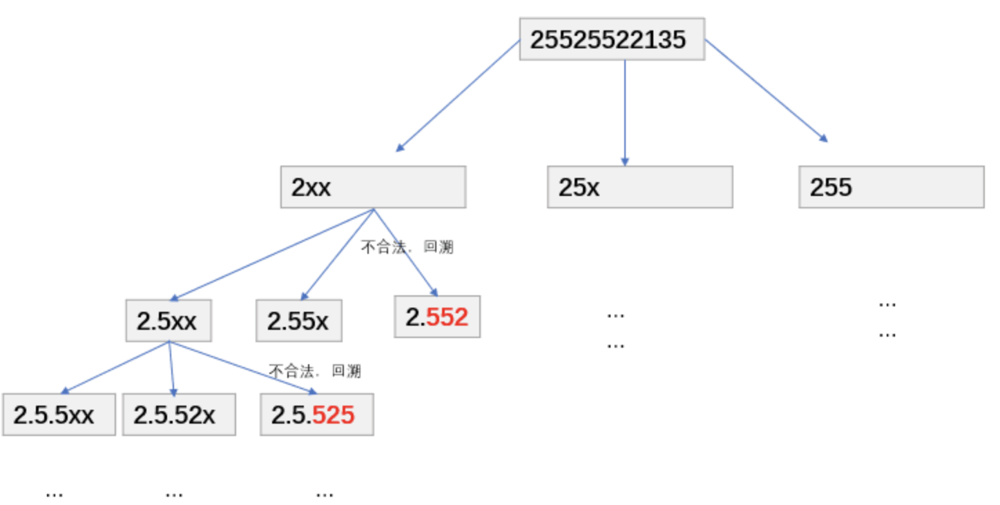

# 牛客

<!-- Tag: 牛客 -->

Problems
---
- [`牛客 0001 大数加法 (中等, 2022-01)`](#牛客-0001-大数加法-中等-2022-01)
- [`牛客 0002 重排链表 (中等, 2022-01)`](#牛客-0002-重排链表-中等-2022-01)
- [`牛客 0003 链表中环的入口结点 (简单, 2022-01)`](#牛客-0003-链表中环的入口结点-简单-2022-01)
- [`牛客 0004 判断链表中是否有环 (简单, 2022-01)`](#牛客-0004-判断链表中是否有环-简单-2022-01)
- [`牛客 0005 二叉树根节点到叶子节点的所有路径和 (中等, 2022-01)`](#牛客-0005-二叉树根节点到叶子节点的所有路径和-中等-2022-01)
- [`牛客 0006 二叉树中的最大路径和 (较难, 2022-01)`](#牛客-0006-二叉树中的最大路径和-较难-2022-01)
- [`牛客 0007 买卖股票的最好时机(一) (简单, 2022-01)`](#牛客-0007-买卖股票的最好时机一-简单-2022-01)
- [`牛客 0008 二叉树中和为某一值的路径(二) (中等, 2022-01)`](#牛客-0008-二叉树中和为某一值的路径二-中等-2022-01)
- [`牛客 0009 二叉树中和为某一值的路径(一) (简单, 2022-01)`](#牛客-0009-二叉树中和为某一值的路径一-简单-2022-01)
- [`牛客 0010 大数乘法 (中等, 2022-01)`](#牛客-0010-大数乘法-中等-2022-01)
- [`牛客 0011 将升序数组转化为平衡二叉搜索树 (简单, 2022-01)`](#牛客-0011-将升序数组转化为平衡二叉搜索树-简单-2022-01)
- [`牛客 0012 重建二叉树 (中等, 2022-01)`](#牛客-0012-重建二叉树-中等-2022-01)
- [`牛客 0013 二叉树的最大深度 (简单, 2022-01)`](#牛客-0013-二叉树的最大深度-简单-2022-01)
- [`牛客 0014 按之字形顺序打印二叉树 (中等, 2022-01)`](#牛客-0014-按之字形顺序打印二叉树-中等-2022-01)
- [`牛客 0015 求二叉树的层序遍历 (中等, 2022-01)`](#牛客-0015-求二叉树的层序遍历-中等-2022-01)
- [`牛客 0016 对称的二叉树 (简单, 2022-01)`](#牛客-0016-对称的二叉树-简单-2022-01)
- [`牛客 0017 最长回文子串 (中等, 2022-01)`](#牛客-0017-最长回文子串-中等-2022-01)
- [`牛客 0018 顺时针旋转矩阵 (简单, 2022-01)`](#牛客-0018-顺时针旋转矩阵-简单-2022-01)
- [`牛客 0019 连续子数组的最大和 (简单, 2022-01)`](#牛客-0019-连续子数组的最大和-简单-2022-01)
- [`牛客 0020 数字字符串转化成IP地址 (中等, 2022-01)`](#牛客-0020-数字字符串转化成ip地址-中等-2022-01)
- [`牛客 0021 链表内指定区间反转 (中等, 2022-01)`](#牛客-0021-链表内指定区间反转-中等-2022-01)
- [`牛客 0022 合并两个有序的数组 (中等, 2022-01)`](#牛客-0022-合并两个有序的数组-中等-2022-01)
- [`牛客 0023 划分链表 (中等, 2022-01)`](#牛客-0023-划分链表-中等-2022-01)
- [`牛客 0024 删除有序链表中重复的元素-II (中等, 2022-01)`](#牛客-0024-删除有序链表中重复的元素-ii-中等-2022-01)
- [`牛客 0025 删除有序链表中重复的元素-I (中等, 2022-01)`](#牛客-0025-删除有序链表中重复的元素-i-中等-2022-01)
- [`牛客 0026 括号生成 (中等, 2022-02)`](#牛客-0026-括号生成-中等-2022-02)
- [`牛客 0027 集合的所有子集(一) (中等, 2022-02)`](#牛客-0027-集合的所有子集一-中等-2022-02)
- [`牛客 0028 最小覆盖子串 (较难, 2022-02)`](#牛客-0028-最小覆盖子串-较难-2022-02)
- [`牛客 0029 二维数组中的查找 (中等, 2022-02)`](#牛客-0029-二维数组中的查找-中等-2022-02)
- [`牛客 0030 缺失的第一个正整数 (中等, 2022-02)`](#牛客-0030-缺失的第一个正整数-中等-2022-02)
- [`牛客 0031 第一个只出现一次的字符 (简单, 2022-02)`](#牛客-0031-第一个只出现一次的字符-简单-2022-02)
- [`牛客 0032 求平方根 (简单, 2022-02)`](#牛客-0032-求平方根-简单-2022-02)
- [`牛客 0033 合并两个排序的链表 (简单, 2022-02)`](#牛客-0033-合并两个排序的链表-简单-2022-02)
- [`牛客 0034 求路径 (简单, 2022-02)`](#牛客-0034-求路径-简单-2022-02)
- [`牛客 0035 编辑距离(二) (较难, 2022-02)`](#牛客-0035-编辑距离二-较难-2022-02)
- [`牛客 0036 在两个长度相等的排序数组中找到上中位数 (较难, 2022-02)`](#牛客-0036-在两个长度相等的排序数组中找到上中位数-较难-2022-02)
- [`牛客 0037 合并区间 (中等, 2022-02)`](#牛客-0037-合并区间-中等-2022-02)
- [`牛客 0038 螺旋矩阵 (中等, 2022-03)`](#牛客-0038-螺旋矩阵-中等-2022-03)
- [`牛客 0039 N皇后问题 (较难, 2022-03)`](#牛客-0039-n皇后问题-较难-2022-03)
- [`牛客 0040 链表相加(二) (中等, 2022-03)`](#牛客-0040-链表相加二-中等-2022-03)
- [`牛客 0041 最长无重复子数组 (中等, 2022-03)`](#牛客-0041-最长无重复子数组-中等-2022-03)
- [`牛客 0042 有重复项数字的全排列 (中等, 2022-03)`](#牛客-0042-有重复项数字的全排列-中等-2022-03)
- [`牛客 0043 没有重复项数字的全排列 (中等, 2022-03)`](#牛客-0043-没有重复项数字的全排列-中等-2022-03)
- [`牛客 0044 通配符匹配 (较难, 2022-03)`](#牛客-0044-通配符匹配-较难-2022-03)
- [`牛客 0045 实现二叉树先序、中序、后序遍历 (中等, 2022-03)`](#牛客-0045-实现二叉树先序中序后序遍历-中等-2022-03)
- [`牛客 0046 加起来和为目标值的组合(二) (中等, 2022-03)`](#牛客-0046-加起来和为目标值的组合二-中等-2022-03)
- [`牛客 0047 数独 (较难, 2022-03)`](#牛客-0047-数独-较难-2022-03)
- [`牛客 0048 在旋转过的有序数组中寻找目标值 (简单, 2022-03)`](#牛客-0048-在旋转过的有序数组中寻找目标值-简单-2022-03)
- [`牛客 0049 最长的括号子串 (较难, 2022-03)`](#牛客-0049-最长的括号子串-较难-2022-03)
- [`牛客 0050 链表中的节点每k个一组翻转 (中等, 2022-03)`](#牛客-0050-链表中的节点每k个一组翻转-中等-2022-03)
- [`牛客 0051 合并k个已排序的链表 (较难, 2022-03)`](#牛客-0051-合并k个已排序的链表-较难-2022-03)
- [`牛客 0052 有效括号序列 (简单, 2022-03)`](#牛客-0052-有效括号序列-简单-2022-03)
- [`牛客 0053 删除链表的倒数第n个节点 (中等, 2022-03)`](#牛客-0053-删除链表的倒数第n个节点-中等-2022-03)
- [`牛客 0091 最长上升子序列(三) (较难, 2022-03)`](#牛客-0091-最长上升子序列三-较难-2022-03)
- [`牛客 0127 最长公共子串 (中等, 2022-03)`](#牛客-0127-最长公共子串-中等-2022-03)
- [`牛客 0145 01背包 (中等, 2022-03)`](#牛客-0145-01背包-中等-2022-03)

---

### `牛客 0001 大数加法 (中等, 2022-01)`

[](数据结构-字符串.md)
[](基础-模拟.md)
[](合集-牛客.md)

<!--{
    "tags": ["字符串", "模拟"],
    "来源": "牛客",
    "难度": "中等",
    "编号": "0001",
    "标题": "大数加法",
    "公司": ["百度", "阿里", "字节", "虾皮"]
}-->

<summary><b>问题简述</b></summary>

```txt
以字符串的形式读入两个数字，计算它们的和，以字符串形式返回。
```
> [大数加法_牛客题霸_牛客网](https://www.nowcoder.com/practice/11ae12e8c6fe48f883cad618c2e81475)

</details>

<!-- <div align="center"></div> -->

<summary><b>思路</b></summary>

- 把较短的字符串通过补前缀 0 使长度一致，此时只要处理好进位即可；

<details><summary><b>Python</b></summary>

```python
class Solution:
    def solve(self , s: str, t: str) -> str:
        # write code here
        n, m = len(s), len(t)
        if n < m:  # 确保 n >= m
            s, t = t, s
            n, m = m, n
            
        t = '0' * (n - m) + t  # 补0
        
        ret = ''
        ex = 0  # 进位标志
        for i in range(n - 1, -1, -1):
            r = int(s[i]) + int(t[i]) + ex
            ret = str(r % 10) + ret
            ex = r // 10
            
        if ex:
            ret = '1' + ret
        
        return ret
```

</details>

---

### `牛客 0002 重排链表 (中等, 2022-01)`

[](数据结构-链表.md)
[](合集-牛客.md)

<!--{
    "tags": ["链表"],
    "来源": "牛客",
    "难度": "中等",
    "编号": "0002",
    "标题": "重排链表",
    "公司": ["美团", "字节", "快手"]
}-->

<summary><b>问题简述</b></summary>

```txt
给定一个单链表 L 的头节点 head ，单链表 L 表示为：
    L0 → L1 → … → Ln - 1 → Ln
请将其重新排列后变为：
    L0 → Ln → L1 → Ln-1 → L2 → Ln-2 → …
不能只是单纯的改变节点内部的值，而是需要实际的进行节点交换。
```
> [重排链表_牛客题霸_牛客网](https://www.nowcoder.com/practice/3d281dc0b3704347846a110bf561ef6b)

<!-- 
<details><summary><b>详细描述</b></summary>

```txt
```
 -->

</details>

<!-- <div align="center"></div> -->

<summary><b>思路：模拟</b></summary>

1. 先找到中间节点 mid；
2. 将链表 mid 反转；
3. 然后合并 head 和 mid；

<details><summary><b>Python</b></summary>

```python
# Definition for singly-linked list.
# class ListNode:
#     def __init__(self, val=0, next=None):
#         self.val = val
#         self.next = next
class Solution:
    def reorderList(self, head: ListNode) -> None:
        """
        Do not return anything, modify head in-place instead.
        """
        if not head: return
    
        def  get_mid(p):
            lp, fp = p, p

            while fp and fp.next:
                lp = lp.next
                fp = fp.next.next
            
            return lp
        
        def reverse(p):
            cur, pre = p, None
            while cur:
                nxt = cur.next
                cur.next = pre
                pre = cur
                cur = nxt
            
            return pre
        
        mid = get_mid(head)  # 注意此时还没有断开两个链表
        mid = reverse(mid)

        # merge
        l, r = head, mid
        while True:
            l_nxt, r_nxt = l.next, r.next
            if not r_nxt:  # 这是一种写法，另一种写法是在获得 mid 后将 mid 与原链表断开（后移一个节点，结果也是正确的，见写法2）
                break
            l.next, r.next = r, l_nxt
            l, r = l_nxt, r_nxt
```

</details>

---

### `牛客 0003 链表中环的入口结点 (简单, 2022-01)`

[](数据结构-链表.md)
[](技巧-双指针-快慢指针.md)
[](合集-牛客.md)

<!--{
    "tags": ["链表", "快慢指针"],
    "来源": "牛客",
    "难度": "简单",
    "编号": "0003",
    "标题": "链表中环的入口结点",
    "公司": []
}-->

<summary><b>问题简述</b></summary>

```txt
给一个长度为 n 的链表，若其中包含环，请找出该链表的环的入口结点，否则返回null。
```
> [链表中环的入口结点_牛客题霸_牛客网](https://www.nowcoder.com/practice/253d2c59ec3e4bc68da16833f79a38e4)

<!-- 
<details><summary><b>详细描述</b></summary>

```txt
```
-->

</details>

<!-- <div align="center"></div> -->

<summary><b>思路：快慢指针</b></summary>

- 快指针 `fast` 每次走两步，慢指针 `slow` 每次走一步；
- 若存在环，则 `fast` 与 `slow` 必会相遇；
- 相遇后，将 `slow` 重新指向 `pHead`，然后，双指针正常每次走一步；
- 当再次相遇时，即为入口节点；
- 注意无环的情况；

**证明**：
- 假设存在环，记环之前的节点数即为 $a$（不包括入口节点），环的节点数为 $b$；当 `fast` 和 `slow` 相遇时距离环入口的步数为 $c$；
- 下面证明：$a=c$
- 记 `fast` 和 `slow` 走的步数分别为 $f$ 和 $s$，且 $f-s = n*b$，即 `fast` 比 `slow` 多走了 `n` 圈；又 $f=2s$，可得 $s=n*b$，而实际上 `slow` 走的距离 $s=a + (n-1)b + (b-c)$，联立得 $a=c$；
- 因此当 `fast` 和 `slow` 在环内相遇时，将 `slow` 重新指向 `pHead`，然后双指针再次相遇时即为入口节点（每次走一步）；

<details><summary><b>Python</b></summary>

```python
class Solution:
    def EntryNodeOfLoop(self, pHead: ListNode):
        # write code here

        no_cycle = True
        slow = fast = pHead
        while fast and fast.next:
            slow = slow.next
            fast = fast.next.next
            if slow == fast:
                no_cycle = False
                break

        if no_cycle:
            return None

        slow = pHead
        while slow != fast:
            slow = slow.next
            fast = fast.next

        return slow
```

</details>

---

### `牛客 0004 判断链表中是否有环 (简单, 2022-01)`

[](数据结构-链表.md)
[](技巧-双指针-快慢指针.md)
[](合集-牛客.md)

<!--{
    "tags": ["链表", "快慢指针"],
    "来源": "牛客",
    "难度": "简单",
    "编号": "0004",
    "标题": "判断链表中是否有环",
    "公司": ["百度", "阿里", "小米"]
}-->

<summary><b>问题简述</b></summary>

```txt
判断给定的链表中是否有环。
```
> [判断链表中是否有环_牛客题霸_牛客网](https://www.nowcoder.com/practice/650474f313294468a4ded3ce0f7898b9)

<!-- 
<details><summary><b>详细描述</b></summary>

```txt
```
-->

</details>

<!-- <div align="center"></div> -->

<summary><b>思路：快慢指针</b></summary>

<details><summary><b>Python</b></summary>

```python
# class ListNode:
#     def __init__(self, x):
#         self.val = x
#         self.next = None

#
# @param head ListNode类 
# @return bool布尔型
#
class Solution:
    def hasCycle(self , head: ListNode) -> bool:
        
        fast = slow = head
        has_cycle = False
        while fast and fast.next:
            slow = slow.next
            fast = fast.next.next
            if slow == fast:
                has_cycle = True
                break
        
        return has_cycle
```

</details>

---

### `牛客 0005 二叉树根节点到叶子节点的所有路径和 (中等, 2022-01)`

[](数据结构-二叉树.md)
[](算法-深度优先搜索(DFS).md)
[](合集-牛客.md)

<!--{
    "tags": ["二叉树", "DFS"],
    "来源": "牛客",
    "难度": "中等",
    "编号": "0005",
    "标题": "二叉树根节点到叶子节点的所有路径和",
    "公司": ["小米", "快手", "字节"]
}-->

<summary><b>问题简述</b></summary>

```txt
给定二叉树，求所有路径和，路径定义如下：
假设某条路径的从根节点到叶节点的值为 1->2->3，则记该条路径表示的值为 123；
输入确保每个节点的值在 0~9 之间；

示例
    1
   2 3
结果：25（12+13=25）
```
> [二叉树根节点到叶子节点的所有路径和_牛客题霸_牛客网](https://www.nowcoder.com/practice/185a87cd29eb42049132aed873273e83)

<!-- 
<details><summary><b>详细描述</b></summary>

```txt
```
-->

</details>

<!-- <div align="center"></div> -->

<summary><b>思路：DFS</b></summary>

<details><summary><b>Python</b></summary>

```python
# class TreeNode:
#     def __init__(self, x):
#         self.val = x
#         self.left = None
#         self.right = None
#
# 代码中的类名、方法名、参数名已经指定，请勿修改，直接返回方法规定的值即可
#
# 
# @param root TreeNode类 
# @return int整型
#
class Solution:
    def sumNumbers(self , root: TreeNode) -> int:
        # write code here
        
        self.ret = 0
        
        def dfs(node: TreeNode, sum_):
            if not node:
                # self.ret += sum_  # 放在这里会导致“加两次”
                return
            
            sum_ = sum_ * 10 + node.val
            if not node.left and not node.right:
                self.ret += sum_
                return
            
            if node.left:
                dfs(node.left, sum_)
            if node.right:
                dfs(node.right, sum_)
        
        dfs(root, 0)
        return self.ret
```

</details>

---

### `牛客 0006 二叉树中的最大路径和 (较难, 2022-01)`

[](数据结构-二叉树.md)
[](合集-牛客.md)

<!--{
    "tags": ["二叉树"],
    "来源": "牛客",
    "难度": "较难",
    "编号": "0006",
    "标题": "二叉树中的最大路径和",
    "公司": ["字节", "美团", "百度"]
}-->

<summary><b>问题简述</b></summary>

```txt
求给定二叉树中的最大路径和。
路径定义：
    1. 同一个节点在路径中最多出现一次；
    2. 路径至少包含一个节点，可以不经过根节点；
```
> [二叉树中的最大路径和_牛客题霸_牛客网](https://www.nowcoder.com/practice/da785ea0f64b442488c125b441a4ba4a)

<!-- 
<details><summary><b>详细描述</b></summary>

```txt
```
-->

</details>

<!-- <div align="center"></div> -->

<summary><b>思路：DFS</b></summary>

- 定义函数 `maxGain(node)` 表示以 `node` 为**起点**的最大路径；显然 maxGain 可以通过递归计算（详见代码）；
- 则**经过** `node` 的最大路径和，可以表示为 `node.val + maxGain(node.left), maxGain(node.right)`；因此可以在计算 `maxGain(root)` 的过程中，记录经过每个节点的最大路径和，进而得到全局最大路径。

<details><summary><b>Python</b></summary>

```python
# class TreeNode:
#     def __init__(self, x):
#         self.val = x
#         self.left = None
#         self.right = None
#
# 代码中的类名、方法名、参数名已经指定，请勿修改，直接返回方法规定的值即可
#
# 
# @param root TreeNode类 
# @return int整型
#
class Solution:
    def maxPathSum(self, root: TreeNode) -> int:
        # write code here

        self.ret = float('-inf')

        def maxGain(node):
            if not node: return 0

            # 如果子路径的 maxGain 为负数，那么对 node 来说 maxGain 就是自己本身；
            max_left = max(0, maxGain(node.left))
            max_right = max(0, maxGain(node.right))
            # 记录“经过”node 节点的最大路径
            self.ret = max(self.ret, node.val + max_left + max_right)
            return node.val + max(max_left, max_right)  # 至少要包含自己本身

        maxGain(root)
        return self.ret
```

</details>

---

### `牛客 0007 买卖股票的最好时机(一) (简单, 2022-01)`

[](基础-模拟.md)
[](合集-牛客.md)

<!--{
    "tags": ["模拟"],
    "来源": "牛客",
    "难度": "简单",
    "编号": "0007",
    "标题": "买卖股票的最好时机(一)",
    "公司": ["字节", "腾讯"]
}-->

<summary><b>问题简述</b></summary>

```txt
给定一支股票的价格序列，返回买卖一次的最大值；
```
> [买卖股票的最好时机(一)_牛客题霸_牛客网](https://www.nowcoder.com/practice/64b4262d4e6d4f6181cd45446a5821ec)

<!-- 
<details><summary><b>详细描述</b></summary>

```txt
```
-->

</details>

<!-- <div align="center"></div> -->

<summary><b>思路：动态规划</b></summary>

- 记 `dp[i]` 表示 `prices[:i]` 中的最小值；
- 则 `ret = max(x - dp[i])`；
- 实际可以用一个变量记录当前最小值，节省空间；

<details><summary><b>Python</b></summary>

```python
#
# 代码中的类名、方法名、参数名已经指定，请勿修改，直接返回方法规定的值即可
#
# 
# @param prices int整型一维数组 
# @return int整型
#
class Solution:
    def maxProfit(self , prices: List[int]) -> int:
        # write code here
        ret = 0
        min_p = prices[0]
        for x in prices[1:]:
            ret = max(ret, x - min_p)
            min_p = min(x, min_p)
        return ret
```

</details>

---

### `牛客 0008 二叉树中和为某一值的路径(二) (中等, 2022-01)`

[](数据结构-二叉树.md)
[](算法-深度优先搜索(DFS).md)
[](合集-牛客.md)

<!--{
    "tags": ["二叉树", "DFS"],
    "来源": "牛客",
    "难度": "中等",
    "编号": "0008",
    "标题": "二叉树中和为某一值的路径(二)",
    "公司": []
}-->

<summary><b>问题简述</b></summary>

```txt
给定二叉树 root 和目标值 target，返回所有和为 target 的路径。
规定路径必须从根节点开始到叶子节点。
```
> [二叉树中和为某一值的路径(二)_牛客题霸_牛客网](https://www.nowcoder.com/practice/b736e784e3e34731af99065031301bca)

<!-- 
<details><summary><b>详细描述</b></summary>

```txt
```
-->

</details>

<!-- <div align="center"></div> -->

<summary><b>思路：DFS</b></summary>

<details><summary><b>Python</b></summary>

```python
# class TreeNode:
#     def __init__(self, x):
#         self.val = x
#         self.left = None
#         self.right = None
#
# 代码中的类名、方法名、参数名已经指定，请勿修改，直接返回方法规定的值即可
#
# 
# @param root TreeNode类 
# @param target int整型 
# @return int整型二维数组
#
class Solution:
    def FindPath(self , root: TreeNode, target: int) -> List[List[int]]:
        # write code here
        
        ret = []
        tmp = []
        
        def dfs(node, k):
            if not node: return
            
            tmp.append(node.val)
            k -= node.val
            
            if not node.left and not node.right and k == 0:
                ret.append(tmp[:])
            
            dfs(node.left, k)
            dfs(node.right, k)
            k += node.val
            tmp.pop()
        
        dfs(root, target)
        return ret
```

</details>

---

### `牛客 0009 二叉树中和为某一值的路径(一) (简单, 2022-01)`

[](数据结构-二叉树.md)
[](算法-深度优先搜索(DFS).md)
[](合集-牛客.md)

<!--{
    "tags": ["二叉树", "DFS"],
    "来源": "牛客",
    "难度": "简单",
    "编号": "0009",
    "标题": "二叉树中和为某一值的路径(一)",
    "公司": ["腾讯", "字节", "京东"]
}-->

<summary><b>问题简述</b></summary>

```txt
给定二叉树 root 和目标值 target，判断是否存在路径和等于 target。
规定路径必须从根节点开始到叶子节点。
```
> [二叉树中和为某一值的路径(一)_牛客题霸_牛客网](https://www.nowcoder.com/practice/508378c0823c423baa723ce448cbfd0c)

<!-- 
<details><summary><b>详细描述</b></summary>

```txt
```
-->

</details>

<!-- <div align="center"></div> -->

<summary><b>思路：DFS</b></summary>

<details><summary><b>Python</b></summary>

```python
# class TreeNode:
#     def __init__(self, x):
#         self.val = x
#         self.left = None
#         self.right = None
#
# 代码中的类名、方法名、参数名已经指定，请勿修改，直接返回方法规定的值即可
#
# 
# @param root TreeNode类 
# @param sum int整型 
# @return bool布尔型
#
class Solution:
    def hasPathSum(self , root: TreeNode, sum: int) -> bool:
        # write code here
        
        def dfs(node, k):
            if not node: return False
            
            if k == node.val and not node.left and not node.right:
                return True
            
            return dfs(node.left, k - node.val) or dfs(node.right, k - node.val)
        
        return dfs(root, sum)
```

</details>

---

### `牛客 0010 大数乘法 (中等, 2022-01)`

[](数据结构-字符串.md)
[](基础-模拟.md)
[](合集-牛客.md)

<!--{
    "tags": ["字符串", "模拟"],
    "来源": "牛客",
    "难度": "中等",
    "编号": "0010",
    "标题": "大数乘法",
    "公司": ["腾讯", "阿里", "字节"]
}-->

<summary><b>问题简述</b></summary>

```txt
以字符串的形式读入两个数字，编写一个函数计算它们的乘积，以字符串形式返回。
```
> http://

<!-- 
<details><summary><b>详细描述</b></summary>

```txt
```
-->

</details>

<!-- <div align="center"></div> -->

<summary><b>思路1：模拟</b></summary>

```
以 54 * 68 为例：

    54
  x 68
  -----

用 tmp 记录每一步的结果

8 * 4 = 32      tmp = [32]
8 * 5 = 40      tmp = [40, 32]
6 * 4 = 24      tmp = [40 + 24, 32]
6 * 5 = 30      tmp = [30, 40 + 24, 32]

得到 tmp 后做循环进位加法即可，详见代码；
```

- 示例中按照手算习惯是从低位开始算起的，实际因为各位之间互相独立，从高位开始也可以，详见代码；

<details><summary><b>Python</b></summary>

```python
#
# 代码中的类名、方法名、参数名已经指定，请勿修改，直接返回方法规定的值即可
#
# 
# @param s string字符串 第一个整数
# @param t string字符串 第二个整数
# @return string字符串
#
class Solution:
    def solve(self , s: str, t: str) -> str:
        from collections import deque
        
        # write code here
        tmp = []
        # 从高位开始算起
        for i, a in enumerate(s):
            for j, b in enumerate(t):
                c = int(a) * int(b)
                if i + j == len(tmp):
                    tmp.append(c)
                else:
                    tmp[i + j] += c
        
        ret = deque()
        add = 0  # 进位
        for x in tmp[::-1]:  # 因为要考虑进位，所以从低位开始算起，即逆序遍历
            x += add
            add = x // 10
            ret.appendleft(str(x % 10))  # 这里也可以直接拼字符串，不过推荐用队列
        
        if add:
            ret.appendleft(str(add))
            
        return ''.join(ret)
```

</details>

---

### `牛客 0011 将升序数组转化为平衡二叉搜索树 (简单, 2022-01)`

[](数据结构-二叉树.md)
[](合集-牛客.md)

<!--{
    "tags": ["二叉树"],
    "来源": "牛客",
    "难度": "简单",
    "编号": "0011",
    "标题": "将升序数组转化为平衡二叉搜索树",
    "公司": ["百度", "映客"]
}-->

<summary><b>问题简述</b></summary>

```txt
给定升序数组，转化为平衡二叉搜索树（BST）
```
> [将升序数组转化为平衡二叉搜索树_牛客题霸_牛客网](https://www.nowcoder.com/practice/7e5b00f94b254da599a9472fe5ab283d)

<!-- 
<details><summary><b>详细描述</b></summary>

```txt
```
-->

</details>

<!-- <div align="center"></div> -->

<summary><b>思路</b></summary>

- 每次选择中间节点作为根节点，按先序遍历递归构建 BST；

<details><summary><b>Python</b></summary>

```python
# class TreeNode:
#     def __init__(self, x):
#         self.val = x
#         self.left = None
#         self.right = None
#
# 代码中的类名、方法名、参数名已经指定，请勿修改，直接返回方法规定的值即可
#
# 
# @param num int整型一维数组 
# @return TreeNode类
#
class Solution:
    def sortedArrayToBST(self , num: List[int]) -> TreeNode:
        # write code here
        def dfs(arr):
            if not arr: return None
            
            l, r = 0, len(arr) - 1
            mid = (l + r) // 2
            
            node = TreeNode(arr[mid])
            node.left = dfs(arr[:mid])
            node.right = dfs(arr[mid + 1:])
            
            return node
        
        return dfs(num)
```

</details>

---

### `牛客 0012 重建二叉树 (中等, 2022-01)`

[](数据结构-二叉树.md)
[](合集-牛客.md)

<!--{
    "tags": ["二叉树"],
    "来源": "牛客",
    "难度": "中等",
    "编号": "0012",
    "标题": "重建二叉树",
    "公司": ["小米", "携程", "腾讯", "字节"]
}-->

<summary><b>问题简述</b></summary>

```txt
给定二叉树的前序和中序遍历结果，重建二叉树；
规定二叉树中各节点的值都不相同；
```
> [重建二叉树_牛客题霸_牛客网](https://www.nowcoder.com/practice/8a19cbe657394eeaac2f6ea9b0f6fcf6)

<!-- 
<details><summary><b>详细描述</b></summary>

```txt
```
-->

</details>

<!-- <div align="center"></div> -->

<summary><b>思路</b></summary>

- 前序遍历的第一个节点为根节点，在中序遍历中找到根节点的位置，其左边部分为左子树，右边为右子树，然后按前序遍历递归构建整个树；

<details><summary><b>Python</b></summary>

```python
# class TreeNode:
#     def __init__(self, x):
#         self.val = x
#         self.left = None
#         self.right = None
#
# 代码中的类名、方法名、参数名已经指定，请勿修改，直接返回方法规定的值即可
#
# 
# @param pre int整型一维数组 
# @param vin int整型一维数组 
# @return TreeNode类
#
class Solution:
    def reConstructBinaryTree(self , pre: List[int], vin: List[int]) -> TreeNode:
        # write code here
        
        def dfs(p, i):
            if not p or not i: return None
            
            val = p[0]
            idx = i.index(val)
            node = TreeNode(val)
            
            node.left = dfs(p[1:idx + 1], i[:idx])
            node.right = dfs(p[idx + 1:], i[idx + 1:])
            
            return node
        
        return dfs(pre, vin)
```

</details>

---

### `牛客 0013 二叉树的最大深度 (简单, 2022-01)`

[](数据结构-二叉树.md)
[](合集-牛客.md)

<!--{
    "tags": ["二叉树"],
    "来源": "牛客",
    "难度": "简单",
    "编号": "0013",
    "标题": "二叉树的最大深度",
    "公司": ["字节", "小米", "阿里"]
}-->

<summary><b>问题简述</b></summary>

```txt
求给定二叉树的最大深度。
```
> http://

<!-- 
<details><summary><b>详细描述</b></summary>

```txt
```
-->

</details>

<!-- <div align="center"></div> -->

<summary><b>思路</b></summary>

<details><summary><b>Python</b></summary>

```python
# class TreeNode:
#     def __init__(self, x):
#         self.val = x
#         self.left = None
#         self.right = None
#
# 代码中的类名、方法名、参数名已经指定，请勿修改，直接返回方法规定的值即可
#
# 
# @param root TreeNode类 
# @return int整型
#
class Solution:
    def maxDepth(self , root: TreeNode) -> int:
        # write code here
        
        def dfs(node):
            if not node: return 0
            
            return 1 + max(dfs(node.left), dfs(node.right))
        
        return dfs(root)
```

</details>

---

### `牛客 0014 按之字形顺序打印二叉树 (中等, 2022-01)`

[](数据结构-二叉树.md)
[](数据结构-栈、队列.md)
[](合集-牛客.md)

<!--{
    "tags": ["二叉树", "队列"],
    "来源": "牛客",
    "难度": "中等",
    "编号": "0014",
    "标题": "按之字形顺序打印二叉树",
    "公司": []
}-->

<summary><b>问题简述</b></summary>

```txt
层序遍历二叉树，按之字形打印每层。
```
> [按之字形顺序打印二叉树_牛客题霸_牛客网](https://www.nowcoder.com/practice/91b69814117f4e8097390d107d2efbe0)

<!-- 
<details><summary><b>详细描述</b></summary>

```txt
```
-->

</details>

<!-- <div align="center"></div> -->

<summary><b>思路</b></summary>

- 队列 + 奇偶讨论，思路比较简单，因为需要把层分离，所以需要借助的辅助变量比较多，详见代码；

<details><summary><b>Python</b></summary>

```python
# class TreeNode:
#     def __init__(self, x):
#         self.val = x
#         self.left = None
#         self.right = None
#
# 代码中的类名、方法名、参数名已经指定，请勿修改，直接返回方法规定的值即可
#
# 
# @param pRoot TreeNode类 
# @return int整型二维数组
#
class Solution:
    def Print(self , pRoot: TreeNode) -> List[List[int]]:
        # write code here
        if not pRoot: return []
        
        from collections import deque
        
        ret = []
        q = deque()
        q.append(pRoot)
        cnt = 1
        nxt = 0  # 下一层需要遍历的节点数
        lv = 0  # 已经遍历的层数
        tmp = []  # 当前层缓存的节点数
        while cnt:
            cnt -= 1
            node = q.popleft()
            tmp.append(node.val)
            
            if node.left:
                q.append(node.left)
                nxt += 1
            if node.right:
                q.append(node.right)
                nxt += 1
            
            if cnt == 0:
                if lv % 2:
                    ret.append(tmp[::-1])
                else:
                    ret.append(tmp)
                tmp = []
                lv += 1
                cnt = nxt
                nxt = 0
                
        return ret
```

</details>

---

### `牛客 0015 求二叉树的层序遍历 (中等, 2022-01)`

[](数据结构-二叉树.md)
[](合集-牛客.md)

<!--{
    "tags": ["二叉树"],
    "来源": "牛客",
    "难度": "中等",
    "编号": "0015",
    "标题": "求二叉树的层序遍历",
    "公司": ["腾讯", "美团", "小米", "神策数据"]
}-->

<summary><b>问题简述</b></summary>

```txt
层序遍历二叉树，每层的结果单独保存在一个列表中。
```
> [求二叉树的层序遍历_牛客题霸_牛客网](https://www.nowcoder.com/practice/04a5560e43e24e9db4595865dc9c63a3)

<!-- 
<details><summary><b>详细描述</b></summary>

```txt
```
-->

</details>

<!-- <div align="center"></div> -->

<summary><b>思路</b></summary>

- 辅助队列

<details><summary><b>Python</b></summary>

```python
# class TreeNode:
#     def __init__(self, x):
#         self.val = x
#         self.left = None
#         self.right = None
#
# 代码中的类名、方法名、参数名已经指定，请勿修改，直接返回方法规定的值即可
#
# 
# @param root TreeNode类 
# @return int整型二维数组
#
class Solution:
    def levelOrder(self , root: TreeNode) -> List[List[int]]:
        # write code here
        if not root: return []
        
        from collections import deque
        
        ret = []
        q = deque()
        q.append(root)
        cnt = 1
        nxt = 0
        tmp = []
        while cnt:
            cnt -= 1
            node = q.popleft()
            tmp.append(node.val)
            
            if node.left:
                q.append(node.left)
                nxt += 1
            if node.right:
                q.append(node.right)
                nxt += 1
                
            if cnt == 0:
                ret.append(tmp)
                tmp = []
                cnt = nxt
                nxt = 0
        
        return ret
```

</details>

---

### `牛客 0016 对称的二叉树 (简单, 2022-01)`

[](数据结构-二叉树.md)
[](合集-牛客.md)

<!--{
    "tags": ["二叉树"],
    "来源": "牛客",
    "难度": "简单",
    "编号": "0016",
    "标题": "对称的二叉树",
    "公司": []
}-->

<summary><b>问题简述</b></summary>

```txt
判断给定二叉树是否对称。
```
> [对称的二叉树_牛客题霸_牛客网](https://www.nowcoder.com/practice/ff05d44dfdb04e1d83bdbdab320efbcb)

<!-- 
<details><summary><b>详细描述</b></summary>

```txt
```
-->

</details>

<!-- <div align="center"></div> -->

<summary><b>思路</b></summary>

- 跟一般的二叉树递归略有不同，因为对称的二叉树，其子树并不对称；

<details><summary><b>Python</b></summary>

```python
# class TreeNode:
#     def __init__(self, x):
#         self.val = x
#         self.left = None
#         self.right = None
#
# 代码中的类名、方法名、参数名已经指定，请勿修改，直接返回方法规定的值即可
#
# 
# @param pRoot TreeNode类 
# @return bool布尔型
#
class Solution:
    def isSymmetrical(self , pRoot: TreeNode) -> bool:
        # write code here
        if not pRoot: return True
        
        def dfs(l, r):
            if not l and not r: return True  # 同时到达叶节点
            if not l or not r: return False
            
            return l.val == r.val and dfs(l.left, r.right) and dfs(l.right, r.left)
            
        return dfs(pRoot.left, pRoot.right)
```

</details>

---

### `牛客 0017 最长回文子串 (中等, 2022-01)`

[](基础-模拟.md)
[](算法-动态规划(记忆化搜索)、递推.md)
[](合集-牛客.md)

<!--{
    "tags": ["模拟", "DP"],
    "来源": "牛客",
    "难度": "中等",
    "编号": "0017",
    "标题": "最长回文子串",
    "公司": ["腾讯", "华为", "美团", "京东"]
}-->

<summary><b>问题简述</b></summary>

```txt
求给定字符串中最长回文子串的长度。
```
> [最长回文子串_牛客题霸_牛客网](https://www.nowcoder.com/practice/b4525d1d84934cf280439aeecc36f4af)

<!-- 
<details><summary><b>详细描述</b></summary>

```txt
```
-->

</details>

<!-- <div align="center"></div> -->

<summary><b>思路1：模拟中心扩散（推荐）</b></summary>

- 中心扩散直观，且不需要额外的空间，比动态规划的方法更好；

<details><summary><b>Python</b></summary>

```python
#
# 代码中的类名、方法名、参数名已经指定，请勿修改，直接返回方法规定的值即可
#
# 
# @param A string字符串 
# @return int整型
#
class Solution:
    def getLongestPalindrome(self , A: str) -> int:
        # write code here
        n = len(A)
        
        def process(l, r):
            tmp = 1  # 使用一个变量保存已知的最大长度
            while l >= 0 and r < n:
                if A[l] != A[r]:
                    break
                tmp = r - l + 1
                l -= 1
                r += 1
            # return r - l + 1  # 直接返回有问题，无法判断最后一次是否匹配上
            return tmp
        
        ret = 1
        for i in range(len(A) - 1):
            # 同时处理 process(i, i), process(i, i + 1) 避免奇偶的讨论
            ret = max(ret, process(i, i), process(i, i + 1))
            
        return ret
```

</details>


<summary><b>思路2：动态规划</b></summary>

- DP 虽然能解，但是不够直观，且初始状态容易写错（相邻两个字符相同的情况）；

<details><summary><b>Python</b></summary>

```python
#
# 代码中的类名、方法名、参数名已经指定，请勿修改，直接返回方法规定的值即可
#
# 
# @param A string字符串 
# @return int整型
#
class Solution:
    def getLongestPalindrome(self , A: str) -> int:
        # write code here
        n = len(A)
        dp = [[0] * n for _ in range(n)]

        for i in range(n):
            dp[i][i] = 1
        
        start = 0
        length = 1
        for j in range(1, n):  # 子串的结束位置
            for i in range(j - 1, -1, -1):  # 子串的开始位置
                if i == j - 1:
                    dp[i][j] = 1 if A[i] == A[j] else 0
                else:
                    dp[i][j] = 1 if dp[i + 1][j - 1] and A[i] == A[j] else 0

                if dp[i][j]:
                    if j - i + 1 > length:
                        length = j - i + 1
                        start = i

        return length
```

</details>

---

### `牛客 0018 顺时针旋转矩阵 (简单, 2022-01)`

[](数据结构-数组、矩阵(二维数组).md)
[](合集-牛客.md)

<!--{
    "tags": ["数组"],
    "来源": "牛客",
    "难度": "简单",
    "编号": "0018",
    "标题": "顺时针旋转矩阵",
    "公司": ["美团", "虾皮", "快手", "华为"]
}-->

<summary><b>问题简述</b></summary>

```txt
给定 NxN 矩阵，和矩阵的阶数 N，返回顺时针旋转 90 度后的矩阵。
```
> [顺时针旋转矩阵_牛客题霸_牛客网](https://www.nowcoder.com/practice/2e95333fbdd4451395066957e24909cc)

<!-- 
<details><summary><b>详细描述</b></summary>

```txt
```
-->

</details>

<!-- <div align="center"></div> -->

<summary><b>思路</b></summary>

- 分两步，先按行逆序，再按列逆序（反过来也可以）；

<details><summary><b>Python</b></summary>

```python
#
# 代码中的类名、方法名、参数名已经指定，请勿修改，直接返回方法规定的值即可
#
# 
# @param mat int整型二维数组 
# @param n int整型 
# @return int整型二维数组
#
class Solution:
    def rotateMatrix(self , mat: List[List[int]], n: int) -> List[List[int]]:
        # write code here

        # 法1）先逆序
        # return list(zip(*mat[::-1]))

        # 法2）后逆序
        return [[row[i] for row in mat][::-1] for i in range(n)]
```

</details>

---

### `牛客 0019 连续子数组的最大和 (简单, 2022-01)`

[](算法-动态规划(记忆化搜索)、递推.md)
[](合集-牛客.md)

<!--{
    "tags": ["DP"],
    "来源": "牛客",
    "难度": "简单",
    "编号": "0019",
    "标题": "连续子数组的最大和",
    "公司": []
}-->

<summary><b>问题简述</b></summary>

```txt
给定数组 arr，求其连续子数组的最大和。
```
> [连续子数组的最大和_牛客题霸_牛客网](https://www.nowcoder.com/practice/459bd355da1549fa8a49e350bf3df484)

<!-- 
<details><summary><b>详细描述</b></summary>

```txt
```
-->

</details>

<!-- <div align="center"></div> -->

<summary><b>思路：动态规划</b></summary>

- 记 `dp[i]` 表示以 `arr[i]` 结尾的最大和；
- 则 `dp[i] = max(dp[i - 1] + arr[i], arr[i])`；
- 因为 `dp[i]` 只与上一个状态有关，因此可以使用滚动变量优化（详见代码）；

<details><summary><b>Python</b></summary>

```python
#
# 代码中的类名、方法名、参数名已经指定，请勿修改，直接返回方法规定的值即可
#
# 
# @param array int整型一维数组 
# @return int整型
#
class Solution:
    def FindGreatestSumOfSubArray(self , array: List[int]) -> int:
        # write code here
        ret = dp = array[0]
        for x in array[1:]:
            dp = max(x, dp + x)
            ret = max(ret, dp)
        
        return ret
```

</details>

---

### `牛客 0020 数字字符串转化成IP地址 (中等, 2022-01)`

[](算法-深度优先搜索(DFS).md)
[](合集-牛客.md)

<!--{
    "tags": ["DFS"],
    "来源": "牛客",
    "难度": "中等",
    "编号": "0020",
    "标题": "数字字符串转化成IP地址",
    "公司": ["百度", "字节", "快手"]
}-->

<summary><b>问题简述</b></summary>

```txt
给定只包含数字的字符串，将该字符串转化成 IP 地址的形式，返回所有可能的情况。
例如：给出的字符串为"25525522135",
返回：["255.255.22.135", "255.255.221.35"]
```
> [数字字符串转化成IP地址_牛客题霸_牛客网](https://www.nowcoder.com/practice/ce73540d47374dbe85b3125f57727e1e)

<!-- 
<details><summary><b>详细描述</b></summary>

```txt
```
-->

</details>

<!-- <div align="center"></div> -->

<summary><b>思路：DFS + 回溯</b></summary>

- 相当于构建一颗三叉树；

<div align="center"></div>

<details><summary><b>Python</b></summary>

```python
#
# 代码中的类名、方法名、参数名已经指定，请勿修改，直接返回方法规定的值即可
#
# 
# @param s string字符串 
# @return string字符串一维数组
#
class Solution:
    def restoreIpAddresses(self , s: str) -> List[str]:
        # write code here
        
        ret = []
        
        def valid(x):
            """验证函数"""
            if not x:  # 非空
                return False
            if x.startswith('0') and len(x) > 1:  # 存在前缀 0
                return False
            return int(x) <= 255
        
        def dfs(k, depth, tmp):
            if depth == 3:  # 到第三层的时候，直接判断所有剩余字符
                if valid(s[k:]):
                    tmp.append(s[k:])
                    ret.append('.'.join(tmp))
                    tmp.pop()  # 这里也要回溯
                return
            
            for i in range(1, 4):
                sub = s[k: k + i]
                if valid(sub):
                    tmp.append(sub)
                    dfs(k + i, depth + 1, tmp)
                    tmp.pop()
        
        dfs(0, 0, [])
        return ret
```

</details>

---

### `牛客 0021 链表内指定区间反转 (中等, 2022-01)`

[](数据结构-链表.md)
[](合集-牛客.md)

<!--{
    "tags": ["链表"],
    "来源": "牛客",
    "难度": "中等",
    "编号": "0021",
    "标题": "链表内指定区间反转",
    "公司": ["字节", "腾讯", "小米", "快手"]
}-->

<summary><b>问题简述</b></summary>

```txt
给定链表 head，把 m 到 n 区间内的节点反转
```
> [链表内指定区间反转_牛客题霸_牛客网](https://www.nowcoder.com/practice/b58434e200a648c589ca2063f1faf58c)

<!-- 
<details><summary><b>详细描述</b></summary>

```txt
```
-->

</details>

<!-- <div align="center"></div> -->

<summary><b>思路：模拟</b></summary>

<details><summary><b>Python</b></summary>

```python
# class ListNode:
#     def __init__(self, x):
#         self.val = x
#         self.next = None
#
# 代码中的类名、方法名、参数名已经指定，请勿修改，直接返回方法规定的值即可
#
# 
# @param head ListNode类 
# @param m int整型 
# @param n int整型 
# @return ListNode类
#
class Solution:
    def reverseBetween(self , head: ListNode, m: int, n: int) -> ListNode:
        # write code here
        
        # 增加一个伪头结点，主要针对完全反转的情况
        dummy = ListNode(0)
        dummy.next = head
        
        cnt = n - m
        pre, cur = dummy, head
        while m - 1:  # 因为要保存开始反转之前的一个节点，所以少移动一次
            m -= 1
            pre = cur
            cur = cur.next
        
        beg, end = pre, cur
        pre, cur = cur, cur.next  # 把少移动的一次补回来
        
        # 开始反转，反转 cnt 次
        while cnt:
            cnt -= 1
            nxt = cur.next
            cur.next = pre
            pre = cur
            cur = nxt
        
        # 重新拼接（可以画图理解为什么是这两个位置拼接）
        beg.next = pre
        end.next = cur
        
        return dummy.next
```

</details>

---

### `牛客 0022 合并两个有序的数组 (中等, 2022-01)`

[](技巧-双指针.md)
[](合集-牛客.md)

<!--{
    "tags": ["双指针"],
    "来源": "牛客",
    "难度": "中等",
    "编号": "0022",
    "标题": "合并两个有序的数组",
    "公司": ["百度", "贝壳", "美团", "字节"]
}-->

<summary><b>问题简述</b></summary>

```txt
给定两个有序数组 A 和 B，请将数组 B 合并到数组 A 中；
A 和 B 中初始的元素数目分别为 m 和 n，A 的数组空间大小为 m + n；
要求不使用额外空间。
```
> [合并两个有序的数组_牛客题霸_牛客网](https://www.nowcoder.com/practice/89865d4375634fc484f3a24b7fe65665)

<!-- 
<details><summary><b>详细描述</b></summary>

```txt
```
-->

</details>

<!-- <div align="center"></div> -->

<summary><b>思路</b></summary>

- 双指针 + 逆序填空；

<details><summary><b>Python</b></summary>

```python
#
# 
# @param A int整型一维数组 
# @param B int整型一维数组 
# @return void
#
class Solution:
    def merge(self , A, m, B, n):
        # write code here
        i, j = m - 1, n - 1
        p = m + n - 1
        
        while i >= 0 and j >= 0:
            if A[i] > B[j]:
                A[p] = A[i]
                i -= 1
            else:
                A[p] = B[j]
                j -= 1
            p -= 1
        
        while j >= 0:
            A[p] = B[j]
            j -= 1
            p -= 1
```

</details>

---

### `牛客 0023 划分链表 (中等, 2022-01)`

[](数据结构-链表.md)
[](合集-牛客.md)

<!--{
    "tags": ["链表"],
    "来源": "牛客",
    "难度": "中等",
    "编号": "0023",
    "标题": "划分链表",
    "公司": ["百度", "小米"]
}-->

<summary><b>问题简述</b></summary>

```txt
给定链表和一个值 x，将所有小于 x 的值移动到左侧，保持相对顺序；
```
> [划分链表_牛客题霸_牛客网](https://www.nowcoder.com/practice/1dc1036be38f45f19000e48abe00b12f)

<!-- 
<details><summary><b>详细描述</b></summary>

```txt
```
-->

</details>

<!-- <div align="center"></div> -->

<summary><b>思路</b></summary>

- 快排中的 partition 操作；
- 因为链表的特殊性，扩展链表并不会带来额外的消耗；
- 考虑维护两个链表，分别保存小于 x 的节点和其他节点；最后将两个链表拼接即可；
- 此外还有一种基于**双指针**的思路：
    - 考虑左指针有右指针，开始时，直接将右指针移动到末尾，然后遍历左指针，遇到大于等于 x 的节点就移动到右指针的位置；

<details><summary><b>Python</b></summary>

```python
# class ListNode:
#     def __init__(self, x):
#         self.val = x
#         self.next = None
#
# 代码中的类名、方法名、参数名已经指定，请勿修改，直接返回方法规定的值即可
#
# 
# @param head ListNode类 
# @param x int整型 
# @return ListNode类
#
class Solution:
    def partition(self , head: ListNode, x: int) -> ListNode:
        # write code here
        
        small = l = ListNode(0)
        large = r = ListNode(0)
        
        cur = head
        while cur:
            if cur.val < x:
                l.next = cur
                l = l.next
            else:
                r.next = cur
                r = r.next
            cur = cur.next
        
        l.next = large.next
        r.next = None
        return small.next
```

</details>

---

### `牛客 0024 删除有序链表中重复的元素-II (中等, 2022-01)`

[](数据结构-链表.md)
[](合集-牛客.md)

<!--{
    "tags": ["链表"],
    "来源": "牛客",
    "难度": "中等",
    "编号": "0024",
    "标题": "删除有序链表中重复的元素-II",
    "公司": ["百度", "美团", "字节"]
}-->

<summary><b>问题简述</b></summary>

```txt
给出一个升序排序的链表，删除链表中的所有重复出现的元素，只保留原链表中只出现一次的元素。
例如：
    给出的链表为 1→2→3→3→4→4→5, 返回 1→2→5.
    给出的链表为 1→1→1→2→3, 返回 2→3.
```
> [删除有序链表中重复的元素-II_牛客题霸_牛客网](https://www.nowcoder.com/practice/71cef9f8b5564579bf7ed93fbe0b2024)

<!-- 
<details><summary><b>详细描述</b></summary>

```txt
```
-->

</details>

<!-- <div align="center"></div> -->

<summary><b>思路见代码</b></summary>

- 链表问题的核心是保证 `pre`、`cur`、`nxt` 三个指针的关系正确；
- 此外，使用任何节点的值之前要确保该节点不为空；
 
<details><summary><b>Python</b></summary>

```python
# class ListNode:
#     def __init__(self, x):
#         self.val = x
#         self.next = None
#
# 代码中的类名、方法名、参数名已经指定，请勿修改，直接返回方法规定的值即可
#
# 
# @param head ListNode类 
# @return ListNode类
#
class Solution:
    def deleteDuplicates(self , head: ListNode) -> ListNode:
        # write code here
        
        dummy = ListNode(0)
        dummy.next = head
        
        pre, cur = dummy, head
        while cur:
            nxt = cur.next
            if nxt and cur.val == nxt.val:  # 找到相等值的范围（闭区间）
                while nxt.next and nxt.val == nxt.next.val:
                    nxt = nxt.next
                # 退出循环时，nxt 指向的相同值的最后一个，所以下面要用 nxt.next
                pre.next = cur = nxt.next
            else:
                pre, cur = cur, nxt
        
        return dummy.next
```

</details>

---

### `牛客 0025 删除有序链表中重复的元素-I (中等, 2022-01)`

[](数据结构-链表.md)
[](合集-牛客.md)

<!--{
    "tags": ["链表"],
    "来源": "牛客",
    "难度": "中等",
    "编号": "0025",
    "标题": "删除有序链表中重复的元素-I",
    "公司": ["字节", "腾讯", "商汤科技"]
}-->

<summary><b>问题简述</b></summary>

```txt
删除给出链表中的重复元素（链表中元素从小到大有序），使链表中的所有元素都只出现一次
例如：
给出的链表为 1→1→2, 返回 1→2.
给出的链表为 1→1→2→3→3, 返回 1→2→3.
```
> [删除有序链表中重复的元素-I_牛客题霸_牛客网](https://www.nowcoder.com/practice/c087914fae584da886a0091e877f2c79)

<!-- 
<details><summary><b>详细描述</b></summary>

```txt
```
-->

</details>

<!-- <div align="center"></div> -->

<summary><b>思路</b></summary>

- 因为要保留范围内的第一个节点，因此可以省略 `pre`；

<details><summary><b>Python</b></summary>

```python
# class ListNode:
#     def __init__(self, x):
#         self.val = x
#         self.next = None
#
# 代码中的类名、方法名、参数名已经指定，请勿修改，直接返回方法规定的值即可
#
# 
# @param head ListNode类 
# @return ListNode类
#
class Solution:
    def deleteDuplicates(self , head: ListNode) -> ListNode:
        # write code here
        
        cur = head
        while cur:
            nxt = cur.next
            if nxt and nxt.val == cur.val:
                while nxt.next and nxt.val == nxt.next.val:
                    nxt = nxt.next
                cur.next = nxt.next
            cur = cur.next
        
        return head
```

</details>

---

### `牛客 0026 括号生成 (中等, 2022-02)`

[](算法-递归-回溯.md)
[](合集-牛客.md)

<!--{
    "tags": ["回溯"],
    "来源": "牛客",
    "难度": "中等",
    "编号": "0026",
    "标题": "括号生成",
    "公司": []
}-->

<summary><b>问题简述</b></summary>

```txt
给出n对括号，请编写一个函数来生成所有的由n对括号组成的合法组合。
例如，给出n=3，解集为：
"((()))", "(()())", "(())()", "()()()", "()(())"
```
> [括号生成_牛客题霸_牛客网](https://www.nowcoder.com/practice/c9addb265cdf4cdd92c092c655d164ca)

<!-- 
<details><summary><b>详细描述</b></summary>

```txt
```
-->

</details>

<!-- <div align="center"></div> -->

<summary><b>思路：递归+回溯</b></summary>

- 关键是中止条件的判断，详见代码；

<details><summary><b>Python</b></summary>

```python
#
# 代码中的类名、方法名、参数名已经指定，请勿修改，直接返回方法规定的值即可
#
# 
# @param n int整型 
# @return string字符串一维数组
#
class Solution:
    def generateParenthesis(self , n: int) -> List[str]:
        # write code here
        
        ret = []
        tmp = []
        
        def dfs(i, j):
            if i > n or j > n or i < j:
                return
            
            if i == j == n:
                ret.append(''.join(tmp))
                return
            
            tmp.append('(')
            dfs(i + 1, j)
            tmp.pop()
            
            tmp.append(')')
            dfs(i, j + 1)
            tmp.pop()
        
        dfs(0, 0)
        return ret
```

</details>

---

### `牛客 0027 集合的所有子集(一) (中等, 2022-02)`

[](算法-递归-回溯.md)
[](合集-牛客.md)

<!--{
    "tags": ["回溯"],
    "来源": "牛客",
    "难度": "中等",
    "编号": "0027",
    "标题": "集合的所有子集(一)",
    "公司": []
}-->

<summary><b>问题简述</b></summary>

```txt
现在有一个没有重复元素的整数集合S，求S的所有子集
注意：
    你给出的子集中的元素必须按升序排列
    给出的解集中不能出现重复的元素
```
> [集合的所有子集(一)_牛客题霸_牛客网](https://www.nowcoder.com/practice/c333d551eb6243e0b4d92e37a06fbfc9)

<!-- 
<details><summary><b>详细描述</b></summary>

```txt
```
-->

</details>

<!-- <div align="center"></div> -->

<summary><b>思路：递归+回溯（01背包）</b></summary>

<details><summary><b>Python</b></summary>

```python
#
# 代码中的类名、方法名、参数名已经指定，请勿修改，直接返回方法规定的值即可
#
# 
# @param S int整型一维数组 
# @return int整型二维数组
#
class Solution:
    def subsets(self , S: List[int]) -> List[List[int]]:
        # write code here
        
        N = len(S)
        ret = []
        tmp = []
        
        def dfs(i):
            if i == N:
                ret.append(tmp[:])
                return
            
            # 不要当前元素
            dfs(i + 1)
            
            # 要当前元素
            tmp.append(S[i])
            dfs(i + 1)
            tmp.pop()
        
        dfs(0)
        return ret
```

</details>

---

### `牛客 0028 最小覆盖子串 (较难, 2022-02)`

[](技巧-双指针-滑动窗口.md)
[](合集-牛客.md)

<!--{
    "tags": ["滑动窗口"],
    "来源": "牛客",
    "难度": "较难",
    "编号": "0028",
    "标题": "最小覆盖子串",
    "公司": []
}-->

<summary><b>问题简述</b></summary>

```txt
给出两个字符串 s 和 t，要求在 s 中找出最短的包含 t 中所有字符的连续子串。
```
> [最小覆盖子串_牛客题霸_牛客网](https://www.nowcoder.com/practice/c466d480d20c4c7c9d322d12ca7955ac)

<!-- 
<details><summary><b>详细描述</b></summary>

```txt
```
-->

</details>

<!-- <div align="center"></div> -->

<summary><b>思路：滑动窗口</b></summary>

- 应用模板比较复杂的一题；

<details><summary><b>滑动窗口模板</b></summary>

```python
l = r = 0  # 初始化 [l, r] 闭区间
while r < N:
    # 更新窗口
    while check():  # 满足要求进入循环，不满足退出
        # 更新答案
        l += 1  # 移动左边界
    r += 1  # 移动右边界
```

</details>

<details><summary><b>Python</b></summary>

```python
#
# 代码中的类名、方法名、参数名已经指定，请勿修改，直接返回方法规定的值即可
#
# 
# @param S string字符串 
# @param T string字符串 
# @return string字符串
#
class Solution:
    def minWindow(self , S: str, T: str) -> str:
        # write code here
        
        from collections import Counter, defaultdict
        
        l, r = 0, 0
        N = len(S)
        ret = S  # 初始化为最大的可能，但是注意，可能有无结果的情况，所以还需要一个变量记录答案是否存在
        flag = -1  # 记录是否出现过匹配串，避免无答案的情况
        need = Counter(T)
        used = defaultdict(int)
        
        def check():  # 检验是否满足情况
            for k, v in need.items():
                if k not in used or used[k] < need[k]:
                    return False
            return True
        
        while r < N:
            used[S[r]] += 1
            while check():
                flag = 1
                if r - l < len(ret):
                    ret = S[l: r + 1]
                used[S[l]] -= 1
                l += 1
            r += 1
        
        return ret if flag != -1 else ''
```

</details>

---

### `牛客 0029 二维数组中的查找 (中等, 2022-02)`

[](算法-二分.md)
[](合集-牛客.md)

<!--{
    "tags": ["二分查找"],
    "来源": "牛客",
    "难度": "中等",
    "编号": "0029",
    "标题": "二维数组中的查找",
    "公司": []
}-->

<summary><b>问题简述</b></summary>

```txt
在一个二维数组array中（每个一维数组的长度相同），每一行都按照从左到右递增的顺序排序，每一列都按照从上到下递增的顺序排序。
请完成一个函数，输入这样的一个二维数组和一个整数，判断数组中是否含有该整数。
```
> [二维数组中的查找_牛客题霸_牛客网](https://www.nowcoder.com/practice/abc3fe2ce8e146608e868a70efebf62e)

<!-- 
<details><summary><b>详细描述</b></summary>

```txt
```
-->

</details>

<!-- <div align="center"></div> -->

<summary><b>思路：模拟二分</b></summary>

<details><summary><b>Python</b></summary>

```python
#
# 代码中的类名、方法名、参数名已经指定，请勿修改，直接返回方法规定的值即可
#
# 
# @param target int整型 
# @param array int整型二维数组 
# @return bool布尔型
#
class Solution:
    def Find(self , target: int, array: List[List[int]]) -> bool:
        # write code here
        if not array: return False
        
        m, n = len(array), len(array[0])
        l, r = 0, n - 1
        while l <= m - 1 and r >= 0:
            if array[l][r] == target:
                return True
            elif array[l][r] > target:
                r -= 1
            else:
                l += 1
        
        return False
```

</details>

---

### `牛客 0030 缺失的第一个正整数 (中等, 2022-02)`

[](数据结构-数组、矩阵(二维数组).md)
[](合集-牛客.md)

<!--{
    "tags": ["数组"],
    "来源": "牛客",
    "难度": "中等",
    "编号": "0030",
    "标题": "缺失的第一个正整数",
    "公司": []
}-->

<summary><b>问题简述</b></summary>

```txt
给定一个无重复元素的整数数组nums，请你找出其中没有出现的最小的正整数
要求：空间复杂度 O(1)，时间复杂度 O(n)
```
> [缺失的第一个正整数_牛客题霸_牛客网](https://www.nowcoder.com/practice/50ec6a5b0e4e45348544348278cdcee5)

<!-- 
<details><summary><b>详细描述</b></summary>

```txt
```
-->

</details>

<!-- <div align="center"></div> -->

<summary><b>思路</b></summary>

- 利用数组下标记录出现过的正数

<details><summary><b>写法1：先移除非正数</b></summary>

```python
#
# 代码中的类名、方法名、参数名已经指定，请勿修改，直接返回方法规定的值即可
#
# 
# @param nums int整型一维数组 
# @return int整型
#
class Solution:
    def minNumberDisappeared(self , nums: List[int]) -> int:
        # write code here
        
        # 倒序移除所有非正数
        for i in range(len(nums) - 1, -1, -1):
            if nums[i] <= 0:
                nums.pop(i)
        
        # 利用数组下标这一隐含变量记录出现过的正数，避免使用额外空间
        N = len(nums)
        for x in nums:
            x = abs(x)
            if 0 < x <= N:
                nums[x - 1] = -abs(nums[x - 1])
        
        # 找到第一个非负数数，其下标就是没出现过的最小正数，如果没有，那么最小正数就是 N+1
        for i in range(N):
            if nums[i] > 0:
                return i + 1
        return N + 1
```

</details>

<details><summary><b>写法2：修改非正数</b></summary>

```python
#
# 代码中的类名、方法名、参数名已经指定，请勿修改，直接返回方法规定的值即可
#
# 
# @param nums int整型一维数组 
# @return int整型
#
class Solution:
    def minNumberDisappeared(self , nums: List[int]) -> int:
        # write code here
        
        N = len(nums)
        
        # 将所有非正数修改为 N+1
        for i in range(N):
            if nums[i] <= 0:
                nums[i] = N + 1
        
        # 利用数组下标这一隐含变量记录出现过的正数，避免使用额外空间
        for x in nums:
            x = abs(x)
            if 0 < x <= N:
                nums[x - 1] = -abs(nums[x - 1])
        
        # 找到第一个非负数数，其下标就是没出现过的最小正数，如果没有，那么最小正数就是 N+1
        for i in range(N):
            if nums[i] > 0:
                return i + 1
        return N + 1
```

</details>

---

### `牛客 0031 第一个只出现一次的字符 (简单, 2022-02)`

[](技巧-哈希表(Hash).md)
[](合集-牛客.md)

<!--{
    "tags": ["哈希表"],
    "来源": "牛客",
    "难度": "简单",
    "编号": "0031",
    "标题": "第一个只出现一次的字符",
    "公司": []
}-->

<summary><b>问题简述</b></summary>

```txt
找到字符串中第一个只出现一次的字符,并返回它的位置, 如果没有则返回 -1（需要区分大小写）.（从0开始计数）
```
> [第一个只出现一次的字符_牛客题霸_牛客网](https://www.nowcoder.com/practice/1c82e8cf713b4bbeb2a5b31cf5b0417c)

<!-- 
<details><summary><b>详细描述</b></summary>

```txt
```
-->

</details>

<!-- <div align="center"></div> -->

<summary><b>思路</b></summary>

- 简单题，没有特殊解法；

<details><summary><b>Python</b></summary>

```python
#
# 代码中的类名、方法名、参数名已经指定，请勿修改，直接返回方法规定的值即可
#
# 
# @param str string字符串 
# @return int整型
#
class Solution:
    def FirstNotRepeatingChar(self , str: str) -> int:
        # write code here
        from collections import Counter
        
        cnt = Counter(str)
        
        for i, c in enumerate(str):
            if cnt[c] == 1:
                return i
        
        return -1
```

</details>

---

### `牛客 0032 求平方根 (简单, 2022-02)`

[](算法-二分.md)
[](合集-热门&经典.md)
[](合集-牛客.md)

<!--{
    "tags": ["二分", "经典"],
    "来源": "牛客",
    "难度": "简单",
    "编号": "0032",
    "标题": "求平方根",
    "公司": []
}-->

<summary><b>问题简述</b></summary>

```txt
实现函数 int sqrt(int x).
计算并返回 x 的平方根（向下取整）
```
> [求平方根_牛客题霸_牛客网](https://www.nowcoder.com/practice/09fbfb16140b40499951f55113f2166c)

<!-- 
<details><summary><b>详细描述</b></summary>

```txt
```
-->

</details>

<!-- <div align="center"></div> -->

<summary><b>思路1：二分查找</b></summary>

<details><summary><b>Python</b></summary>

```python
#
# 代码中的类名、方法名、参数名已经指定，请勿修改，直接返回方法规定的值即可
# 
# @param x int整型 
# @return int整型
#
class Solution:
    def sqrt(self , x: int) -> int:
        # write code here
        assert x >= 0
        if x == 0: return 0
        
        l, r = 1, x
        while l < r:
            mid = (l + r) // 2
            if mid <= x / mid:
                if mid + 1 > x / (mid + 1):
                    return mid
                l = mid + 1
            else:
                r = mid - 1
        
        return 1
```

</details>


<summary><b>思路2：牛顿迭代法</b></summary>

- 牛顿迭代法求根公式：$x_{n+1} = x_n - \frac{f(x_n)}{f'(x_n)}$；
- 本题中（为避免歧义，将问题修改为求 $a$ 的根），则 $f(x) = x^2 - a$，带入上式，得 $x_{n+1} = x_n - \frac{x_n^2-a}{2x_n}=(x_n+a/x_n)/2$，初始化 $x_0=a$，迭代计算 $x_n$，直到 $|x_{n+1}-x_n|$ 满足误差要求；

<details><summary><b>Python</b></summary>

```python
class Solution:
    def sqrt(self, a: int) -> int:
        # write code here
        assert x >= 0
        if a == 0: return 0

        eps = 1e-1  # 精度要求

        r = a
        while True:
            t = (r + a / r) / 2
            if abs(r - t) < eps:
                break
            r = t

        return int(r)
```

</details>

---

### `牛客 0033 合并两个排序的链表 (简单, 2022-02)`

[](数据结构-链表.md)
[](合集-牛客.md)

<!--{
    "tags": ["链表"],
    "来源": "牛客",
    "难度": "简单",
    "编号": "0033",
    "标题": "合并两个排序的链表",
    "公司": []
}-->

<summary><b>问题简述</b></summary>

```txt
输入两个递增的链表，单个链表的长度为n，合并这两个链表并使新链表中的节点仍然是递增排序的。
```
> [合并两个排序的链表_牛客题霸_牛客网](https://www.nowcoder.com/practice/d8b6b4358f774294a89de2a6ac4d9337)

<!-- 
<details><summary><b>详细描述</b></summary>

```txt
```
-->

</details>

<!-- <div align="center"></div> -->

<summary><b>思路</b></summary>

<details><summary><b>Python</b></summary>

```python
# class ListNode:
#     def __init__(self, x):
#         self.val = x
#         self.next = None
#
# 代码中的类名、方法名、参数名已经指定，请勿修改，直接返回方法规定的值即可
#
# 
# @param pHead1 ListNode类 
# @param pHead2 ListNode类 
# @return ListNode类
#
class Solution:
    def Merge(self , pHead1: ListNode, pHead2: ListNode) -> ListNode:
        # write code here
        
        dummy = cur = ListNode(0)
        
        p1, p2 = pHead1, pHead2
        while p1 and p2:
            if p1.val < p2.val:
                cur.next = p1
                p1 = p1.next
            else:
                cur.next = p2
                p2 = p2.next
            cur = cur.next
        
        cur.next = p1 if p1 else p2
        
        return dummy.next
```

</details>

---

### `牛客 0034 求路径 (简单, 2022-02)`

[](算法-动态规划(记忆化搜索)、递推.md)
[](合集-牛客.md)

<!--{
    "tags": ["动态规划"],
    "来源": "牛客",
    "难度": "简单",
    "编号": "0034",
    "标题": "求路径",
    "公司": []
}-->

<summary><b>问题简述</b></summary>

```txt
一个机器人在m×n大小的地图的左上角（起点）。
机器人每次可以向下或向右移动。机器人要到达地图的右下角（终点）。
可以有多少种不同的路径从起点走到终点？
```
> [求路径_牛客题霸_牛客网](https://www.nowcoder.com/practice/166eaff8439d4cd898e3ba933fbc6358)

<!-- 
<details><summary><b>详细描述</b></summary>

```txt
```
-->

</details>

<!-- <div align="center"></div> -->

<summary><b>思路：动态规矩</b></summary>

<details><summary><b>Python：递归</b></summary>

```python
#
# 代码中的类名、方法名、参数名已经指定，请勿修改，直接返回方法规定的值即可
#
# 
# @param m int整型 
# @param n int整型 
# @return int整型
#
class Solution:
    def uniquePaths(self , m: int, n: int) -> int:
        # write code here
        from functools import lru_cache
        
        @lru_cache(maxsize=None)
        def dp(i, j):
            if i == m and j == n:
                return 1
            if i > m or j > n: return 0
            
            return dp(i + 1, j) + dp(i, j + 1)
        
        return dp(1, 1)
```

</details>

---

### `牛客 0035 编辑距离(二) (较难, 2022-02)`

[](技巧-从暴力递归到动态规划.md)
[](算法-动态规划(记忆化搜索)、递推.md)
[](合集-牛客.md)

<!--{
    "tags": ["DFS2DP", "动态规划"],
    "来源": "牛客",
    "难度": "较难",
    "编号": "0035",
    "标题": "编辑距离(二)",
    "公司": []
}-->

<summary><b>问题简述</b></summary>

```txt
给定两个字符串str1和str2，再给定三个整数ic，dc和rc，分别代表插入、删除和替换一个字符的代价，请输出将str1编辑成str2的最小代价。
```
> [编辑距离(二)_牛客题霸_牛客网](https://www.nowcoder.com/practice/05fed41805ae4394ab6607d0d745c8e4)

<!-- 
<details><summary><b>详细描述</b></summary>

```txt
```
-->

</details>

<!-- <div align="center"></div> -->

<summary><b>思路：动态规划</b></summary>

- 定义 `dp(i, j)` 表示将 `s1[:i]` 编辑到 `s2[:j]` 的最小代价；

<details><summary><b>写法1：递归</b></summary>

```python
#
# 代码中的类名、方法名、参数名已经指定，请勿修改，直接返回方法规定的值即可
#
# min edit cost
# @param str1 string字符串 the string
# @param str2 string字符串 the string
# @param ic int整型 insert cost
# @param dc int整型 delete cost
# @param rc int整型 replace cost
# @return int整型
#
class Solution:
    def minEditCost(self , str1: str, str2: str, ic: int, dc: int, rc: int) -> int:
        # write code here
        import sys
        sys.setrecursionlimit(10000)
        
        from functools import lru_cache
        
        @lru_cache(maxsize=None)
        def dp(i, j):
            if i == 0 and j == 0: return 0
            if i == 0: return ic * j
            if j == 0: return dc * i
            
            r1 = dp(i - 1, j) + dc
            r2 = dp(i, j - 1) + ic
            r3 = dp(i - 1, j - 1)
            if str1[i - 1] != str2[j - 1]:
                r3 += rc
            
            return min(r1, r2, r3)
        
        return dp(len(str1), len(str2))
```

</details>

**优化**：可以看到，想让递归代码通过所有用例，需要解除递归深度限制，还有用上记忆化搜素；下面是把递归代码**一比一**修改为标准动态规划写法的代码；

<details><summary><b>写法2：动态规划</b></summary>

```python
#
# 代码中的类名、方法名、参数名已经指定，请勿修改，直接返回方法规定的值即可
#
# min edit cost
# @param str1 string字符串 the string
# @param str2 string字符串 the string
# @param ic int整型 insert cost
# @param dc int整型 delete cost
# @param rc int整型 replace cost
# @return int整型
#
class Solution:
    def minEditCost(self , str1: str, str2: str, ic: int, dc: int, rc: int) -> int:
        # write code here
        
        m, n = len(str1), len(str2)
        dp = [[0] * (n + 1) for _ in range(m + 1)]
        
        for i in range(m + 1):
            for j in range(n + 1):
                if i == 0: 
                    dp[i][j] = ic * j
                    continue
                if j == 0: 
                    dp[i][j] = dc * i
                    continue
                r1 = dp[i - 1][j] + dc
                r2 = dp[i][j - 1] + ic
                r3 = dp[i - 1][j - 1]
                if str1[i - 1] != str2[j - 1]:
                    r3 += rc
                dp[i][j] = min(r1, r2, r3)
        
        return dp[-1][-1]
```

</details>

---

### `牛客 0036 在两个长度相等的排序数组中找到上中位数 (较难, 2022-02)`

[](算法-二分.md)
[](合集-牛客.md)

<!--{
    "tags": ["二分"],
    "来源": "牛客",
    "难度": "较难",
    "编号": "0036",
    "标题": "在两个长度相等的排序数组中找到上中位数",
    "公司": []
}-->

<summary><b>问题简述</b></summary>

```txt
给定两个递增数组arr1和arr2，已知两个数组的长度都为N，求两个数组中所有数的上中位数。
上中位数：假设递增序列长度为n，为第n/2个数
```
> [在两个长度相等的排序数组中找到上中位数_牛客题霸_牛客网](https://www.nowcoder.com/practice/6fbe70f3a51d44fa9395cfc49694404f)

<!-- 
<details><summary><b>详细描述</b></summary>

```txt
```
-->

</details>

<!-- <div align="center"></div> -->

<summary><b>思路</b></summary>

- 简化版[寻找两个正序数组的中位数 - LeetCode](https://leetcode-cn.com/problems/median-of-two-sorted-arrays/submissions/)
- 二分目标：找到最大的 `i`，使 `A[i - 1] <= B[j]`，其中 `i + j == N`；
- 思路简述：将 `A, B` 分别分成如下两组，且保证 `max(A_i-1, B_j-1) <= min(A_i, B_j)`，根据中位数性质，目标值即 `max(A_i-1, B_j-1)`；
    - 可证，上述条件等价于找到最大的 `i`，使 `A[i - 1] <= B[j]`（证明详见参考链接）
    > [寻找两个有序数组的中位数 - 力扣官方题解](https://leetcode-cn.com/problems/median-of-two-sorted-arrays/solution/xun-zhao-liang-ge-you-xu-shu-zu-de-zhong-wei-s-114/)

    ```
        A_0, .., A_i-1 | A_i, .., A_N-1
        B_0, .., B_j-1 | B_j, .., B_N-1
    其中
        i + j == N
    ```

- 相比 LeetCode 版，本题不需要处理奇数情况，同时在 `i==0/N` 时的判断更简单，详见代码；

<details><summary><b>Python</b></summary>

```python
#
# 代码中的类名、方法名、参数名已经指定，请勿修改，直接返回方法规定的值即可
#
# find median in two sorted array
# @param arr1 int整型一维数组 the array1
# @param arr2 int整型一维数组 the array2
# @return int整型
#
class Solution:
    def findMedianinTwoSortedAray(self , arr1: List[int], arr2: List[int]) -> int:
        # write code here
        if arr1[-1] <= arr2[0]: return arr1[-1]
        if arr2[-1] <= arr1[0]: return arr2[-1]
        
        N = len(arr1)
        l, r = 0, N  # [l, r) 左闭右开区间，注意始终保证这个条件
        
        while l < r:
            # 这里的 i、j 是数量的概念，而不是下标
            i = (l + r + 1) // 2  # A 中的前 i 个数
            j = N - i  # B 中的前 j 个数
            
            if arr1[i - 1] <= arr2[j]:
                l = i  # [l, i-1] 区间满足要求，下一轮在 [i, r) 中继续找更大的，所以使 l = i
            else:
                r = i - 1  # [i-1, r) 区间不满足要求，下一轮从 [l, i-1) 继续找符合的，所以令 r = i - 1
        
        i = (l + r + 1) // 2
        j = N - i
        
        if i == 0:
            return arr2[-1]
        elif i == N:
            return arr1[-1]
        else:
            return max(arr1[i - 1], arr2[j - 1])
```

</details>

---

### `牛客 0037 合并区间 (中等, 2022-02)`

[](算法-排序.md)
[](合集-牛客.md)

<!--{
    "tags": ["排序"],
    "来源": "牛客",
    "难度": "中等",
    "编号": "0037",
    "标题": "合并区间",
    "公司": []
}-->

<summary><b>问题简述</b></summary>

```txt
给出一组区间，请合并所有重叠的区间。
请保证合并后的区间按区间起点升序排列。
```
> [合并区间_牛客题霸_牛客网](https://www.nowcoder.com/practice/69f4e5b7ad284a478777cb2a17fb5e6a)

<!-- 
<details><summary><b>详细描述</b></summary>

```txt
```
-->

</details>

<!-- <div align="center"></div> -->

<summary><b>思路</b></summary>

- 按开始节点排序，则可以合并的部分必是连续的，然后根据题意模拟即可；

<details><summary><b>Python</b></summary>

```python
# class Interval:
#     def __init__(self, a=0, b=0):
#         self.start = a
#         self.end = b
#
# 代码中的类名、方法名、参数名已经指定，请勿修改，直接返回方法规定的值即可
# 
# @param intervals Interval类一维数组 
# @return Interval类一维数组
#
class Solution:
    def merge(self , intervals: List[Interval]) -> List[Interval]:
        # write code here
        if not intervals: return []
        
        a = sorted(intervals, key=lambda x: (x.start, x.end))
        ret = [a[0]]
        for it in a[1:]:
            pre = ret[-1]
            if it.start > pre.end:
                ret.append(it)
            else:
                pre.end = max(pre.end, it.end)
        
        return ret
```

</details>

---

### `牛客 0038 螺旋矩阵 (中等, 2022-03)`

[](数据结构-数组、矩阵(二维数组).md)
[](基础-模拟.md)
[](合集-牛客.md)

<!--{
    "tags": ["数组", "模拟"],
    "来源": "牛客",
    "难度": "中等",
    "编号": "0038",
    "标题": "螺旋矩阵",
    "公司": []
}-->

<summary><b>问题简述</b></summary>

```txt
给定一个m x n大小的矩阵（m行，n列），按螺旋的顺序返回矩阵中的所有元素。
```
> [螺旋矩阵_牛客题霸_牛客网](https://www.nowcoder.com/practice/7edf70f2d29c4b599693dc3aaeea1d31)

<!-- 
<details><summary><b>详细描述</b></summary>

```txt
```
-->

</details>

<!-- <div align="center"></div> -->

<summary><b>思路</b></summary>

- 把矩阵及其元素看作坐标中的点，初始定义左上角和右下角两个点 `(0, 0)` 和 `(m, n)`；
- 然后根据要求，每次打印一圈，注意边界条件，详见代码；

<details><summary><b>Python</b></summary>

```python
#
# 代码中的类名、方法名、参数名已经指定，请勿修改，直接返回方法规定的值即可
#
# 
# @param matrix int整型二维数组 
# @return int整型一维数组
#
class Solution:
    def spiralOrder(self , M: List[List[int]]) -> List[int]:
        # write code here
        if not M: return []
        
        ret = []
        
        def dfs(a, b, c, d):
            
            # 打印一行 (a,b) -> (a, d)
            if a == c:
                t = b
                while t <= d:
                    ret.append(M[a][t])
                    t += 1
            # 打印一列 (a, d) -> (c, d)
            elif b == d:
                t = a
                while t <= c:
                    ret.append(M[t][b])
                    t += 1
            # 打印一圈
            else:
                # 左到右: (a,b) -> (a, d-1)
                t = b
                while t < d:
                    ret.append(M[a][t])
                    t += 1
                # 上到下: (a, d) -> (c-1, d)
                t = a
                while t < c:
                    ret.append(M[t][d])
                    t += 1
                # 右到左: (c, d) -> (c, b+1)
                t = d
                while t > b:
                    ret.append(M[c][t])
                    t -= 1
                # 下到上: (c, b) -> (a-1, b)
                t = c
                while t > a:
                    ret.append(M[t][b])
                    t -= 1
        
        a, b, c, d = 0, 0, len(M) - 1, len(M[0]) - 1
        while a <= c and b <= d:
            dfs(a, b, c, d)
            a, b = a + 1, b + 1
            c, d = c - 1, d - 1
        
        return ret
```

</details>

---

### `牛客 0039 N皇后问题 (较难, 2022-03)`

[](算法-递归、迭代.md)
[](技巧-位运算.md)
[](合集-牛客.md)

<!--{
    "tags": ["递归", "位运算"],
    "来源": "牛客",
    "难度": "较难",
    "编号": "0039",
    "标题": "N皇后问题",
    "公司": []
}-->

<summary><b>问题简述</b></summary>

```txt
N 皇后问题是指在 n * n 的棋盘上要摆 n 个皇后，
要求：任何两个皇后不同行，不同列也不在同一条斜线上，
求给一个整数 n ，返回 n 皇后的摆法数。
```
> [N皇后问题_牛客题霸_牛客网](https://www.nowcoder.com/practice/c76408782512486d91eea181107293b6)

<!-- 
<details><summary><b>详细描述</b></summary>

```txt
```
-->

</details>

<!-- <div align="center"></div> -->

<summary><b>思路：DFS</b></summary>

<!-- 左程云算法：N皇后问题 https://www.bilibili.com/video/BV1NU4y1M7rF?p=9&t=8702.4 -->

- 定义 `book[i]=j` 表示第 `i` 行、第 `j` 列放了一个“皇后”；
- DFS 每一行，检查该行的每个点 `(i,j)` 是否与已经放置的点 `(i_,j_)` 是否共行、共列、共斜线；
    - 检查是否共斜线：`abs(斜率) != 1`
- 【DFS 找方法数】初始化全局变量 `ret=0` 记录可行的方法数，能顺利走到递归基就 `+1`；

<details><summary><b>Python（推荐）</b></summary>

```python
#
# 代码中的类名、方法名、参数名已经指定，请勿修改，直接返回方法规定的值即可
# 
# @param n int整型 the n
# @return int整型
#
class Solution:
    def Nqueen(self , n: int) -> int:
        # book[i] = j 表示第 i 行的“皇后”放在了第 j 列
        book = [-1] * n
        
        def valid(i, j):
            """验证当前点 (i,j) 与所有已经放置的点 (i_,j_) 是否共列或共斜线"""
            for i_ in range(i):
                j_ = book[i_]
                # 如果共列或共斜线，因为 i_ < i，所以不会共行
                if j == j_ or abs(i - i_) == abs(j - j_):
                    return False
            return True
        
        # 记录找到的方法数
        self.ret = 0
        
        def dfs(i):
            """深度优先遍历每一行"""
            if i == n:  # 找到一种摆法
                self.ret += 1
                return
            
            for j in range(n):  # 遍历第 i 行的每个点 (i, j)
                if valid(i, j):  # 验证当前点 (i, j) 是否能放
                    book[i] = j
                    dfs(i + 1)
                    # book[i] = -1  # 这里不需要回溯，因为 valid 只会遍历 book[0:i-1]
        dfs(0)
        return self.ret
```

</details>


**优化**：最优时间复杂度就是 $O(n^n)$，但是可以利用位运算优化常数项（核心利用二进制状态压缩优化 `valid` 的判断）；
> 因为 Python 中的位运算跟其他语言略有区别，下面的代码用 C++ 完成；

<details><summary><b>C++</b></summary>

```cpp
class Solution {
    int ret = 0;  // 记录找到的方法数

    void dfs(int c, int l, int r, int limit) {
        if (c == limit) {  // 列都填满了，说明找到了一种摆法
            ret += 1;
            return;
        }
        // 当前行可以摆放的位置
        int pos = limit & (~(c | l | r));
        while (pos) {
            // 找到 pos 中最右侧的 1
            int R1 = pos & (~pos + 1);
            dfs(c | R1,  // 增加一个列限制
                (l | R1) << 1,  // 加一个 左斜线的限制
                (r | R1) >> 1,  // 加一个 右斜线的限制
                limit);  // limit 不变
            pos -= R1;  // 把最右的 1 清 0
        }
    }

public:
    int Nqueen(int n) {
        // limit 的后 n 位为 1，因为 n <= 9，所以 int 就够了
        // limit 的作用是限制有效位置，该值全程不会改变
        int limit = (1 << n) - 1;
        dfs(0, 0, 0, limit);  // 初始全 0，表示都没有限制
        return ret;
    }
};
```

</details>

---

### `牛客 0040 链表相加(二) (中等, 2022-03)`

[](数据结构-链表.md)
[](合集-牛客.md)

<!--{
    "tags": ["链表"],
    "来源": "牛客",
    "难度": "中等",
    "编号": "0040",
    "标题": "链表相加(二)",
    "公司": []
}-->

<summary><b>问题简述</b></summary>

```txt
假设链表中每一个节点的值都在 0 - 9 之间，那么链表整体就可以代表一个整数。
给定两个这种链表，请生成代表两个整数相加值的结果链表。
```
> [链表相加(二)_牛客题霸_牛客网](https://www.nowcoder.com/practice/c56f6c70fb3f4849bc56e33ff2a50b6b)

<!-- 
<details><summary><b>详细描述</b></summary>

```txt
```
-->

</details>

<!-- <div align="center"></div> -->

<summary><b>思路1：转成数值计算（超时）</b></summary>

<details><summary><b>Python</b></summary>

```python
# class ListNode:
#     def __init__(self, x):
#         self.val = x
#         self.next = None
#
# 代码中的类名、方法名、参数名已经指定，请勿修改，直接返回方法规定的值即可
#
# 
# @param head1 ListNode类 
# @param head2 ListNode类 
# @return ListNode类
#
class Solution:
    def addInList(self , head1: ListNode, head2: ListNode) -> ListNode:
        # write code here
        
        def get_v(cur):
            ret = 0
            while cur:
                ret = ret * 10 + cur.val
                cur = cur.next
            return ret
        
        s = get_v(head1) + get_v(head2)
        s = str(s)

        dummy = cur = ListNode(0)
        for c in s:
            cur.next = ListNode(int(c))
            cur = cur.next
            
        return dummy.next
```

</details>


<summary><b>思路2：利用栈</b></summary>

<details><summary><b>Python</b></summary>

```python
# class ListNode:
#     def __init__(self, x):
#         self.val = x
#         self.next = None
#
# 代码中的类名、方法名、参数名已经指定，请勿修改，直接返回方法规定的值即可
#
# 
# @param head1 ListNode类 
# @param head2 ListNode类 
# @return ListNode类
#
class Solution:
    def addInList(self , head1: ListNode, head2: ListNode) -> ListNode:
        # write code here
        
        def get_v(x):
            ret = []
            while x:
                ret.append(x.val)
                x = x.next
            return ret
        
        h1 = get_v(head1)
        h2 = get_v(head2)
        
        ret = []
        ex = 0
        while h1 or h2:
            h1v = h1.pop() if h1 else 0
            h2v = h2.pop() if h2 else 0
            v = h1v + h2v + ex
            ret.append(v % 10)
            ex = v // 10
        
        if ex:
            ret.append(1)
            
        dummy = cur = ListNode(0)
        while ret:
            cur.next = ListNode(ret.pop())
            cur = cur.next
            
        return dummy.next
```

</details>


<summary><b>思路3：反转链表后逐位相加（推荐）</b></summary>

<details><summary><b>Python</b></summary>

```python
# class ListNode:
#     def __init__(self, x):
#         self.val = x
#         self.next = None
#
# 代码中的类名、方法名、参数名已经指定，请勿修改，直接返回方法规定的值即可
#
# 
# @param head1 ListNode类 
# @param head2 ListNode类 
# @return ListNode类
#
class Solution:
    def addInList(self , head1: ListNode, head2: ListNode) -> ListNode:
        
        # def pp(x):
        #     """打印链表（调试用）"""
        #     tmp = []
        #     while x:
        #         tmp.append(x.val)
        #         x = x.next
        #     print(tmp)
        
        def reverse(x):
            """反转链表"""
            pre, cur = None, x
            while cur:
                nxt = cur.next
                cur.next = pre
                pre = cur
                cur = nxt
                
            return pre
        
        h1 = reverse(head1)
        h2 = reverse(head2)
        
        cur = dummy = ListNode(0)
        ex = 0  # 进位
        
        # 合并 h1 和 h2 的判断
        while h1 or h2:
            h1v = h1.val if h1 else 0
            h2v = h2.val if h2 else 0
            v = h1v + h2v + ex
            node = ListNode(v % 10)
            ex = v // 10
            cur.next = node
            cur = cur.next
            h1 = h1.next if h1 else None
            h2 = h2.next if h2 else None
        
        # 将下面两段合并到一起
        # ex = 0
        # while h1 and h2:
        #     v = h1.val + h2.val + ex
        #     node = ListNode(v % 10)
        #     ex = v // 10
        #     cur.next = node
        #     cur = cur.next
        #     h1 = h1.next
        #     h2 = h2.next
         
        # h = h1 if h1 else h2
        # while h:
        #     v = h.val + ex
        #     node = ListNode(v % 10)
        #     ex = v // 10
        #     cur.next = node
        #     cur = cur.next
        #     h = h.next
        
        # 如果还存在进位
        if ex:
            cur.next = ListNode(1)
        
        ret = dummy.next
        return reverse(ret)  # 注意最后再反转一次
```

</details>

---

### `牛客 0041 最长无重复子数组 (中等, 2022-03)`

[](技巧-双指针-滑动窗口.md)
[](合集-牛客.md)

<!--{
    "tags": ["滑动窗口"],
    "来源": "牛客",
    "难度": "中等",
    "编号": "0041",
    "标题": "最长无重复子数组",
    "公司": []
}-->

<summary><b>问题简述</b></summary>

```txt
给定一个长度为n的数组arr，返回arr的最长无重复元素子数组的长度，无重复指的是所有数字都不相同。
子数组是连续的，比如[1,3,5,7,9]的子数组有[1,3]，[3,5,7]等等，但是[1,3,7]不是子数组
```
> [最长无重复子数组_牛客题霸_牛客网](https://www.nowcoder.com/practice/b56799ebfd684fb394bd315e89324fb4)

<!-- 
<details><summary><b>详细描述</b></summary>

```txt
```
-->

</details>

<!-- <div align="center"></div> -->

<summary><b>思路：滑动窗口</b></summary>

- 标准的滑动窗口模板问题；

<details><summary><b>Python</b></summary>

```python
class Solution:
    def maxLength(self , arr: List[int]) -> int:
        if not arr: return 0
        
        N = len(arr)
        l, r = 0, 0  # [l, r] 滑动窗口闭区间
        
        ret = 1
        book = set()
        while r < N:
            # 当不满足条件时，循环移动左边界直到再次满足
            while arr[r] in book:  # 注意这里判断的是 arr[r]
                book.remove(arr[l])  # 这里移除的是 arr[l]
                l += 1
            
            ret = max(ret, r - l + 1)  # 更新结果
            book.add(arr[r])
            r += 1
        
        return ret
```

</details>

---

### `牛客 0042 有重复项数字的全排列 (中等, 2022-03)`

[](算法-递归-回溯.md)
[](合集-牛客.md)

<!--{
    "tags": ["回溯"],
    "来源": "牛客",
    "难度": "中等",
    "编号": "0042",
    "标题": "有重复项数字的全排列",
    "公司": []
}-->

<summary><b>问题简述</b></summary>

```txt
给出一组可能包含重复项的数字，返回该组数字的所有排列。结果以字典序升序排列。
```
> [有重复项数字的全排列_牛客题霸_牛客网](https://www.nowcoder.com/practice/a43a2b986ef34843ac4fdd9159b69863)

<!-- 
<details><summary><b>详细描述</b></summary>

```txt
```
-->

</details>

<!-- <div align="center"></div> -->

<summary><b>思路：DFS+回溯</b></summary>

- 难点是重复数字的剪枝；
- 定义 `book[i] = 1` 表示 `num[i]` 已经使用过；
    > [全排列II - 代码随想录](https://www.programmercarl.com/0047.%E5%85%A8%E6%8E%92%E5%88%97II.html)

<details><summary><b>Python</b></summary>

```python
#
# 代码中的类名、方法名、参数名已经指定，请勿修改，直接返回方法规定的值即可
# 
# @param num int整型一维数组 
# @return int整型二维数组
#
class Solution:
    def permuteUnique(self , num: List[int]) -> List[List[int]]:
        
        ret = []
        tmp = []
        N = len(num)
        
        num.sort()  # 排序
        book = [0] * N
        
        def dfs(deep):
            if deep == N:
                ret.append(tmp[:])
                return 
            
            for i in range(N):
                if book[i]:
                    continue
                
                # 树层剪枝
                if not book[i - 1] and i > 0 and num[i] == num[i - 1]:
                    continue
                # 为什么是 not book[i - 1]？
                #   当遍历完一条路径回到本层的时候，book[i - 1] 会回溯为 0，
                #   此时如果还有 num[i] == num[i - 1]，说明当前路径重复，直接跳过
                
                book[i] = 1
                tmp.append(num[i])
                dfs(deep + 1)
                tmp.pop()
                book[i] = 0
        
        dfs(0)
        return ret
```

</details>

---

### `牛客 0043 没有重复项数字的全排列 (中等, 2022-03)`

[](算法-递归-回溯.md)
[](合集-牛客.md)

<!--{
    "tags": ["回溯"],
    "来源": "牛客",
    "难度": "中等",
    "编号": "0043",
    "标题": "没有重复项数字的全排列",
    "公司": []
}-->

<summary><b>问题简述</b></summary>

```txt
给出一组数字，返回该组数字的所有排列
例如：
[1,2,3]的所有排列如下
[1,2,3],[1,3,2],[2,1,3],[2,3,1],[3,1,2], [3,2,1].
（以数字在数组中的位置靠前为优先级，按字典序排列输出。）
```
> [没有重复项数字的全排列_牛客题霸_牛客网](https://www.nowcoder.com/practice/4bcf3081067a4d028f95acee3ddcd2b1)

<!-- 
<details><summary><b>详细描述</b></summary>

```txt
```
-->

</details>

<!-- <div align="center"></div> -->

<summary><b>思路：DFS+回溯</b></summary>

<details><summary><b>Python</b></summary>

```python
#
# 代码中的类名、方法名、参数名已经指定，请勿修改，直接返回方法规定的值即可
#
# 
# @param num int整型一维数组 
# @return int整型二维数组
#
class Solution:
    def permute(self , num: List[int]) -> List[List[int]]:
        
        ret = []
        tmp = []
        N = len(num)
        book = [0] * N
        
        def dfs(deep):
            if deep == N:
                ret.append(tmp[:])
            
            for i in range(N):
                if book[i]:
                    continue
                
                book[i] = 1
                tmp.append(num[i])
                dfs(deep + 1)
                tmp.pop()
                book[i] = 0
        
        dfs(0)
        return ret
```

</details>

---

### `牛客 0044 通配符匹配 (较难, 2022-03)`

[](技巧-从暴力递归到动态规划.md)
[](合集-牛客.md)

<!--{
    "tags": ["DFS2DP"],
    "来源": "牛客",
    "难度": "较难",
    "编号": "0044",
    "标题": "通配符匹配",
    "公司": []
}-->

<summary><b>问题简述</b></summary>

```txt
请实现支持'?'and'*'.的通配符模式匹配
'?' 可以匹配任何单个字符。
'*' 可以匹配任何字符序列（包括空序列）。

详细用例见链接
```
> [通配符匹配_牛客题霸_牛客网](https://www.nowcoder.com/practice/e96f1a44d4e44d9ab6289ee080099322)

<!-- 
<details><summary><b>详细描述</b></summary>

```txt
```
-->

</details>

<!-- <div align="center"></div> -->

<summary><b>思路：动态规划</b></summary>

- 定义 `dp(i, j)` 表示 `s[:i]` 与 `p[:j]` 能否匹配；
- 分情况讨论：
    - `i==0, j==0` 时，匹配；
    - `i==0, j!=0` 时，只能当 `p[:j]` 全为 `*` 时才能匹配；
    - `i!=0, j==0` 时，始终不匹配；
    - `s[i - 1] == p[j - 1] or p[j - 1] == '?'` 时，需要 `dp(i-1,j-1)` 匹配；
    - `p[j - 1] == '*'` 时，需要 `dp(i-1,j)` 或 `dp(i,j-1)` 匹配；
    - 其他情况，不匹配

<details><summary><b>递归写法</b></summary>

```python
class Solution:
    def isMatch(self, s: str, p: str) -> bool:
        from functools import lru_cache

        @lru_cache(maxsize=None)
        def dp(i, j):
            # 空串与空串
            if i == 0 and j == 0: return True
            # p 为空，s 不为空使，始终不匹配
            if j == 0: return False
            # s 为空时，只有 p 的前 j 个字符都是 '*' 才能匹配成功（这是最容易弄错的地方）
            if i == 0: return p[:j] == '*' * j  # p[j - 1] == '*' and dp(i, j - 1)

            # '?' 能匹配任意字符（不能匹配空字符）
            if s[i - 1] == p[j - 1] or p[j - 1] == '?':
                return dp(i - 1, j - 1)
            # 如果当前 p[j - 1] 是 '*'，那么有两种可能匹配成功：
            #   1) s[:i - 1] 和 p[:j]，此时 '*' 匹配的是 空字符
            #   2) s[:i] 和 p[:j - 1]，此时 '*' 匹配的是 s[i - 1]
            elif p[j - 1] == '*':
                return dp(i - 1, j) or dp(i, j - 1)
            else:
                return False
        
        return dp(len(s), len(p))
```

</details>

<details><summary><b>迭代写法（略）</b></summary>

```python
```

</details>

---

### `牛客 0045 实现二叉树先序、中序、后序遍历 (中等, 2022-03)`

[](算法-深度优先搜索(DFS).md)
[](合集-牛客.md)

<!--{
    "tags": ["DFS"],
    "来源": "牛客",
    "难度": "中等",
    "编号": "0045",
    "标题": "实现二叉树先序、中序、后序遍历",
    "公司": []
}-->

<summary><b>问题简述</b></summary>

```txt
给定一棵二叉树，分别按照二叉树先序，中序和后序打印所有的节点。
```
> [实现二叉树先序，中序和后序遍历_牛客题霸_牛客网](https://www.nowcoder.com/practice/a9fec6c46a684ad5a3abd4e365a9d362)

<!-- 
<details><summary><b>详细描述</b></summary>

```txt
```
-->

</details>

<!-- <div align="center"></div> -->

<summary><b>思路：DFS</b></summary>

<details><summary><b>Python</b></summary>

```python
# class TreeNode:
#     def __init__(self, x):
#         self.val = x
#         self.left = None
#         self.right = None
#
# 代码中的类名、方法名、参数名已经指定，请勿修改，直接返回方法规定的值即可
# 
# @param root TreeNode类 the root of binary tree
# @return int整型二维数组
#
class Solution:
    def threeOrders(self , root: TreeNode) -> List[List[int]]:
        # write code here
        
        p, i, s = [], [], []
        
        def dfs(x):
            if x is None:
                return 
            
            p.append(x.val)
            dfs(x.left)
            i.append(x.val)
            dfs(x.right)
            s.append(x.val)
        
        dfs(root)
        return [p, i, s]
```

</details>

---

### `牛客 0046 加起来和为目标值的组合(二) (中等, 2022-03)`

[](算法-递归-回溯.md)
[](合集-牛客.md)

<!--{
    "tags": ["回溯"],
    "来源": "牛客",
    "难度": "中等",
    "编号": "0046",
    "标题": "加起来和为目标值的组合(二)",
    "公司": []
}-->

<summary><b>问题简述</b></summary>

```txt
给出一组候选数 c 和一个目标数 t ，找出候选数中起来和等于 t 的所有组合。

c 中的每个数字在一个组合中只能使用一次。

注意：
1. 题目中所有的数字（包括目标数 t ）都是正整数
2. 组合中的数字要按非递减排序
3. 结果中不能包含重复的组合
4. 组合之间的排序按照索引从小到大依次比较，小的排在前面，如果索引相同的情况下数值相同，则比较下一个索引。
```
> 

<!-- 
<details><summary><b>详细描述</b></summary>

```txt
```
-->

</details>

<!-- <div align="center"></div> -->

<summary><b>思路：DFS回溯</b></summary>

- 定义 `dfs(start, rest)` 表示从 `start` 开始遍历剩下的元素，剩余目标和 `rest`；
- 剪枝要点（详见代码）；
    - 先对 `arr` 排序；
    - **当前层**跳过重复值，即 `arr[i] == arr[i-1]` 时 `continue`；
    - 遍历当前层元素时，若 `rest < arr[i]` 直接 `break`；

<details><summary><b>Python</b></summary>

```python
#
# 代码中的类名、方法名、参数名已经指定，请勿修改，直接返回方法规定的值即可
# 
# @param num int整型一维数组 
# @param target int整型 
# @return int整型二维数组
#
class Solution:
    def combinationSum2(self , arr: List[int], target: int) -> List[List[int]]:
        
        N = len(arr)
        arr.sort()
        ret = []
        tmp = []
        
        def dfs(start, rest):
            if rest == 0:
                ret.append(tmp[:])
                return
            
            for i in range(start, N):
                if i > start and arr[i] == arr[i - 1]:
                    continue
                # 因为排过序了，所以当前值不够的话，后面的肯定都不够了，直接全部剪掉
                if rest < arr[i]:
                    break
                    
                tmp.append(arr[i])
                # 注意这里不是 start + 1，而是 i + 1，表示下一层应该从 i + 1 开始尝试
                # dfs(start + 1, rest - arr[i])  # err
                dfs(i + 1, rest - arr[i])
                tmp.pop()
                    
        dfs(0, target)
        return ret
```

</details>

---

### `牛客 0047 数独 (较难, 2022-03)`

[](算法-递归-回溯.md)
[](合集-牛客.md)

<!--{
    "tags": ["回溯"],
    "来源": "牛客",
    "难度": "较难",
    "编号": "0047",
    "标题": "数独",
    "公司": []
}-->

<summary><b>问题简述</b></summary>

```txt
请编写一个程序，给数独中的剩余的空格填写上数字
空格用字符'.'表示
假设给定的数独只有唯一的解法
```
> [数独_牛客题霸_牛客网](https://www.nowcoder.com/practice/5e6c424b82224b85b64f28fd85761280)

<!-- 
<details><summary><b>详细描述</b></summary>

```txt
```
-->

</details>

<!-- <div align="center"></div> -->

<summary><b>思路</b></summary>

<!-- 左程云算法：https://www.bilibili.com/video/BV1vi4y1R7g9?p=41 -->

- 使用三个矩阵记录每行、每列、每块出现过的数字；开始时，需要对已经出现过的数字初始化；
- 难点1：
    - 对 `board[i][j]` 很容易确定他所在的行和列，但是确定所在块需要对坐标做一个转换；
    - 具体来说，假设块的标号从左往右，从上往下依次为 `0~8`，则对 `(i,j)`，其所在块的 id 为 `k = 3*(i/3) + j/3`；
    - 简单验证几个位置，`(0,0)` 在第 0 块，`(8,8)` 在第 8 块；`(4,5)` 在第 4 块；
- 难点2：
    - 确定下一个遍历位置，最直观的顺序是从左往右，从上往下；
    - 假设当前位置为 `(i, j)` 表示第 `i` 行，第 `j` 列；则下一个位置 `(nxt_i, nxt_j)` 为：
        - `nxt_i = i if j != 8 else i + 1`；
        - `nxt_j = j + 1 if j != 8 else 0`；
- 详见代码；

<details><summary><b>Python</b></summary>

```python
class Solution:
    def solveSudoku(self , board):
        if not board: return []
        
        n = len(board)  # 9
        row = [[0] * (n + 1) for _ in range(n)]
        col = [[0] * (n + 1) for _ in range(n)]
        blk = [[0] * (n + 1) for _ in range(n)]
        
        def init():
            """初始化 row, clo, blk 记录出现过的数字"""
            for i in range(n):
                for j in range(n):
                    # 确定块 id
                    k = 3 * (i // 3) + j // 3
                    if (x := board[i][j]) != '.':
                        x = int(x)
                        row[i][x] = col[j][x] = blk[k][x] = 1
        
        def dfs(i, j):
            # 顺利达到最后一行，说明每个位置都满足要求
            if i == n: return True
            
            # 确定下一个遍历位置
            nxt_i = i if j != (n - 1) else i + 1
            nxt_j = j + 1 if j != (n - 1) else 0
            
            # 如果当前位置不需要填，直接到下一个位置
            if board[i][j] != '.':
                return dfs(nxt_i, nxt_j)
            
            # 对当前位置遍历每个可用数字
            k = 3 * (i // 3) + j // 3  # 块 id
            for x in range(1, 10):
                # 不可用，跳过
                if row[i][x] or col[j][x] or blk[k][x]:
                    continue
                # 可用，DFS回溯
                row[i][x] = col[j][x] = blk[k][x] = 1
                board[i][j] = str(x)
                if dfs(nxt_i, nxt_j):
                    return True
                board[i][j] = '.'
                row[i][x] = col[j][x] = blk[k][x] = 0
            
            return False
        
        init()
        dfs(0, 0)
        return board
```

</details>

---

### `牛客 0048 在旋转过的有序数组中寻找目标值 (简单, 2022-03)`

[](算法-二分.md)
[](合集-热门&经典.md)
[](合集-牛客.md)

<!--{
    "tags": ["二分", "热门"],
    "来源": "牛客",
    "难度": "简单",
    "编号": "0048",
    "标题": "在旋转过的有序数组中寻找目标值",
    "公司": []
}-->

<summary><b>问题简述</b></summary>

```txt
有一个长度为 n 的按严格升序排列的整数数组 nums ，在实行 search 函数之前，在某个下标 k 上进行旋转；
给定旋转后的数组 nums 和一个整型 target ，请你查找 target 是否存在于 nums 数组中并返回其下标（从0开始计数），如果不存在请返回-1。
```
> [在旋转过的有序数组中寻找目标值_牛客题霸_牛客网](https://www.nowcoder.com/practice/87c0e7abcbda41e7963660fa7d020995)

<!-- 
<details><summary><b>详细描述</b></summary>

```txt
```
-->

</details>

<!-- <div align="center"></div> -->

<summary><b>思路</b></summary>

- 通过比较 `nums[m]` 和 `nums[0]` 可以得到知道当前那部分是有序的；
    - 比如当 `nums[m] > nums[0]` 时，`[l, m]` 是有序的，反之 `[m, r]` 是有序的；
- 然后看 `target` 是否在有序部分内，然后确定下一步的搜索区间；

<details><summary><b>写法1：<code>[l, r]</code> 闭区间</b></summary>

```python
class Solution:
    def search(self , nums: List[int], target: int) -> int:
        
        l, r = 0, len(nums) - 1  # 闭区间
        
        # 中止条件：区间内没有元素，对闭区间来说，就是 l > r
        while l <= r:
            m = (l + r) // 2

            if nums[m] == target:
                return m
            
            # 因为 nums 严格递增，可以不考虑等于的情况
            if nums[m] > nums[0]:
                # [l, m] 有序
                if nums[l] <= target < nums[m]:  # 注意 target 可能 == nums[l]
                    r = m - 1
                else:
                    l = m + 1
            else:
                # [m, r] 有序
                if nums[m] < target <= nums[r]:  # 同理 target 是可能 == nums[r]
                    l = m + 1
                else:
                    r = m - 1
            # 因为是闭区间，所以当端点明确不可能是 target 时，可以置信的 +1 或 -1
        
        return -1
```

</details>


<details><summary><b>写法2：<code>[l, r)</code> 左闭右开</b></summary>

```python
class Solution:
    def search(self , nums: List[int], target: int) -> int:
        
        l, r = 0, len(nums)  # [l, r) 左闭右开
        
        # 中止条件：区间内没有元素，对半开区间来说，就是 l >= r
        while l < r:  # !
            m = (l + r) // 2

            if nums[m] == target:
                return m
            
            if nums[m] > nums[0]:
                if nums[l] <= target < nums[m]:
                    r = m  # !
                else:
                    l = m + 1
            else:
                if nums[m] < target <= nums[r - 1]:  # 防止越界
                    l = m + 1
                else:
                    r = m  # !
        
        return -1
```

</details>


<details><summary><b>写法3：<code>(l, r]</code> 左开右闭</b></summary>

```python
class Solution:
    def search(self , nums: List[int], target: int) -> int:
        
        l, r = -1, len(nums) - 1  # (l, r] 左开右闭
        
        # 中止条件：区间内没有元素，对半开区间来说，就是 l >= r
        while l < r:  # !
            m = (l + r + 1) // 2  # +1 保证取到中间值

            if nums[m] == target:
                return m
            
            if nums[m] > nums[0]:
                if nums[l + 1] <= target < nums[m]:  # 防止越界
                    r = m - 1
                else:
                    l = m  # !
            else:
                if nums[m] < target <= nums[r]:
                    l = m  # !
                else:
                    r = m - 1
        
        return -1
```

</details>

---

### `牛客 0049 最长的括号子串 (较难, 2022-03)`

[](数据结构-栈、队列.md)
[](合集-牛客.md)

<!--{
    "tags": ["栈"],
    "来源": "牛客",
    "难度": "较难",
    "编号": "0049",
    "标题": "最长的括号子串",
    "公司": []
}-->

<summary><b>问题简述</b></summary>

```txt
给出一个长度为 n 的，仅包含字符 '(' 和 ')' 的字符串，计算最长的格式正确的括号子串的长度。
```
> [最长的括号子串_牛客题霸_牛客网](https://www.nowcoder.com/practice/45fd68024a4c4e97a8d6c45fc61dc6ad)

<!-- 
<details><summary><b>详细描述</b></summary>

```txt
```
-->

</details>

<!-- <div align="center"></div> -->

<summary><b>思路</b></summary>

> [最长有效括号（方法二） - 力扣（LeetCode）](https://leetcode-cn.com/problems/longest-valid-parentheses/solution/zui-chang-you-xiao-gua-hao-by-leetcode-solution/)

<details><summary><b>Python</b></summary>

```python
class Solution:
    def longestValidParentheses(self , s: str) -> int:
        
        stk = [-1]
        ret = 0
        
        for i, c in enumerate(s):
            if c == '(':
                stk.append(i)
            else:
                stk.pop()
                if not stk:
                    stk.append(i)
                ret = max(ret, i - stk[-1])
        
        return ret
```

</details>

---

### `牛客 0050 链表中的节点每k个一组翻转 (中等, 2022-03)`

[](数据结构-链表.md)
[](合集-热门&经典.md)
[](合集-牛客.md)

<!--{
    "tags": ["链表", "热门"],
    "来源": "牛客",
    "难度": "中等",
    "编号": "0050",
    "标题": "链表中的节点每k个一组翻转",
    "公司": []
}-->

<summary><b>问题简述</b></summary>

```txt
将给出的链表中的节点每 k 个一组翻转，返回翻转后的链表
如果链表中的节点数不是 k 的倍数，将最后剩下的节点保持原样
你不能更改节点中的值，只能更改节点本身。
```
> [链表中的节点每k个一组翻转_牛客题霸_牛客网](https://www.nowcoder.com/practice/b49c3dc907814e9bbfa8437c251b028e)

<!-- 
<details><summary><b>详细描述</b></summary>

```txt
```
-->

</details>

<!-- <div align="center"></div> -->

<summary><b>思路（不使用栈）</b></summary>

- 每次取 k 个节点，反转后接入原链表；
- 细节很多，不容易写对，详见代码；

<details><summary><b>Python</b></summary>

```python
# Definition for singly-linked list.
# class ListNode:
#     def __init__(self, val=0, next=None):
#         self.val = val
#         self.next = next
class Solution:
    def reverseKGroup(self, head: Optional[ListNode], k: int) -> Optional[ListNode]:

        dummy = ListNode(0)
        dummy.next = head
        
        def reverse(h):
            """标准的反转链表"""
            pre, cur = None, h
            while cur:
                nxt = cur.next
                cur.next = pre
                pre = cur
                cur = nxt
            return pre, h  # 反转后的首尾节点
        
        # [l, r] 分别指向子链表的首尾节点，
        # 小技巧，把 r 初始化为 l 的前一个节点，那么移动 k 次后，就刚好是第 k 个节点
        pre = dummy 
        l, r = head, pre
        while l:
            for _ in range(k):
                r = r.next
                if not r:  # 不足 k 个节点，提前返回
                    return dummy.next
            
            # 断开 r 和 r.next 就是一个标准的链表反转；否则需要调整尾结点的判断，不推荐
            nxt, r.next = r.next, None
            l, r = reverse(l)  # 得到反转后的首尾节点
            pre.next, r.next = l, nxt  # 接入原链表
            pre, l = r, nxt   # 更新下一组 pre, l, r；
            # 因为反转后 r 刚好就是下一组 l 的前一个节点，所以不用再更新
        
        return dummy.next
```

</details>

---

### `牛客 0051 合并k个已排序的链表 (较难, 2022-03)`

[](数据结构-堆、优先队列.md)
[](合集-牛客.md)

<!--{
    "tags": ["堆"],
    "来源": "牛客",
    "难度": "较难",
    "编号": "0051",
    "标题": "合并k个已排序的链表",
    "公司": []
}-->

<summary><b>问题简述</b></summary>

```txt
合并 k 个升序的链表并将结果作为一个升序的链表返回其头节点。
```
> 

<!-- 
<details><summary><b>详细描述</b></summary>

```txt
```
-->

</details>

<!-- <div align="center"></div> -->

<summary><b>思路：堆/优先队列</b></summary>

<details><summary><b>写法1：不重载运算符，利用 tuple 排序</b></summary>

```python
class Solution:
    def mergeKLists(self , lists: List[ListNode]) -> ListNode:
        
        import heapq
        
        h = []
        cnt = 0  # 一个自增变量，避免直接对 node 排序
        
        # init
        for node in lists:
            if node:
                heapq.heappush(h, (node.val, cnt, node))
                cnt += 1
        
        cur = dummy = ListNode(0)
        while h:
            _, _, node = heapq.heappop(h)
            cur.next = node
            cur = cur.next
            if node.next:
                node = node.next
                heapq.heappush(h, (node.val, cnt, node))
                cnt += 1
        
        return dummy.next
```

</details>


<details><summary><b>写法2：重载运算符</b></summary>

```python
class Solution:
    def mergeKLists(self , lists: List[ListNode]) -> ListNode:
        
        import heapq
        
        h = []
        cnt = 0
        
        # 重载运算符
        def lt(a, b):
            return a.val < b.val
        ListNode.__lt__ = lt

        # 下面的写法也可以，但是不推荐，因为 lambda 表达式是不支持序列化的
        # ListNode.__lt__ = lambda a, b: a.val < b.val
        
        # init
        for node in lists:
            if node:
                heapq.heappush(h, node)
        
        cur = dummy = ListNode(0)
        while h:
            node = heapq.heappop(h)
            cur.next = node
            cur = cur.next
            if node.next:
                node = node.next
                heapq.heappush(h, node)
        
        return dummy.next
```

</details>

---

### `牛客 0052 有效括号序列 (简单, 2022-03)`

[](数据结构-栈、队列.md)
[](合集-牛客.md)

<!--{
    "tags": ["栈"],
    "来源": "牛客",
    "难度": "简单",
    "编号": "0052",
    "标题": "有效括号序列",
    "公司": []
}-->

<summary><b>问题简述</b></summary>

```txt
给出一个仅包含字符'(',')','{','}','['和']',的字符串，判断给出的字符串是否是合法的括号序列
括号必须以正确的顺序关闭，"()"和"()[]{}"都是合法的括号序列，但"(]"和"([)]"不合法。
```
> [有效括号序列_牛客题霸_牛客网](https://www.nowcoder.com/practice/37548e94a270412c8b9fb85643c8ccc2)

<!-- 
<details><summary><b>详细描述</b></summary>

```txt
```
-->

</details>

<!-- <div align="center"></div> -->

<summary><b>思路：栈</b></summary>

- 遇到左括号入栈，否则出栈；
    - 出栈时，看括号是否匹配；
- 无效条件，中途遇到了不匹配的括号；最后栈不为空；
- 小技巧：
    - 遇到左括号，可以压栈对应的右括号，这样出栈匹配时做等值比较就可以了；
    - 奇数串直接返回 False；

<details><summary><b>Python</b></summary>

```python
class Solution:
    def isValid(self, s: str) -> bool:
        
        if len(s) & 1: return False
        
        stk = []
        book = {'(': ')', '[': ']', '{': '}'}
        
        for c in s:
            if c in book:
                stk.append(book[c])
            else:
                if not stk or stk[-1] != c:
                    return False
                stk.pop()
        
        return False if stk else True
```

</details>

---

### `牛客 0053 删除链表的倒数第n个节点 (中等, 2022-03)`

[](技巧-双指针-快慢指针.md)
[](合集-牛客.md)

<!--{
    "tags": ["快慢指针"],
    "来源": "牛客",
    "难度": "中等",
    "编号": "0053",
    "标题": "删除链表的倒数第n个节点",
    "公司": []
}-->

<summary><b>问题简述</b></summary>

```txt
给定一个链表，删除链表的倒数第 n 个节点并返回链表的头指针。
```
> [删除链表的倒数第n个节点_牛客题霸_牛客网](https://www.nowcoder.com/practice/f95dcdafbde44b22a6d741baf71653f6)

<!-- 
<details><summary><b>详细描述</b></summary>

```txt
```
-->

</details>

<!-- <div align="center"></div> -->

<summary><b>思路：快慢指针</b></summary>

- 单向链表指针问题的难点是，不能回退，往往是多走了一个位置或者少走了一个位置；
- 不用记，多试几次或者手工模拟一下；

<details><summary><b>Python</b></summary>

```python
class Solution:
    def removeNthFromEnd(self , head: ListNode, n: int) -> ListNode:
        dummy = ListNode(0)
        dummy.next = head
        
        fast = slow = dummy
        # fast 先走 n 步
        for _ in range(n):
            fast = fast.next
        
        while fast.next:  # 这里为什么是 fast.next？手动模拟一下
            fast = fast.next
            slow = slow.next
        
        # 退出循环时，slow 正好指向需要删除节点的前一个
        slow.next = slow.next.next
        return dummy.next
```

</details>

---

### `牛客 0091 最长上升子序列(三) (较难, 2022-03)`

[](算法-动态规划(记忆化搜索)、递推.md)
[](合集-牛客.md)

<!--{
    "tags": ["DP"],
    "来源": "牛客",
    "难度": "较难",
    "编号": "0091",
    "标题": "最长上升子序列(三)",
    "公司": ["字节", "百度"]
}-->

<summary><b>问题简述</b></summary>

```txt
给定数组，返回字典序最小的最长上升子序列；
```
> [最长上升子序列(三)_牛客题霸_牛客网](https://www.nowcoder.com/practice/9cf027bf54714ad889d4f30ff0ae5481)

<!-- 
<details><summary><b>详细描述</b></summary>

```txt
```
-->

</details>

<!-- <div align="center"></div> -->

<summary><b>思路：动态规划</b></summary>

- 为了返回字典序最小的 LIS，本题需要结合两种 DP 状态；
    - 记 `dp_end[i]` 表示长度为 `(i+1)` 的 LIS 结尾的最小值；
    - 记 `dp_len[i]` 表示以 `arr[i]` 结尾的 LIS 的长度；
    > 这两种状态都可以用来求 LIS 的长度，前者的时间复杂度为 $O(n\log n)$，后者为 $O(n^2)$
- 得到这两个状态序列后就可以来计算具体的 LIS 了；下面举例说明如何使用这两个状态来还原 LIS；
    ```
    arr:    [1,2,8,6,4]
    dp_len: [1,2,3,3,3]
    dp_end: [1,2,4]
    # 这里省略了这两个状态序列的生成过程，
    # 因为 dp_len 可以在计算 dp_end 的过程中一起获得，因此时间复杂度依然是 `O(NlogN)`

    初始化：
        cnt = len(dp_end) # LIS 的长度
        ret = [0] * cnt  # 记录 LIS

    然后逆序遍历 dp_len
    当 dp_len[i] == cnt 时，将 ret[cnt - 1] 赋值为 arr[i]，同时 cnt -= 1

    为什么要逆序遍历？
        举个例子，arr 结尾的三个数，其最大的 LIS 长度都是 3，但其中 4 是最小的，
        因为如果它不是最小的，意味着它对应的 LIS 长度就应该大于 3 了
    ```

<details><summary><b>Python</b></summary>

```python
#
# 代码中的类名、方法名、参数名已经指定，请勿修改，直接返回方法规定的值即可
#
# retrun the longest increasing subsequence
# @param arr int整型一维数组 the array
# @return int整型一维数组
#
class Solution:
    def LIS(self, arr: List[int]) -> List[int]:
        # write code here
        if not arr: return []

        from bisect import bisect_left

        dp_end = [arr[0]]  # dp_end[i] 表示长度为 (i+1) 的 LIS 结尾的最小值
        dp_len = [1]  # dp_len[i] 表示以 arr[i] 结尾的 LIS 的长度
        for x in arr[1:]:
            if x > dp_end[-1]:
                dp_end.append(x)
                dp_len.append(len(dp_end))
            else:
                idx = bisect_left(dp_end, x)
                dp_end[idx] = x
                dp_len.append(idx + 1)

        cnt = len(dp_end)
        ret = [0] * cnt
        for i in range(len(arr) - 1, -1, -1):
            if dp_len[i] == cnt:
                cnt -= 1
                ret[cnt] = arr[i]
        
        return ret
```

</details>

---

### `牛客 0127 最长公共子串 (中等, 2022-03)`

[](技巧-从暴力递归到动态规划.md)
[](算法-动态规划(记忆化搜索)、递推.md)
[](合集-牛客.md)

<!--{
    "tags": ["DFS2DP", "动态规划"],
    "来源": "牛客",
    "难度": "中等",
    "编号": "0127",
    "标题": "最长公共子串",
    "公司": []
}-->

<summary><b>问题简述</b></summary>

```txt
给定两个字符串str1和str2,输出两个字符串的最长公共子串
题目保证str1和str2的最长公共子串存在且唯一。 
```
> [最长公共子串_牛客题霸_牛客网](https://www.nowcoder.com/practice/f33f5adc55f444baa0e0ca87ad8a6aac)

<!-- 
<details><summary><b>详细描述</b></summary>

```txt
```
-->

</details>

<!-- <div align="center"></div> -->

<summary><b>思路1：动态规划（超时）</b></summary>

- 定义 `dp(i, j)` 表示以 `s1[i - 1]` 和 `s2[j - 1]` 结尾的最长公共子串；
    - 注意：`dp(i, j)` 保存的并不是全局最优解，所以需要用全局变量来动态更新；
    - 本题中，因为需要返回具体子串，所以可以保存两个变量，一个是结尾索引，一个是子串长度，根据这两个变量就可以找到具体的公共子串；
- 初始化 `i == 0 or j == 0` 时，`dp(i, j) == 0`
- 转移方程：`dp(i, j) = dp(i - 1, j - 1) + 1 if s1[i - 1] == s2[j - 1] else 0`；
    - **值得注意的是**，当前状态 `(i, j)` 只跟 `(i-1, j-1)` 状态有关，这与常见的双样本位置对应模型不同（比如“编辑距离”）；
    - 具体来说，状态转移时没有用到 `(i, j-1)` 和 `(i-1, j)`，**但它们依然是要计算的**，这在迭代写法中是自然的；但是在递归写法中很容易被忽略（因为转移方程中没有它们），详见递归写法的代码；

<details><summary><b>写法1）递归</b></summary>

```python
class Solution:
    def LCS(self , s1: str, s2: str) -> str:
        # write code here
        import sys
        sys.setrecursionlimit(100000)
        from functools import lru_cache
        
        self.mLen = 0
        self.end = 0
        
        @lru_cache(maxsize=None)
        def dp(i, j):
            if i == 0 or j == 0: return 0
            # 可以省略
            # if i == 1: return int(s1[0] == s2[j - 1])
            # if j == 1: return int(s1[i - 1] == s2[0])

            # 虽然没有用到这两个状态的值，但依然要调用，这是递归写法很容易忽略的点
            _ = dp(i - 1, j)
            _ = dp(i, j - 1)
            r = dp(i - 1, j - 1) + 1 if s1[i - 1] == s2[j - 1] else 0
            # 更新全局最优解
            if r > self.mLen:
                self.mLen = r
                self.end = i
            return r
        
        dp(len(s1), len(s2))
        return s1[self.end - self.mLen: self.end]
```

</details>

<details><summary><b>写法2）迭代（从递归修改而来）</b></summary>

```python
class Solution:
    def LCS(self , s1: str, s2: str) -> str:
        
        mLen = 0
        end = 0
        m, n = len(s1), len(s2)
        dp = [[0] * (n + 1) for _ in range(m + 1)]
        
        for i in range(1, m + 1):
            for j in range(1, n + 1):
                # 可以省略
                # if i == 0 or j == 0:
                #     dp[i][j] = 0
                dp[i][j] = dp[i - 1][j - 1] + 1 if s1[i - 1] == s2[j - 1] else 0
                if dp[i][j] > mLen:
                    mLen = dp[i][j]
                    end = i

        return s1[end - mLen: end]
```

</details>


<summary><b>思路2</b></summary>

- 有一个超长用例导致上面的代码超时；
- 下面是另一种实现方式，本质上跟动态规划的思路是一样的；

<details><summary><b>Python</b></summary>

```python
class Solution:
    def LCS(self , s1: str, s2: str) -> str:
        
        ret = ''
        mLen = 0
        
        for i in range(len(s1)):  # 遍历每一个 s1[:i + 1] 子串
            sub = s1[i - mLen: i + 1]  # 截取可能的最长公共子串
            if sub in s2:  # 如果是公共子串
                ret = sub  # 保存结果
                mLen += 1  # 尝试更长的子串
        
        return ret

```

</details>

---

### `牛客 0145 01背包 (中等, 2022-03)`

[](算法-动态规划(记忆化搜索)、递推.md)
[](技巧-从暴力递归到动态规划.md)
[](合集-热门&经典.md)
[](合集-牛客.md)

<!--{
    "tags": ["DP", "DFS2DP", "经典"],
    "来源": "牛客",
    "难度": "中等",
    "编号": "0145",
    "标题": "01背包",
    "公司": ["阿里"]
}-->

<summary><b>问题简述</b></summary>

```txt
给定最多能容纳 V 体积的背包，和 n 个物品，每个物品有重量(w)和体积(v)两个属性；
求背包能放的最大重量；
每个物品的重量(w)和体积(v)保存在数组 vw 中；

示例1：
    输入：10,2,[[1,3],[10,4]]
    返回：4
示例2：
    输入：10,2,[[1,3],[9,8]]
    返回：11
```
> [01背包_牛客题霸_牛客网](https://www.nowcoder.com/practice/2820ea076d144b30806e72de5e5d4bbf)

<!-- 
<details><summary><b>详细描述</b></summary>

```txt
```
-->

</details>

<!-- <div align="center"></div> -->


<summary><b>总结</b></summary>

- 熟练掌握**思路 1** 的优化路径（解新题）；
- 牢记 01 背包的**一维转移方程**：
    - 优化目标是最大重量：`dp[i] = max(dp[i], dp[i - v[i]] + w[i])`
    - 优化目标是最小空间：`dp[i] = min(dp[i], dp[i - w[i]] + v[i])`


<summary><b>思路1：暴力递归+记忆化搜索 -> 动态规划</b></summary>

<details><summary><b>Python：写法1）暴力递归+记忆化搜索</b></summary>

```python
#
# 代码中的类名、方法名、参数名已经指定，请勿修改，直接返回方法规定的值即可
#
# 计算01背包问题的结果
# @param V int整型 背包的体积
# @param n int整型 物品的个数
# @param vw int整型二维数组 第一维度为n,第二维度为2的二维数组,vw[i][0],vw[i][1]分别描述i+1个物品的vi,wi
# @return int整型
#
class Solution:
    def knapsack(self , V: int, n: int, vw: List[List[int]]) -> int:
        # write code here
        import sys
        sys.setrecursionlimit(1010)  # 解除递归深度限制
        
        # 记忆空间
        dp = dict()
        
        # 剩余空间为 rest 的情况下，前 i 个物品能装载的最大值
        def dfs(i, rest):
            if (i, rest) in dp:
                return dp[(i, rest)]
            
            # 递归基
            if i == 0:
                return 0
            
            # 不拿第 i 个物品
            r1 = dfs(i - 1, rest)
            # 拿第 i 个物品，前提是空间足够
            r2 = 0
            if rest >= vw[i - 1][0]:  # 注意第 i 个物品第下标是 i-1，这里最容易犯错
                r2 = dfs(i - 1, rest - vw[i - 1][0]) + vw[i - 1][1]
            
            # 记忆
            dp[(i, rest)] = max(r1, r2)
            return dp[(i, rest)]
        
        return dfs(n, V)  # 因为下标从 0 开始，所以第 n 个物品的下标为 n-1
```

</details>

<details><summary><b>Python：写法2）使用标准库提供的缓存（爆栈）</b></summary>

- 不知道什么原因无法通过最长的用例，好像 `lru_cache` 和 `setrecursionlimit` 不能同时生效；

```python
#
# 代码中的类名、方法名、参数名已经指定，请勿修改，直接返回方法规定的值即可
#
# 计算01背包问题的结果
# @param V int整型 背包的体积
# @param n int整型 物品的个数
# @param vw int整型二维数组 第一维度为n,第二维度为2的二维数组,vw[i][0],vw[i][1]分别描述i+1个物品的vi,wi
# @return int整型
#
class Solution:
    def knapsack(self , V: int, n: int, vw: List[List[int]]) -> int:
        # write code here
        from functools import lru_cache
        import sys
        sys.setrecursionlimit(1010)  # 解除递归深度限制
        
        # 剩余空间为 rest 的情况下，前 i 个物品能装载的最大值
        @lru_cache(maxsize=None)
        def dfs(i, rest):
            if i == -1:  # 因为下标从 0 开始，所以递归基设为 -1
                return 0
            
            # 不拿第 i 个物品
            r1 = dfs(i - 1, rest)
            # 拿第 i 个物品，前提是空间足够
            r2 = 0 if rest < vw[i][0] else dfs(i - 1, rest - vw[i][0]) + vw[i][1]

            return max(r1, r2)
        
        return dfs(n - 1, V)  # 因为下标从 0 开始，所以第 n 个物品的下标为 n-1
```

</details>

<details><summary><b>Python：写法3）将暴力递归转成动态规划</b></summary>

```python
#
# 代码中的类名、方法名、参数名已经指定，请勿修改，直接返回方法规定的值即可
#
# 计算01背包问题的结果
# @param V int整型 背包的体积
# @param n int整型 物品的个数
# @param vw int整型二维数组 第一维度为n,第二维度为2的二维数组,vw[i][0],vw[i][1]分别描述i+1个物品的vi,wi
# @return int整型
#
class Solution:
    def knapsack(self , V: int, n: int, vw: List[List[int]]) -> int:
        # write code here
        
        dp = [[0] * (V + 1) for _ in range(n + 1)]
        # 对应递归基：剩余容量为 V 时前 0 个物品的最大重量
        dp[0][V] = 0
        
        for i in range(1, n + 1):
            for rest in range(V + 1):  # 这里正序逆序遍历都可以
                # 与 dfs 的过程一一对应
                r1 = dp[i - 1][rest]
                r2 = 0
                if rest >= vw[i - 1][0]:
                    r2 = dp[i - 1][rest - vw[i - 1][0]] + vw[i - 1][1]
                dp[i][rest] = max(r1, r2)
        
        return dp[n][V]
```

</details>

<summary><b>思路2：一维 DP（内存优化）</b></summary>

- 因为每次更新第 `i` 行数据时，只与 `i-1` 行有关，所以可以使用一维数组优化；

<details><summary><b>Python</b></summary>

```python
#
# 代码中的类名、方法名、参数名已经指定，请勿修改，直接返回方法规定的值即可
#
# 计算01背包问题的结果
# @param V int整型 背包的体积
# @param n int整型 物品的个数
# @param vw int整型二维数组 第一维度为n,第二维度为2的二维数组,vw[i][0],vw[i][1]分别描述i+1个物品的vi,wi
# @return int整型
#
class Solution:
    def knapsack(self , V: int, n: int, vw: List[List[int]]) -> int:
        # write code here
        
        dp = [0] * (V + 1)
        dp[0] = 0  # 可以省略
        
        for i in range(1, n + 1):
            for rest in range(V, vw[i - 1][0] - 1, -1):
                # 不拿第 i 个物品
                r1 = dp[rest]
                # 拿第 i 个物品
                r2 = dp[rest - vw[i - 1][0]] + vw[i - 1][1]
                # 取较大的
                dp[rest] = max(r1, r2)
        
        return dp[V]
```

</details>

>**为什么一维 DP 中要逆序遍历体积？**
>> 二维状态的转移方程：`dp[i][j]=max(dp[i-1][j], dp[i-1][j-v[i]] + w[i])`;  
>> 一维状态的转移方程：`dp[j]=max(dp[j], dp[j-v[i]] + w[i])`;  
>>> 可以看到二维中更新第 `i` 层数据用的都是 `i - 1` 层的数据，因为第 `i - 1` 层的数据已经固定，所以正序逆序遍历都无所谓；而如果在一维状态中正序遍历，那么 `dp[j-v[i]]` 会在 `dp[j]` 前被更新，导致 `dp[j]` 得到错误的答案；
>>>> [关于01背包和完全背包的优化的体积顺序问题_听-起风了的博客-CSDN博客](https://blog.csdn.net/qq_62654838/article/details/121670012)

<summary><b>思路3：另一种尝试</b></summary>

- 思路 1 是最直观的尝试方法；但存在一个问题，就是当 V 非常大时，可能会超时；
- 此时可以尝试另一个递推思路，定义 `dp[i][w]` 表示前 `i` 个物品达到重量为 `w` 时需要的最小空间；
- 最后的答案为满足 `dp[n][w] <= V` 时最大的 w；
- 事实上，对比后可以发现两者的转移方程非常相似：
    - 最大重量：`dp[i] = max(dp[i], dp[i - v[i]] + w[i])`
    - 最小空间：`dp[i] = min(dp[i], dp[i - w[i]] + v[i])`

<details><summary><b>Python：写法1）二维 DP</b></summary>

```python
#
# 代码中的类名、方法名、参数名已经指定，请勿修改，直接返回方法规定的值即可
#
# 计算01背包问题的结果
# @param V int整型 背包的体积
# @param n int整型 物品的个数
# @param vw int整型二维数组 第一维度为n,第二维度为2的二维数组,vw[i][0],vw[i][1]分别描述i+1个物品的vi,wi
# @return int整型
#
class Solution:
    def knapsack(self , V: int, n: int, vw: List[List[int]]) -> int:
        # write code here
        
        # 重量上限，即所有物品的重量和
        W = sum(it[1] for it in vw)
        
        # 初始化为无穷大
        #   也可以初始化为 -1，表示不能达到的重量，但是没有直接初始化为无穷大方便；
        dp = [[float('inf')] * (W + 1) for _ in range(n + 1)]
        dp[0][0] = 0  # 重量为 0 所需的最小空间也是 0
            
        for i in range(1, n + 1):
            for w in range(W + 1):
                r1 = dp[i - 1][w]
                r2 = float('inf')
                if w - vw[i - 1][1] >= 0:
                    r2 = dp[i - 1][w - vw[i - 1][1]] + vw[i - 1][0]
                dp[i][w] = min(r1, r2)
            
        for w in range(W, -1, -1):
            if dp[n][w] <= V:
                return w
            
        return 0
```

</details>


<details><summary><b>Python：写法2）一维 DP</b></summary>

```python
#
# 代码中的类名、方法名、参数名已经指定，请勿修改，直接返回方法规定的值即可
#
# 计算01背包问题的结果
# @param V int整型 背包的体积
# @param n int整型 物品的个数
# @param vw int整型二维数组 第一维度为n,第二维度为2的二维数组,vw[i][0],vw[i][1]分别描述i+1个物品的vi,wi
# @return int整型
#
class Solution:
    def knapsack(self , V: int, n: int, vw: List[List[int]]) -> int:
        # write code here
        
        # 最大重量
        W = sum(it[1] for it in vw)
        
        # 初始化为无穷大
        dp = [float('inf')] * (W + 1)
        dp[0] = 0  # 重量为 0 所需的最小空间也是 0
            
        for i in range(1, n + 1):
            for w in range(W, vw[i - 1][1] - 1, -1):
                dp[w] = min(dp[w], dp[w - vw[i - 1][1]] + vw[i - 1][0])
        
        # 逆序遍历 S，当找到需要的最小体积相遇等于 V 时，此时的 w 就是最大重量
        for w in range(W, -1, -1):
            if dp[w] <= V:
                return w
            
        return 0
```

</details>

<summary><b>代码验证</b></summary>

- 因为上面一些代码不能通过 OJ，所以离线写了一个对数器验证正确性（假设能通过 OJ 的 Solution1 是正确的）；

<details><summary><b>Python</b></summary>

```python
from typing import *


class Solution1:
    def knapsack(self, V: int, n: int, vw: List[List[int]]) -> int:
        # write code here

        dp = [[0] * (V + 1) for _ in range(n + 1)]
        # 对应递归基：剩余容量为 V 时前 0 个物品的最大重量
        dp[0][V] = 0

        for i in range(1, n + 1):
            for rest in range(V + 1):  # 这里正序逆序遍历都可以
                # 与 dfs 的过程一一对应
                r1 = dp[i - 1][rest]
                r2 = 0
                if rest >= vw[i - 1][0]:
                    r2 = dp[i - 1][rest - vw[i - 1][0]] + vw[i - 1][1]
                dp[i][rest] = max(r1, r2)

        return dp[n][V]


class Solution2:
    def knapsack(self, V: int, n: int, vw: List[List[int]]) -> int:
        # write code here

        dp = [0] * (V + 1)
        dp[0] = 0  # 可以省略

        for i in range(1, n + 1):
            for rest in range(V, vw[i - 1][0] - 1, -1):
                # 不拿第 i 个物品
                r1 = dp[rest]
                # 拿第 i 个物品
                r2 = dp[rest - vw[i - 1][0]] + vw[i - 1][1]
                # 取较大的
                dp[rest] = max(r1, r2)

        return dp[V]


class Solution3:
    def knapsack(self, V: int, n: int, vw: List[List[int]]) -> int:
        # write code here

        # 最大重量
        W = sum(it[1] for it in vw)

        # 初始化为无穷大
        dp = [[float('inf')] * (W + 1) for _ in range(n + 1)]
        dp[0][0] = 0  # 重量为 0 所需的最小空间也是 0

        for i in range(1, n + 1):
            for w in range(W + 1):
                r1 = dp[i - 1][w]
                r2 = float('inf')
                if w - vw[i - 1][1] >= 0:
                    r2 = dp[i - 1][w - vw[i - 1][1]] + vw[i - 1][0]
                dp[i][w] = min(r1, r2)

        for w in range(W, -1, -1):
            if dp[n][w] <= V:
                return w

        return 0


class Solution4:
    def knapsack(self, V: int, n: int, vw: List[List[int]]) -> int:
        # write code here

        # 最大重量
        W = sum(it[1] for it in vw)

        # 初始化为无穷大
        dp = [float('inf')] * (W + 1)
        dp[0] = 0  # 重量为 0 所需的最小空间也是 0

        for i in range(1, n + 1):
            for w in range(W, vw[i - 1][1] - 1, -1):
                dp[w] = min(dp[w], dp[w - vw[i - 1][1]] + vw[i - 1][0])

        # 逆序遍历 S，当找到需要的最小体积相遇等于 V 时，此时的 w 就是最大重量
        for w in range(W, -1, -1):
            if dp[w] <= V:
                return w

        return 0


def random_input():
    import random
    MAX = 1000

    V = random.randint(1, MAX)
    n = random.randint(1, 100)  # 因为 方法 3, 4 比较慢，所以控制一下 n 的范围

    vw = []
    for _ in range(n):
        v, w = random.randint(1, MAX), random.randint(1, MAX)
        vw.append([v, w])

    return V, n, vw


def _test():
    """"""
    for _ in range(10):
        V, n, vw = random_input()
        r1 = Solution1().knapsack(V, n, vw)
        r2 = Solution2().knapsack(V, n, vw)
        r3 = Solution3().knapsack(V, n, vw)
        r4 = Solution4().knapsack(V, n, vw)

        assert r1 == r2 == r3 == r4


if __name__ == '__main__':
    """"""
    _test()

```

</details>

---
