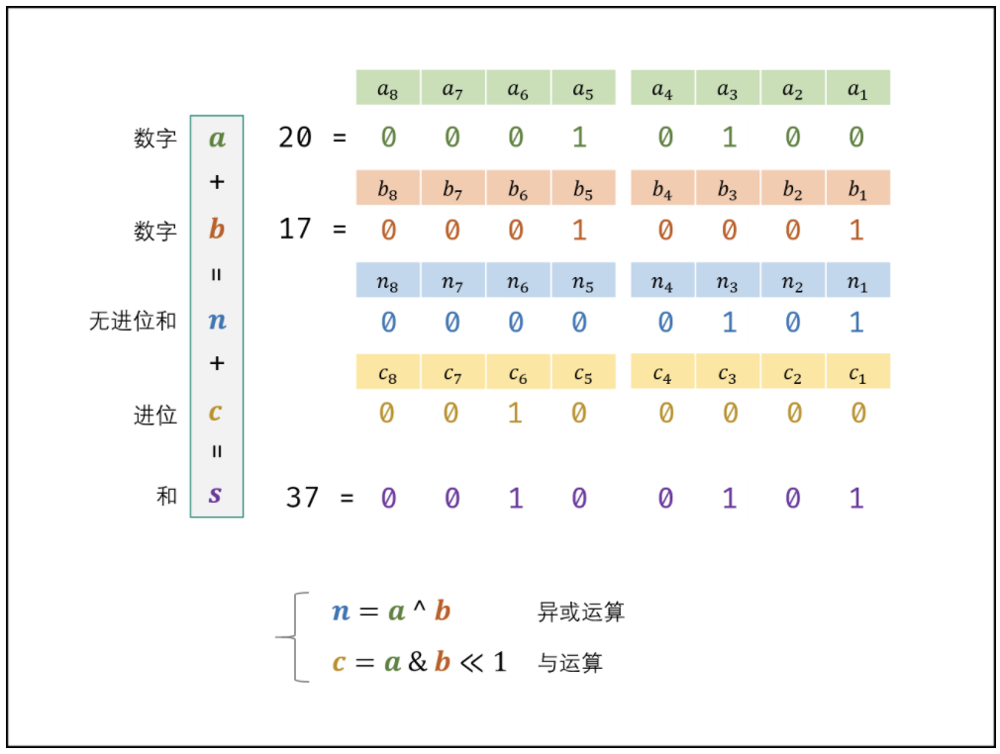

# 位运算

[Problems Index](#problems-index)

<!-- Tag: 位运算 -->


## 常用位运算

**判断奇偶**
```python
if n & 1:  # 奇数
    ...
else:  # 偶数
    ...
```

**抹去最后一个 1**
```
n &= n - 1
```

Problems Index
---
- [`LeetCode 0029 两数相除 (中等, 2021-10)`](#leetcode-0029-两数相除-中等-2021-10)
- [`LeetCode 0187 重复的DNA序列 (中等, 2021-10)`](#leetcode-0187-重复的dna序列-中等-2021-10)
- [`剑指Offer 1500 二进制中1的个数 (简单, 2021-11)`](#剑指offer-1500-二进制中1的个数-简单-2021-11)
- [`剑指Offer 5601 数组中数字出现的次数 (中等, 2022-01)`](#剑指offer-5601-数组中数字出现的次数-中等-2022-01)
- [`剑指Offer 5602 数组中数字出现的次数 (中等, 2022-01)`](#剑指offer-5602-数组中数字出现的次数-中等-2022-01)
- [`剑指Offer 6500 不用加减乘除做加法 (简单, 2022-01)`](#剑指offer-6500-不用加减乘除做加法-简单-2022-01)

---

### `LeetCode 0029 两数相除 (中等, 2021-10)`

[](技巧-位运算.md)
[](算法-二分.md)
[](合集-LeetCode.md)

<!--{
    "tags": ["位运算", "二分查找"],
    "来源": "LeetCode",
    "编号": "0029",
    "难度": "中等",
    "标题": "两数相除"
}-->

<summary><b>问题简述</b></summary>

```txt
不使用乘法、除法和 mod 运算符，返回两数相除的整数部分，如 10/3 返回 3。
```

<details><summary><b>详细描述</b></summary>

```txt
给定两个整数，被除数 dividend 和除数 divisor。将两数相除，要求不使用乘法、除法和 mod 运算符。

返回被除数 dividend 除以除数 divisor 得到的商。

整数除法的结果应当截去（truncate）其小数部分，例如：truncate(8.345) = 8 以及 truncate(-2.7335) = -2

示例 1:
    输入: dividend = 10, divisor = 3
    输出: 3
    解释: 10/3 = truncate(3.33333..) = truncate(3) = 3
示例 2:
    输入: dividend = 7, divisor = -3
    输出: -2
    解释: 7/-3 = truncate(-2.33333..) = -2

提示：
    被除数和除数均为 32 位有符号整数。
    除数不为 0。
    假设我们的环境只能存储 32 位有符号整数，其数值范围是 [−2^31,  2^31 − 1]。本题中，如果除法结果溢出，则返回 2^31 − 1。

来源：力扣（LeetCode）
链接：https://leetcode-cn.com/problems/divide-two-integers
著作权归领扣网络所有。商业转载请联系官方授权，非商业转载请注明出处。
```

</details>


<summary><b>思路</b></summary>

<details><summary><b>Python：二分查找</b></summary>

```python
class Solution:
    def divide(self, dividend: int, divisor: int) -> int:
        """"""
        INT_MIN, INT_MAX = -2 ** 31, 2 ** 31 - 1

        # 按照题目要求，只有一种情况会溢出
        if dividend == INT_MIN and divisor == -1:
            return INT_MAX

        sign = (dividend > 0 and divisor > 0) or (dividend < 0 and divisor < 0)

        # 核心操作
        def div(a, b):
            if a < b:
                return 0

            cnt = 1
            tb = b
            while (tb + tb) <= a:
                cnt += cnt
                tb += tb

            return cnt + div(a - tb, b)

        ret = div(abs(dividend), abs(divisor))
        return ret if sign else -ret
```

**核心操作说明**，以 60 / 8 为例：
```txt
第一轮 div(60, 8): 8 -> 32 时停止，因为 32 + 32 > 60，返回 4
第二轮 div(28, 8): 8 -> 16 时停止，因为 16 + 16 > 28，返回 2
第三轮 div(8, 8):  8 -> 8  时停止，因为 8  +  8 >  8，返回 1
第三轮 div(0, 8):  因为 0 < 8，返回 0

因此结果为 1 + 2 + 4 = 7
```

</details>

---

### `LeetCode 0187 重复的DNA序列 (中等, 2021-10)`

[](技巧-哈希表(Hash).md)
[](技巧-位运算.md)
[](合集-LeetCode.md)

<!--{
    "tags": ["哈希表", "位运算"],
    "来源": "LeetCode",
    "编号": "0187",
    "难度": "中等",
    "标题": "重复的DNA序列"
}-->

<summary><b>问题简述</b></summary>

```txt
找出由 ATCG 构成的字符串中所有重复且长度为 10 的子串；
```

<details><summary><b>详细描述</b></summary>

```txt
所有 DNA 都由一系列缩写为 'A'，'C'，'G' 和 'T' 的核苷酸组成，例如："ACGAATTCCG"。在研究 DNA 时，识别 DNA 中的重复序列有时会对研究非常有帮助。

编写一个函数来找出所有目标子串，目标子串的长度为 10，且在 DNA 字符串 s 中出现次数超过一次。

示例 1：
    输入：s = "AAAAACCCCCAAAAACCCCCCAAAAAGGGTTT"
    输出：["AAAAACCCCC","CCCCCAAAAA"]
示例 2：
    输入：s = "AAAAAAAAAAAAA"
    输出：["AAAAAAAAAA"]

提示：
    0 <= s.length <= 10^5
    s[i] 为 'A'、'C'、'G' 或 'T'

来源：力扣（LeetCode）
链接：https://leetcode-cn.com/problems/repeated-dna-sequences
著作权归领扣网络所有。商业转载请联系官方授权，非商业转载请注明出处。
```

</details>

<summary><b>思路</b></summary>

- 基本思路：哈希表计数；
- 如果直接使用子串本身作为哈希表的 key，那么时间复杂度和空间复杂度都是 `O(NL)`；而如果使用位运算+滑动窗口手动构造 key，可以把复杂度降为 `O(N)`；


<details><summary><b>子串作为 key</b></summary>

- 时间&空间复杂度：`O(NL)`；
```python
class Solution:
    def findRepeatedDnaSequences(self, s: str) -> List[str]:
        """"""
        # from collections import defaultdict
        L = 10

        cnt = defaultdict(int)
        ans = []
        for i in range(len(s) - L + 1):
            subs = s[i: i+L]
            cnt[subs] += 1
            if cnt[subs] == 2:
                ans.append(subs)

        return ans
```

</details>

<details><summary><b>位运算+滑动窗口</b></summary>

- 时间&空间复杂度：`O(N)`；
```python
class Solution:
    def findRepeatedDnaSequences(self, s: str) -> List[str]:
        """"""
        # from collections import defaultdict
        L = 10
        B = {'A': 0, 'T': 1, 'C': 2, 'G': 3}  # 分别为 00, 01, 10, 11

        if len(s) < L + 1:  # assert，否则部分用例会无法通过
            return []

        # 先计算前 9 位的值
        x = 0
        for i in range(L - 1):
            b = B[s[i]]
            x = (x << 2) | b

        ans = []
        cnt = defaultdict(int)
        for i in range(len(s) - L + 1):
            b = B[s[i + L - 1]]
            # 注意该有的括号不要少，避免运算优先级混乱
            x = ((x << 2) | b) & ((1 << (L * 2)) - 1)  # 滑动计算子串的 hash 值
            cnt[x] += 1
            if cnt[x] == 2:
                ans.append(s[i: i + L])

        return ans
```

</details>


<details><summary><b>位运算说明</b></summary>

- `(x << 2) | b`：
    ```python
    # 以为均为二进制表示
    设 x = 0010 1011, b = 10: 
    该运算相当于把 b “拼” 到 x 末尾

    x         :   0010 1011
    x = x << 2:   1010 1100
    
    x = x | b :   1010 1100
                | 0000 0010
                -----------
                  1010 1110
    ```
- `x & ((1 << (L * 2)) - 1)`
    ```python
    # 该运算把 x 除低 10 位前的所有位置置 0
    设 L = 5，x = 1110 1010 1010: 
    
    y = 1 << (L * 2):   0100 0000 0000
    y = y - 1       :   0011 1111 1111

    x = x & y       :   1110 1010 1010
                      & 0011 1111 1111
                      ----------------
                        0010 1010 1010

    ```

</details>

---

### `剑指Offer 1500 二进制中1的个数 (简单, 2021-11)`

[](技巧-位运算.md)
[](合集-剑指Offer.md)

<!--{
    "tags": ["位运算"],
    "来源": "剑指Offer",
    "编号": "1500",
    "难度": "简单",
    "标题": "二进制中1的个数"
}-->

<summary><b>问题简述</b></summary>

```txt
输入是一个无符号整数，返回其二进制表达式中数字位数为 '1' 的个数
```

<details><summary><b>详细描述</b></summary>

```txt
编写一个函数，输入是一个无符号整数（以二进制串的形式），返回其二进制表达式中数字位数为 '1' 的个数（也被称为 汉明重量).）。

提示：
    请注意，在某些语言（如 Java）中，没有无符号整数类型。在这种情况下，输入和输出都将被指定为有符号整数类型，并且不应影响您的实现，因为无论整数是有符号的还是无符号的，其内部的二进制表示形式都是相同的。
    在 Java 中，编译器使用 二进制补码 记法来表示有符号整数。因此，在上面的 示例 3 中，输入表示有符号整数 -3。

示例 1：
    输入：n = 11 (控制台输入 00000000000000000000000000001011)
    输出：3
    解释：输入的二进制串 00000000000000000000000000001011 中，共有三位为 '1'。
示例 2：
    输入：n = 128 (控制台输入 00000000000000000000000010000000)
    输出：1
    解释：输入的二进制串 00000000000000000000000010000000 中，共有一位为 '1'。
示例 3：
    输入：n = 4294967293 (控制台输入 11111111111111111111111111111101，部分语言中 n = -3）
    输出：31
    解释：输入的二进制串 11111111111111111111111111111101 中，共有 31 位为 '1'。

提示：
    输入必须是长度为 32 的 二进制串 。

来源：力扣（LeetCode）
链接：https://leetcode-cn.com/problems/er-jin-zhi-zhong-1de-ge-shu-lcof
著作权归领扣网络所有。商业转载请联系官方授权，非商业转载请注明出处。
```

</details>

<summary><b>思路</b></summary>

<!-- <div align="center"></div> -->

<details><summary><b>Python：法1</b></summary>

```python
class Solution:
    def hammingWeight(self, n: int) -> int:
        ret = 0
        while n:
            # if n % 2 == 1:  # 是奇数
            #     ret += 1
            ret += n & 1  # 同上等价
            n >>= 1

        return ret
```

</details>

<details><summary><b>Python：法2</b></summary>

```python
class Solution:
    def hammingWeight(self, n: int) -> int:
        res = 0
        while n:
            res += 1
            n &= n - 1  # 消去最右边的 1，能循环几次就有几个 1
        return res
```

图解：

<div align="center"></div>


</details>

---

### `剑指Offer 5601 数组中数字出现的次数 (中等, 2022-01)`

[](技巧-位运算.md)
[](合集-剑指Offer.md)

<!--{
    "tags": ["位运算"],
    "来源": "剑指Offer",
    "编号": "5601",
    "难度": "中等",
    "标题": "数组中数字出现的次数"
}-->

<summary><b>问题简述</b></summary>

```txt
一个整型数组中除两个数字外，其他数字都出现了两次。求这两个只出现一次的数字。
要求时间复杂度是O(n)，空间复杂度是O(1)。
```

<details><summary><b>详细描述</b></summary>

```txt
一个整型数组 nums 里除两个数字之外，其他数字都出现了两次。请写程序找出这两个只出现一次的数字。要求时间复杂度是O(n)，空间复杂度是O(1)。

示例 1：
    输入：nums = [4,1,4,6]
    输出：[1,6] 或 [6,1]
示例 2：
    输入：nums = [1,2,10,4,1,4,3,3]
    输出：[2,10] 或 [10,2]

限制：
    2 <= nums.length <= 10000

来源：力扣（LeetCode）
链接：https://leetcode-cn.com/problems/shu-zu-zhong-shu-zi-chu-xian-de-ci-shu-lcof
著作权归领扣网络所有。商业转载请联系官方授权，非商业转载请注明出处。
```

</details>

<!-- <div align="center"></div> -->

<summary><b>思路</b></summary>

- 异或运算的性质：
    ```
    性质1：0^a = a
    性质2：a^a = 0
    性质3（交换律）：a^b = b^a
    性质4（结合律）：(a^b)^c = a^(b^c)
    ```
- 根据性质1 和性质2，可以构造如下算法：
    ```
    定义 all_xor(nums) := nums[0] ^ nums[1] ^ .. ^ nums[-1]
    记这两个不同的数分别为 a 和 b
    则 ab = a ^ b = all_xor(nums)  # 存在两个相同数字的都被消去
    因为 a != b，则 ab 的二进制表示中必然有一个为 1（因为 0^1=1）
    根据这个位置的 1 将 nums 分为两组 ls 和 rs
    则结果为 [all_xor(ls), all_xor(rs)]
    ```


<details><summary><b>Python</b></summary>

```python
class Solution:
    def singleNumbers(self, nums: List[int]) -> List[int]:
        
        def all_xor(ns):
            r = 0
            for x in ns:
                r ^= x
            return r

        # 求 a^b
        ab = all_xor(nums)

        # 找出二进制 ab 中从左往右第一个 1 的索引
        idx = 0
        while not ab & 1:
            ab >>= 1
            idx += 1
        
        # 将 nums 根据 1 的位置分为两部分
        y = 1 << idx
        ls, rs = [], []
        for x in nums:
            if x & y:
                ls.append(x)
            else:
                rs.append(x)
        
        return [all_xor(ls), all_xor(rs)]
        
```

</details>

---

### `剑指Offer 5602 数组中数字出现的次数 (中等, 2022-01)`

[](技巧-位运算.md)
[](合集-剑指Offer.md)

<!--{
    "tags": ["位运算"],
    "来源": "剑指Offer",
    "编号": "5602",
    "难度": "中等",
    "标题": "数组中数字出现的次数"
}-->

<summary><b>问题简述</b></summary>

```txt
数组 nums 中除一个数字只出现一次外，其他数字都出现了三次。找出那个只出现一次的数字。
要求：时间复杂度 O(N)，空间复杂度 O(1)
```

<details><summary><b>详细描述</b></summary>

```txt
在一个数组 nums 中除一个数字只出现一次之外，其他数字都出现了三次。请找出那个只出现一次的数字。

示例 1：
    输入：nums = [3,4,3,3]
    输出：4
示例 2：
    输入：nums = [9,1,7,9,7,9,7]
    输出：1

限制：
    1 <= nums.length <= 10000
    1 <= nums[i] < 2^31


来源：力扣（LeetCode）
链接：https://leetcode-cn.com/problems/shu-zu-zhong-shu-zi-chu-xian-de-ci-shu-ii-lcof
著作权归领扣网络所有。商业转载请联系官方授权，非商业转载请注明出处。
```

</details>

<!-- <div align="center"></div> -->

<summary><b>思路1</b></summary>

- 统计每个数字二进制各位出现的次数，然后对各位出现的次数对 3 求余，即可得到目标值的二进制各位的值；
- 因为每个数的二进制位数是固定的，所以空间复杂度依然是 `O(1)`；

<details><summary><b>Python</b></summary>

```python
class Solution:
    def singleNumber(self, nums: List[int]) -> int:
        
        cnt = [0] * 32

        for i in range(32):
            for x in nums:
                if x & (1 << i):
                    cnt[i] += 1
        
        ret = 0
        for i, n in enumerate(cnt):
            if n % 3:
                ret += 2 ** i
        
        return ret
```

</details>


**优化**：上述Python代码只能处理正数，如果是负数还要一步操作
> [数组中数字出现的次数 II（位运算 + 有限状态自动机，清晰图解） - Krahets](https://leetcode-cn.com/problems/shu-zu-zhong-shu-zi-chu-xian-de-ci-shu-ii-lcof/solution/mian-shi-ti-56-ii-shu-zu-zhong-shu-zi-chu-xian-d-4/)

<details><summary><b>Python</b></summary>

```python
class Solution:
    def singleNumber(self, nums: List[int]) -> int:
        
        cnt = [0] * 32

        for i in range(32):
            for x in nums:
                if x & (1 << i):
                    cnt[i] += 1
        
        ret = 0
        for i, n in enumerate(cnt):
            if n % 3:
                ret += 2 ** i
        
        if cnt[31] % 3 == 0:  # 最高位是 0 为正数
            return ret
        else:
            return ~(ret ^ 0xffffffff)  # 这一步的操作实际上就是讲 ret 二进制表示中 32位以上的部分都置为 0
```

</details>


<summary><b>思路2：有限状态自动机</b></summary>

> [数组中数字出现的次数 II（位运算 + 有限状态自动机，清晰图解） - Krahets](https://leetcode-cn.com/problems/shu-zu-zhong-shu-zi-chu-xian-de-ci-shu-ii-lcof/solution/mian-shi-ti-56-ii-shu-zu-zhong-shu-zi-chu-xian-d-4/)

<details><summary><b>Python</b></summary>

```python
class Solution:
    def singleNumber(self, nums: List[int]) -> int:
        ones, twos = 0, 0
        for num in nums:
            ones = ones ^ num & ~twos
            twos = twos ^ num & ~ones
        return ones
```

</details>

---

### `剑指Offer 6500 不用加减乘除做加法 (简单, 2022-01)`

[](技巧-位运算.md)
[](合集-剑指Offer.md)

<!--{
    "tags": ["位运算"],
    "来源": "剑指Offer",
    "编号": "6500",
    "难度": "简单",
    "标题": "不用加减乘除做加法"
}-->

<summary><b>问题简述</b></summary>

```txt
求两个整数之和，要求不能使用 “+”、“-”、“*”、“/” 运算符号。
```

<details><summary><b>详细描述</b></summary>

```txt
写一个函数，求两个整数之和，要求在函数体内不得使用 “+”、“-”、“*”、“/” 四则运算符号。

示例:
    输入: a = 1, b = 1
    输出: 2

提示：
    a, b 均可能是负数或 0
    结果不会溢出 32 位整数

来源：力扣（LeetCode）
链接：https://leetcode-cn.com/problems/bu-yong-jia-jian-cheng-chu-zuo-jia-fa-lcof
著作权归领扣网络所有。商业转载请联系官方授权，非商业转载请注明出处。
```

</details>

<!-- <div align="center"></div> -->

<summary><b>思路</b></summary>

<div align="center"></div>

> [不用加减乘除做加法（位运算，清晰图解）](https://leetcode-cn.com/problems/bu-yong-jia-jian-cheng-chu-zuo-jia-fa-lcof/solution/mian-shi-ti-65-bu-yong-jia-jian-cheng-chu-zuo-ji-7/)

- 不用编程语言之间略有区别；

<details><summary><b>Java（推荐）</b></summary>

```java
class Solution {
    public int add(int a, int b) {
        while(b != 0) { // 当进位为 0 时跳出
            int c = (a & b) << 1;  // c = 进位
            a ^= b; // a = 非进位和
            b = c; // b = 进位
        }
        return a;
    }
}
```

</details>

<details><summary><b>Python</b></summary>

- Python 中

```python
class Solution:
    def add(self, a: int, b: int) -> int:
        x = 0xffffffff
        a, b = a & x, b & x  # 转为补码形式
        while b != 0:
            a, b = (a ^ b), (a & b) << 1 & x
        return a if a <= 0x7fffffff else ~(a ^ x)  # 还原
```

</details>

<details><summary><b>C++</b></summary>

> [不用加减乘除做加法](https://leetcode-cn.com/problems/bu-yong-jia-jian-cheng-chu-zuo-jia-fa-lcof/solution/dian-zan-yao-wo-zhi-dao-ni-xiang-kan-dia-ovxy/)

```cpp
class Solution {
public:
    int add(int a, int b) {
        while (b) {
            int carry = a & b; // 计算 进位
            a = a ^ b; // 计算 本位
            b = (unsigned)carry << 1;  // C++中负数不支持左位移
        }
        return a;
    }
};
```

</details>

---
