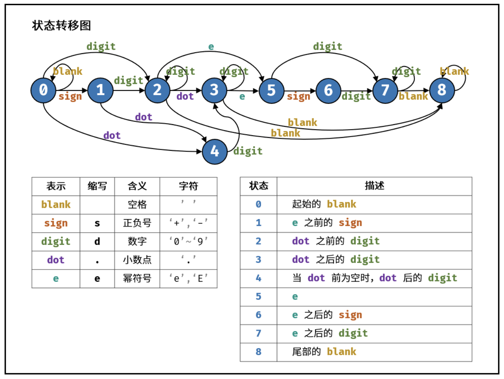

# 字符串

[Problems Index](#problems-index)

<!-- Tag: 字符串 -->

Problems Index
---
- [`LeetCode 0434 字符串中的单词数 (简单, 2021-10)`](#leetcode-0434-字符串中的单词数-简单-2021-10)
- [`LeetCode 0859 亲密字符串 (简单, 2021-11)`](#leetcode-0859-亲密字符串-简单-2021-11)
- [`剑指Offer 0500 替换空格 (简单, 2021-11)`](#剑指offer-0500-替换空格-简单-2021-11)
- [`剑指Offer 1900 正则表达式匹配 (困难, 2021-11)`](#剑指offer-1900-正则表达式匹配-困难-2021-11)
- [`剑指Offer 2000 表示数值的字符串 (中等, 2021-11)`](#剑指offer-2000-表示数值的字符串-中等-2021-11)
- [`剑指Offer 5802 左旋转字符串 (简单, 2022-01)`](#剑指offer-5802-左旋转字符串-简单-2022-01)
- [`剑指Offer 6700 把字符串转换成整数（atoi） (中等, 2022-01)`](#剑指offer-6700-把字符串转换成整数atoi-中等-2022-01)
- [`牛客 0001 大数加法 (中等, 2022-01)`](#牛客-0001-大数加法-中等-2022-01)
- [`牛客 0010 大数乘法 (中等, 2022-01)`](#牛客-0010-大数乘法-中等-2022-01)

---

### `LeetCode 0434 字符串中的单词数 (简单, 2021-10)`

[](数据结构-字符串.md)
[](合集-LeetCode.md)

<!--{
    "tags": ["字符串"],
    "来源": "LeetCode",
    "编号": "0434",
    "难度": "简单",
    "标题": "字符串中的单词数"
}-->

<summary><b>问题描述</b></summary>

```txt
统计字符串中的单词个数，这里的单词指的是连续的不是空格的字符。

请注意，你可以假定字符串里不包括任何不可打印的字符。

示例:
    输入: "Hello, my name is John"
    输出: 5
    解释: 这里的单词是指连续的不是空格的字符，所以 "Hello," 算作 1 个单词。

来源：力扣（LeetCode）
链接：https://leetcode-cn.com/problems/number-of-segments-in-a-string
著作权归领扣网络所有。商业转载请联系官方授权，非商业转载请注明出处。
```

<summary><b>思路</b></summary>

<details><summary><b>Python3</b></summary>

```python
class Solution:
    def countSegments(self, s):
        
        # 针对第一个字符初始化，注意处理空串
        ans = 0 if s == '' or s[0] == ' ' else 1

        for i in range(1, len(s)):
            if s[i] != ' ' and s[i - 1] == ' ':
                ans += 1

        return ans

```

</details>

---

### `LeetCode 0859 亲密字符串 (简单, 2021-11)`

[](基础-模拟.md)
[](数据结构-字符串.md)
[](合集-LeetCode.md)

<!--{
    "tags": ["模拟", "字符串"],
    "来源": "LeetCode",
    "编号": "0859",
    "难度": "简单",
    "标题": "亲密字符串"
}-->

<summary><b>问题简述</b></summary>

```txt
给你两个字符串 s 和 goal ，只要我们可以通过交换 s 中的两个字母得到与 goal 相等的结果，就返回 true ；否则返回 false。

例如，在 "abcd" 中交换下标 0 和下标 2 的元素可以生成 "cbad" 。
```

<details><summary><b>详细描述</b></summary>

```txt
给你两个字符串 s 和 goal ，只要我们可以通过交换 s 中的两个字母得到与 goal 相等的结果，就返回 true ；否则返回 false 。

交换字母的定义是：取两个下标 i 和 j （下标从 0 开始）且满足 i != j ，接着交换 s[i] 和 s[j] 处的字符。

例如，在 "abcd" 中交换下标 0 和下标 2 的元素可以生成 "cbad" 。
 

示例 1：
    输入：s = "ab", goal = "ba"
    输出：true
    解释：你可以交换 s[0] = 'a' 和 s[1] = 'b' 生成 "ba"，此时 s 和 goal 相等。
示例 2：
    输入：s = "ab", goal = "ab"
    输出：false
    解释：你只能交换 s[0] = 'a' 和 s[1] = 'b' 生成 "ba"，此时 s 和 goal 不相等。
示例 3：
    输入：s = "aa", goal = "aa"
    输出：true
    解释：你可以交换 s[0] = 'a' 和 s[1] = 'a' 生成 "aa"，此时 s 和 goal 相等。
示例 4：
    输入：s = "aaaaaaabc", goal = "aaaaaaacb"
    输出：true
 

提示：
    1 <= s.length, goal.length <= 2 * 10^4
    s 和 goal 由小写英文字母组成

来源：力扣（LeetCode）
链接：https://leetcode-cn.com/problems/buddy-strings
著作权归领扣网络所有。商业转载请联系官方授权，非商业转载请注明出处。
```

<!-- <div align="center"></div> -->

</details>


<summary><b>思路：分情况讨论</b></summary>

- 当 `len(s) != len(goal)` 时：False
- 当 `len(s) == len(goal)` 时：
    - 当 `s != goal` 时：当且仅当不同的字符数量等于 2，且交换后满足条件；
    - 当 `s == goal` 时：`s` 中存在出现至少 2 次的字符；

- `s == goal` 的情况比较容易被忽略；


<details><summary><b>Python：模拟</b></summary>

```python
class Solution:

    def buddyStrings(self, s: str, goal: str) -> bool:
        """"""
        if len(s) != len(goal):
            return False

        dif = []
        cs = set()
        for i, c in enumerate(s):
            cs.add(c)
            if s[i] != goal[i]:
                dif.append(i)

        # 存在字符出现过 2 次
        if s == goal and len(cs) < len(s):
            return True

        # 只存在两个位置字符不同，且交换后满足条件
        if len(dif) == 2 and (s[dif[0]], s[dif[1]]) == (goal[dif[1]], goal[dif[0]]):
            return True

        return False
```

</details>

---

### `剑指Offer 0500 替换空格 (简单, 2021-11)`

[](数据结构-字符串.md)
[](合集-剑指Offer.md)

<!--{
    "tags": ["字符串"],
    "来源": "剑指Offer",
    "编号": "0500",
    "难度": "简单",
    "标题": "替换空格"
}-->

<summary><b>问题简述</b></summary>

```txt
实现一个函数，把字符串 s 中的每个空格替换成"%20"。
```

<details><summary><b>详细描述</b></summary>

```txt
请实现一个函数，把字符串 s 中的每个空格替换成"%20"。

示例 1：
    输入：s = "We are happy."
    输出："We%20are%20happy."

限制：
    0 <= s 的长度 <= 10000

来源：力扣（LeetCode）
链接：https://leetcode-cn.com/problems/ti-huan-kong-ge-lcof
著作权归领扣网络所有。商业转载请联系官方授权，非商业转载请注明出处。
```

<!-- <div align="center"></div> -->

</details>


<summary><b>思路</b></summary>

- Python、Java 中的字符串都是不可变类型，所以始终要申请新的容器；那么问题就很简单，替换拼接即可；
- C++ 中 string 是可变类型，因此可以尝试原地替换；


<details><summary><b>Python</b></summary>

```python
class Solution:
    def replaceSpace(self, s: str) -> str:
        buf = []
        for c in s:
            if c == ' ':
                buf.append('%20')
            else:
                buf.append(c)
        
        return ''.join(buf)
```

</details>

<details><summary><b>C++：原地替换</b></summary>

```cpp
class Solution {
public:
    string replaceSpace(string s) {
        // 统计空格数量
        int space_cnt = 0;
        for (char c : s) {
            if (c == ' ') space_cnt++;
        }
        // 修改 s 长度
        int i = s.size() - 1;  // 原来的长度
        s.resize(s.size() + 2 * space_cnt);        
        int j = s.size() - 1;  // 新的长度
        // 倒序遍历修改
        while (i < j) {
            if (s[i] != ' ')
                s[j] = s[i];
            else {
                s[j - 2] = '%';
                s[j - 1] = '2';
                s[j] = '0';
                j -= 2;
            }
            i--;
            j--;
        }
        return s;
    }
};
```

</details>

---

### `剑指Offer 1900 正则表达式匹配 (困难, 2021-11)`

[](数据结构-字符串.md)
[](算法-动态规划(记忆化搜索)、递推.md)
[](算法-递归、迭代.md)
[](合集-剑指Offer.md)

<!--{
    "tags": ["字符串", "动态规划", "递归"],
    "来源": "剑指Offer",
    "编号": "1900",
    "难度": "困难",
    "标题": "正则表达式匹配"
}-->

<summary><b>问题简述</b></summary>

```txt
请实现一个函数用来匹配包含'.'和'*'的正则表达式。
```

<details><summary><b>详细描述</b></summary>

```txt
请实现一个函数用来匹配包含'.'和'*'的正则表达式。模式中的字符'.'表示任意一个字符，而'*'表示它前面的字符可以出现任意次（含0次）。在本题中，匹配是指字符串的所有字符匹配整个模式。例如，字符串"aaa"与模式"a.a"和"ab*ac*a"匹配，但与"aa.a"和"ab*a"均不匹配。

示例 1:
    输入:
    s = "aa"
    p = "a"
    输出: false
    解释: "a" 无法匹配 "aa" 整个字符串。
示例 2:
    输入:
    s = "aa"
    p = "a*"
    输出: true
    解释: 因为 '*' 代表可以匹配零个或多个前面的那一个元素, 在这里前面的元素就是 'a'。因此，字符串 "aa" 可被视为 'a' 重复了一次。
示例 3:
    输入:
    s = "ab"
    p = ".*"
    输出: true
    解释: ".*" 表示可匹配零个或多个（'*'）任意字符（'.'）。
示例 4:
    输入:
    s = "aab"
    p = "c*a*b"
    输出: true
    解释: 因为 '*' 表示零个或多个，这里 'c' 为 0 个, 'a' 被重复一次。因此可以匹配字符串 "aab"。
示例 5:
    输入:
    s = "mississippi"
    p = "mis*is*p*."
    输出: false
    s 可能为空，且只包含从 a-z 的小写字母。
    p 可能为空，且只包含从 a-z 的小写字母以及字符 . 和 *，无连续的 '*'。

来源：力扣（LeetCode）
链接：https://leetcode-cn.com/problems/zheng-ze-biao-da-shi-pi-pei-lcof
著作权归领扣网络所有。商业转载请联系官方授权，非商业转载请注明出处。
```

</details>

<!-- <div align="center"></div> -->

<summary><b>思路：动态规划</b></summary>

> [正则表达式匹配（动态规划，清晰图解） - Krahets](https://leetcode-cn.com/problems/zheng-ze-biao-da-shi-pi-pei-lcof/solution/jian-zhi-offer-19-zheng-ze-biao-da-shi-pi-pei-dong/)

- 记主串为 `s`，模式串为 `p`；
- 将 `s` 的前 i 个 字符记为 `s[:i]`，p 的前 j 个字符记为 `p[:j]`；
- 整体思路是从 `s[:1]` 和 `p[:1]` 开始，判断 `s[:i]` 和 `p[:j]` 能否匹配；


<details><summary><b>Python</b></summary>

```python
class Solution:
    def isMatch(self, s: str, p: str) -> bool:
        m, n = len(s), len(p)

        # dp[i][j] := 代表字符串 s 的前 i 个字符和 p 的前 j 个字符能否匹配
        dp = [[False] * (n + 1) for _ in range(m + 1)]

        dp[0][0] = True  # ‘空主串’与‘空模式串’匹配

        # 初始化首行：‘空主串’与‘特殊模式串’匹配（如 a*、a*b* 等）
        for j in range(2, n + 1, 2):
            dp[0][j] = dp[0][j - 2] and p[j - 1] == '*'

        # 状态转移
        for i in range(1, m + 1):
            for j in range(1, n + 1):
                # 便于理解，记 s[I] == s[i - 1] 表示 s 的第 i 个字符，p[J] 同理
                I, J = i - 1, j - 1
                # 根据 p 的 第 j 个字符是否为 *，分两种情况讨论
                if p[J] != '*':
                    # s[:i-1] 与 p[:j-1] 匹配的前提下，‘s 的第 i 个字符 == p 的第 j 个字符’ 或 ‘p 的第 j 个字符是 .’
                    #   这里 s[i-1] 和 p[j-1] 分别表示的是 s 和 p 的第 i 个和第 j 个字符
                    if dp[i - 1][j - 1] and (s[I] == p[J] or p[J] == '.'):
                        dp[i][j] = True
                else:  # 当 p[J] == '*' 时
                    # 情况1：* 匹配了 0 个字符，如 'a' 和 'ab*'
                    if dp[i][j - 2]:
                        dp[i][j] = True
                    # 情况2：* 匹配了至少一个字符，如 'ab' 和 'ab*'
                    #   dp[i - 1][j] == True 表示在 '[a]b' 和 '[ab*]' 中括号部分匹配的前提下，
                    #   再看 s[I] 与 p[J-1] 是否相同，或者 p[J-1] 是否为 .
                    elif dp[i - 1][j] and (s[I] == p[J - 1] or p[J - 1] == '.'):
                        dp[i][j] = True

        return dp[m][n]
```

</details>

<summary><b>思路2：递归</b></summary>

- 看到一份非常简洁的递归代码；
    > 见[正则表达式匹配（动态规划，清晰图解） - 评论区](https://leetcode-cn.com/problems/zheng-ze-biao-da-shi-pi-pei-lcof/solution/jian-zhi-offer-19-zheng-ze-biao-da-shi-pi-pei-dong/)

<details><summary><b>C++</b></summary>

```cpp
class Solution {
public:
    bool isMatch(string s, string p) 
    {
        if (p.empty()) 
            return s.empty();
        
        bool first_match = !s.empty() && (s[0] == p[0] || p[0] == '.');
        
        // *前字符重复>=1次 || *前字符重复0次（不出现）
        if (p.size() >= 2 && p[1] == '*')  
            return (first_match && isMatch(s.substr(1), p)) || isMatch(s, p.substr(2));
        else  // 不是*，减去已经匹配成功的头部，继续比较
            return first_match && isMatch(s.substr(1), p.substr(1));    
    }
};
```

</details>

---

### `剑指Offer 2000 表示数值的字符串 (中等, 2021-11)`

[](数据结构-字符串.md)
[](技巧-有限状态自动机.md)
[](合集-剑指Offer.md)

<!--{
    "tags": ["字符串", "有限状态自动机"],
    "来源": "剑指Offer",
    "编号": "2000",
    "难度": "中等",
    "标题": "表示数值的字符串"
}-->

<summary><b>问题简述</b></summary>

```txt
请实现一个函数用来判断字符串是否表示数值（包括整数和小数）。
```

<details><summary><b>详细描述</b></summary>

```txt
请实现一个函数用来判断字符串是否表示数值（包括整数和小数）。

数值（按顺序）可以分成以下几个部分：

    1. 若干空格
    2. 一个 小数 或者 整数
    3. （可选）一个 'e' 或 'E' ，后面跟着一个 整数
    4. 若干空格

小数（按顺序）可以分成以下几个部分：
    1. （可选）一个符号字符（'+' 或 '-'）
    2. 下述格式之一：
        1. 至少一位数字，后面跟着一个点 '.'
        2. 至少一位数字，后面跟着一个点 '.' ，后面再跟着至少一位数字
        3. 一个点 '.' ，后面跟着至少一位数字

整数（按顺序）可以分成以下几个部分：
    1. （可选）一个符号字符（'+' 或 '-'）
    2. 至少一位数字

部分数值列举如下：
    ["+100", "5e2", "-123", "3.1416", "-1E-16", "0123"]
部分非数值列举如下：
    ["12e", "1a3.14", "1.2.3", "+-5", "12e+5.4"]

示例 1：
    输入：s = "0"
    输出：true
示例 2：
    输入：s = "e"
    输出：false
示例 3：
    输入：s = "."
    输出：false
示例 4：
    输入：s = "    .1  "
    输出：true
 
提示：
    1 <= s.length <= 20
    s 仅含英文字母（大写和小写），数字（0-9），加号 '+' ，减号 '-' ，空格 ' ' 或者点 '.' 。

来源：力扣（LeetCode）
链接：https://leetcode-cn.com/problems/biao-shi-shu-zhi-de-zi-fu-chuan-lcof
著作权归领扣网络所有。商业转载请联系官方授权，非商业转载请注明出处。
```

</details>

<!-- <div align="center"></div> -->

<summary><b>思路：有限状态自动机</b></summary>

<div align="center"></div>

- 其中合法的结束状态有：2, 3, 7, 8

> [表示数值的字符串（有限状态自动机，清晰图解） - Krahets](https://leetcode-cn.com/problems/biao-shi-shu-zhi-de-zi-fu-chuan-lcof/solution/mian-shi-ti-20-biao-shi-shu-zhi-de-zi-fu-chuan-y-2/)

<details><summary><b>Python</b></summary>

```python
class Solution:
    def isNumber(self, s: str) -> bool:
        # '.'
        # ' '
        # 's': sign
        # 'd': digit
        # 'e': e/E
        states = [
            {' ': 0, 's': 1, 'd': 2, '.': 4},   # 0. start 'blank'
            {'d': 2, '.': 4},                   # 1. 'sign' before 'e'
            {'d': 2, '.': 3, 'e': 5, ' ': 8},   # 2. 'digit' before 'dot'
            {'d': 3, 'e': 5, ' ': 8},           # 3. 'digit' after 'dot'
            {'d': 3},                           # 4. 'digit' after 'dot' ('blank' before 'dot')
            {'s': 6, 'd': 7},                   # 5. 'e'
            {'d': 7},                           # 6. 'sign' after 'e'
            {'d': 7, ' ': 8},                   # 7. 'digit' after 'e'
            {' ': 8}                            # 8. end with 'blank'
        ]

        p = 0  # 开始状态 0
        for c in s:
            if '0' <= c <= '9':
                t = 'd'  # digit
            elif c in "+-":
                t = 's'  # sign
            elif c in "eE":
                t = 'e'  # e or E
            elif c in ". ":
                t = c  # dot, blank
            else:
                t = '?'  # unknown

            if t not in states[p]:
                return False

            p = states[p][t]

        return p in (2, 3, 7, 8)
```

</details>

---

### `剑指Offer 5802 左旋转字符串 (简单, 2022-01)`

[](数据结构-字符串.md)
[](合集-剑指Offer.md)

<!--{
    "tags": ["字符串"],
    "来源": "剑指Offer",
    "编号": "5802",
    "难度": "简单",
    "标题": "左旋转字符串"
}-->

<summary><b>问题简述</b></summary>

```txt
把字符串前面的 n 个字符转移到字符串的尾部。
```

<details><summary><b>详细描述</b></summary>

```txt
字符串的左旋转操作是把字符串前面的若干个字符转移到字符串的尾部。请定义一个函数实现字符串左旋转操作的功能。比如，输入字符串"abcdefg"和数字2，该函数将返回左旋转两位得到的结果"cdefgab"。

示例 1：
    输入: s = "abcdefg", k = 2
    输出: "cdefgab"
示例 2：
    输入: s = "lrloseumgh", k = 6
    输出: "umghlrlose"

限制：
    1 <= k < s.length <= 10000

来源：力扣（LeetCode）
链接：https://leetcode-cn.com/problems/zuo-xuan-zhuan-zi-fu-chuan-lcof
著作权归领扣网络所有。商业转载请联系官方授权，非商业转载请注明出处。
```

</details>

<!-- <div align="center"></div> -->

<summary><b>思路</b></summary>

> [左旋转字符串（切片 / 列表 / 字符串，清晰图解）](https://leetcode-cn.com/problems/zuo-xuan-zhuan-zi-fu-chuan-lcof/solution/mian-shi-ti-58-ii-zuo-xuan-zhuan-zi-fu-chuan-qie-p/)

<details><summary><b>Python</b></summary>

```python
class Solution:
    def reverseLeftWords(self, s: str, n: int) -> str:

        # 法1：切片（速度最快）
        def f1():
            return s[n:] + s[:n]
        
        # 法2：列表（面试推荐写法）
        def f2():
            ret = []
            # for i in range(n, len(s)):
            #     ret.append(s[i])
            # for i in range(n):
            #     ret.append(s[i])

            # 使用求余操作简化上述循环
            for i in range(len(s)):
                ret.append(s[(n + i) % len(s)])

            return ''.join(ret)
        
        return f2()

```

</details>

---

### `剑指Offer 6700 把字符串转换成整数（atoi） (中等, 2022-01)`

[](数据结构-字符串.md)
[](基础-模拟.md)
[](基础-经典问题&代码.md)
[](合集-剑指Offer.md)

<!--{
    "tags": ["字符串", "模拟", "经典"],
    "来源": "剑指Offer",
    "编号": "6700",
    "难度": "中等",
    "标题": "把字符串转换成整数（atoi）"
}-->

<summary><b>问题简述</b></summary>

```txt
写一个函数 strToInt(string s)，实现把字符串转换成整数这个功能。不能使用 atoi 或者其他类似的库函数。
```

<details><summary><b>详细描述</b></summary>

```txt
写一个函数 strToInt(string s)，实现把字符串转换成整数这个功能。不能使用 atoi 或者其他类似的库函数。

首先，该函数会根据需要丢弃无用的开头空格字符，直到寻找到第一个非空格的字符为止。

当我们寻找到的第一个非空字符为正或者负号时，则将该符号与之后面尽可能多的连续数字组合起来，作为该整数的正负号；假如第一个非空字符是数字，则直接将其与之后连续的数字字符组合起来，形成整数。

该字符串除了有效的整数部分之后也可能会存在多余的字符，这些字符可以被忽略，它们对于函数不应该造成影响。

注意：假如该字符串中的第一个非空格字符不是一个有效整数字符、字符串为空或字符串仅包含空白字符时，则你的函数不需要进行转换。

在任何情况下，若函数不能进行有效的转换时，请返回 0。

说明：
    假设我们的环境只能存储 32 位大小的有符号整数，那么其数值范围为 [−231,  231 − 1]。如果数值超过这个范围，请返回  INT_MAX (231 − 1) 或 INT_MIN (−231) 。

示例 1:
    输入: "42"
    输出: 42
示例 2:
    输入: "   -42"
    输出: -42
    解释: 第一个非空白字符为 '-', 它是一个负号。
         我们尽可能将负号与后面所有连续出现的数字组合起来，最后得到 -42 。
示例 3:
    输入: "4193 with words"
    输出: 4193
    解释: 转换截止于数字 '3' ，因为它的下一个字符不为数字。
示例 4:
    输入: "words and 987"
    输出: 0
    解释: 第一个非空字符是 'w', 但它不是数字或正、负号。
        因此无法执行有效的转换。
示例 5:
    输入: "-91283472332"
    输出: -2147483648
    解释: 数字 "-91283472332" 超过 32 位有符号整数范围。 
         因此返回 INT_MIN (−231) 。

来源：力扣（LeetCode）
链接：https://leetcode-cn.com/problems/ba-zi-fu-chuan-zhuan-huan-cheng-zheng-shu-lcof
著作权归领扣网络所有。商业转载请联系官方授权，非商业转载请注明出处。
```

<!-- <div align="center"></div> -->

</details>


<summary><b>思路</b></summary>

- 把字符串当做数组，依次遍历每个字符，根据题目要求执行每一步操作；
- 注意一些细节：如正负号、char 与 int 的互转、越界判断等，详见下方代码；
- PS：不同编程语言中字符串的实现细节；


<details><summary><b>C++</b></summary>

```cpp
class Solution {
public:
    int strToInt(string str) {
        int n = str.length();
        if (n < 1) return 0;
        
        int ret = 0;
        int p = 0;      // 模拟指针
        int sign = 1;   // 正负
        int s_max = INT_MAX / 10;
        
        while (isspace(str[p])) 
            p++;  // 跳过前置空格

        // c++ 的字符串末尾有一个特殊字符，因此不需要做越界判断
        // if (p == n) return 0;
        
        if (str[p] == '-') sign = -1;
        if (str[p] == '-' || str[p] == '+') p++;
        
        while (str[p] >= '0' && str[p] <= '9') {
            if (ret > s_max || (ret == s_max && str[p] > '7')) {  // 越界判断
                return sign > 0 ? INT_MAX : INT_MIN;
            }
            ret = ret * 10 + (str[p] - '0');  // str[p] - '0' 必须括起来，否则顺序计算时会溢出
            p++;
        }
        
        return sign * ret;
    }
};

```

</details>


<details><summary><b>Python</b></summary>

```python
class Solution:
    def strToInt(self, str: str) -> int:

        n = len(str)
        if n < 1: return 0

        INT_MAX = 2 ** 31 - 1
        INT_MIN = -2 ** 31

        ret = 0  # 保存结果
        sign = 1  # 记录符号
        p = 0  # 模拟指针

        # Python 字符串与 C++ 不同，时刻需要进行越界判断
        while p < n and str[p] == ' ':
            p += 1
        
        if p == n:  # 越界判断
            return ret
        
        if str[p] == '-':
            sign = -1
        if str[p] in ('-', '+'):
            p += 1
        
        while p < n and '0' <= str[p] <= '9':  # 注意越界判断
            ret = ret * 10 + int(str[p])
            p += 1
            if ret > INT_MAX:  # python 中不存在越界，因此直接跟 INT_MAX 比较即可
                return INT_MAX if sign == 1 else INT_MIN
        
        return ret * sign
```

</details>


<details><summary><b>Java</b></summary>

> [把字符串转换成整数（数字越界处理，清晰图解）](https://leetcode-cn.com/problems/ba-zi-fu-chuan-zhuan-huan-cheng-zheng-shu-lcof/solution/mian-shi-ti-67-ba-zi-fu-chuan-zhuan-huan-cheng-z-4/)

```java
class Solution {
    public int strToInt(String str) {
        int res = 0, bndry = Integer.MAX_VALUE / 10;
        int i = 0, sign = 1, length = str.length();
        if(length == 0) return 0;
        while(str.charAt(i) == ' ')
            if(++i == length) return 0;
        if(str.charAt(i) == '-') sign = -1;
        if(str.charAt(i) == '-' || str.charAt(i) == '+') i++;
        for(int j = i; j < length; j++) {
            if(str.charAt(j) < '0' || str.charAt(j) > '9') break;
            if(res > bndry || res == bndry && str.charAt(j) > '7')
                return sign == 1 ? Integer.MAX_VALUE : Integer.MIN_VALUE;
            res = res * 10 + (str.charAt(j) - '0');
        }
        return sign * res;
    }
}

```

</details>

---

### `牛客 0001 大数加法 (中等, 2022-01)`

[](数据结构-字符串.md)
[](基础-模拟.md)
[](合集-牛客.md)

<!--{
    "tags": ["字符串", "模拟"],
    "来源": "牛客",
    "难度": "中等",
    "编号": "0001",
    "标题": "大数加法",
    "公司": ["百度", "阿里", "字节", "虾皮"]
}-->

<summary><b>问题简述</b></summary>

```txt
以字符串的形式读入两个数字，计算它们的和，以字符串形式返回。
```
> [大数加法_牛客题霸_牛客网](https://www.nowcoder.com/practice/11ae12e8c6fe48f883cad618c2e81475)

</details>

<!-- <div align="center"></div> -->

<summary><b>思路</b></summary>

- 把较短的字符串通过补前缀 0 使长度一致，此时只要处理好进位即可；

<details><summary><b>Python</b></summary>

```python
class Solution:
    def solve(self , s: str, t: str) -> str:
        # write code here
        n, m = len(s), len(t)
        if n < m:  # 确保 n >= m
            s, t = t, s
            n, m = m, n
            
        t = '0' * (n - m) + t  # 补0
        
        ret = ''
        ex = 0  # 进位标志
        for i in range(n - 1, -1, -1):
            r = int(s[i]) + int(t[i]) + ex
            ret = str(r % 10) + ret
            ex = r // 10
            
        if ex:
            ret = '1' + ret
        
        return ret
```

</details>

---

### `牛客 0010 大数乘法 (中等, 2022-01)`

[](数据结构-字符串.md)
[](基础-模拟.md)
[](合集-牛客.md)

<!--{
    "tags": ["字符串", "模拟"],
    "来源": "牛客",
    "难度": "中等",
    "编号": "0010",
    "标题": "大数乘法",
    "公司": ["腾讯", "阿里", "字节"]
}-->

<summary><b>问题简述</b></summary>

```txt
以字符串的形式读入两个数字，编写一个函数计算它们的乘积，以字符串形式返回。
```
> http://

<!-- 
<details><summary><b>详细描述</b></summary>

```txt
```
-->

</details>

<!-- <div align="center"></div> -->

<summary><b>思路1：模拟</b></summary>

```
以 54 * 68 为例：

    54
  x 68
  -----

用 tmp 记录每一步的结果

8 * 4 = 32      tmp = [32]
8 * 5 = 40      tmp = [40, 32]
6 * 4 = 24      tmp = [40 + 24, 32]
6 * 5 = 30      tmp = [30, 40 + 24, 32]

得到 tmp 后做循环进位加法即可，详见代码；
```

- 示例中按照手算习惯是从低位开始算起的，实际因为各位之间互相独立，从高位开始也可以，详见代码；

<details><summary><b>Python</b></summary>

```python
#
# 代码中的类名、方法名、参数名已经指定，请勿修改，直接返回方法规定的值即可
#
# 
# @param s string字符串 第一个整数
# @param t string字符串 第二个整数
# @return string字符串
#
class Solution:
    def solve(self , s: str, t: str) -> str:
        from collections import deque
        
        # write code here
        tmp = []
        # 从高位开始算起
        for i, a in enumerate(s):
            for j, b in enumerate(t):
                c = int(a) * int(b)
                if i + j == len(tmp):
                    tmp.append(c)
                else:
                    tmp[i + j] += c
        
        ret = deque()
        add = 0  # 进位
        for x in tmp[::-1]:  # 因为要考虑进位，所以从低位开始算起，即逆序遍历
            x += add
            add = x // 10
            ret.appendleft(str(x % 10))  # 这里也可以直接拼字符串，不过推荐用队列
        
        if add:
            ret.appendleft(str(add))
            
        return ''.join(ret)
```

</details>

---
