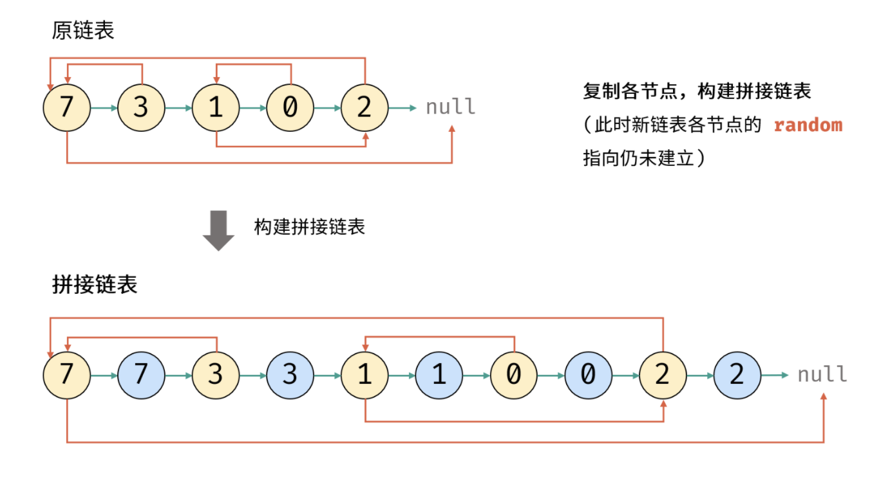

# 剑指Offer

[Problems Index](#problems-index)

<!-- Tag: 剑指Offer -->

Problems Index
---
- [`剑指Offer No.0003 数组中重复的数字 (简单, 2021-11)`](#剑指offer-no0003-数组中重复的数字-简单-2021-11)
- [`剑指Offer No.0004 二维数组中的查找 (中等, 2021-11)`](#剑指offer-no0004-二维数组中的查找-中等-2021-11)
- [`剑指Offer No.0005 替换空格 (简单, 2021-11)`](#剑指offer-no0005-替换空格-简单-2021-11)
- [`剑指Offer No.0006 从尾到头打印链表 (简单, 2021-11)`](#剑指offer-no0006-从尾到头打印链表-简单-2021-11)
- [`剑指Offer No.0007 重建二叉树 (中等, 2021-11)`](#剑指offer-no0007-重建二叉树-中等-2021-11)
- [`剑指Offer No.0009 用两个栈实现队列 (简单, 2021-11)`](#剑指offer-no0009-用两个栈实现队列-简单-2021-11)
- [`剑指Offer No.0010 斐波那契数列-1 (简单, 2021-11)`](#剑指offer-no0010-斐波那契数列-1-简单-2021-11)
- [`剑指Offer No.0010 斐波那契数列-2（青蛙跳台阶） (简单, 2021-11)`](#剑指offer-no0010-斐波那契数列-2青蛙跳台阶-简单-2021-11)
- [`剑指Offer No.0011 旋转数组的最小数字 (简单, 2021-11)`](#剑指offer-no0011-旋转数组的最小数字-简单-2021-11)
- [`剑指Offer No.0012 矩阵中的路径 (中等, 2021-11)`](#剑指offer-no0012-矩阵中的路径-中等-2021-11)
- [`剑指Offer No.0013 机器人的运动范围 (中等, 2021-11)`](#剑指offer-no0013-机器人的运动范围-中等-2021-11)
- [`剑指Offer No.0014 剪绳子1（整数拆分） (中等, 2021-11)`](#剑指offer-no0014-剪绳子1整数拆分-中等-2021-11)
- [`剑指Offer No.0015 二进制中1的个数 (简单, 2021-11)`](#剑指offer-no0015-二进制中1的个数-简单-2021-11)
- [`剑指Offer No.0016 数值的整数次方（快速幂） (中等, 2021-11)`](#剑指offer-no0016-数值的整数次方快速幂-中等-2021-11)
- [`剑指Offer No.0017 打印从1到最大的n位数（N叉树的遍历） (中等, 2021-11)`](#剑指offer-no0017-打印从1到最大的n位数n叉树的遍历-中等-2021-11)
- [`剑指Offer No.0018 删除链表的节点 (简单, 2021-11)`](#剑指offer-no0018-删除链表的节点-简单-2021-11)
- [`剑指Offer No.0021 调整数组顺序使奇数位于偶数前面 (简单, 2021-11)`](#剑指offer-no0021-调整数组顺序使奇数位于偶数前面-简单-2021-11)
- [`剑指Offer No.0022 链表中倒数第k个节点 (简单, 2021-11)`](#剑指offer-no0022-链表中倒数第k个节点-简单-2021-11)
- [`剑指Offer No.0024 反转链表 (简单, 2021-11)`](#剑指offer-no0024-反转链表-简单-2021-11)
- [`剑指Offer No.0025 合并两个排序的链表 (简单, 2021-11)`](#剑指offer-no0025-合并两个排序的链表-简单-2021-11)
- [`剑指Offer No.0026 树的子结构 (中等, 2021-11)`](#剑指offer-no0026-树的子结构-中等-2021-11)
- [`剑指Offer No.0027 二叉树的镜像 (简单, 2021-11)`](#剑指offer-no0027-二叉树的镜像-简单-2021-11)
- [`剑指Offer No.0028 对称的二叉树 (简单, 2021-11)`](#剑指offer-no0028-对称的二叉树-简单-2021-11)
- [`剑指Offer No.0029 顺时针打印矩阵（3种思路4个写法） (中等, 2021-11)`](#剑指offer-no0029-顺时针打印矩阵3种思路4个写法-中等-2021-11)
- [`剑指Offer No.0030 包含min函数的栈 (简单, 2021-11)`](#剑指offer-no0030-包含min函数的栈-简单-2021-11)
- [`剑指Offer No.0031 栈的压入、弹出序列 (中等, 2021-11)`](#剑指offer-no0031-栈的压入弹出序列-中等-2021-11)
- [`剑指Offer No.0032 1-层序遍历二叉树 (简单, 2021-11)`](#剑指offer-no0032-1-层序遍历二叉树-简单-2021-11)
- [`剑指Offer No.0032 2-层序遍历二叉树 (简单, 2021-11)`](#剑指offer-no0032-2-层序遍历二叉树-简单-2021-11)
- [`剑指Offer No.0032 3-层序遍历二叉树（之字形遍历） (简单, 2021-11)`](#剑指offer-no0032-3-层序遍历二叉树之字形遍历-简单-2021-11)
- [`剑指Offer No.0033 二叉搜索树的后序遍历序列 (中等, 2021-12)`](#剑指offer-no0033-二叉搜索树的后序遍历序列-中等-2021-12)
- [`剑指Offer No.0034 二叉树中和为某一值的路径 (中等, 2021-12)`](#剑指offer-no0034-二叉树中和为某一值的路径-中等-2021-12)
- [`剑指Offer No.0035 复杂链表的复制（深拷贝） (中等, 2021-12)`](#剑指offer-no0035-复杂链表的复制深拷贝-中等-2021-12)
- [`剑指Offer No.0036 二叉搜索树与双向链表 (中等, 2021-12)`](#剑指offer-no0036-二叉搜索树与双向链表-中等-2021-12)
- [`剑指Offer No.0037 序列化二叉树 (困难, 2021-12)`](#剑指offer-no0037-序列化二叉树-困难-2021-12)
- [`剑指Offer No.0038 字符串的排列（全排列） (中等, 2021-12)`](#剑指offer-no0038-字符串的排列全排列-中等-2021-12)
- [`剑指Offer No.0039 数组中出现次数超过一半的数字（摩尔投票） (简单, 2021-12)`](#剑指offer-no0039-数组中出现次数超过一半的数字摩尔投票-简单-2021-12)
- [`剑指Offer No.0040 最小的k个数（partition操作） (简单, 2021-12)`](#剑指offer-no0040-最小的k个数partition操作-简单-2021-12)
- [`剑指Offer No.0041 数据流中的中位数 (困难, 2021-12)`](#剑指offer-no0041-数据流中的中位数-困难-2021-12)
- [`剑指Offer No.0042 连续子数组的最大和 (简单, 2021-12)`](#剑指offer-no0042-连续子数组的最大和-简单-2021-12)
- [`剑指Offer No.0044 数字序列中某一位的数字 (中等, 2021-12)`](#剑指offer-no0044-数字序列中某一位的数字-中等-2021-12)
- [`剑指Offer No.0045 把数组排成最小的数 (中等, 2021-12)`](#剑指offer-no0045-把数组排成最小的数-中等-2021-12)
- [`剑指Offer No.0046 斐波那契数列-3（把数字翻译成字符串） (中等, 2021-12)`](#剑指offer-no0046-斐波那契数列-3把数字翻译成字符串-中等-2021-12)
- [`剑指Offer No.0047 礼物的最大价值 (中等, 2021-12)`](#剑指offer-no0047-礼物的最大价值-中等-2021-12)
- [`剑指Offer No.0048 最长不含重复字符的子字符串 (中等, 2021-12)`](#剑指offer-no0048-最长不含重复字符的子字符串-中等-2021-12)
- [`剑指Offer No.0049 丑数 (中等, 2021-12)`](#剑指offer-no0049-丑数-中等-2021-12)
- [`剑指Offer No.0050 第一个只出现一次的字符 (简单, 2021-12)`](#剑指offer-no0050-第一个只出现一次的字符-简单-2021-12)
- [`剑指Offer No.0051 数组中的逆序对 (困难, 2022-01)`](#剑指offer-no0051-数组中的逆序对-困难-2022-01)
- [`剑指Offer No.0052 两个链表的第一个公共节点 (简单, 2022-01)`](#剑指offer-no0052-两个链表的第一个公共节点-简单-2022-01)
- [`剑指Offer No.0053 1-求0～n-1中缺失的数字 (简单, 2022-01)`](#剑指offer-no0053-1-求0n-1中缺失的数字-简单-2022-01)
- [`剑指Offer No.0053 2-在排序数组中查找数字 (简单, 2022-01)`](#剑指offer-no0053-2-在排序数组中查找数字-简单-2022-01)
- [`剑指Offer No.0054 二叉搜索树的第k大节点 (简单, 2022-01)`](#剑指offer-no0054-二叉搜索树的第k大节点-简单-2022-01)
- [`剑指Offer No.0055 1-求二叉树的深度 (简单, 2022-01)`](#剑指offer-no0055-1-求二叉树的深度-简单-2022-01)
- [`剑指Offer No.0055 2-判断是否为平衡二叉树 (简单, 2022-01)`](#剑指offer-no0055-2-判断是否为平衡二叉树-简单-2022-01)
- [`剑指Offer No.0056 1-数组中数字出现的次数 (中等, 2022-01)`](#剑指offer-no0056-1-数组中数字出现的次数-中等-2022-01)
- [`剑指Offer No.0057 1-和为s的两个数字 (简单, 2022-01)`](#剑指offer-no0057-1-和为s的两个数字-简单-2022-01)
- [`剑指Offer No.0057 2-和为s的连续正数序列 (简单, 2022-01)`](#剑指offer-no0057-2-和为s的连续正数序列-简单-2022-01)
- [`剑指Offer No.0058 1-翻转单词顺序 (简单, 2022-01)`](#剑指offer-no0058-1-翻转单词顺序-简单-2022-01)
- [`剑指Offer No.0058 2-左旋转字符串 (简单, 2022-01)`](#剑指offer-no0058-2-左旋转字符串-简单-2022-01)
- [`剑指Offer No.0063 买卖股票的最佳时机 (中等, 2022-01)`](#剑指offer-no0063-买卖股票的最佳时机-中等-2022-01)
- [`剑指Offer No.0067 把字符串转换成整数 (中等, 2022-01)`](#剑指offer-no0067-把字符串转换成整数-中等-2022-01)

---

### `剑指Offer No.0003 数组中重复的数字 (简单, 2021-11)`

[](技巧-哈希表(Hash).md)
[](题集-剑指Offer.md)

<!-- Tag: 哈希表 -->

<summary><b>问题简述</b></summary>

```txt
找出数组中任意一个重复的数字。
```

<details><summary><b>详细描述</b></summary>

```txt
找出数组中重复的数字。

在一个长度为 n 的数组 nums 里的所有数字都在 0～n-1 的范围内。数组中某些数字是重复的，但不知道有几个数字重复了，也不知道每个数字重复了几次。请找出数组中任意一个重复的数字。

示例 1：
    输入：
    [2, 3, 1, 0, 2, 5, 3]
    输出：2 或 3 

限制：
    2 <= n <= 100000

来源：力扣（LeetCode）
链接：https://leetcode-cn.com/problems/shu-zu-zhong-zhong-fu-de-shu-zi-lcof
著作权归领扣网络所有。商业转载请联系官方授权，非商业转载请注明出处。
```

<!-- <div align="center"></div> -->

</details>

<summary><b>思路</b></summary>

- 遍历数组，保存见过的数字，当遇到出现过的数字即返回


<details><summary><b>Python</b></summary>

```python
class Solution:
    def findRepeatNumber(self, nums: List[int]) -> int:
        tb = set()
        for i in nums:
            if i in tb:
                return i
            tb.add(i)
```

</details>

---

### `剑指Offer No.0004 二维数组中的查找 (中等, 2021-11)`

[](算法-二分.md)
[](题集-剑指Offer.md)

<!-- Tag: 二分查找 -->

<summary><b>问题简述</b></summary>

```txt
一个 n * m 的二维数组，每一行从左到右递增，每一列从上到下递增。
输入一个整数，判断该数组中是否含有该整数。
```

<details><summary><b>详细描述</b></summary>

```txt
在一个 n * m 的二维数组中，每一行都按照从左到右递增的顺序排序，每一列都按照从上到下递增的顺序排序。请完成一个高效的函数，输入这样的一个二维数组和一个整数，判断数组中是否含有该整数。

示例:
    现有矩阵 matrix 如下：
    [
    [1,   4,  7, 11, 15],
    [2,   5,  8, 12, 19],
    [3,   6,  9, 16, 22],
    [10, 13, 14, 17, 24],
    [18, 21, 23, 26, 30]
    ]
    给定 target = 5，返回 true。
    给定 target = 20，返回 false。

限制：
    0 <= n <= 1000
    0 <= m <= 1000

来源：力扣（LeetCode）
链接：https://leetcode-cn.com/problems/er-wei-shu-zu-zhong-de-cha-zhao-lcof
著作权归领扣网络所有。商业转载请联系官方授权，非商业转载请注明出处。
```

<!-- <div align="center"></div> -->

</details>


<summary><b>思路</b></summary>

- 法1）对每一行做二分查找，时间复杂度`O(N*logM)`
- 法2）模拟二分，从左下角开始查找，打标目标值往右，小于目标值往上；


<details><summary><b>Python：模拟二分</b></summary>

```python
class Solution:
    def findNumberIn2DArray(self, matrix: List[List[int]], target: int) -> bool:
        if len(matrix) < 1:
            return False

        n, m = len(matrix), len(matrix[0])
        i, j = n - 1, 0

        while i >= 0 and j <= m - 1:
            if matrix[i][j] == target:
                return True
            elif matrix[i][j] > target:
                i -= 1
            else:  # matrix[i][j] < target:
                j += 1

        return False
```

</details>

---

### `剑指Offer No.0005 替换空格 (简单, 2021-11)`

[](数据结构-字符串.md)
[](题集-剑指Offer.md)

<!-- Tag: 字符串 -->

<summary><b>问题简述</b></summary>

```txt
实现一个函数，把字符串 s 中的每个空格替换成"%20"。
```

<details><summary><b>详细描述</b></summary>

```txt
请实现一个函数，把字符串 s 中的每个空格替换成"%20"。

示例 1：
    输入：s = "We are happy."
    输出："We%20are%20happy."

限制：
    0 <= s 的长度 <= 10000

来源：力扣（LeetCode）
链接：https://leetcode-cn.com/problems/ti-huan-kong-ge-lcof
著作权归领扣网络所有。商业转载请联系官方授权，非商业转载请注明出处。
```

<!-- <div align="center"></div> -->

</details>


<summary><b>思路</b></summary>

- Python、Java 中的字符串都是不可变类型，所以始终要申请新的容器；那么问题就很简单，替换拼接即可；
- C++ 中 string 是可变类型，因此可以尝试原地替换；


<details><summary><b>Python</b></summary>

```python
class Solution:
    def replaceSpace(self, s: str) -> str:
        buf = []
        for c in s:
            if c == ' ':
                buf.append('%20')
            else:
                buf.append(c)
        
        return ''.join(buf)
```

</details>

<details><summary><b>C++：原地替换</b></summary>

```cpp
class Solution {
public:
    string replaceSpace(string s) {
        // 统计空格数量
        int space_cnt = 0;
        for (char c : s) {
            if (c == ' ') space_cnt++;
        }
        // 修改 s 长度
        int i = s.size() - 1;  // 原来的长度
        s.resize(s.size() + 2 * space_cnt);        
        int j = s.size() - 1;  // 新的长度
        // 倒序遍历修改
        while (i < j) {
            if (s[i] != ' ')
                s[j] = s[i];
            else {
                s[j - 2] = '%';
                s[j - 1] = '2';
                s[j] = '0';
                j -= 2;
            }
            i--;
            j--;
        }
        return s;
    }
};
```

</details>

---

### `剑指Offer No.0006 从尾到头打印链表 (简单, 2021-11)`

[](数据结构-链表.md)
[](数据结构-栈、队列.md)
[](算法-深度优先搜索(DFS).md)
[](算法-递归、迭代.md)
[](题集-剑指Offer.md)

<!-- Tag: 链表、栈、DFS、递归 -->

<summary><b>问题简述</b></summary>

```txt
从尾到头打印链表（用数组返回）
```

<details><summary><b>详细描述</b></summary>

```txt
输入一个链表的头节点，从尾到头反过来返回每个节点的值（用数组返回）。

示例 1：
    输入：head = [1,3,2]
    输出：[2,3,1]

限制：
    0 <= 链表长度 <= 10000

来源：力扣（LeetCode）
链接：https://leetcode-cn.com/problems/cong-wei-dao-tou-da-yin-lian-biao-lcof
著作权归领扣网络所有。商业转载请联系官方授权，非商业转载请注明出处。
```

<!-- <div align="center"></div> -->

</details>


<summary><b>思路</b></summary>

- 法1）利用栈，顺序入栈，然后依次出栈即可
- 法2）利用深度优先遍历思想（二叉树的先序遍历）


<details><summary><b>Python：栈</b></summary>

```python
# Definition for singly-linked list.
# class ListNode:
#     def __init__(self, x):
#         self.val = x
#         self.next = None

class Solution:
    def reversePrint(self, head: ListNode) -> List[int]:
        stack = []
        while head:
            stack.append(head.val)
            head = head.next
        
        # ret = []
        # for _ in range(len(stack)):  # 相当于逆序遍历
        #     ret.append(stack.pop())
        # return ret
        return stack[::-1]  # 与以上代码等价
```

</details>

<details><summary><b>Python：DFS、递归</b></summary>

```python
# Definition for singly-linked list.
# class ListNode:
#     def __init__(self, x):
#         self.val = x
#         self.next = None

class Solution:
    def reversePrint(self, head: ListNode) -> List[int]:
        if head is None:
            return []

        ret = self.reversePrint(head.next)
        ret.append(head.val)

        return ret
```

</details>

---

### `剑指Offer No.0007 重建二叉树 (中等, 2021-11)`

[](数据结构-树、二叉树.md)
[](算法-分治.md)
[](题集-经典问题&代码.md)
[](题集-剑指Offer.md)

<!-- Tag: 二叉树、分治、经典 -->

<summary><b>问题简述</b></summary>

```txt
给出二叉树前序遍历和中序遍历的结果，重建该二叉树并返回其根节点。
```

<details><summary><b>详细描述</b></summary>

```txt
输入某二叉树的前序遍历和中序遍历的结果，请构建该二叉树并返回其根节点。
假设输入的前序遍历和中序遍历的结果中都不含重复的数字。

示例 1:
    Input: preorder = [3,9,20,15,7], inorder = [9,3,15,20,7]
    Output: [3,9,20,null,null,15,7]
示例 2:
    Input: preorder = [-1], inorder = [-1]
    Output: [-1]

来源：力扣（LeetCode）
链接：https://leetcode-cn.com/problems/zhong-jian-er-cha-shu-lcof
著作权归领扣网络所有。商业转载请联系官方授权，非商业转载请注明出处。
```

<!-- <div align="center"></div> -->

</details>


<summary><b>思路</b></summary>

- 前序遍历，节点按照 `[ 根节点 | 左子树 | 右子树 ]` 的顺序输出。
- 中序遍历，节点按照 `[ 左子树 | 根节点 | 右子树 ]` 的顺序输出。
- 可知：
    - 前序遍历的首元素为根节点 node 的值。
    - 在中序遍历的结果中搜索根节点的索引 ，可将**中序遍历**划分为 `[ 左子树 | 根节点 | 右子树 ]` 。
    - 根据中序遍历中的左（右）子树的节点数量，可将**前序遍历**划分为 `[ 根节点 | 左子树 | 右子树 ]` 。

<div align="center"></div>


<details><summary><b>Python</b></summary>

```python
# Definition for a binary tree node.
# class TreeNode:
#     def __init__(self, x):
#         self.val = x
#         self.left = None
#         self.right = None

class Solution:
    def buildTree(self, preorder: List[int], inorder: List[int]) -> TreeNode:
        if len(preorder) < 1 or len(inorder) < 1:  # 两个都判断一下
            return None

        # 建立根节点
        root_val = preorder[0]
        root = TreeNode(root_val)
        root_idx = inorder.index(root_val)  # 找到根节点在中序遍历的位置

        # 截取左子树的 preorder 和 inorder，递归建立左子树
        inorder_left = inorder[:root_idx]
        preorder_left = preorder[1: len(inorder_left) + 1]
        root.left = self.buildTree(preorder_left, inorder_left)
        # 截取右子树的 preorder 和 inorder，递归建立右子树
        inorder_right = inorder[root_idx + 1:]
        preorder_right = preorder[-len(inorder_right):]
        root.right = self.buildTree(preorder_right, inorder_right)
        return root
```

- 更常见的写法会使用一个字典来保存每个节点在中序遍历中的位置，取代`root_idx = inorder.index(root_val)` 这一步，
- 但是这样做就必须每次从最初的 preorder 和 inorder 中截取左右子树的片段，代码会变得比较复杂，传递的参数比较多，故没有采用这种写法；

</details>

---

### `剑指Offer No.0009 用两个栈实现队列 (简单, 2021-11)`

[](数据结构-栈、队列.md)
[](数据结构-栈、队列.md)
[](数据结构-设计.md)
[](题集-剑指Offer.md)

<!-- Tag: 栈、队列、设计 -->

<summary><b>问题简述</b></summary>

```txt
用两个栈实现一个队列。
队列包含两个函数 appendTail 和 deleteHead(若队列中没有元素，deleteHead 操作返回 -1 )
```

<details><summary><b>详细描述</b></summary>

```txt
用两个栈实现一个队列。队列的声明如下，请实现它的两个函数 appendTail 和 deleteHead ，分别完成在队列尾部插入整数和在队列头部删除整数的功能。(若队列中没有元素，deleteHead 操作返回 -1 )

示例 1：
    输入：
    ["CQueue","appendTail","deleteHead","deleteHead"]
    [[],[3],[],[]]
    输出：[null,null,3,-1]
示例 2：
    输入：
    ["CQueue","deleteHead","appendTail","appendTail","deleteHead","deleteHead"]
    [[],[],[5],[2],[],[]]
    输出：[null,-1,null,null,5,2]

提示：
    1 <= values <= 10000
    最多会对 appendTail、deleteHead 进行 10000 次调用

来源：力扣（LeetCode）
链接：https://leetcode-cn.com/problems/yong-liang-ge-zhan-shi-xian-dui-lie-lcof
著作权归领扣网络所有。商业转载请联系官方授权，非商业转载请注明出处。
```

<!-- <div align="center"></div> -->

</details>


<summary><b>思路</b></summary>

- 栈：先进后出；队列：先进先出；换言之，队列就是倒序输出的栈；
- 利用双栈可实现倒序输出：维护两个栈 A 和 B，将 A 中元素依次弹出并压入栈 B，再依次弹出 B 中元素，即实现了对栈 A 元素的倒序输出，即实现了队列的性质；


<details><summary><b>Python</b></summary>

```python
class CQueue:
    def __init__(self):
        self.I = []  # 入栈
        self.O = []  # 出栈

    def appendTail(self, value: int) -> None:
        self.I.append(value)  # 新元素全部加到 I

    def deleteHead(self) -> int:
        if self.O:  # 如果 O 不为空
            return self.O.pop()  # 弹出栈顶元素
        
        if not self.I:  # 如果 I 为空，说明队列为空
            return -1

        while self.I:  # 如果 I 不为空，但 O 为空，此时将 I 中元素依次加入 O  
            self.O.append(self.I.pop())
        return self.O.pop()


# Your CQueue object will be instantiated and called as such:
# obj = CQueue()
# obj.appendTail(value)
# param_2 = obj.deleteHead()
```

</details>

---

### `剑指Offer No.0010 斐波那契数列-1 (简单, 2021-11)`

[](算法-动态规划(DP、记忆化搜索).md)
[](算法-动态规划(DP、记忆化搜索).md)
[](题集-剑指Offer.md)

<!-- Tag: DP、记忆化搜索 -->

<summary><b>问题简述</b></summary>

```txt
输入 n ，求斐波那契（Fibonacci）数列的第 n 项
```

<details><summary><b>详细描述</b></summary>

```txt
写一个函数，输入 n ，求斐波那契（Fibonacci）数列的第 n 项（即 F(N)）。斐波那契数列的定义如下：
    F(0) = 0,   F(1) = 1
    F(N) = F(N - 1) + F(N - 2), 其中 N > 1.
斐波那契数列由 0 和 1 开始，之后的斐波那契数就是由之前的两数相加而得出。

答案需要取模 1e9+7（1000000007），如计算初始结果为：1000000008，请返回 1。

示例 1：
    输入：n = 2
    输出：1
示例 2：
    输入：n = 5
    输出：5

提示：
    0 <= n <= 100

来源：力扣（LeetCode）
链接：https://leetcode-cn.com/problems/fei-bo-na-qi-shu-lie-lcof
著作权归领扣网络所有。商业转载请联系官方授权，非商业转载请注明出处。
```

<!-- <div align="center"></div> -->

</details>


<summary><b>思路</b></summary>

- 法1）递归
- 法2）DP（记忆化搜索），因为每个答案只与固定的前两个结果有关，因此可以使用滚动 DP；


<details><summary><b>Python：递归（会超时）</b></summary>

```python
class Solution:
    
    def fib(self, n: int) -> int:
        if n == 0:
            return 0
        if n == 1:
            return 1
        
        MAX = 1000000007
        return (self.fib(n-1) + self.fib(n-2)) % MAX
```

</details>


<details><summary><b>Python：动态规划</b></summary>

```python
class Solution:
    
    def fib(self, n: int) -> int:
        if n == 0:
            return 0
        if n == 1:
            return 1
        
        MAX = 1000000007

        dp = [0, 1]  # 因为每个答案只与固定的前两个结果有关，所以只需要“记忆”两个答案
        for _ in range(n - 1):
            dp[0], dp[1] = dp[1], dp[0] + dp[1]
        
        return dp[1] % MAX
```

</details>

---

### `剑指Offer No.0010 斐波那契数列-2（青蛙跳台阶） (简单, 2021-11)`

[](算法-动态规划(DP、记忆化搜索).md)
[](题集-剑指Offer.md)

<!-- Tag: DP -->

<summary><b>问题简述</b></summary>

```txt
规定一次可以跳1级台阶或2级台阶。求跳上一个 n 级台阶总共有多少种跳法。
```

<details><summary><b>详细描述</b></summary>

```txt
一只青蛙一次可以跳上1级台阶，也可以跳上2级台阶。求该青蛙跳上一个 n 级的台阶总共有多少种跳法。

答案需要取模 1e9+7（1000000007），如计算初始结果为：1000000008，请返回 1。

示例 1：
    输入：n = 2
    输出：2
示例 2：
    输入：n = 7
    输出：21
示例 3：
    输入：n = 0
    输出：1
提示：
    0 <= n <= 100

来源：力扣（LeetCode）
链接：https://leetcode-cn.com/problems/qing-wa-tiao-tai-jie-wen-ti-lcof
著作权归领扣网络所有。商业转载请联系官方授权，非商业转载请注明出处。
```

<!-- <div align="center"></div> -->

</details>


<summary><b>思路</b></summary>

- 本题实际上就是求斐波那契数列，跳上 n 级台阶的方法数 `f(n) = f(n-1) + f(n-2)`，
- 只是初始状态不同，这里是 `f(0) = 1, f(1) = 1`；


<details><summary><b>Python：动态规划</b></summary>

```python
class Solution:
    def numWays(self, n: int) -> int:
        MAX = 1000000007

        dp = [1, 1]  # 
        for _ in range(n - 1):
            dp[0], dp[1] = dp[1], dp[0] + dp[1]
        
        return dp[1] % MAX if n > 0 else dp[0]
```

</details>

---

### `剑指Offer No.0011 旋转数组的最小数字 (简单, 2021-11)`

[](算法-二分.md)
[](题集-剑指Offer.md)

<!-- Tag: 二分查找 -->

<summary><b>问题简述</b></summary>

```txt
求旋转数组中的最小元素；
旋转数组：将一个有序数组的前 N 个数组拼接到末尾；
例如，数组 [3,4,5,1,2] 为 [1,2,3,4,5] 的一个旋转；
```

<details><summary><b>详细描述</b></summary>

```txt
把一个数组最开始的若干个元素搬到数组的末尾，我们称之为数组的旋转。输入一个递增排序的数组的一个旋转，输出旋转数组的最小元素。例如，数组 [3,4,5,1,2] 为 [1,2,3,4,5] 的一个旋转，该数组的最小值为1。  

示例 1：
    输入：[3,4,5,1,2]
    输出：1
示例 2：
    输入：[2,2,2,0,1]
    输出：0

来源：力扣（LeetCode）
链接：https://leetcode-cn.com/problems/xuan-zhuan-shu-zu-de-zui-xiao-shu-zi-lcof
著作权归领扣网络所有。商业转载请联系官方授权，非商业转载请注明出处。
```

<!-- <div align="center"></div> -->

</details>

<summary><b>思路：二分查找</b></summary>

- 本题的难点是比较基准的确定（详见代码）
- 本题虽然是简单题，但有很多需要注意的点；
  > [旋转数组的最小数字（二分法，清晰图解）](https://leetcode-cn.com/problems/xuan-zhuan-shu-zu-de-zui-xiao-shu-zi-lcof/solution/mian-shi-ti-11-xuan-zhuan-shu-zu-de-zui-xiao-shu-3/)


<details><summary><b>Python</b></summary>

```python
class Solution:
    def minArray(self, numbers: List[int]) -> int:
        """"""
        if numbers[0] < numbers[-1]:  # 只有严格小于，才说明没有发生旋转
            return numbers[0]

        l, r = -1, len(numbers) - 1  # 本题设置为左开右闭较合适，即 (l, r]
        while l + 1 < r:
            mid = l + (r - l) // 2  # l <= mid < r
            if numbers[mid] > numbers[r]:  # 中值大于右边界，说明最小值在右侧
                l = mid  # 因为设置 l 为开区间，故不需要 l = mid + 1
            elif numbers[mid] < numbers[r]:  # 中值小于右边界，说明最小值在左侧
                r = mid  # mid 本身就可能是最小值，且 r 为闭区间，故不需要 r = mid - 1
            else:
                r -= 1  # 关键步骤，当 numbers[mid] == numbers[r] 时，无法判断旋转点 x 是在 (l, m] 还是 (m, r] 区间中，通过 r-=1 来缩小范围

        return numbers[r]  # 循环结束时，应有 l+1 == r
```

</details>

---

### `剑指Offer No.0012 矩阵中的路径 (中等, 2021-11)`

[](算法-深度优先搜索(DFS).md)
[](算法-深度优先搜索(DFS).md)
[](题集-剑指Offer.md)

<!-- Tag: DFS、DFS+回溯 -->

<summary><b>问题简述</b></summary>

```txt
给定一个 m x n 二维字符矩阵 board 和字符串 word。如果 word 存在于网格中，返回 true ；否则，返回 false 。

其中单词必须按照字母顺序，通过相邻的单元格内的字母构成，其中“相邻”单元格是那些水平相邻或垂直相邻的单元格。同一个单元格内的字母不允许被重复使用。
```

<details><summary><b>详细描述</b></summary>

```txt
给定一个 m x n 二维字符网格 board 和一个字符串单词 word 。如果 word 存在于网格中，返回 true ；否则，返回 false 。

单词必须按照字母顺序，通过相邻的单元格内的字母构成，其中“相邻”单元格是那些水平相邻或垂直相邻的单元格。同一个单元格内的字母不允许被重复使用。

例如，在下面的 3×4 的矩阵中包含单词 "ABCCED"（单词中的字母已标出）。

示例 1：
    输入：board = [["A","B","C","E"],["S","F","C","S"],["A","D","E","E"]], word = "ABCCED"
    输出：true
示例 2：
    输入：board = [["a","b"],["c","d"]], word = "abcd"
    输出：false
 
提示：
    1 <= board.length <= 200
    1 <= board[i].length <= 200
    board 和 word 仅由大小写英文字母组成
 

来源：力扣（LeetCode）
链接：https://leetcode-cn.com/problems/ju-zhen-zhong-de-lu-jing-lcof
著作权归领扣网络所有。商业转载请联系官方授权，非商业转载请注明出处。
```

<div align="center"></div>

</details>

<summary><b>思路</b></summary>

- 棋盘搜索，非常典型的 DFS + 回溯问题；

<!-- <div align="center"></div> -->

<details><summary><b>Python：DFS + 回溯</b></summary>

```python
class Solution:
    def exist(self, board: List[List[str]], word: str) -> bool:
        if len(board) < 1:
            return False

        m, n = len(board), len(board[0])

        # 使用内部函数，可以减少一些参数的传递，同时比成员方法更简洁
        def dfs(i, j, k):  # i, j, k 分别表示 board[i][j] 和 word[k]
            if not 0 <= i < m or not 0 <= j < n:  # 先判断是否越界
                return False

            if board[i][j] != word[k]:  # 这一步可以合并到越界判断，但会损失一些可读性，故分离出来单独判断
                return False
            else:  # board[i][j] == word[k]:  # 如果当前位置字符相同，继续深度搜索
                if k == len(word) - 1:  # 如果字符已经全部匹配成功，返回 True
                    return True

                # 置空，表示该位置已访问过；一些代码中会使用一个新的矩阵记录位置是否访问，这里直接在原矩阵上标记
                board[i][j] = ''
                # 继续遍历 4 个方向
                flag = dfs(i + 1, j, k + 1) or dfs(i - 1, j, k + 1) or dfs(i, j + 1, k + 1) or dfs(i, j - 1, k + 1)
                # 这一步是容易忽略的：因为需要回溯，所以必须还原该位置的元素
                board[i][j] = word[k]

                return flag

        # board 中每一个位置都可能是起始位置，所以要循环遍历
        for i in range(m):
            for j in range(n):
                if dfs(i, j, 0):
                    return True
        return False
```

</details>

---

### `剑指Offer No.0013 机器人的运动范围 (中等, 2021-11)`

[](算法-深度优先搜索(DFS).md)
[](题集-剑指Offer.md)

<!-- Tag: DFS -->

<summary><b>问题描述</b></summary>

```txt
地上有一个m行n列的方格，从坐标 [0,0] 到坐标 [m-1,n-1] 。一个机器人从坐标 [0, 0] 的格子开始移动，它每次可以向左、右、上、下移动一格（不能移动到方格外），也不能进入行坐标和列坐标的数位之和大于k的格子。例如，当k为18时，机器人能够进入方格 [35, 37] ，因为3+5+3+7=18。但它不能进入方格 [35, 38]，因为3+5+3+8=19。请问该机器人能够到达多少个格子？

示例 1：
    输入：m = 2, n = 3, k = 1
    输出：3
示例 2：
    输入：m = 3, n = 1, k = 0
    输出：1

提示：
    1 <= n,m <= 100
    0 <= k <= 20

来源：力扣（LeetCode）
链接：https://leetcode-cn.com/problems/ji-qi-ren-de-yun-dong-fan-wei-lcof
著作权归领扣网络所有。商业转载请联系官方授权，非商业转载请注明出处。
```

<summary><b>思路</b></summary>

- 本题也可以使用广度优先搜索；
  > [机器人的运动范围（ 回溯算法，DFS / BFS ，清晰图解）](https://leetcode-cn.com/problems/ji-qi-ren-de-yun-dong-fan-wei-lcof/solution/mian-shi-ti-13-ji-qi-ren-de-yun-dong-fan-wei-dfs-b/)

<!-- <div align="center"></div> -->

<details><summary><b>Python：DFS+回溯</b></summary>

```python
class Solution:
    def movingCount(self, m: int, n: int, k: int) -> int:

        def dig_sum(x):  # 求数位之和
            s = 0
            while x != 0:
                s += x % 10
                x = x // 10
            return s

        def dfs(i, j):
            if not 0 <= i < m or not 0 <= j < n or dig_sum(i) + dig_sum(j) > k:
                return 0

            if (i, j) in visited:  # 如果已经访问过
                return 0
            else:
                visited.add((i, j))  # 访问标记
                return 1 + dfs(i + 1, j) + dfs(i, j + 1)  # 因为只能往左或往右，所以只需要搜索两个方向

        visited = set()
        return dfs(0, 0)
```

</details>

---

### `剑指Offer No.0014 剪绳子1（整数拆分） (中等, 2021-11)`

[](算法-动态规划(DP、记忆化搜索).md)
[](技巧-贪心.md)
[](基础-模拟、数学、找规律.md)
[](题集-剑指Offer.md)

<!-- Tag: 动态规划、贪心、数学 -->

<summary><b>问题简述</b></summary>

```txt
给定一个正整数 n，将其拆分为至少两个正整数的和，使这些整数的乘积最大化。返回最大乘积。
```

<details><summary><b>详细描述</b></summary>

```txt
给你一根长度为 n 的绳子，请把绳子剪成整数长度的 m 段（m、n都是整数，n>1并且m>1），每段绳子的长度记为 k[0],k[1]...k[m-1] 。请问 k[0]*k[1]*...*k[m-1] 可能的最大乘积是多少？例如，当绳子的长度是8时，我们把它剪成长度分别为2、3、3的三段，此时得到的最大乘积是18。

示例 1：
    输入: 2
    输出: 1
    解释: 2 = 1 + 1, 1 × 1 = 1
示例 2:
    输入: 10
    输出: 36
    解释: 10 = 3 + 3 + 4, 3 × 3 × 4 = 36
提示：
    2 <= n <= 58

来源：力扣（LeetCode）
链接：https://leetcode-cn.com/problems/jian-sheng-zi-lcof
著作权归领扣网络所有。商业转载请联系官方授权，非商业转载请注明出处。
```

</details>

<summary><b>思路1：动态规划</b></summary>

<!-- <div align="center"></div> -->

- 在不使用任何数学结论的前提下，可以把本题当做纯 DP 来做：

<details><summary><b>Python（写法1）</b></summary>

> LeetCode 官方题解中的写法：[整数拆分](https://leetcode-cn.com/problems/integer-break/solution/zheng-shu-chai-fen-by-leetcode-solution/)

```python
class Solution:
    def integerBreak(self, n: int) -> int:
        dp = [1] * (n + 1)

        for i in range(2, n + 1):
            for j in range(1, i):
                # 状态定义：dp[i] 表示长度为 i 并拆分成至少两个正整数后的最大乘积（i>=1）
                #   j * (i - j)   表示将 i 拆分成 j 和 i-j，且 i-j 不再拆分
                #   j * dp[i - j] 表示将 i 拆分成 j 和 i-j，且 i-j 会继续拆分，dp[i-j] 即为继续拆分的最优结果（最优子结构）
                dp[i] = max(dp[i], max(j * (i - j), j * dp[i - j]))

        return dp[n]
```

</details>

<details><summary><b>Python（写法2）</b></summary>

> 《剑指Offer》中的写法

```python
class Solution:
    def cuttingRope(self, n: int) -> int:
        # 对于 n = 2、3 的情况，直接硬编码
        if n == 2:
            return 1
        if n == 3:
            return 2

        # 状态定义：dp[i] 表示长度为 i 并拆分成至少两个正整数后的最大乘积（i>3）
        #   当 i <= 3 时，不满足该定义，此时不拆效率最高
        #   初始状态（dp[0] 仅用于占位）
        dp = [0,1,2,3] + [0] * (n - 3) 

        for i in range(4, n + 1):
            for j in range(2, i):
                dp[i] = max(dp[i], dp[i-j] * dp[j])

        return dp[n]
```

</details>


<summary><b>思路2：数学/贪心</b></summary>

- 数学上可证：尽可能按长度为 3 切，如果剩余 4，则按 2、2 切；
  > 证明见：[剪绳子1（数学推导 / 贪心思想，清晰图解）](https://leetcode-cn.com/problems/jian-sheng-zi-lcof/solution/mian-shi-ti-14-i-jian-sheng-zi-tan-xin-si-xiang-by/)

- **简述**：当 `x >= 4` 时，有 `2(x-2) = 2x - 4 >= x`；简言之，对任意大于等于 4 的因子，都可以拆成 2 和 x-2 而不损失性能；因此只需考虑拆成 2 或 3 两种情况（1除外）；而由于 `2*2 > 3*1` 和 `3*3 > 2*2*2`，可知最多使用两个 2；

<details><summary><b>Python</b></summary>

```python
class Solution:
    def cuttingRope(self, n: int) -> int:
        import math
        if n <= 3:
            return n - 1
        
        a, b = n // 3, n % 3
        if b == 1:
            return int(math.pow(3, a - 1) * 4)
        elif b == 2:
            return int(math.pow(3, a) * 2)
        else:
            return int(math.pow(3, a))
```

</details>

---

### `剑指Offer No.0015 二进制中1的个数 (简单, 2021-11)`

[](技巧-位运算.md)
[](题集-剑指Offer.md)

<!-- Tag: 位运算 -->

<summary><b>问题简述</b></summary>

```txt
输入是一个无符号整数，返回其二进制表达式中数字位数为 '1' 的个数
```

<details><summary><b>详细描述</b></summary>

```txt
编写一个函数，输入是一个无符号整数（以二进制串的形式），返回其二进制表达式中数字位数为 '1' 的个数（也被称为 汉明重量).）。

提示：
    请注意，在某些语言（如 Java）中，没有无符号整数类型。在这种情况下，输入和输出都将被指定为有符号整数类型，并且不应影响您的实现，因为无论整数是有符号的还是无符号的，其内部的二进制表示形式都是相同的。
    在 Java 中，编译器使用 二进制补码 记法来表示有符号整数。因此，在上面的 示例 3 中，输入表示有符号整数 -3。

示例 1：
    输入：n = 11 (控制台输入 00000000000000000000000000001011)
    输出：3
    解释：输入的二进制串 00000000000000000000000000001011 中，共有三位为 '1'。
示例 2：
    输入：n = 128 (控制台输入 00000000000000000000000010000000)
    输出：1
    解释：输入的二进制串 00000000000000000000000010000000 中，共有一位为 '1'。
示例 3：
    输入：n = 4294967293 (控制台输入 11111111111111111111111111111101，部分语言中 n = -3）
    输出：31
    解释：输入的二进制串 11111111111111111111111111111101 中，共有 31 位为 '1'。

提示：
    输入必须是长度为 32 的 二进制串 。

来源：力扣（LeetCode）
链接：https://leetcode-cn.com/problems/er-jin-zhi-zhong-1de-ge-shu-lcof
著作权归领扣网络所有。商业转载请联系官方授权，非商业转载请注明出处。
```

</details>

<summary><b>思路</b></summary>

<!-- <div align="center"></div> -->

<details><summary><b>Python：法1</b></summary>

```python
class Solution:
    def hammingWeight(self, n: int) -> int:
        ret = 0
        while n:
            # if n % 2 == 1:  # 是奇数
            #     ret += 1
            ret += n & 1  # 同上等价
            n >>= 1

        return ret
```

</details>

<details><summary><b>Python：法2</b></summary>

```python
class Solution:
    def hammingWeight(self, n: int) -> int:
        res = 0
        while n:
            res += 1
            n &= n - 1  # 消去最右边的 1，能循环几次就有几个 1
        return res
```

图解：

<div align="center"></div>


</details>

---

### `剑指Offer No.0016 数值的整数次方（快速幂） (中等, 2021-11)`

[](算法-递归、迭代.md)
[](算法-二分.md)
[](题集-经典问题&代码.md)
[](题集-剑指Offer.md)

<!-- Tag: 递归、二分法、经典 -->

<summary><b>问题简述</b></summary>

```txt
实现快速幂算法，即 pow(x, n)，不使用库函数；
```

<details><summary><b>详细描述</b></summary>

```txt
实现 pow(x, n) ，即计算 x 的 n 次幂函数（即，xn）。不得使用库函数，同时不需要考虑大数问题。

示例 1：
    输入：x = 2.00000, n = 10
    输出：1024.00000
示例 2：
    输入：x = 2.10000, n = 3
    输出：9.26100
示例 3：
    输入：x = 2.00000, n = -2
    输出：0.25000
    解释：2-2 = 1/22 = 1/4 = 0.25

提示：
    -100.0 < x < 100.0
    -2^31 <= n <= 2^31-1
    -10^4 <= x^n <= 10^4

来源：力扣（LeetCode）
链接：https://leetcode-cn.com/problems/shu-zhi-de-zheng-shu-ci-fang-lcof
著作权归领扣网络所有。商业转载请联系官方授权，非商业转载请注明出处。
```

</details>

<summary><b>思路</b></summary>

- 直接连乘 n 次会报超时；
- 从二分角度理解快速幂

    ```python
    3^20      
    = (3^2)^10       # 当指数为偶数时，对指数除2取整，底数平方
    = (9^2)^5   
    = (81^2)^2 * 81  # 当指数为奇数时，对指数除2取整，底数平方，同时再乘一个当前的底数（这里是 81）
    = (6561^2)^1 * 81
    = 43046721^0 * 81 * 43046721
    = 1 * 81 * 43046721
    ```

    > [数值的整数次方（快速幂，清晰图解）](https://leetcode-cn.com/problems/shu-zhi-de-zheng-shu-ci-fang-lcof/solution/mian-shi-ti-16-shu-zhi-de-zheng-shu-ci-fang-kuai-s/)

<!-- <div align="center"></div> -->

<details><summary><b>Python</b></summary>

```python
class Solution:
    def myPow(self, x: float, n: int) -> float:
        if x == 0: 
            return 0
        
        if n == 0:
            return 1

        if n < 0: 
            x = 1 / x
            n = -n

        ret = 1
        while n:
            if n & 1: 
                ret *= x
            x *= x
            n >>= 1
        return ret
```

</details>

---

### `剑指Offer No.0017 打印从1到最大的n位数（N叉树的遍历） (中等, 2021-11)`

[](算法-深度优先搜索(DFS).md)
[](题集-剑指Offer.md)

<!-- Tag: DFS -->

<summary><b>问题简述</b></summary>

```txt
输入数字 n，按顺序打印出从 1 到最大的 n 位十进制数（考虑大数情况）；
比如输入 3，则打印出 1~999
```

<details><summary><b>详细描述</b></summary>

```txt
输入数字 n，按顺序打印出从 1 到最大的 n 位十进制数。比如输入 3，则打印出 1、2、3 一直到最大的 3 位数 999。

示例 1:
    输入: n = 1
    输出: [1,2,3,4,5,6,7,8,9]

说明：
    用返回一个整数列表来代替打印
    n 为正整数

来源：力扣（LeetCode）
链接：https://leetcode-cn.com/problems/da-yin-cong-1dao-zui-da-de-nwei-shu-lcof
著作权归领扣网络所有。商业转载请联系官方授权，非商业转载请注明出处。
```

</details>

<summary><b>思路</b></summary>

- 考虑大数情况下，直接遍历会存在越界问题；
- 本题实际上是一个 N 叉树（N=9）的遍历问题；

<!-- <div align="center"></div> -->

<details><summary><b>Python：不考虑大数</b></summary>

```python
class Solution:
    def printNumbers(self, n: int) -> List[int]:
        res = []
        for i in range(1, 10 ** n):
            res.append(i)
        return res
```

</details>

<details><summary><b>Python：考虑大数</b></summary>

```python
class Solution:
    def printNumbers(self, n: int) -> List[int]:

        ret = []
        dig = '0123456789'
        buf = [''] * n

        def process(buf):
            """去除前置0"""
            start = 0
            while start < n - 1 and buf[start] == '0':  # 保留至少一个 0
                start += 1
            return int(''.join(buf[start:]))  # LeetCode要求返回 int

        def dfs(k):
            """DFS全排列"""
            if k == n:
                ret.append(process(buf))
                return

            for i in dig:  # 每一位都有 0-9 10种取法
                buf[k] = i
                dfs(k+1)

        dfs(0)
        return ret[1:]  # 要求从 1 开始，故移除第一位
```

</details>

---

### `剑指Offer No.0018 删除链表的节点 (简单, 2021-11)`

[](数据结构-链表.md)
[](题集-剑指Offer.md)

<!-- Tag: 链表 -->

<summary><b>问题简述</b></summary>

```txt
给单向链表的头指针和要删除的节点的值（链表中的值都不相同），返回删除后的链表的头节点。
```

<details><summary><b>详细描述</b></summary>

```txt
给定单向链表的头指针和一个要删除的节点的值，定义一个函数删除该节点。
返回删除后的链表的头节点。

注意：此题对比原题有改动

示例 1:
    输入: head = [4,5,1,9], val = 5
    输出: [4,1,9]
    解释: 给定你链表中值为 5 的第二个节点，那么在调用了你的函数之后，该链表应变为 4 -> 1 -> 9.
示例 2:
    输入: head = [4,5,1,9], val = 1
    输出: [4,5,9]
    解释: 给定你链表中值为 1 的第三个节点，那么在调用了你的函数之后，该链表应变为 4 -> 5 -> 9.

说明：
    题目保证链表中节点的值互不相同
    若使用 C 或 C++ 语言，你不需要 free 或 delete 被删除的节点

来源：力扣（LeetCode）
链接：https://leetcode-cn.com/problems/shan-chu-lian-biao-de-jie-dian-lcof
著作权归领扣网络所有。商业转载请联系官方授权，非商业转载请注明出处。
```

</details>

<summary><b>思路</b></summary>

<!-- <div align="center"></div> -->

<details><summary><b>Python</b></summary>

```python
# Definition for singly-linked list.
# class ListNode:
#     def __init__(self, x):
#         self.val = x
#         self.next = None

class Solution:
    def deleteNode(self, head: ListNode, val: int) -> ListNode:
        if head.val == val:  # 头结点单独处理
            return head.next

        cur = head  # 记录当前遍历的节点
        pre = None  # 记录 cur 的前一个节点
        while cur:
            pre = cur
            cur = cur.next
            if cur.val == val:  # 移除匹配的节点
                pre.next = cur.next
                break
        
        return head
```

</details>

---

### `剑指Offer No.0021 调整数组顺序使奇数位于偶数前面 (简单, 2021-11)`

[](数据结构-数组、矩阵(二维数组).md)
[](技巧-双指针、滑动窗口.md)
[](题集-剑指Offer.md)

<!-- Tag: 数组、双指针 -->

<summary><b>问题简述</b></summary>

```txt
给定整型数组，调整其顺序，使所有奇数在偶数之前（不要求顺序）。
```

<details><summary><b>详细描述</b></summary>

```txt
输入一个整数数组，实现一个函数来调整该数组中数字的顺序，使得所有奇数在数组的前半部分，所有偶数在数组的后半部分。

示例：
    输入：nums = [1,2,3,4]
    输出：[1,3,2,4] 
    注：[3,1,2,4] 也是正确的答案之一。
提示：
    0 <= nums.length <= 50000
    0 <= nums[i] <= 10000

来源：力扣（LeetCode）
链接：https://leetcode-cn.com/problems/diao-zheng-shu-zu-shun-xu-shi-qi-shu-wei-yu-ou-shu-qian-mian-lcof
著作权归领扣网络所有。商业转载请联系官方授权，非商业转载请注明出处。
```

</details>

<!-- <div align="center"></div> -->

<summary><b>思路</b></summary>

- 头尾双指针，当头指针指向偶数，尾指针指向奇数时，交换；
- **注意边界判断**；

<details><summary><b>Python</b></summary>

```python
class Solution:
    def exchange(self, nums: List[int]) -> List[int]:

        l, r = 0, len(nums) - 1
        while l < r:
            # 注意需要始终保持 l < r
            while l < r and nums[l] % 2 == 1:
                l += 1
            while l < r and nums[r] % 2 == 0:
                r -= 1
            
            nums[l], nums[r] = nums[r], nums[l]
        
        return nums
```

</details>

---

### `剑指Offer No.0022 链表中倒数第k个节点 (简单, 2021-11)`

[](数据结构-链表.md)
[](技巧-双指针、滑动窗口.md)
[](题集-剑指Offer.md)

<!-- Tag: 链表、双指针 -->

<summary><b>问题简述</b></summary>

```txt
输入一个链表，输出该链表中倒数第k个节点。
```

<details><summary><b>详细描述</b></summary>

```txt
输入一个链表，输出该链表中倒数第k个节点。为了符合大多数人的习惯，本题从1开始计数，即链表的尾节点是倒数第1个节点。

例如，一个链表有 6 个节点，从头节点开始，它们的值依次是 1、2、3、4、5、6。这个链表的倒数第 3 个节点是值为 4 的节点。

示例：
    给定一个链表: 1->2->3->4->5, 和 k = 2.
    返回链表 4->5.

来源：力扣（LeetCode）
链接：https://leetcode-cn.com/problems/lian-biao-zhong-dao-shu-di-kge-jie-dian-lcof
著作权归领扣网络所有。商业转载请联系官方授权，非商业转载请注明出处。
```

</details>

<!-- <div align="center"></div> -->

<summary><b>思路</b></summary>

- 前后双指针，保持两个指针相距 k 个节点，当前指针达到链表尾时，返回后指针；

<details><summary><b>Python</b></summary>

```python
# Definition for singly-linked list.
# class ListNode:
#     def __init__(self, x):
#         self.val = x
#         self.next = None

class Solution:
    def getKthFromEnd(self, head: ListNode, k: int) -> ListNode:
        if head is None or k < 1:
            return head

        cur = head
        ret = head

        while k:
            cur = cur.next
            k -= 1
        
        while cur:
            ret = ret.next
            cur = cur.next

        # 更简洁的写法，合并两个循环
        # while cur:
        #     if k <= 0: 
        #         ret = ret.next
        #     cur = cur.next
        #     k -= 1

        return ret
```

</details>

---

### `剑指Offer No.0024 反转链表 (简单, 2021-11)`

[](数据结构-链表.md)
[](算法-递归、迭代.md)
[](算法-递归、迭代.md)
[](题集-经典问题&代码.md)
[](题集-剑指Offer.md)

<!-- Tag: 链表、递归、迭代、经典 -->

<summary><b>问题简述</b></summary>

```txt
输入一个链表的头节点，反转该链表。
```

<details><summary><b>详细描述</b></summary>

```txt
定义一个函数，输入一个链表的头节点，反转该链表并输出反转后链表的头节点。

示例:
    输入: 1->2->3->4->5->NULL
    输出: 5->4->3->2->1->NULL

限制：
    0 <= 节点个数 <= 5000

来源：力扣（LeetCode）
链接：https://leetcode-cn.com/problems/fan-zhuan-lian-biao-lcof
著作权归领扣网络所有。商业转载请联系官方授权，非商业转载请注明出处。
```

</details>

<!-- <div align="center"></div> -->

<summary><b>思路</b></summary>


<details><summary><b>Python：递归（写法1）</b></summary>

```python
# Definition for singly-linked list.
# class ListNode:
#     def __init__(self, x):
#         self.val = x
#         self.next = None

class Solution:

    def reverseList(self, head: ListNode) -> ListNode:
        if not head:  # 单独处理空链表
            return head
        
        self.ret = None

        def dfs(cur):
            # nonlocal ret  # 如果不使用 self.ret，而是 ret，就需要加上这句
            
            if cur.next is None:
                if self.ret is None:
                    self.ret = cur  # 尾节点，即新链表的头节点
                return cur
            
            nxt = dfs(cur.next)
            nxt.next = cur
            return cur
        
        
        head = dfs(head)
        head.next = None  # 断开最后一个节点，容易忽略的一步
        return self.ret
```

</details>


<details><summary><b>Python：递归（写法2）</b></summary>

```python
# Definition for singly-linked list.
# class ListNode:
#     def __init__(self, x):
#         self.val = x
#         self.next = None

class Solution:

    def reverseList(self, head: ListNode) -> ListNode:

        def dfs(cur, pre):  # 当前节点，上一个节点
            if cur is None:  # 达到尾结点
                return pre  # 返回尾结点的上一个节点
            
            ret = dfs(cur.next, cur)
            cur.next = pre  # 把当前节点的 next 指向上一个节点
            return ret
        
        return dfs(head, None)
```

</details>


<details><summary><b>Python：迭代</b></summary>

```python
# Definition for singly-linked list.
# class ListNode:
#     def __init__(self, x):
#         self.val = x
#         self.next = None

class Solution:
    def reverseList(self, head: ListNode) -> ListNode:
        cur, pre = head, None
        while cur:
            # 注意顺序
            nxt = cur.next # 暂存后继节点 cur.next
            cur.next = pre # 修改 next 引用指向
            pre = cur      # pre 暂存 cur
            cur = nxt      # cur 访问下一节点
        return pre
```

</details>

---

### `剑指Offer No.0025 合并两个排序的链表 (简单, 2021-11)`

[](数据结构-链表.md)
[](算法-递归、迭代.md)
[](算法-递归、迭代.md)
[](题集-剑指Offer.md)

<!-- Tag: 链表、递归、迭代 -->

<summary><b>问题简述</b></summary>

```txt
合并两个有序链表，且合并后依然有序；
```

<details><summary><b>详细描述</b></summary>

```txt
输入两个递增排序的链表，合并这两个链表并使新链表中的节点仍然是递增排序的。

示例1：
    输入：1->2->4, 1->3->4
    输出：1->1->2->3->4->4

限制：
    0 <= 链表长度 <= 1000

来源：力扣（LeetCode）
链接：https://leetcode-cn.com/problems/he-bing-liang-ge-pai-xu-de-lian-biao-lcof
著作权归领扣网络所有。商业转载请联系官方授权，非商业转载请注明出处。
```

</details>

<!-- <div align="center"></div> -->

<summary><b>思路1：递归</b></summary>

- 递归公式：`merge(l1, l2) = li + merge(li.next, lj)`，  
  其中当 `l1<l2` 时 `i,j = 1,2`，否则 `i,j=2,1`

<details><summary><b>Python</b></summary>

```python
# Definition for singly-linked list.
# class ListNode:
#     def __init__(self, x):
#         self.val = x
#         self.next = None

class Solution:
    def mergeTwoLists(self, l1: ListNode, l2: ListNode) -> ListNode:
        
        def dfs(p1, p2):
            if not p1: return p2
            if not p2: return p1

            if p1.val < p2.val:
                p1.next = dfs(p1.next, p2)
                return p1
            else:
                p2.next = dfs(p1, p2.next)
                return p2

        return dfs(l1, l2)
```

</details>

<summary><b>思路2：迭代</b></summary>

> [合并两个排序的链表（伪头节点，清晰图解）](https://leetcode-cn.com/problems/he-bing-liang-ge-pai-xu-de-lian-biao-lcof/solution/mian-shi-ti-25-he-bing-liang-ge-pai-xu-de-lian-b-2/)

<details><summary><b>Python：伪头结点（推荐）</b></summary>

```python
class Solution:
    def mergeTwoLists(self, l1: ListNode, l2: ListNode) -> ListNode:
        ret = cur = ListNode(0)

        while l1 and l2:
            if l1.val < l2.val:
                cur.next, l1 = l1, l1.next
            else:
                cur.next, l2 = l2, l2.next
            
            cur = cur.next  # 这一步容易忽略
        
        cur.next = l1 if l1 else l2
        return ret.next
```

</details>

<details><summary><b>Python：不使用伪头结点</b></summary>

```python
class Solution:
    def mergeTwoLists(self, l1: ListNode, l2: ListNode) -> ListNode:
        if not l1: return l2
        if not l2: return l1

        cur = ret = l1 if l1.val < l2.val else l2  # 
        
        while l1 and l2:
            if l1.val < l2.val:  # 这两处的判断条件要一致，否则会出错
                cur.next, l1 = l1, l1.next
            else:
                cur.next, l2 = l2, l2.next
            cur = cur.next
        
        cur.next = l1 if l1 else l2
        return ret
```

</details>

---

### `剑指Offer No.0026 树的子结构 (中等, 2021-11)`

[](数据结构-树、二叉树.md)
[](算法-递归、迭代.md)
[](题集-剑指Offer.md)

<!-- Tag: 二叉树、递归 -->

<summary><b>问题简述</b></summary>

```txt
输入两棵二叉树A和B，判断B是不是A的子结构(约定空树不是任意一个树的子结构)
```

<details><summary><b>详细描述</b></summary>

```txt
输入两棵二叉树A和B，判断B是不是A的子结构。(约定空树不是任意一个树的子结构)

B是A的子结构， 即 A中有出现和B相同的结构和节点值。

例如:
    给定的树 A:
         3
        / \
       4   5
      / \
     1   2
    
    给定的树 B：
       4 
      /
     1
    返回 true，因为 B 与 A 的一个子树拥有相同的结构和节点值。

示例 1：
    输入：A = [1,2,3], B = [3,1]
    输出：false
示例 2：
    输入：A = [3,4,5,1,2], B = [4,1]
    输出：true

限制：
    0 <= 节点个数 <= 10000

来源：力扣（LeetCode）
链接：https://leetcode-cn.com/problems/shu-de-zi-jie-gou-lcof
著作权归领扣网络所有。商业转载请联系官方授权，非商业转载请注明出处。
```

<!-- <div align="center"></div> -->

</details>


<summary><b>思路：递归遍历</b></summary>

> [树的子结构（先序遍历 + 包含判断，清晰图解）](https://leetcode-cn.com/problems/shu-de-zi-jie-gou-lcof/solution/mian-shi-ti-26-shu-de-zi-jie-gou-xian-xu-bian-li-p/)


1. 确定 b 是 a（以 a 为根节点） 的子结构：
    - 如果 b 与 a 是否相等；
    - 递归判断 b 和 a 的**左、右子节点是否分别相等**；
    - 如果 b 比 a 先达到空节点，则 b 是 a 的子结构；
2. 遍历 A 中的每个节点 a（以任意顺序遍历均可），然后确定 B 是否为 a 的子结构；

<details><summary><b>Python</b></summary>

```python
# Definition for a binary tree node.
# class TreeNode:
#     def __init__(self, x):
#         self.val = x
#         self.left = None
#         self.right = None

class Solution:
    def isSubStructure(self, A: TreeNode, B: TreeNode) -> bool:
        # 题目设定如果原始输入的 B 是空树，则不是 A 的子树
        # 显然当 A 是空树是，B 也不是 A 的子树
        if not B or not A: return False

        def dfs(a, b):
            """同时从 a 和 b 的根节点开始，判断 b 是不是 a 的子树"""
            # 递归中止条件：
            #   如果 b 先于 a 达到空节点，则 b 是 a 的子树；反之不是；所以需要先判断 b
            if not b: return True
            if not a: return False

            if a.val == b.val:  # 如果当前节点值相同，分别递归判断 a 和 b 的左右子树（这里不要求顺序）
                return dfs(a.left, b.left) and dfs(a.right, b.right)
            else:
                return False
        
        # 遍历 A 中的每个节点，判断以其作为根节点，是否包含 B
        #   这里任意遍历顺序都可以，只要能达到 A 中每个节点
        
        # 先序
        # return dfs(A, B) or self.isSubStructure(A.left, B) or self.isSubStructure(A.right, B)
        
        # 中序
        # return self.isSubStructure(A.left, B) or dfs(A, B) or self.isSubStructure(A.right, B)
        
        # 后序
        return self.isSubStructure(A.left, B) or self.isSubStructure(A.right, B) or dfs(A, B)
```

</details>

<details><summary><b>C++</b></summary>

```cpp
/**
 * Definition for a binary tree node.
 * struct TreeNode {
 *     int val;
 *     TreeNode *left;
 *     TreeNode *right;
 *     TreeNode(int x) : val(x), left(NULL), right(NULL) {}
 * };
 */
class Solution {
public:
    bool isSubStructure(TreeNode* A, TreeNode* B) {
        if (A == nullptr || B == nullptr) return false;

        return isSubTree(A, B)
            || isSubStructure(A->left, B) 
            || isSubStructure(A->right, B);
    }

    bool isSubTree(TreeNode* A, TreeNode* B) {
        if (B == nullptr) return true; 
        if (A == nullptr) return false;

        if (A->val == B->val) {
            return isSubTree(A->left, B->left) && isSubTree(A->right, B->right);
        } else {
            return false;
        }
    }
};
```

</details>

---

### `剑指Offer No.0027 二叉树的镜像 (简单, 2021-11)`

[](数据结构-树、二叉树.md)
[](算法-递归、迭代.md)
[](题集-剑指Offer.md)

<!-- Tag: 二叉树、递归 -->

<summary><b>问题简述</b></summary>

```txt
输入一个二叉树，输出它的镜像。
```

<details><summary><b>详细描述</b></summary>

```txt
请完成一个函数，输入一个二叉树，该函数输出它的镜像。

例如输入：

     4
   /   \
  2     7
 / \   / \
1   3 6   9

镜像输出：

     4
   /   \
  7     2
 / \   / \
9   6 3   1

示例 1：
    输入：root = [4,2,7,1,3,6,9]
    输出：[4,7,2,9,6,3,1]

限制：
    0 <= 节点个数 <= 1000

来源：力扣（LeetCode）
链接：https://leetcode-cn.com/problems/er-cha-shu-de-jing-xiang-lcof
著作权归领扣网络所有。商业转载请联系官方授权，非商业转载请注明出处。
```

<!-- <div align="center"></div> -->

</details>


<summary><b>思路</b></summary>

- 对当前节点，镜像操作，就是调换左右子树，即 `left, right = right, left`；
- 对整个树镜像，就是将每个节点下的左右子树都调换；
- 具体操作：**先序或后序**遍历每个节点，然后交换该节点的左右子树；
- **为什么不可以中序遍历？**
    - 根据中序遍历的性质，当对根节点进行操作镜像时，其左子树已经完成了镜像，右子树还没有；
    - 此时交换左右子树，相当于把已经完成交换的左子树变成了右子树，之后在右子树上的镜像操作实际还是在对这个原来的左子树操作（相当于又把它还原了）；
    - 所以中序遍历的最终结果，就只是仅仅交换了根节点的左右子树；

<details><summary><b>Python</b></summary>

```python
# Definition for a binary tree node.
# class TreeNode:
#     def __init__(self, x):
#         self.val = x
#         self.left = None
#         self.right = None

class Solution:
    def mirrorTree(self, root: TreeNode) -> TreeNode:
        """"""
        if root is None: return None

        # 交换左右子树
        root.left, root.right = root.right, root.left

        # 递归应用到左右子树
        self.mirrorTree(root.left)
        self.mirrorTree(root.right)

        return root
```

</details>

---

### `剑指Offer No.0028 对称的二叉树 (简单, 2021-11)`

[](数据结构-树、二叉树.md)
[](算法-递归、迭代.md)
[](题集-剑指Offer.md)

<!-- Tag: 二叉树、递归 -->

<summary><b>问题简述</b></summary>

```txt
判断一棵二叉树是不是对称的。
```

<details><summary><b>详细描述</b></summary>

```txt
请实现一个函数，用来判断一棵二叉树是不是对称的。如果一棵二叉树和它的镜像一样，那么它是对称的。

例如，二叉树 [1,2,2,3,4,4,3] 是对称的。

    1
   / \
  2   2
 / \ / \
3  4 4  3

但是下面这个 [1,2,2,null,3,null,3] 则不是镜像对称的:

    1
   / \
  2   2
   \   \
   3    3
 

示例 1：
    输入：root = [1,2,2,3,4,4,3]
    输出：true
示例 2：
    输入：root = [1,2,2,null,3,null,3]
    输出：false
 

限制：
    0 <= 节点个数 <= 1000

来源：力扣（LeetCode）
链接：https://leetcode-cn.com/problems/dui-cheng-de-er-cha-shu-lcof
著作权归领扣网络所有。商业转载请联系官方授权，非商业转载请注明出处。
```

<!-- <div align="center"></div> -->

</details>


<summary><b>思路</b></summary>

- 想象一左一右两条路线，沿途比较路线上的节点，如果一路相等，同时达到叶子，说明这两条路线是相同的；
- “对称”则要求这两条路线必须从根节点的左右子节点开始；且沿途左路线往左的时候，右路线必须往右，来满足对称；
- 递归的中止条件必须考虑全面；

<div align="center"></div>

> [对称的二叉树（递归，清晰图解）](https://leetcode-cn.com/problems/dui-cheng-de-er-cha-shu-lcof/solution/mian-shi-ti-28-dui-cheng-de-er-cha-shu-di-gui-qing/)

<details><summary><b>Python</b></summary>

```python
# Definition for a binary tree node.
# class TreeNode:
#     def __init__(self, x):
#         self.val = x
#         self.left = None
#         self.right = None

class Solution:
    def isSymmetric(self, root: TreeNode) -> bool:
        if not root: return True  # 空树返回 True

        def dfs(l, r):
            """"""
            # 如果能同时达到叶子节点，说明这两条路线是对称的
            if l is None and r is None:
                return True
            
            # 满足以下条件，说明不对称
            if (l and not r) or (r and not l) or l.val != r.val:
                return False
            
            # 递归深入
            return dfs(l.left, r.right) and dfs(l.right, r.left)
        
        return dfs(root.left, root.right)

```

</details>

<details><summary><b>C++</b></summary>

```cpp
/**
 * Definition for a binary tree node.
 * struct TreeNode {
 *     int val;
 *     TreeNode *left;
 *     TreeNode *right;
 *     TreeNode(int x) : val(x), left(NULL), right(NULL) {}
 * };
 */
class Solution {
public:
    bool isSymmetric(TreeNode* root) {
        if (root == nullptr) 
            return true;

        return dfs(root->left, root->right);
    }

    bool dfs(TreeNode* l, TreeNode* r) {  // 注意，出了根节点外，l 和 r 并不是同一节点的左右子树，理解这一点很重要
        if (l == nullptr && r == nullptr) 
            return true;
        if (l == nullptr || r == nullptr) 
            return false;
            
        if (l->val == r->val) {
            return dfs(l->left, r->right) && dfs(l->right, r->left);
        } else {
            return false;
        }

    }
};
```

</details>

---

### `剑指Offer No.0029 顺时针打印矩阵（3种思路4个写法） (中等, 2021-11)`

[](数据结构-数组、矩阵(二维数组).md)
[](基础-模拟、数学、找规律.md)
[](题集-经典问题&代码.md)
[](题集-剑指Offer.md)

<!-- Tag: 数组、模拟、经典 -->

<summary><b>问题简述</b></summary>

```txt
输入一个矩阵，按照从外向里以顺时针的顺序依次打印出每一个数字。
```

<details><summary><b>详细描述</b></summary>

```txt
输入一个矩阵，按照从外向里以顺时针的顺序依次打印出每一个数字。

示例 1：
    输入：matrix = [[1,2,3],[4,5,6],[7,8,9]]
    输出：[1,2,3,6,9,8,7,4,5]
示例 2：
    输入：matrix = [[1,2,3,4],[5,6,7,8],[9,10,11,12]]
    输出：[1,2,3,4,8,12,11,10,9,5,6,7]

限制：
    0 <= matrix.length <= 100
    0 <= matrix[i].length <= 100

来源：力扣（LeetCode）
链接：https://leetcode-cn.com/problems/shun-shi-zhen-da-yin-ju-zhen-lcof
著作权归领扣网络所有。商业转载请联系官方授权，非商业转载请注明出处。
```

</details>

<!-- <div align="center"></div> -->

<summary><b>思路1：螺旋遍历</b></summary>

- 循环遍历 4 个方向的路线，中间做好边界判断（虽然思路简单，但是写起来很容易出错）；

<details><summary><b>Python：写法1（更朴素）</b></summary>

```python
class Solution:
    def spiralOrder(self, matrix: [[int]]) -> [int]:
        """"""        
        ret = []
        if not matrix or not matrix[0]:
            return ret

        m, n = len(matrix), len(matrix[0])  # m行n列
        # 设置左、右、上、下边界
        l, r, t, b, = 0, n - 1, 0, m - 1

        while True:
            # 依次遍历 4 个方向
            # 因为最后一趟遍历哪个方向都有可能，所以需要 4 个 break

            # left to right, top+=1
            for i in range(l, r + 1):
                ret.append(matrix[t][i])
            t += 1
            if t > b:
                break

            # top to bottom, right-=1
            for i in range(t, b + 1):
                ret.append(matrix[i][r])
            r -= 1
            if l > r:
                break

            # right to left, bottom-=1
            for i in range(r, l - 1, -1):  # 逆序
                ret.append(matrix[b][i])
            b -= 1
            if t > b:
                break

            # bottom to top, left+=1
            for i in range(b, t - 1, -1):  # 逆序
                ret.append(matrix[i][l])
            l += 1
            if l > r:
                break

        return ret
```

</details>

- 写法 1 的逻辑足够清晰，但不够通用（优雅），比如要遍历 8 个方向时；
- 另一种写法会预先定义各方向的 **step**，详见代码；

<details><summary><b>Python：写法2（更优雅）</b></summary>

```python
class Solution:
    def spiralOrder(self, matrix: List[List[int]]) -> List[int]:
        if not matrix or not matrix[0]:
            return []

        # 4 个方向的 step
        steps = [(0, 1), (1, 0), (0, -1), (-1, 0)]
        m, n = len(matrix), len(matrix[0])

        # 法1）使用一个 set 或矩阵记录已经访问过的位置
        # visited = set()
        # visited = [[False] * n for _ in range(m)]  # m行n列
        # 法2）直接在 matrix 上修改访问过的位置
        visited = 10001

        ret = []
        i, j = 0, 0  # 记录当前访问的位置
        k = 0  # 已经访问过的位置数量
        d = 0  # 方向标记
        while k < m * n:
            ret.append(matrix[i][j])
            matrix[i][j] = visited
            # visited.add((i, j))
            # visited[i][j] = True
            k += 1

            # 下一个位置
            nxt_i, nxt_j = i + steps[d][0], j + steps[d][1]
            # 判断下一个位置是否合法，或是否访问过
            if not 0 <= nxt_i < m or not 0 <= nxt_j < n or matrix[nxt_i][nxt_j] == visited:
                # 如果不合法或已经访问过，进入下一个方向
                d = (d + 1) % 4
                nxt_i, nxt_j = i + steps[d][0], j + steps[d][1]
            i, j = nxt_i, nxt_j

        return ret
```

</details>

<summary><b>思路2：层层递归</b></summary>

- 每次遍历完最外圈后，递归遍历下一圈；

<details><summary><b>Python</b></summary>

```python
class Solution:
    def spiralOrder(self, matrix: List[List[int]]) -> List[int]:
        """"""
        def dfs(M):
            # 注意：这里除了要判断 M，还要判断 M[0]，因为之后代码中的切片操作可能会使行数据为空列表 []
            if not M or not M[0]: return []

            m, n = len(M), len(M[0])

            # 如果最内圈是一行或一列，那么该行/列的遍历方向一定是 左→右 或 上→下
            if m == 1:
                return M[0]
            if n == 1:
                return [row[0] for row in M]

            # 最外一圈的数据
            ret = M[0] \
                + [row[-1] for row in M[1:]] \
                + M[-1][-2::-1] \
                + [row[0] for row in M[-2:0:-1]]

            return ret + dfs([row[1:-1] for row in M[1:-1]])

        return dfs(matrix)
```

</details>

<summary><b>思路3：“削苹果”</b></summary>

- 每次“削去”矩阵的第一层，然后将矩阵逆时针旋转 90 度，循环削去第一层；
- 而**逆时针旋转的操作在 python 中可以用一行代码完成！**

<details><summary><b>Python</b></summary>

```python
class Solution:
    def spiralOrder(self, matrix: List[List[int]]) -> List[int]:
        ret = []
        while matrix:
            ret += list(matrix.pop(0))  # zip 后的结果是一个元组，这里转成 list，不过实际上不转换也可以；

            # 核心操作，逆时针旋转 90 度
            matrix = list(zip(*matrix))[::-1]
        
        return ret
```

```python
# 图解 `list(zip(*matrix))[::-1]` 这一步做了什么：

# 假设已经 pop 了第一行，此时矩阵剩余的部分是：
[4 5 6]  # 记为 l1
[7 8 9]  # 记为 l2，如果有 n 行，则记为 ln

# zip(*matrix) 包含了两个知识点：一个是 zip() 函数，一个是 * 号的作用；
# zip(*matrix) 实际上等价于 zip(l1, l2, ..., ln)
# 经过这一步 matrix 将转化为（相当于做了一次转置）
[4 7]
[5 8]
[6 9]

# 这时再将 matrix 做一次逆序，就得到了逆时针旋转 90 度的结果
[6 9]
[5 8]
[4 7]

```

</details>

---

### `剑指Offer No.0030 包含min函数的栈 (简单, 2021-11)`

[](数据结构-栈、队列.md)
[](数据结构-数组、矩阵(二维数组).md)
[](数据结构-设计.md)
[](题集-剑指Offer.md)

<!-- Tag: 栈、数组、设计 -->

<summary><b>问题简述</b></summary>

```txt
实现栈的 pop 和 push 方法，同时实现一个 min 方法，返回栈中的最小值，min、push 及 pop 的时间复杂度都是 O(1)。
```

<details><summary><b>详细描述</b></summary>

```txt
定义栈的数据结构，请在该类型中实现一个能够得到栈的最小元素的 min 函数在该栈中，调用 min、push 及 pop 的时间复杂度都是 O(1)。

示例:
    MinStack minStack = new MinStack();
    minStack.push(-2);
    minStack.push(0);
    minStack.push(-3);
    minStack.min();     --> 返回 -3.
    minStack.pop();
    minStack.top();     --> 返回 0.
    minStack.min();     --> 返回 -2.

提示：
    - 各函数的调用总次数不超过 20000 次
    - pop、top 和 min 操作总是在 非空栈 上调用。

来源：力扣（LeetCode）
链接：https://leetcode-cn.com/problems/bao-han-minhan-shu-de-zhan-lcof
著作权归领扣网络所有。商业转载请联系官方授权，非商业转载请注明出处。
```

</details>

<!-- <div align="center"></div> -->

<summary><b>思路</b></summary>

- 使用两个 list: Buf 和 Min；其中 Buf 正常模拟栈，Min 也是一个栈，但是它只会将**小于等于栈顶**的元素入栈；
- 当 Buf 的出栈元素等于 Min 的栈顶元素时，Min 也出栈；
- Python 中 list 自带的 `append` 和 `pop` 方法默认行为就是栈的 `push` 和 `pop`，`top` 方法返回 `Buf[-1]` 即可；

<details><summary><b>Python</b></summary>

```python
class MinStack:

    def __init__(self):
        """
        initialize your data structure here.
        """
        self.Buf = []
        self.Min = []

    def push(self, x: int) -> None:
        self.Buf.append(x)
        if not self.Min or x <= self.Min[-1]:  # 注意这里是小于等于
            self.Min.append(x)

    def pop(self) -> None:
        x = self.Buf.pop()
        if x == self.Min[-1]:
            self.Min.pop()

    def top(self) -> int:
        return self.Buf[-1]

    def min(self) -> int:
        return self.Min[-1]


# Your MinStack object will be instantiated and called as such:
# obj = MinStack()
# obj.push(x)
# obj.pop()
# param_3 = obj.top()
# param_4 = obj.min()
```

</details>

---

### `剑指Offer No.0031 栈的压入、弹出序列 (中等, 2021-11)`

[](数据结构-栈、队列.md)
[](数据结构-数组、矩阵(二维数组).md)
[](题集-经典问题&代码.md)
[](题集-剑指Offer.md)

<!-- Tag: 栈、数组、经典 -->

<summary><b>问题简述</b></summary>

```txt
输入两个整数序列，第一个序列表示栈的压入顺序，请判断第二个序列是否为该栈的弹出顺序。
假设压入栈的所有数字均不相等。
```

<details><summary><b>详细描述</b></summary>

```txt
输入两个整数序列，第一个序列表示栈的压入顺序，请判断第二个序列是否为该栈的弹出顺序。假设压入栈的所有数字均不相等。
例如，序列 {1,2,3,4,5} 是某栈的压栈序列，序列 {4,5,3,2,1} 是该压栈序列对应的一个弹出序列，但 {4,3,5,1,2} 就不可能是该压栈序列的弹出序列。

示例 1：
    输入：pushed = [1,2,3,4,5], popped = [4,5,3,2,1]
    输出：true
    解释：我们可以按以下顺序执行：
    push(1), push(2), push(3), push(4), pop() -> 4,
    push(5), pop() -> 5, pop() -> 3, pop() -> 2, pop() -> 1
示例 2：
    输入：pushed = [1,2,3,4,5], popped = [4,3,5,1,2]
    输出：false
    解释：1 不能在 2 之前弹出。

提示：
    0 <= pushed.length == popped.length <= 1000
    0 <= pushed[i], popped[i] < 1000
    pushed 是 popped 的排列。

来源：力扣（LeetCode）
链接：https://leetcode-cn.com/problems/zhan-de-ya-ru-dan-chu-xu-lie-lcof
著作权归领扣网络所有。商业转载请联系官方授权，非商业转载请注明出处。
```

</details>

<!-- <div align="center"></div> -->

<summary><b>思路</b></summary>

- 设置一个模拟栈 s，将 pushed 中的元素顺序入栈；
- 期间，如果 popped 中的元素与 s 栈顶元素相同，则弹出栈顶元素，**直到不再相同或 s 为空**；
- 当结束循环时，如果 s 不为空，则返回 False，反之 True；

<details><summary><b>Python</b></summary>

```python
class Solution:
    def validateStackSequences(self, pushed: List[int], popped: List[int]) -> bool:

        s = []  # 模拟栈

        # pop(0) 的操作很浪费时间，其实是不需要修改 pushed 和 popped 的，详见优化后的代码
        while pushed:
            s.append(pushed.pop(0))

            while s and s[-1] == popped[0]:
                s.pop()
                popped.pop(0)
        
        return True if not popped else False
```

</details>

<details><summary><b>Python：优化后</b></summary>

```python
class Solution:
    def validateStackSequences(self, pushed: List[int], popped: List[int]) -> bool:

        s = []  # 模拟栈

        idx = 0  # popped 索引
        for x in pushed:
            s.append(x)

            while s and s[-1] == popped[idx]:
                s.pop()
                idx += 1
        
        return True if not s else False
```

</details>

---

### `剑指Offer No.0032 1-层序遍历二叉树 (简单, 2021-11)`

[](算法-广度优先搜索(BFS).md)
[](数据结构-树、二叉树.md)
[](数据结构-栈、队列.md)
[](题集-剑指Offer.md)

<!-- Tag: BFS、二叉树、队列 -->

<summary><b>问题简述</b></summary>

```txt
层序遍历二叉树
```

<details><summary><b>详细描述</b></summary>

```txt
从上到下打印出二叉树的每个节点，同一层的节点按照从左到右的顺序打印。

例如:
    给定二叉树: [3,9,20,null,null,15,7],

        3
    / \
    9  20
        /  \
    15   7
返回：
    [3,9,20,15,7]
 
提示：
    节点总数 <= 1000


来源：力扣（LeetCode）
链接：https://leetcode-cn.com/problems/cong-shang-dao-xia-da-yin-er-cha-shu-lcof
著作权归领扣网络所有。商业转载请联系官方授权，非商业转载请注明出处。
```

<!-- <div align="center"></div> -->

</details>


<summary><b>思路</b></summary>

- 利用辅助队列 q；
    1. 将树的根结点入队；
    2. 如果 q 不为空，则将头结点出队记为 node；如果 node 的左节点不为空，则将左节点入队；如果 node 的右节点不为空，则将右节点入队；
    3. 重复 2、3，直到 q 为空


<details><summary><b>Python</b></summary>

- `list` 也可以模拟队列，为什么还要用 `collections.deque`？
    - `list.pop(0)` 的时间复杂度为 `O(N)`；而 `deque.popleft()` 只要 `O(1)`；

```python
# Definition for a binary tree node.
# class TreeNode:
#     def __init__(self, x):
#         self.val = x
#         self.left = None
#         self.right = None

class Solution:
    def levelOrder(self, root: TreeNode) -> List[int]:
        from collections import deque

        if not root: return []

        buf = deque([root])  # 队列
        ret = []
        while buf:
            cur = buf.popleft()  # 弹出队列头
            ret.append(cur.val)

            if cur.left:
                buf.append(cur.left)
            if cur.right:
                buf.append(cur.right)
        
        return ret
```

</details>


<details><summary><b>C++</b></summary>

```cpp
/**
 * Definition for a binary tree node.
 * struct TreeNode {
 *     int val;
 *     TreeNode *left;
 *     TreeNode *right;
 *     TreeNode(int x) : val(x), left(NULL), right(NULL) {}
 * };
 */
class Solution {

public:
    vector<int> levelOrder(TreeNode* root) {
        
        vector<int> ret;
        queue<TreeNode*> q;  // 辅助队列
        
        if (root)
            q.push(root);

        while (!q.empty()) {
            TreeNode* node = q.front();
            q.pop();

            ret.push_back(node->val);
            if (node->left) {
                q.push(node->left);
            }
            if (node->right) {
                q.push(node->right);
            }
        }

        return ret;
    }
};
```

</details>

---

### `剑指Offer No.0032 2-层序遍历二叉树 (简单, 2021-11)`

[](算法-广度优先搜索(BFS).md)
[](数据结构-树、二叉树.md)
[](数据结构-栈、队列.md)
[](题集-剑指Offer.md)

<!-- Tag: BFS、二叉树、队列 -->

<summary><b>问题简述</b></summary>

```txt
从上到下按层打印二叉树，同一层的节点按从左到右的顺序打印，每一层打印到一行。
```

<details><summary><b>详细描述</b></summary>

```txt
从上到下按层打印二叉树，同一层的节点按从左到右的顺序打印，每一层打印到一行。

例如:
    给定二叉树: [3,9,20,null,null,15,7],
        3
       / \
      9  20
        /  \
       15   7
    返回其层次遍历结果：
    [
        [3],
        [9,20],
        [15,7]
    ]

提示：
    节点总数 <= 1000

来源：力扣（LeetCode）
链接：https://leetcode-cn.com/problems/cong-shang-dao-xia-da-yin-er-cha-shu-ii-lcof
著作权归领扣网络所有。商业转载请联系官方授权，非商业转载请注明出处。
```

</details>

<!-- <div align="center"></div> -->

<summary><b>思路</b></summary>

- 相比 “层序遍历二叉树-1”，本题需要同时记录当前层的节点数量（写法1）；
- 实际上每一层的节点数量包含在了保存的队列信息中，详见（写法2）；

<details><summary><b>Python：写法1</b></summary>

```python
# Definition for a binary tree node.
# class TreeNode:
#     def __init__(self, x):
#         self.val = x
#         self.left = None
#         self.right = None

class Solution:
    def levelOrder(self, root: TreeNode) -> List[List[int]]:
        from collections import deque

        if not root: return []

        buf = deque([root])
        cnt = 1  # 记录当前层的节点数量
        ret = []
        while buf:
            tmp = []  # 记录层结果
            for _ in range(cnt):  # 循环当前层节点数量的次数，期间改变 cnt 不会影响遍历次数
                cur = buf.popleft()
                tmp.append(cur.val)
                cnt -= 1

                if cur.left:
                    buf.append(cur.left)
                    cnt += 1
                if cur.right:
                    buf.append(cur.right)
                    cnt += 1
            ret.append(tmp)

        return ret
```

</details>

<details><summary><b>Python：写法2</b></summary>

```python
# Definition for a binary tree node.
# class TreeNode:
#     def __init__(self, x):
#         self.val = x
#         self.left = None
#         self.right = None

class Solution:
    def levelOrder(self, root: TreeNode) -> List[List[int]]:
        from collections import deque

        if not root: return []

        buf = deque([root])
        ret = []
        while buf:
            tmp = []
            for _ in range(len(buf)):
                cur = buf.popleft()
                tmp.append(cur.val)
                
                if cur.left:
                    buf.append(cur.left)
                if cur.right:
                    buf.append(cur.right)
            
            ret.append(tmp)
        
        return ret
```

</details>

---

### `剑指Offer No.0032 3-层序遍历二叉树（之字形遍历） (简单, 2021-11)`

[](算法-广度优先搜索(BFS).md)
[](数据结构-树、二叉树.md)
[](数据结构-栈、队列.md)
[](题集-剑指Offer.md)

<!-- Tag: BFS、二叉树、队列 -->

<summary><b>问题简述</b></summary>

```txt
按照之字形顺序打印二叉树，即第一行按照从左到右的顺序打印，第二层按照从右到左的顺序打印，第三行再按照从左到右的顺序打印，其他行以此类推。
```

<details><summary><b>详细描述</b></summary>

```txt
请实现一个函数按照之字形顺序打印二叉树，即第一行按照从左到右的顺序打印，第二层按照从右到左的顺序打印，第三行再按照从左到右的顺序打印，其他行以此类推。

例如:
    给定二叉树: [3,9,20,null,null,15,7],

        3
       / \
      9  20
        /  \
       15   7
    返回其层次遍历结果：

    [
        [3],
        [20,9],
        [15,7]
    ]

提示：
    节点总数 <= 1000

来源：力扣（LeetCode）
链接：https://leetcode-cn.com/problems/cong-shang-dao-xia-da-yin-er-cha-shu-iii-lcof
著作权归领扣网络所有。商业转载请联系官方授权，非商业转载请注明出处。
```

</details>

<!-- <div align="center"></div> -->

<summary><b>思路</b></summary>

- 在“层序遍历二叉树-2”的基础上，加入奇偶层的处理即可；

<details><summary><b>Python</b></summary>

```python
# Definition for a binary tree node.
# class TreeNode:
#     def __init__(self, x):
#         self.val = x
#         self.left = None
#         self.right = None

class Solution:
    def levelOrder(self, root: TreeNode) -> List[List[int]]:
        from collections import deque

        if not root: return []

        buf = deque([root])
        lv = 1  # 记录当前层数
        cnt = 1  # 记录当前层的节点数
        ret = []
        while buf:
            tmp = []
            for _ in range(cnt):
                cur = buf.popleft()
                tmp.append(cur.val)
                cnt -= 1

                if cur.left:
                    buf.append(cur.left)
                    cnt += 1
                if cur.right:
                    buf.append(cur.right)
                    cnt += 1
            
            # 上面的代码跟 层序遍历二叉树-2 完全相同，
            # 在将 tmp 加入 ret 时，对偶数层的 tmp 做一下倒序
            if lv & 1:  # 奇数层
                ret.append(tmp)
            else:
                ret.append(tmp[::-1])
            lv += 1
        
        return ret
```

</details>

---

### `剑指Offer No.0033 二叉搜索树的后序遍历序列 (中等, 2021-12)`

[](数据结构-树、二叉树.md)
[](题集-剑指Offer.md)

<!-- Tag: 二叉树 -->

<summary><b>问题简述</b></summary>

```txt
输入一个整数数组，判断该数组是不是某二叉搜索树的后序遍历结果。
```

<details><summary><b>详细描述</b></summary>

```txt
输入一个整数数组，判断该数组是不是某二叉搜索树的后序遍历结果。如果是则返回 true，否则返回 false。假设输入的数组的任意两个数字都互不相同。

参考以下这颗二叉搜索树：

     5
    / \
   2   6
  / \
 1   3

示例 1：
    输入: [1,6,3,2,5]
    输出: false
示例 2：
    输入: [1,3,2,6,5]
    输出: true

提示：
    数组长度 <= 1000

来源：力扣（LeetCode）
链接：https://leetcode-cn.com/problems/er-cha-sou-suo-shu-de-hou-xu-bian-li-xu-lie-lcof
著作权归领扣网络所有。商业转载请联系官方授权，非商业转载请注明出处。
```

</details>

<!-- <div align="center"></div> -->

<summary><b>思路</b></summary>

- 记后序遍历的结果为 `p`，则 `p` 有如下结论：
    - `p[-1]` 为根节点：
    - `p[:-1]` 可以划分为左右子树两个部分，分别记为 `pl` 和 `pr`；
- 而该二叉树为二叉搜索树，又有 `all(x < p[-1] for x in pl)` 和 `all(x > p[-1] for x in pr)`
- 然后递归判断左右子树是否满足以上性质即可；

<details><summary><b>Python</b></summary>

```python
class Solution:
    def verifyPostorder(self, postorder: List[int]) -> bool:

        def dfs(p):
            if not p: return True  # 记空树为二叉搜索树

            root_val = p[-1]
            pl = []  # 左子树
            for idx, x in enumerate(p):
                if x < root_val:  # 题目规定 p 中元素互不相等
                    pl.append(x)
                else:
                    break
            
            pr = p[idx: -1]  # 右子树
            flag = all(x > root_val for x in pr)
            return flag and dfs(pl) and dfs(pr)

        return dfs(postorder)
```

</details>

<details><summary><b>Python：优化</b></summary>

- 可以用索引范围代替 `pl` 和 `pr`，避免使用额外空间；
- 还有其他判断方法，这里是严格按照上面的思路来写的；
    > [二叉搜索树的后序遍历序列（递归分治 / 单调栈，清晰图解）](https://leetcode-cn.com/problems/er-cha-sou-suo-shu-de-hou-xu-bian-li-xu-lie-lcof/solution/mian-shi-ti-33-er-cha-sou-suo-shu-de-hou-xu-bian-6/)

```python
class Solution:
    def verifyPostorder(self, postorder: List[int]) -> bool:
        p = postorder

        def dfs(l, r):  # [l, r]
            if l >= r: return True

            root_val = p[r]
            cnt = 0  # 记录小于root的节点数量，即左子树
            for i in range(l, r):  # 这里踩了个坑，不能直接用 i 代替 cnt，因为退出循环时不能保证 i 一定指向第一个大于 root 的元素，比如右子树为空的情况
                if p[i] > root_val:
                    break
                else:
                    cnt += 1
            flag = all(p[i] > root_val for i in range(l + cnt, r))
            return flag and dfs(l, l + cnt - 1) and dfs(l + cnt, r - 1)

        return dfs(0, len(p) - 1)
```

</details>

---

### `剑指Offer No.0034 二叉树中和为某一值的路径 (中等, 2021-12)`

[](数据结构-树、二叉树.md)
[](算法-深度优先搜索(DFS).md)
[](题集-剑指Offer.md)

<!-- Tag: 二叉树、DFS -->

<summary><b>问题简述</b></summary>

```txt
给定二叉树 root 和一个整数 targetSum ，找出所有从根节点到叶子节点路径总和等于给定目标和的路径。
```

<details><summary><b>详细描述</b></summary>

```txt
给你二叉树的根节点 root 和一个整数目标和 targetSum ，找出所有 从根节点到叶子节点 路径总和等于给定目标和的路径。

叶子节点 是指没有子节点的节点。

示例 1：
    输入：root = [5,4,8,11,null,13,4,7,2,null,null,5,1], targetSum = 22
    输出：[[5,4,11,2],[5,8,4,5]]
示例 2：
    输入：root = [1,2,3], targetSum = 5
    输出：[]
示例 3：
    输入：root = [1,2], targetSum = 0
    输出：[]

提示：
    树中节点总数在范围 [0, 5000] 内
    -1000 <= Node.val <= 1000
    -1000 <= targetSum <= 1000

来源：力扣（LeetCode）
链接：https://leetcode-cn.com/problems/er-cha-shu-zhong-he-wei-mou-yi-zhi-de-lu-jing-lcof
著作权归领扣网络所有。商业转载请联系官方授权，非商业转载请注明出处。
```

</details>

<!-- <div align="center"></div> -->

<summary><b>思路</b></summary>

- 先序深度优先搜索；
- 因为要保存路径，所以还要加上回溯序列；

<details><summary><b>Python</b></summary>

```python
# Definition for a binary tree node.
# class TreeNode:
#     def __init__(self, val=0, left=None, right=None):
#         self.val = val
#         self.left = left
#         self.right = right

class Solution:
    def pathSum(self, root: TreeNode, target: int) -> List[List[int]]:
        if not root: return []

        ret = []
        buf = []
        def dfs(R, T):
            # 这样写会导致结果输出两次，原因是如果当前叶节点满足后，会继续遍历其左右两个空节点，导致结果被添加两次
            # if not R:
            #     if T == 0:
            #         ret.append(buf[:])
            #     return

            if not R: return
            if R.left is None and R.right is None:
                if T == R.val:
                    ret.append(buf[:] + [R.val])  # 直接传 buf 会有问题，而 buf[:] 相对于 buf 的一份浅拷贝
                return

            buf.append(R.val)
            dfs(R.left, T - R.val)
            dfs(R.right, T - R.val)
            buf.pop()
        
        dfs(root, target)
        return ret
```

</details>

---

### `剑指Offer No.0035 复杂链表的复制（深拷贝） (中等, 2021-12)`

[](数据结构-链表.md)
[](技巧-哈希表(Hash).md)
[](题集-经典问题&代码.md)
[](题集-剑指Offer.md)

<!-- Tag: 链表、哈希表、经典 -->

<summary><b>问题简述</b></summary>

```txt
复制带随机指针的链表，返回复制后链表的头结点；
```

<details><summary><b>详细描述</b></summary>

**注意**：本题的输入输出带有迷惑性，它们并不是实际的输入和输出，而是链表的数组展现；

```txt
给你一个长度为 n 的链表，每个节点包含一个额外增加的随机指针 random ，该指针可以指向链表中的任何节点或空节点。

构造这个链表的 深拷贝。深拷贝应该正好由 n 个 全新 节点组成，其中每个新节点的值都设为其对应的原节点的值。新节点的 next 指针和 random 指针也都应指向复制链表中的新节点，并使原链表和复制链表中的这些指针能够表示相同的链表状态。复制链表中的指针都不应指向原链表中的节点 。

例如，如果原链表中有 X 和 Y 两个节点，其中 X.random --> Y 。那么在复制链表中对应的两个节点 x 和 y ，同样有 x.random --> y 。

返回复制链表的头节点。

用一个由 n 个节点组成的链表来表示输入/输出中的链表。每个节点用一个 [val, random_index] 表示：

val：一个表示 Node.val 的整数。
random_index：随机指针指向的节点索引（范围从 0 到 n-1）；如果不指向任何节点，则为  null 。
你的代码 只 接受原链表的头节点 head 作为传入参数。

示例 1：
    输入：head = [[7,null],[13,0],[11,4],[10,2],[1,0]]
    输出：[[7,null],[13,0],[11,4],[10,2],[1,0]]
示例 2：
    输入：head = [[1,1],[2,1]]
    输出：[[1,1],[2,1]]
示例 3：
    输入：head = [[3,null],[3,0],[3,null]]
    输出：[[3,null],[3,0],[3,null]]
示例 4：
    输入：head = []
    输出：[]
    解释：给定的链表为空（空指针），因此返回 null。

提示：
    -10000 <= Node.val <= 10000
    Node.random 为空（null）或指向链表中的节点。
    节点数目不超过 1000 。

来源：力扣（LeetCode）
链接：https://leetcode-cn.com/problems/fu-za-lian-biao-de-fu-zhi-lcof
著作权归领扣网络所有。商业转载请联系官方授权，非商业转载请注明出处。
```

</details>

<!-- <div align="center"></div> -->

<summary><b>思路1：哈希表</b></summary>

- 先看下普通链表的复制：

    <details><summary><b>普通链表的复制</b></summary>

    ```python
        class Solution:
            def copyList(self, head: 'Node') -> 'Node':
                cur = head
                ret = pre = Node(0)  # 伪头结点
                while cur:
                    node = Node(cur.val) # 复制节点 cur
                    pre.next = node      # 新链表的 前驱节点 -> 当前节点
                    # pre.random = '???' # 新链表的 「 前驱节点 -> 当前节点 」 无法确定
                    cur = cur.next       # 遍历下一节点
                    pre = node           # 保存当前新节点
                return ret.next
    ```

    </details>

- 首先要理解本题的难点：
    - 复制当前节点的时候，随机指针指向的节点可能还没有创建；
    - 即使你先按普通链表先把节点都创建出来，由于链表无法随机访问的性质，你也不知道随机节点在哪个位置；
- 解决方法是利用哈希表（写法1）：
    - 第一次遍历时，记录每个节点对应的复制节点；
    - 第二次遍历时，根据原链表的指向从哈希表中提取对应的节点，建立指向关系；
- 本题还有一种递归的写法（写法2）：
    - 同样用一个哈希表保存

<details><summary><b>Python：迭代（写法1）</b></summary>

```python
"""
# Definition for a Node.
class Node:
    def __init__(self, x: int, next: 'Node' = None, random: 'Node' = None):
        self.val = int(x)
        self.next = next
        self.random = random
"""

class Solution:
    def copyRandomList(self, head: 'Node') -> 'Node':
        if not head: return None  # 使用伪头结点，可以省去这行

        dp = dict()

        # 第一次遍历，生成复制节点，并记录到哈希表
        p = head
        while p:
            dp[p] = Node(p.val)
            p = p.next
        
        # 写法1：使用伪头结点，可以省去对 head 为 None 的判断
        cur = head
        ret = pre = Node(0)  # 伪头结点
        while cur:
            pre.next = dp[cur]  # 这里可以不用 get，因为一定存在
            pre.next.random = dp.get(cur.random)  # get 方法在 key 不存在时，默认返回 None
            cur = cur.next
            pre = pre.next

        return ret.next

        # 写法2：相比使用伪头结点
        # cur = head
        # while cur:
        #     dp[cur].next = dp.get(cur.next)
        #     dp[cur].random = dp.get(cur.random)
        #     cur = cur.next
        
        # return dp[head]
```

</details>


<details><summary><b>Python：递归（写法2）</b></summary>

- 【不推荐】虽然代码量会少一点，但是不好理解；

```python
"""
# Definition for a Node.
class Node:
    def __init__(self, x: int, next: 'Node' = None, random: 'Node' = None):
        self.val = int(x)
        self.next = next
        self.random = random
"""

class Solution:
    def copyRandomList(self, head: 'Node') -> 'Node':
        if not head: return None

        dp = dict()
        
        def dfs(p):
            if not p: return None

            if p not in dp:
                dp[p] = Node(p.val)
                dp[p].next = dfs(p.next)
                dp[p].random = dfs(p.random)
        
            return dp[p]
        
        return dfs(head)
```

</details>


<summary><b>思路2：复制+拆分</b></summary>

<div align="center"></div>

> 详见：[复杂链表的复制（哈希表 / 拼接与拆分，清晰图解）](https://leetcode-cn.com/problems/fu-za-lian-biao-de-fu-zhi-lcof/solution/jian-zhi-offer-35-fu-za-lian-biao-de-fu-zhi-ha-xi-/)

- 注意这个方法需要遍历三次：
    - 第一次复制节点
    - 第二次设置随机节点
    - 第三次拆分
- 因为随机节点指向任意，所以必须先设置完所有随机节点后才能拆分；

<details><summary><b>Python</b></summary>

```python
"""
# Definition for a Node.
class Node:
    def __init__(self, x: int, next: 'Node' = None, random: 'Node' = None):
        self.val = int(x)
        self.next = next
        self.random = random
"""

"""
# Definition for a Node.
class Node:
    def __init__(self, x: int, next: 'Node' = None, random: 'Node' = None):
        self.val = int(x)
        self.next = next
        self.random = random
"""

class Solution:
    def copyRandomList(self, head: 'Node') -> 'Node':
        if not head: return None

        # 复制节点
        cur = head
        while cur:
            nod = Node(cur.val)  # 创建节点
            cur.next, nod.next = nod, cur.next  # 接入新节点
            cur = nod.next  # 遍历下一个节点

        # 设置随机节点，因为随机节点指向任意，所以必须先设置随机节点后才能断开
        cur = head
        while cur:
            if cur.random:
                cur.next.random = cur.random.next
            cur = cur.next.next

        # 拆分节点
        cur = head
        ret = nxt = head.next
        while nxt.next:
            # 开始拆分
            cur.next = cur.next.next
            nxt.next = nxt.next.next

            # 下一组
            cur = cur.next
            nxt = nxt.next
        
        return ret
```

</details>

---

### `剑指Offer No.0036 二叉搜索树与双向链表 (中等, 2021-12)`

[](数据结构-树、二叉树.md)
[](算法-递归、迭代.md)
[](题集-经典问题&代码.md)
[](题集-剑指Offer.md)

<!-- Tag: 二叉树、递归、经典 -->

<summary><b>问题简述</b></summary>

```txt
输入一棵二叉搜索树，将该二叉搜索树转换成一个排序的循环双向链表。
```

<details><summary><b>详细描述</b></summary>

```txt
输入一棵二叉搜索树，将该二叉搜索树转换成一个排序的循环双向链表。要求不能创建任何新的节点，只能调整树中节点指针的指向。

为了让您更好地理解问题，以下面的二叉搜索树为例：

     4
    / \
   2   5
  / \
 1   3

我们希望将这个二叉搜索树转化为双向循环链表。链表中的每个节点都有一个前驱和后继指针。对于双向循环链表，第一个节点的前驱是最后一个节点，最后一个节点的后继是第一个节点。

下图展示了上面的二叉搜索树转化成的链表。“head” 表示指向链表中有最小元素的节点。

 head -> 1 <-> 2 <-> 3 <-> 4 <-> 5 (1 和 5 也互连)
         ↑-----------------------↑

特别地，我们希望可以就地完成转换操作。当转化完成以后，树中节点的左指针需要指向前驱，树中节点的右指针需要指向后继。还需要返回链表中的第一个节点的指针。

来源：力扣（LeetCode）
链接：https://leetcode-cn.com/problems/er-cha-sou-suo-shu-yu-shuang-xiang-lian-biao-lcof
著作权归领扣网络所有。商业转载请联系官方授权，非商业转载请注明出处。
```

</details>

<!-- <div align="center"></div> -->

<summary><b>思路</b></summary>

- 根据二叉搜索树的性质，其**中序遍历**结果就是一个有序的单向链表；
- 因此本题要做的就是在中序遍历的过程中，修改指针的指向，得到双向链表；
- 考虑使用中序遍历访问树的各节点，记 `cur`，初始化前驱节点 `pre=None`；  
  1. 在访问每个节点时构建 `cur` 和前驱节点 `pre` 的引用指向；  
  2. 当 `pre=None` 时，说明该节点是最左叶子节点（中序遍历访问的第一个节点），即头结点 `ret`；否则修改双向节点引用，即 `pre.right = cur`， `cur.left = pre`；
  3. **在访问右子树前，将 `pre` 指向 `cur`；**
  4. 中序遍历完成后，最后构建头节点和尾节点的引用指向。  

<details><summary><b>Python</b></summary>

```python
"""
# Definition for a Node.
class Node:
    def __init__(self, val, left=None, right=None):
        self.val = val
        self.left = left
        self.right = right
"""
class Solution:
    def treeToDoublyList(self, root: 'Node') -> 'Node':
        if not root: return None

        self.ret = self.pre = None

        def dfs(cur):
            if not cur:
                return

            dfs(cur.left)
            if self.pre:
                self.pre.right = cur
                cur.left = self.pre
            else:  # 达到最左叶子节点（只执行一次）
                self.ret = cur  # 双向链表的头结点
            
            self.pre = cur  # 在遍历右子树前，将 pre 指向 cur
            dfs(cur.right)

        dfs(root)
        # 遍历结束时，pre 指向最右叶子节点
        self.ret.left = self.pre 
        self.pre.right = self.ret
        return self.ret
```

</details>

---

### `剑指Offer No.0037 序列化二叉树 (困难, 2021-12)`

[](数据结构-树、二叉树.md)
[](题集-剑指Offer.md)

<!-- Tag: 二叉树 -->

<summary><b>问题简述</b></summary>

```txt
实现两个函数，分别用来序列化和反序列化二叉树。
```

<details><summary><b>详细描述</b></summary>

```txt
请实现两个函数，分别用来序列化和反序列化二叉树。

你需要设计一个算法来实现二叉树的序列化与反序列化。这里不限定你的序列 / 反序列化算法执行逻辑，你只需要保证一个二叉树可以被序列化为一个字符串并且将这个字符串反序列化为原始的树结构。

提示：输入输出格式与 LeetCode 目前使用的方式一致，详情请参阅 LeetCode 序列化二叉树的格式。你并非必须采取这种方式，你也可以采用其他的方法解决这个问题。

示例：
    输入：root = [1,2,3,null,null,4,5]
    输出：[1,2,3,null,null,4,5]

注意：本题与主站 297 题相同：https://leetcode-cn.com/problems/serialize-and-deserialize-binary-tree/

来源：力扣（LeetCode）
链接：https://leetcode-cn.com/problems/xu-lie-hua-er-cha-shu-lcof
著作权归领扣网络所有。商业转载请联系官方授权，非商业转载请注明出处。
```

</details>

<!-- <div align="center"></div> -->

~~<summary><b>思路1：中序遍历+前序/后序遍历</b></summary>~~

- **只适用于树种节点不重复的情况**；
- 单独的中序/前序/后序能不能还原二叉树；
- 但是中序 + 前序/后序就可以；
- 因此可以序列化可以输出，中序+前序/后序的结果，反序列化时再用他们还原；

<details><summary><b>Python</b></summary>

```python
class Codec:

    def serialize(self, root):
        """Encodes a tree to a single string.

        :type root: TreeNode
        :rtype: str
        """

        inorder = []
        preorder = []

        def in_dfs(r):
            if not r: return

            in_dfs(r.left)
            inorder.append(r.val)
            in_dfs(r.right)

        def pre_dfs(r):
            if not r: return

            preorder.append(r.val)
            pre_dfs(r.left)
            pre_dfs(r.right)

        in_dfs(root)
        pre_dfs(root)
        return str(inorder) + ', ' + str(preorder)

    def deserialize(self, data):
        """Decodes your encoded data to tree.

        :type data: str
        :rtype: TreeNode
        """
        inorder, preorder = eval(data)

        def dfs(inorder, preorder):
            if not inorder and not preorder: return

            root_val = preorder[0]
            root = TreeNode(root_val)
            root_idx = inorder.index(root_val)

            root.left = dfs(inorder[:root_idx], preorder[1:root_idx + 1])
            root.right = dfs(inorder[root_idx + 1:], preorder[root_idx + 1:])
            
            return root
        
        return dfs(inorder, preorder)

# Your Codec object will be instantiated and called as such:
# codec = Codec()
# codec.deserialize(codec.serialize(root))
```

</details>


<summary><b>思路2：层序遍历</b></summary>

- 无论是序列化还是反序列化，都需要用到辅助队列；
- 层序遍历的缺点是可能会保存很多无效的空节点；

<details><summary><b>Python</b></summary>

```python
# Definition for a binary tree node.
# class TreeNode(object):
#     def __init__(self, x):
#         self.val = x
#         self.left = None
#         self.right = None

class Codec:

    def serialize(self, root):
        """Encodes a tree to a single string.
        
        :type root: TreeNode
        :rtype: str
        """
        from collections import deque

        if not root: return '[]'  # 空判断

        buf = deque([root])
        ret = []
        while buf:
            p = buf.popleft()
            if p:
                ret.append(p.val)
                buf.append(p.left)
                buf.append(p.right)
            else:  # 注意空节点也要保存
                ret.append(None)

        return str(ret)

    def deserialize(self, data):
        """Decodes your encoded data to tree.
        
        :type data: str
        :rtype: TreeNode
        """
        from collections import deque

        data = eval(data)  # 利用 python 的 eval 函数方便的将字符串还原为列表
        if not data: return None  # 空判断

        i = 0  # 记录当前节点在 data 中的位置
        root = TreeNode(data[i])
        i += 1
        buf = deque([root])

        while buf:
            p = buf.popleft()
            if data[i] is not None:  # 因为在 if 中 0 也是 False，所以保险起见用 is not None 来判断
                p.left = TreeNode(data[i])
                buf.append(p.left)  # 新节点入队，当生成下一层的节点时，依然按照从左往右的顺序
            i += 1
            if data[i] is not None:
                p.right = TreeNode(data[i])
                buf.append(p.right)
            i += 1

        return root


# Your Codec object will be instantiated and called as such:
# codec = Codec()
# codec.deserialize(codec.serialize(root))
```

</details>

---

### `剑指Offer No.0038 字符串的排列（全排列） (中等, 2021-12)`

[](算法-深度优先搜索(DFS).md)
[](题集-经典问题&代码.md)
[](题集-剑指Offer.md)

<!-- Tag: DFS+剪枝、经典 -->

<summary><b>问题简述</b></summary>

```txt
输入一个字符串，打印出该字符串中字符的所有排列。
```

<details><summary><b>详细描述</b></summary>

```txt
输入一个字符串，打印出该字符串中字符的所有排列。

你可以以任意顺序返回这个字符串数组，但里面不能有重复元素。

示例:
    输入：s = "abc"
    输出：["abc","acb","bac","bca","cab","cba"]

限制：
    1 <= s 的长度 <= 8

来源：力扣（LeetCode）
链接：https://leetcode-cn.com/problems/zi-fu-chuan-de-pai-lie-lcof
著作权归领扣网络所有。商业转载请联系官方授权，非商业转载请注明出处。
```

</details>

<!-- <div align="center"></div> -->

<summary><b>思路1：DFS树状遍历+剪枝</b></summary>

- 深度优先求全排列的过程实际上相当于是一个**多叉树的先序遍历过程**；
    - 假设共有 `n` 种状态都不重复，则：
    - 第一层有 `n` 种选择；
    - 第二层有 `n - 1` 种选择；
    - ...
    - 共有 `n!` 种可能；

    <details><summary><b>图示</b></summary>

    <div align="center"></div>

    </details>

**本题的难点是如何过滤重复的状态**

- **写法1）** 遍历所有状态，直接用 `set` 保存结果（不剪枝）：

    <details><summary><b>Python</b></summary>

    ```python
    class Solution:
        def permutation(self, s: str) -> List[str]:

            N = len(s)
            buf = []
            ret = set()
            visited = [False] * N
            def dfs(deep):
                if deep == N:
                    ret.add(''.join(buf))
                    return

                for i in range(N):
                    if not visited[i]:
                        # 标记
                        buf.append(s[i])
                        visited[i] = True
                        # 进入下一层
                        dfs(deep + 1)
                        # 回溯（撤销标记）
                        buf.pop()  
                        visited[i] = False
            
            dfs(0)
            return list(ret)
    ```

    </details>

- **写法2）** 跳过重复字符（需排序）：
    - 其中用于剪枝的代码不太好理解，其解析详见：[「代码随想录」剑指 Offer 38. 字符串的排列](https://leetcode-cn.com/problems/zi-fu-chuan-de-pai-lie-lcof/solution/dai-ma-sui-xiang-lu-jian-zhi-offer-38-zi-gwt6/)
  
        ```python
        if not visited[i - 1] and i > 0 and s[i] == s[i - 1]: 
            continue
        ```

    <details><summary><b>Python</b></summary>

    ```python
    class Solution:
        def permutation(self, s: str) -> List[str]:

            s = sorted(s)  # 排序，使相同字符在一起
            N = len(s)
            ret = []  # 保存结果
            buf = []  # 临时结果
            visited = [False] * N  # 记录是否访问
            def dfs(deep):  # 传入递归深度
                if deep == N:
                    ret.append(''.join(buf))
                    return

                for i in range(N):
                    # 剪枝
                    if visited[i - 1] is False and i > 0 and s[i] == s[i - 1]:
                        continue

                    # 下面的代码居然可以（区别仅在于 visited[i - 1] 的状态），
                    # 但是效率不如上面的，具体解析可参考：[「代码随想录」剑指 Offer 38. 字符串的排列](https://leetcode-cn.com/problems/zi-fu-chuan-de-pai-lie-lcof/solution/dai-ma-sui-xiang-lu-jian-zhi-offer-38-zi-gwt6/)
                    # if visited[i - 1] is True and i > 0 and s[i] == s[i - 1]:
                    #     continue

                    if not visited[i]:  # 如果当前位置还没访问过
                        # 标记当前位置
                        visited[i] = True
                        buf.append(s[i])
                        # 下一个位置
                        dfs(deep + 1)
                        # 回溯
                        buf.pop()
                        visited[i] = False

            dfs(0)
            return ret
    ```

    </details>

- **写法3）** 在每一层用一个 `set` 保存已经用过的字符（不排序）：

    <details><summary><b>Python</b></summary>

    ```python
    class Solution:
        def permutation(self, s: str) -> List[str]:

            N = len(s)
            buf = []
            ret = set()
            visited = [False] * N
            def dfs(deep):
                if deep == N:
                    ret.add(''.join(buf))
                    return

                used = set()  # 记录用过的字符
                for i in range(N):
                    if s[i] in used:  # 如果是已经用过的
                        continue

                    if not visited[i]:
                        # 标记
                        used.add(s[i])
                        buf.append(s[i])
                        visited[i] = True
                        # 进入下一层
                        dfs(deep + 1)
                        # 回溯（撤销标记）
                        buf.pop()  
                        visited[i] = False
            
            dfs(0)
            return list(ret)
    ```

    </details>

- **写法2）** 原地交换
    > [剑指 Offer 38. 字符串的排列（回溯法，清晰图解）](https://leetcode-cn.com/problems/zi-fu-chuan-de-pai-lie-lcof/solution/mian-shi-ti-38-zi-fu-chuan-de-pai-lie-hui-su-fa-by/)

    - 这个写法有点像“下一个排列”，只是没有使用字典序；

    <details><summary><b>Python</b></summary>

    ```python
    class Solution:
        def permutation(self, s: str) -> List[str]:
            N = len(s)
            buf = list(s)
            ret = []

            def dfs(deep):
                if deep == N - 1:
                    ret.append(''.join(buf))   # 添加排列方案
                    return

                used = set()
                for i in range(deep, N):  # 注意遍历范围，类似选择排序
                    if buf[i] in used:  # 已经用过的状态
                        continue

                    used.add(buf[i])
                    buf[deep], buf[i] = buf[i], buf[deep]  # 交换，将 buf[i] 固定在第 deep 位
                    dfs(deep + 1)               # 开启固定第 x + 1 位字符
                    buf[deep], buf[i] = buf[i], buf[deep]  # 恢复交换

            dfs(0)
            return ret
    ```

    </details>


<summary><b>思路2：下一个排列</b></summary>

> [字符串的排列](https://leetcode-cn.com/problems/zi-fu-chuan-de-pai-lie-lcof/solution/zi-fu-chuan-de-pai-lie-by-leetcode-solut-hhvs/)

- 先排序得到最小的字典序结果；
- 循环直到不存在下一个更大的排列；

<details><summary><b>Python</b></summary>

```python
class Solution:
    def permutation(self, s: str) -> List[str]:
        
        def nextPermutation(nums: List[str]) -> bool:
            i = len(nums) - 2
            while i >= 0 and nums[i] >= nums[i + 1]:
                i -= 1

            if i < 0:
                return False
            else:
                j = len(nums) - 1
                while j >= 0 and nums[i] >= nums[j]:
                    j -= 1
                nums[i], nums[j] = nums[j], nums[i]

            left, right = i + 1, len(nums) - 1
            while left < right:
                nums[left], nums[right] = nums[right], nums[left]
                left += 1
                right -= 1

            return True

        buf = sorted(s)
        ret = [''.join(buf)]
        while nextPermutation(buf):
            ret.append(''.join(buf))

        return ret
```

</details>

---

### `剑指Offer No.0039 数组中出现次数超过一半的数字（摩尔投票） (简单, 2021-12)`

[](算法-排序.md)
[](基础-模拟、数学、找规律.md)
[](算法-分治.md)
[](题集-经典问题&代码.md)
[](题集-剑指Offer.md)

<!-- Tag: 排序、模拟、分治、经典 -->

<summary><b>问题简述</b></summary>

```txt
数组中有一个数字出现的次数超过数组长度的一半，请找出这个数字。
```

<details><summary><b>详细描述</b></summary>

```txt
数组中有一个数字出现的次数超过数组长度的一半，请找出这个数字。

你可以假设数组是非空的，并且给定的数组总是存在多数元素。

示例 1:
    输入: [1, 2, 3, 2, 2, 2, 5, 4, 2]
    输出: 2
限制：
    1 <= 数组长度 <= 50000

来源：力扣（LeetCode）
链接：https://leetcode-cn.com/problems/shu-zu-zhong-chu-xian-ci-shu-chao-guo-yi-ban-de-shu-zi-lcof
著作权归领扣网络所有。商业转载请联系官方授权，非商业转载请注明出处。
```

</details>

<!-- <div align="center"></div> -->

<summary><b>思路1：排序</b></summary>

- 排序后，数组中间位置的数一定满足题意；
- 时间复杂度 `O(NlogN)`；

<details><summary><b>Python</b></summary>

```python
class Solution:
    def majorityElement(self, nums: List[int]) -> int:
        return sorted(nums)[len(nums) // 2]
```

</details>


<summary><b>思路2：计数</b></summary>

- 一次遍历，记录每个数出现的次数；
- 空间复杂度 `O(N)`；

<details><summary><b>Python</b></summary>

```python
class Solution:
    def majorityElement(self, nums: List[int]) -> int:
        from collections import defaultdict

        cnt = defaultdict(int)

        for x in nums:
            cnt[x] += 1
            if cnt[x] > len(nums) // 2:
                return x
        
        # return -1
```

</details>


<summary><b>思路3：“摩尔投票法”</b></summary>

> [数组中出现次数超过一半的数字（摩尔投票法，清晰图解）](https://leetcode-cn.com/problems/shu-zu-zhong-chu-xian-ci-shu-chao-guo-yi-ban-de-shu-zi-lcof/solution/mian-shi-ti-39-shu-zu-zhong-chu-xian-ci-shu-chao-3/)

- “摩尔投票法”的核心思想是**一一抵消**；
- 假设已知目标数为 x，遍历时若出现一次 x 记 `+1` 票，否则为 `-1` 票；
    - 推论1：最终票数和必大于 0；
    - 推论2：若前 n 个数的票数和为 0，那么剩余部分依然满足推论1，即目标数字依然为 x；

<details><summary><b>Python</b></summary>

```python
class Solution:
    def majorityElement(self, nums: List[int]) -> int:

        cnt = 0
        for x in nums:
            if cnt == 0:  # 当票数和为 0 时，假设当前值为目标值
                ret = x   # 如果这个数不是目标值，那么它迟早会因为不断 -1，被替换掉
                
            if x == ret:
                cnt += 1
            else:
                cnt -= 1
        
        return ret
```

</details>


<summary><b>思路4：分治</b></summary>

> [数组中出现次数超过一半的数字](https://leetcode-cn.com/problems/shu-zu-zhong-chu-xian-ci-shu-chao-guo-yi-ban-de-shu-zi-lcof/solution/shu-zu-zhong-chu-xian-ci-shu-chao-guo-yi-pvh8/)

- 本题使用分治在时间和空间上都不是最优，仅用于理解分治的思想；

<details><summary><b>Python</b></summary>

```python
class Solution:
    def majorityElement(self, nums: List[int]) -> int:

        def recur(lo, hi):  # [lo, hi] 闭区间
            if lo == hi:  # 当数组中只有一个元素时，这个数就是目标值
                return nums[lo]

            # 分治
            mid = (hi - lo) // 2 + lo
            l = recur(lo, mid)
            r = recur(mid + 1, hi)

            # 如果左右返回值相同时，显然这个值就是目标值
            if l == r:
                return l

            # 否则需要判断哪个出现的次数更多
            lc = sum(1 for i in range(lo, hi + 1) if nums[i] == l)
            rc = sum(1 for i in range(lo, hi + 1) if nums[i] == r)
            return l if lc > rc else r

        return recur(0, len(nums) - 1)
```

</details>

---

### `剑指Offer No.0040 最小的k个数（partition操作） (简单, 2021-12)`

[](数据结构-堆、优先队列.md)
[](算法-排序.md)
[](题集-经典问题&代码.md)
[](题集-剑指Offer.md)

<!-- Tag: 优先队列、快排、经典 -->

<summary><b>问题简述</b></summary>

```txt
输入整数数组 arr ，找出其中最小的 k 个数
```

<details><summary><b>详细描述</b></summary>

```txt
输入整数数组 arr ，找出其中最小的 k 个数。例如，输入4、5、1、6、2、7、3、8这8个数字，则最小的4个数字是1、2、3、4。

示例 1：
    输入：arr = [3,2,1], k = 2
    输出：[1,2] 或者 [2,1]
示例 2：
    输入：arr = [0,1,2,1], k = 1
    输出：[0]
 
限制：
    0 <= k <= arr.length <= 10000
    0 <= arr[i] <= 10000

来源：力扣（LeetCode）
链接：https://leetcode-cn.com/problems/zui-xiao-de-kge-shu-lcof
著作权归领扣网络所有。商业转载请联系官方授权，非商业转载请注明出处。
```

</details>

<!-- <div align="center"></div> -->

<summary><b>思路1：快排中的 partition 过程</b></summary>

- 快排的过程：
    - **partition 过程**：以数组某个元素（一般取首元素）为基准数，将所有小于基准数的元素移动至其左边，大于基准数的元素移动至其右边。
    - 递归地对左右部分执行 **partition 过程**，直至区域内的元素数量为 1；
- 基于以上思想，当某次划分后基准数正好是第 k+1 小的数字，那么此时基准数左边的所有数字便是题目要求的最小的 k 个数。

<details><summary><b>Python</b></summary>

```python
class Solution:
    def getLeastNumbers(self, arr: List[int], k: int) -> List[int]:

        def partition(lo, hi):  # [lo, hi]
            if lo == hi: return

            p = arr[lo]  # 选取第一个位置为基准点
            l, r = lo, hi  # 注意点1）l 的初始位置在 lo，而不是 lo + 1
            # l, r = lo + 1, hi  # 这样写是错误的，因为不能保证 arr[lo + 1] <= arr[lo] 成立；如果 arr[lo + 1] > arr[lo]，那么最后一步交换就会出错
            while l < r:
                # 注意点2）如果选取 arr[lo] 为基准点，则需要先移动 r，
                # 这样才能保证结束循环时，l 和 r 指向一个小于等于 arr[lo] 的值
                # 反之，如果选择 arr[hi] 为基准点，则需要先移动 l
                while l < r and arr[r] >= p: r -= 1
                while l < r and arr[l] <= p: l += 1
                arr[l], arr[r] = arr[r], arr[l]
                
            arr[lo], arr[l] = arr[l], arr[lo]  # 将基准点移动到分界点

            if l < k: partition(l + 1, hi)
            if l > k: partition(lo, l - 1)

        partition(0, len(arr) - 1)
        return arr[:k]
```

</details>


<summary><b>思路2：堆（优先队列）</b></summary>

- **写法1）** 维护一个长度为 k 的大顶堆（第一个数最大），当下一个元素小于堆顶值，就更新堆（弹出堆顶，插入新值）；
- **写法2）** 直接对整个数组构建一个小顶堆，然后循环弹出前 k 个值；
- 注意写法1 的时间复杂度是 `O(NlogK)`，而写法2 是 `O(NlogN)`；

<details><summary><b>Python：写法1（使用库函数）</b></summary>

```python
class Solution:
    def getLeastNumbers(self, arr: List[int], k: int) -> List[int]:
        if k < 1 or not arr:  # 使用堆，要添加非空断言
            return []

        import heapq

        # python 默认是小顶堆，且不支持自定义比较函数，所以要添加负号转成取前 k 大的数
        ret = [-x for x in arr[:k]]
        heapq.heapify(ret)

        for i in range(k, len(arr)):
            if -arr[i] > ret[0]:
                heapq.heappop(ret)
                heapq.heappush(ret, -arr[i])

        return [-x for x in ret]
```

</details>

<details><summary><b>Python：写法2（使用库函数）</b></summary>

```python
class Solution:
    def getLeastNumbers(self, arr: List[int], k: int) -> List[int]:
        if k < 1 or not arr:  # 使用堆，要添加非空断言
            return []

        import heapq

        # python 默认是小顶堆
        heapq.heapify(arr)

        ret = []
        for _ in range(k):
            ret.append(heapq.heappop(arr))

        return ret
```

</details>


<summary><b>思路3：计数排序</b></summary>

- 因为题目限制了 `arr[i]` 的范围，所以还可以使用计数排序，时间复杂度 `O(N)`；

<details><summary><b>Python：写法1（不使用库函数）</b></summary>

```python
class Solution:
    def getLeastNumbers(self, arr: List[int], k: int) -> List[int]:
        if k >= len(arr):  # 使用计数排序要加长度判断
            return arr

        dp = [0] * 10001

        for x in arr:
            dp[x] += 1
        
        ret = []
        cnt = 0
        for i in range(len(dp)):
            while dp[i] and cnt < k:
                ret.append(i)
                cnt += 1
                dp[i] -= 1
            if cnt == k:
                return ret
```

</details>

---

### `剑指Offer No.0041 数据流中的中位数 (困难, 2021-12)`

[](数据结构-设计.md)
[](数据结构-堆、优先队列.md)
[](题集-剑指Offer.md)

<!-- Tag: 设计、堆 -->

<summary><b>问题简述</b></summary>

```txt
设计一个支持以下两种操作的数据结构：
    void addNum(int num) - 从数据流中添加一个整数到数据结构中。
    double findMedian() - 返回目前所有元素的中位数。
```

<details><summary><b>详细描述</b></summary>

```txt
如何得到一个数据流中的中位数？如果从数据流中读出奇数个数值，那么中位数就是所有数值排序之后位于中间的数值。如果从数据流中读出偶数个数值，那么中位数就是所有数值排序之后中间两个数的平均值。

例如，
[2,3,4] 的中位数是 3
[2,3] 的中位数是 (2 + 3) / 2 = 2.5

设计一个支持以下两种操作的数据结构：
    void addNum(int num) - 从数据流中添加一个整数到数据结构中。
    double findMedian() - 返回目前所有元素的中位数。
示例 1：
    输入：
    ["MedianFinder","addNum","addNum","findMedian","addNum","findMedian"]
    [[],[1],[2],[],[3],[]]
    输出：[null,null,null,1.50000,null,2.00000]
示例 2：
    输入：
    ["MedianFinder","addNum","findMedian","addNum","findMedian"]
    [[],[2],[],[3],[]]
    输出：[null,null,2.00000,null,2.50000]
 
限制：
    最多会对 addNum、findMedian 进行 50000 次调用。

来源：力扣（LeetCode）
链接：https://leetcode-cn.com/problems/shu-ju-liu-zhong-de-zhong-wei-shu-lcof
著作权归领扣网络所有。商业转载请联系官方授权，非商业转载请注明出处。
```

</details>

<!-- <div align="center"></div> -->

<summary><b>思路</b></summary>

- 分别使用一个大顶堆存放较小的一半（堆顶为其中的最大值），和一个小顶堆存放较大的一半（堆顶为其中的最小值）；
- 动态保持两个堆的元素数量相等或差1（为了减少判断，可以始终保持固定的堆数量多1）

<details><summary><b>Python：优化前</b></summary>

- 这份代码的逻辑非常直白，看上起也比较啰嗦；

```python
import heapq

class MedianFinder:

    def __init__(self):
        """
        initialize your data structure here.
        """
        self.lo = []  # 大顶堆，维护小于中位数的部分
        self.hi = []  # 小顶堆，维护大于中位数的部分
        self.cnt = 0  # 计数

    def addNum(self, num: int) -> None:
        if self.cnt == 0:  # 初始化
            heapq.heappush(self.hi, num)
            self.cnt += 1
            return

        if num > self.findMedian():  # to hi
            if self.cnt % 2:
                heapq.heappush(self.hi, num)
                tmp = heapq.heappop(self.hi)
                heapq.heappush(self.lo, -tmp)
            else:
                heapq.heappush(self.hi, num)
        else:  # to lo
            if self.cnt % 2:
                heapq.heappush(self.lo, -num)
            else:
                heapq.heappush(self.lo, -num)
                tmp = heapq.heappop(self.lo)
                heapq.heappush(self.hi, -tmp)

        self.cnt += 1

    def findMedian(self) -> float:
        if self.cnt % 2:
            return self.hi[0]
        else:
            return (-self.lo[0] + self.hi[0]) / 2

```

</details>


<details><summary><b>Python：优化后</b></summary>

> [数据流中的中位数（优先队列 / 堆，清晰图解）](https://leetcode-cn.com/problems/shu-ju-liu-zhong-de-zhong-wei-shu-lcof/solution/mian-shi-ti-41-shu-ju-liu-zhong-de-zhong-wei-shu-y/)

```python
from heapq import *

class MedianFinder:
    def __init__(self):
        self.hi = []  # 小顶堆，保存较大的一半
        self.lo = []  # 大顶堆，保存较小的一半

    def addNum(self, num: int) -> None:
        # 开始时，都为 0，先存入 self.lo，在转移到 self.hi
        if len(self.hi) == len(self.lo):
            heappush(self.lo, -num)
            heappush(self.hi, -heappop(self.lo))
        else:
            heappush(self.hi, num)
            heappush(self.lo, -heappop(self.hi))            


    def findMedian(self) -> float:
        if len(self.hi) != len(self.lo):
            return self.hi[0]
        else:
            return (-self.lo[0] + self.hi[0]) / 2

```

</details>

---

### `剑指Offer No.0042 连续子数组的最大和 (简单, 2021-12)`

[](算法-动态规划(DP、记忆化搜索).md)
[](题集-剑指Offer.md)

<!-- Tag: 动态规划 -->

<summary><b>问题简述</b></summary>

```txt
给定一个整型数组，求其连续子数组的最大和。
```

<details><summary><b>详细描述</b></summary>

```txt
输入一个整型数组，数组中的一个或连续多个整数组成一个子数组。求所有子数组的和的最大值。

要求时间复杂度为O(n)。

示例1:
    输入: nums = [-2,1,-3,4,-1,2,1,-5,4]
    输出: 6
    解释: 连续子数组 [4,-1,2,1] 的和最大，为 6。

提示：
    1 <= arr.length <= 10^5
    -100 <= arr[i] <= 100

来源：力扣（LeetCode）
链接：https://leetcode-cn.com/problems/lian-xu-zi-shu-zu-de-zui-da-he-lcof
著作权归领扣网络所有。商业转载请联系官方授权，非商业转载请注明出处。
```

</details>

<summary><b>思路：动态规划</b></summary>

- **状态定义**：记 `dp[i]` 表示以 `nums[i]` 结尾的连续子数组最大和；
  > “以 `nums[i]` 结尾”表示就是这个数一定会加上去，那么要看的就是这个数前面的部分要不要加上去——大于零就加，小于零就舍弃。
- **转移方程**：
    - 当 $dp[i-1] > 0$ 时：执行 $dp[i] = dp[i-1] + nums[i]$；
    - 当 $dp[i-1] \le 0$ 时：执行 $dp[i] = nums[i]$；

- 时间复杂度：`O(N)`；
- 空间复杂度：`O(1)`，实际上不需要存储所有状态，只需要保存 `dp[i-1]` 即可，然后用一个变量保存历史最大值；


<details><summary><b>Python：未优化</b></summary>

```python
class Solution:
    def maxSubArray(self, nums: List[int]) -> int:

        n = len(nums)
        dp = [float('-inf')] * n

        dp[0] = nums[0]
        for i in range(1, n):
            dp[i] = max(nums[i], dp[i-1] + nums[i])
        
        return max(dp)
```

</details>

<details><summary><b>Python：空间优化</b></summary>

```python
class Solution:
    def maxSubArray(self, nums: List[int]) -> int:
        """"""
        dp = float('-inf')
        ret = nums[0]
        for i in range(len(nums)):
            if dp > 0:
                dp = dp + nums[i]
            else:
                dp = nums[i]

            ret = max(ret, dp)
        
        return ret
```

</details>

---

### `剑指Offer No.0044 数字序列中某一位的数字 (中等, 2021-12)`

[](基础-模拟、数学、找规律.md)
[](基础-模拟、数学、找规律.md)
[](题集-剑指Offer.md)

<!-- Tag: 数学、找规律 -->

<summary><b>问题简述</b></summary>

```txt
数字以0123456789101112131415…的格式序列化到一个字符序列中，求任意第n位对应的数字。
```

<details><summary><b>详细描述</b></summary>

```txt
数字以0123456789101112131415…的格式序列化到一个字符序列中。在这个序列中，第5位（从下标0开始计数）是5，第13位是1，第19位是4，等等。

请写一个函数，求任意第n位对应的数字。

示例 1：
    输入：n = 3
    输出：3
示例 2：
    输入：n = 11
    输出：0
 
限制：
    0 <= n < 2^31

来源：力扣（LeetCode）
链接：https://leetcode-cn.com/problems/shu-zi-xu-lie-zhong-mou-yi-wei-de-shu-zi-lcof
著作权归领扣网络所有。商业转载请联系官方授权，非商业转载请注明出处。
```

<!-- <div align="center"></div> -->

</details>


<summary><b>思路：找规律</b></summary>

<div align="center"></div>

> [数字序列中某一位的数字（迭代 + 求整 / 求余，清晰图解）](https://leetcode-cn.com/problems/shu-zi-xu-lie-zhong-mou-yi-wei-de-shu-zi-lcof/solution/mian-shi-ti-44-shu-zi-xu-lie-zhong-mou-yi-wei-de-6/)


<details><summary><b>Python：迭代+求整/求余</b></summary>

```python
class Solution:
    def findNthDigit(self, n: int) -> int:
        digit, start, count = 1, 1, 9
        while n > count:  # 1. 计算所属区间，如 1~9、10~99、100~999、... 等
            n -= count
            start *= 10
            digit += 1
            count = 9 * start * digit
        num = start + (n - 1) // digit  # 2. 计算属于区间中的哪个数字
        idx = (n - 1) % digit  # 3. 计算在该数字的第几位
        return int(str(num)[idx])  # 4. 返回结果

```
> [数字序列中某一位的数字（迭代 + 求整 / 求余，清晰图解）](https://leetcode-cn.com/problems/shu-zi-xu-lie-zhong-mou-yi-wei-de-shu-zi-lcof/solution/mian-shi-ti-44-shu-zi-xu-lie-zhong-mou-yi-wei-de-6/)

</details>

---

### `剑指Offer No.0045 把数组排成最小的数 (中等, 2021-12)`

[](算法-排序.md)
[](题集-剑指Offer.md)

<!-- Tag: 排序 -->

<summary><b>问题简述</b></summary>

```txt
xxx
```

<details><summary><b>详细描述</b></summary>

```txt
输入一个非负整数数组，把数组里所有数字拼接起来排成一个数，打印能拼接出的所有数字中最小的一个。

示例 1:
    输入: [10,2]
    输出: "102"
示例 2:
    输入: [3,30,34,5,9]
    输出: "3033459"

提示:
    0 < nums.length <= 100
说明:
    输出结果可能非常大，所以你需要返回一个字符串而不是整数
    拼接起来的数字可能会有前导 0，最后结果不需要去掉前导 0

来源：力扣（LeetCode）
链接：https://leetcode-cn.com/problems/ba-shu-zu-pai-cheng-zui-xiao-de-shu-lcof
著作权归领扣网络所有。商业转载请联系官方授权，非商业转载请注明出处。
```

</details>

<!-- <div align="center"></div> -->

<summary><b>思路</b></summary>

- 算法基于以下结论：若 `x + y < y + x` 则 `x` 应该排在 `y` 前面/左边；
- 关于该结论的证明详见：[把数组排成最小的数](https://leetcode-cn.com/problems/ba-shu-zu-pai-cheng-zui-xiao-de-shu-lcof/solution/mian-shi-ti-45-ba-shu-zu-pai-cheng-zui-xiao-de-s-4/)

- 根于该规则对 `nums` 排序后拼接即可；


<details><summary><b>Python：使用库函数</b></summary>

```python
import functools

class Solution:
    def minNumber(self, nums: List[int]) -> str:

        def cmp(x1, x2):
            if x1 + x2 < x2 + x1:
                return -1
            elif x1 + x2 > x2 + x1:
                return 1
            else:
                return 0

        # Python3 的 sort 中取消了 cmp 参数，需要通过 functools.cmp_to_key 转换
        nums = sorted([str(x) for x in nums], key=functools.cmp_to_key(cmp))
        # print(nums)
        return ''.join(nums)
```

</details>


<details><summary><b>Python：手动实现排序（快排）</b></summary>

```python
class Solution:
    def minNumber(self, nums: List[int]) -> str:

        nums = [str(x) for x in nums]
        
        def qsort(lo, hi):
            if lo >= hi: return
            
            i, j = lo, hi
            while i < j:
                while nums[j] + nums[lo] >= nums[lo] + nums[j] and i < j: j -= 1
                while nums[i] + nums[lo] <= nums[lo] + nums[i] and i < j: i += 1
                nums[i], nums[j] = nums[j], nums[i]
            nums[i], nums[lo] = nums[lo], nums[i]
            
            qsort(lo, i - 1)
            qsort(i + 1, hi)

        qsort(0, len(nums) - 1)
        return ''.join(nums)
```

</details>

---

### `剑指Offer No.0046 斐波那契数列-3（把数字翻译成字符串） (中等, 2021-12)`

[](算法-动态规划(DP、记忆化搜索).md)
[](题集-剑指Offer.md)

<!-- Tag: 动态规划 -->

<summary><b>问题简述</b></summary>

```txt
给定一个数字，我们按照如下规则把它翻译为字符串：0 翻译成 “a” ，1 翻译成 “b”，……，11 翻译成 “l”，……，25 翻译成 “z”。求一个数字有多少种不同的翻译方法。
```

<details><summary><b>详细描述</b></summary>

```txt
给定一个数字，我们按照如下规则把它翻译为字符串：0 翻译成 “a” ，1 翻译成 “b”，……，11 翻译成 “l”，……，25 翻译成 “z”。一个数字可能有多个翻译。请编程实现一个函数，用来计算一个数字有多少种不同的翻译方法。

示例 1:
    输入: 12258
    输出: 5
    解释: 12258有5种不同的翻译，分别是"bccfi", "bwfi", "bczi", "mcfi"和"mzi"

提示：
    0 <= num < 231

来源：力扣（LeetCode）
链接：https://leetcode-cn.com/problems/ba-shu-zi-fan-yi-cheng-zi-fu-chuan-lcof
著作权归领扣网络所有。商业转载请联系官方授权，非商业转载请注明出处。
```

</details>

<!-- <div align="center"></div> -->

<summary><b>思路：动态规划</b></summary>

- 首先要意识到本题是一个有条件的斐波那契数列/跳台阶问题；
    - 假设不是26个字母，而是100个不同的字母，那么是不是 `dp[i] = dp[i-1] + dp[i-2]`？；
- 因此本题另一个考察点就是如何实现这个条件判断；

<details><summary><b>Python</b></summary>

```python
import math


class Solution:
    def translateNum(self, num: int) -> int:

        # num 的位数
        N = int(math.log10(num)) + 1 if num > 0 else 1

        def slide(i):
            """截取 num 中的两位数，效果如下
            Examples:
                >>> slide(54321, 1)
                54
                >>> slide(54321, 2)
                43
                >>> slide(54321, 3)
                32
            """
            return num // 10 ** (N - i - 1) % 100

        dp0 = 1
        dp1 = 2 if slide(1) < 26 else 1

        if N == 1:
            return dp0
        if N == 2:
            return dp1

        for i in range(2, N):
            if 9 < slide(i) < 26:  # “01” 不能翻译成 “a”，所以要大于 9
                dp0, dp1 = dp1, dp0 + dp1
            else:
                dp0, dp1 = dp1, dp1

        return dp1
```

</details>

---

### `剑指Offer No.0047 礼物的最大价值 (中等, 2021-12)`

[](算法-动态规划(DP、记忆化搜索).md)
[](题集-剑指Offer.md)

<!-- Tag: 动态规划 -->

<summary><b>问题简述</b></summary>

```txt
给定 m*n 的整型数组 grid，求从左上角到右下角路线中和的最大值（每次向下或向右移动一格）

示例输入: 
    [1,3,1]
    [1,5,1]
    [4,2,1]
输出: 12
解释: 路径 1→3→5→2→1 可以拿到最多价值的礼物
```

<details><summary><b>详细描述</b></summary>

```txt
在一个 m*n 的棋盘的每一格都放有一个礼物，每个礼物都有一定的价值（价值大于 0）。你可以从棋盘的左上角开始拿格子里的礼物，并每次向右或者向下移动一格、直到到达棋盘的右下角。给定一个棋盘及其上面的礼物的价值，请计算你最多能拿到多少价值的礼物？

示例 1:
    输入: 
    [
      [1,3,1],
      [1,5,1],
      [4,2,1]
    ]
    输出: 12
    解释: 路径 1→3→5→2→1 可以拿到最多价值的礼物
 
提示：
    0 < grid.length <= 200
    0 < grid[0].length <= 200

来源：力扣（LeetCode）
链接：https://leetcode-cn.com/problems/li-wu-de-zui-da-jie-zhi-lcof
著作权归领扣网络所有。商业转载请联系官方授权，非商业转载请注明出处。
```

<!-- <div align="center"></div> -->

</details>


<summary><b>思路：动态规划</b></summary>

**状态定义**
- 记 `dp[i][j] := 从左上角走至 (i,j) 位置时的最大值` 

**转移方程**
- `dp[i][j] = max(dp[i-1][j], dp[i][j-1]) + grid[i][j]`

**初始状态**
- `dp[i][0] = sum(grid[:i][0])`
- `dp[0][j] = sum(grid[0][:j])`


<details><summary><b>Python：本地修改</b></summary>

因为 `dp[i][j]` 只与 `dp[i-1][j]` 和 `dp[i][j-1]` 有关，因此可以直接将 grid 作为 dp 矩阵，原地修改；
> [题解：礼物的最大价值（动态规划，清晰图解）](https://leetcode-cn.com/problems/li-wu-de-zui-da-jie-zhi-lcof/solution/mian-shi-ti-47-li-wu-de-zui-da-jie-zhi-dong-tai-gu/)

```python
class Solution:
    def maxValue(self, grid: List[List[int]]) -> int:
        m, n = len(grid), len(grid[0])

        # 初始化
        for j in range(1, n): 
            grid[0][j] += grid[0][j - 1]
        for i in range(1, m):
            grid[i][0] += grid[i - 1][0]
        
        for i in range(1, m):
            for j in range(1, n):
                grid[i][j] += max(grid[i][j - 1], grid[i - 1][j])

        return grid[-1][-1]
```

</details>


<details><summary><b>Python：非本地修改，优化空间复杂度</b></summary>

<br/>因为不存在回溯（每次只能向下或向右），所以只需要保存上一行（或上一列）的结果即可；

**状态定义**
- 记 `dp[j] := 从左上角走至 (i,j) 位置时的最大值` 

**转移方程**
- `dp[j] = max(dp[j-1], dp[j]) + grid[i][j]`

    ```
    dp[j-1] + grid[i][j] 表示路线为 grid[i-1][j-1] → grid[i-1][j] → grid[i][j]，即先往右再向下
    dp[j]   + grid[i][j] 表示路线为 grid[i-1][j-1] → grid[i][j-1] → grid[i][j]，即先向下再往右
    然后选择这两条路线中较大的更新 dp[j]
    ```

**初始状态**
- `dp[j] = sum(grid[0][:j])`

```python
class Solution:
    def maxValue(self, grid: List[List[int]]) -> int:
        if not grid or not grid[0]: return 0

        m, n = len(grid), len(grid[0])

        # 初始化第一行的结果
        dp = [grid[0][0]] + [0] * (n - 1)
        for i in range(1, n):
            dp[i] = dp[i - 1] + grid[0][i]

        for i in range(1, m):
            dp[0] = dp[0] + grid[i][0]
            for j in range(1, n):
                # dp[j-1] + grid[i][j] 表示 grid[i-1][j-1] → grid[i][j-1] → grid[i][j]
                # dp[j]   + grid[i][j] 表示 grid[i-1][j-1] → grid[i-1][j] → grid[i][j]
                # 然后选择这两条路线中较大的更新 dp[j]
                dp[j] = max(dp[j-1], dp[j]) + grid[i][j]
        
        return dp[n-1]
```

</details>

---

### `剑指Offer No.0048 最长不含重复字符的子字符串 (中等, 2021-12)`

[](技巧-哈希表(Hash).md)
[](技巧-双指针、滑动窗口.md)
[](算法-动态规划(DP、记忆化搜索).md)
[](题集-剑指Offer.md)

<!-- Tag: 哈希表、双指针、动态规划 -->

<summary><b>问题简述</b></summary>

```txt
求字符串 s 中的最长不重复子串，返回其长度；
```

<details><summary><b>详细描述</b></summary>

```txt
请从字符串中找出一个最长的不包含重复字符的子字符串，计算该最长子字符串的长度。

示例 1:
    输入: "abcabcbb"
    输出: 3 
    解释: 因为无重复字符的最长子串是 "abc"，所以其长度为 3。
示例 2:
    输入: "bbbbb"
    输出: 1
    解释: 因为无重复字符的最长子串是 "b"，所以其长度为 1。
示例 3:
    输入: "pwwkew"
    输出: 3
    解释: 因为无重复字符的最长子串是 "wke"，所以其长度为 3。
        请注意，你的答案必须是 子串 的长度，"pwke" 是一个子序列，不是子串。
 
提示：
    s.length <= 40000

来源：力扣（LeetCode）
链接：https://leetcode-cn.com/problems/zui-chang-bu-han-zhong-fu-zi-fu-de-zi-zi-fu-chuan-lcof
著作权归领扣网络所有。商业转载请联系官方授权，非商业转载请注明出处。
```

</details>

<!-- <div align="center"></div> -->

<summary><b>思路1：双指针（推荐）</b></summary>

- 双指针同向遍历每个字符；同时使用哈希表记录每个字符的最新位置；
- 如果右指针遇到已经出现过的字符，则将左指针移动到该字符的位置，更新最大长度；
- 具体细节见代码；

<details><summary><b>Python</b></summary>

```python
class Solution:
    def lengthOfLongestSubstring(self, s: str) -> int:
        if not s: return 0
        
        c2p = dict()
        lo = -1  # 左指针
        ret = 1
        for hi, c in enumerate(s):  # 遍历右指针
            if c not in c2p or c2p[c] < lo:  # 如果当前字符还没有出现过，或者出现过但是在左指针的左侧，可以更新最大长度
                ret = max(ret, hi - lo)
            else:  # 否则更新左指针
                lo = c2p[c]

            c2p[c] = hi  # 更新字符最新位置

        return ret
```

</details>


<summary><b>思路2：动态规划</b></summary>

> [最长不含重复字符的子字符串（动态规划 / 双指针 + 哈希表，清晰图解）](https://

**状态定义**
leetcode-cn.com/problems/zui-chang-bu-han-zhong-fu-zi-fu-de-zi-zi-fu-chuan-lcof/solution/mian-shi-ti-48-zui-chang-bu-han-zhong-fu-zi-fu-d-9/)
- 记 `dp[i] := 以第 i 个字符为结尾的不含重复字符的子串的最大长度`；

**转移方程**
```
dp[i] = dp[i-1] + 1     if dp[i-1] < i-i
      = i-j             else

其中 j 表示字符 s[i] 上一次出现的位置；
```

- 使用一个 hash 表记录每个字符上一次出现的位置；
- 因为当前状态只与上一个状态有关，因此可以使用一个变量代替数组（滚动）；

**初始状态**
- `dp[0] = 1`

<!-- <div align="center"></div> -->

<details><summary><b>Python</b></summary>

```python
class Solution:
    def lengthOfLongestSubstring(self, s: str) -> int:
        idx = dict()
        ret = dp = 0
        for i, c in enumerate(s):
            if c not in idx:
                dp = dp + 1
            else:
                j = idx[c]  # 如果 c 已经出现过，获取其上一个出现的位置
                if dp < i - j:  # 参考双指针思路，这里相当于上一次出现的位置在左指针之前，不影响更新长度
                    dp = dp + 1
                else:  # 反之，在左指针之后
                    dp = i - j

            idx[c] = i  # 更新位置 i
            ret = max(ret, dp)  # 更新最大长度
        return ret
```

</details>

---

### `剑指Offer No.0049 丑数 (中等, 2021-12)`

[](算法-动态规划(DP、记忆化搜索).md)
[](题集-经典问题&代码.md)
[](题集-剑指Offer.md)

<!-- Tag: 动态规划、经典 -->

<summary><b>问题简述</b></summary>

```txt
我们把只包含质因子 2、3 和 5 的数称作丑数（Ugly Number）。
求按从小到大的顺序的第 n 个丑数。
```

<details><summary><b>详细描述</b></summary>

```txt
我们把只包含质因子 2、3 和 5 的数称作丑数（Ugly Number）。求按从小到大的顺序的第 n 个丑数。

示例:
    输入: n = 10
    输出: 12
    解释: 1, 2, 3, 4, 5, 6, 8, 9, 10, 12 是前 10 个丑数。
说明:
    1 是丑数。
    n 不超过1690。

来源：力扣（LeetCode）
链接：https://leetcode-cn.com/problems/chou-shu-lcof
著作权归领扣网络所有。商业转载请联系官方授权，非商业转载请注明出处。
```

</details>

<!-- <div align="center"></div> -->

<summary><b>思路：暴力解</b></summary>

- 根据丑数的定义，有如下推论：
    - 一个丑数乘以 2、3、5 之后，还是丑数；
    - 从 1 开始，对每个丑数都乘以 2、3、5，再加入丑数序列（移除重复），那么不会产生遗漏；
- 对已有的丑数乘以 2、3、5，取其中大于已知最大丑数的最小值；

<details><summary><b>Python</b></summary>

```python
class Solution:
    def nthUglyNumber(self, n: int) -> int:

        dp = [1]
        for i in range(1, n):
            M = dp[-1]  # 当前最大丑数

            tmp = []
            for x in dp[::-1]:  # 逆序遍历
                if x * 5 < M:
                    break
                    
                if x * 2 > M:
                    tmp.append(x * 2)
                if x * 3 > M:
                    tmp.append(x * 3)
                if x * 5 > M:
                    tmp.append(x * 5)

            dp.append(min(tmp))

        return dp[-1]
```

</details>

<summary><b>思路：动态规划</b></summary>

- 暴力解中存在大量重复计算，可以考虑动态规划；

<details><summary><b>Python</b></summary>

- 代码解读：[丑数，清晰的推导思路](https://leetcode-cn.com/problems/chou-shu-lcof/solution/chou-shu-ii-qing-xi-de-tui-dao-si-lu-by-mrsate/)

```python
class Solution:
    def nthUglyNumber(self, n: int) -> int:

        dp = [1] * n
        p1, p2, p3 = 0, 0, 0  # 三指针归并

        for i in range(1, n):
            n2, n3, n5 = dp[p1] * 2, dp[p2] * 3, dp[p3] * 5
            dp[i] = min(n2, n3, n5)

            # 去重：使用 if 而不是 elif
            if dp[i] == n2:
                p1 += 1
            if dp[i] == n3:
                p2 += 1
            if dp[i] == n5:
                p3 += 1

        return dp[-1]

```

</details>

---

### `剑指Offer No.0050 第一个只出现一次的字符 (简单, 2021-12)`

[](技巧-哈希表(Hash).md)
[](题集-剑指Offer.md)

<!-- Tag: 哈希表 -->

<summary><b>问题简述</b></summary>

```txt
在字符串 s 中找出第一个只出现一次的字符。如果没有，返回一个单空格。
```

<details><summary><b>详细描述</b></summary>

```txt
在字符串 s 中找出第一个只出现一次的字符。如果没有，返回一个单空格。 s 只包含小写字母。

示例 1:
    输入：s = "abaccdeff"
    输出：'b'
示例 2:
    输入：s = "" 
    输出：' '

限制：
    0 <= s 的长度 <= 50000

来源：力扣（LeetCode）
链接：https://leetcode-cn.com/problems/di-yi-ge-zhi-chu-xian-yi-ci-de-zi-fu-lcof
著作权归领扣网络所有。商业转载请联系官方授权，非商业转载请注明出处。
```

</details>

<!-- <div align="center"></div> -->


<summary><b>思路1：哈希表</b></summary>

<details><summary><b>Python</b></summary>

```python
class Solution:
    def firstUniqChar(self, s: str) -> str:
        dic = defaultdict(int)  # python 3.6 之后 dict 默认就是有序的

        for c in s:
            dic[c] += 1

        for c in s:
            if dic[c] == 1: 
                return c

        return ' '
```

</details>


<summary><b>思路1：有序哈希表</b></summary>

<details><summary><b>Python</b></summary>

- python 3.6 之后 dict 默认就是有序的；
    > [为什么 Python 3.6 以后字典有序并且效率更高？](https://www.cnblogs.com/xieqiankun/p/python_dict.html)

```python
from collections import defaultdict

class Solution:
    def firstUniqChar(self, s: str) -> str:
        dic = defaultdict(int)  # python 3.6 之后 dict 默认就是有序的

        for c in s:
            dic[c] += 1

        for c, v in dic.items():
            if v == 1: 
                return c

        return ' '
```

</details>

---

### `剑指Offer No.0051 数组中的逆序对 (困难, 2022-01)`

[](算法-分治.md)
[](数据结构-线段树、树状数组.md)
[](题集-经典问题&代码.md)
[](题集-剑指Offer.md)

<!-- Tag: 分治、树状数组、经典 -->

<summary><b>问题简述</b></summary>

```txt
在数组中的两个数字，如果前一个数字大于后面的数字，则这两个数字组成一个逆序对。
输入一个数组，求该数组中的逆序对的总数。
```

<details><summary><b>详细描述</b></summary>

```txt
在数组中的两个数字，如果前面一个数字大于后面的数字，则这两个数字组成一个逆序对。输入一个数组，求出这个数组中的逆序对的总数。

示例 1:
    输入: [7,5,6,4]
    输出: 5

限制：
    0 <= 数组长度 <= 50000

来源：力扣（LeetCode）
链接：https://leetcode-cn.com/problems/shu-zu-zhong-de-ni-xu-dui-lcof
著作权归领扣网络所有。商业转载请联系官方授权，非商业转载请注明出处。
```

</details>

<!-- <div align="center"></div> -->

<summary><b>思路1：利用归并排序</b></summary>

- **归并排序**

    <div align="center"></div> 

    > [数组中的逆序对（归并排序，清晰图解）](https://leetcode-cn.com/problems/shu-zu-zhong-de-ni-xu-dui-lcof/solution/jian-zhi-offer-51-shu-zu-zhong-de-ni-xu-pvn2h/)

- **在合并过程中统计逆序对的数量**
    - 归并排序的合并过程：依次比较两个子数组的首元素，将其中较小的放置到一个新的数组中；
    - 每当遇到`左子数组当前元素 > 右子数组当前元素`时，意味着「左子数组当前元素 至 末尾元素」与「右子数组当前元素」构成了若干「逆序对」

- 归并排序需要用到辅助数组，因此其空间复杂度为 `O(N)`；
    - 辅助数组一般有两种用法，分别见写法1 和 写法2；

<details><summary><b>Python：写法1</b></summary>

```python
class Solution:
    def reversePairs(self, nums: List[int]) -> int:
        
        # 临时数组 for 归并排序：空间复杂度 O(N)
        tmp = [0] * len(nums)

        def merge(lo, hi):  # 闭区间 [lo, hi]
            if lo >= hi: return 0

            m = (lo + hi) // 2
            ret = merge(lo, m) + merge(m + 1, hi)  # 分治

            # 辅助数组
            tmp[lo: hi + 1] = nums[lo: hi + 1]  # 先复制，再赋值

            l, r = lo, m + 1  # 左右指针
            for i in range(lo, hi + 1):
                # 必须先判断是否越界
                if l == m + 1:  # 左子数组遍历完毕
                    nums[i] = tmp[r]
                    r += 1
                elif r == hi + 1 or tmp[l] <= tmp[r]:  # 右子数组遍历完毕，或 tmp[l] <= tmp[r] 时，即左指针位置小于右指针位置
                    nums[i] = tmp[l]
                    l += 1
                else:  # tmp[l] > tmp[r] 时
                    nums[i] = tmp[r]
                    r += 1
                    ret += m - l + 1  # 累计逆序对数

            return ret

        return merge(0, len(nums) - 1)
```

</details>

<details><summary><b>Python：写法2</b></summary>

```python
class Solution:
    def reversePairs(self, nums: List[int]) -> int:
        
        # 临时数组 for 归并排序：空间复杂度 O(N)
        tmp = [0] * len(nums)

        def merge(lo, hi):  # 闭区间 [lo, hi]
            if lo >= hi: return 0

            m = (lo + hi) // 2
            ret = merge(lo, m) + merge(m + 1, hi)  # 分治

            l, r = lo, m + 1  # 左右指针
            for i in range(lo, hi + 1):
                # 必须先判断是否越界
                if l == m + 1:  # 左子数组遍历完毕
                    tmp[i] = nums[r]
                    r += 1
                elif r == hi + 1 or nums[l] <= nums[r]:  # 右子数组遍历完毕，或 nums[l] <= nums[r]
                    tmp[i] = nums[l]
                    l += 1
                else:  # nums[l] > nums[r]
                    tmp[i] = nums[r]
                    r += 1
                    ret += m - l + 1  # 累计逆序对数

            # 辅助数组
            nums[lo: hi + 1] = tmp[lo: hi + 1]  # 先赋值，再覆盖
            return ret

        return merge(0, len(nums) - 1)
```

</details>


<summary><b>思路2：树状数组</b></summary>

> [数组中的逆序对](https://leetcode-cn.com/problems/shu-zu-zhong-de-ni-xu-dui-lcof/solution/shu-zu-zhong-de-ni-xu-dui-by-leetcode-solution/)

<details><summary><b>Python</b></summary>

```python
class BIT:
    def __init__(self, n):
        self.n = n
        self.tree = [0] * (n + 1)

    @staticmethod
    def lowbit(x):
        return x & (-x)
    
    def query(self, x):
        ret = 0
        while x > 0:
            ret += self.tree[x]
            x -= BIT.lowbit(x)
        return ret

    def update(self, x):
        while x <= self.n:
            self.tree[x] += 1
            x += BIT.lowbit(x)

class Solution:
    def reversePairs(self, nums: List[int]) -> int:
        n = len(nums)

        # 离散化
        tmp = sorted(nums)
        for i in range(n):
            nums[i] = bisect.bisect_left(tmp, nums[i]) + 1

        # 树状数组统计逆序对
        bit = BIT(n)
        ans = 0
        for i in range(n - 1, -1, -1):
            ans += bit.query(nums[i] - 1)
            bit.update(nums[i])
        return ans

```

</details>


<summary><b>更快的代码</b></summary>

<!-- - 利用归并排序求逆序对的核心是，在合并两个有序数组时可以快速累计逆序对数，其实这个过程在快排中也存在； -->

<details><summary><b>Python：快排？</b></summary>

```python
class Solution:
    def reversePairs(self, nums: List[int]) -> int:
        if len(nums) <= 1: return 0

        more, less = [], []
        count = 0
        center_count = 0
        center = random.choice(nums)
        for i in nums:
            if i > center:
                more.append(i)
            elif i == center:
                center_count += 1
                count += len(more)
            else:
                count += center_count
                count += len(more)
                less.append(i)
        count += self.reversePairs(more) + self.reversePairs(less)
        return count
```

</details>

<details><summary><b>Python：二分？</b></summary>

```python
class Solution:
    def reversePairs(self, nums: List[int]) -> int:
        tmp = []
        ret = 0
        for num in nums[::-1]:
            cur = bisect_left(tmp, num)
            ret += cur

            tmp[cur:cur] = [num]  # 用这句是 732ms
            # tmp.insert(cur, num)  # 用这句是 1624ms

        return ret
```

</details>

---

### `剑指Offer No.0052 两个链表的第一个公共节点 (简单, 2022-01)`

[](数据结构-链表.md)
[](技巧-双指针、滑动窗口.md)
[](题集-剑指Offer.md)

<!-- Tag: 链表、双指针 -->

<summary><b>问题描述</b></summary>

```txt
输入两个链表，找出它们的第一个公共节点。

来源：力扣（LeetCode）
链接：https://leetcode-cn.com/problems/liang-ge-lian-biao-de-di-yi-ge-gong-gong-jie-dian-lcof
著作权归领扣网络所有。商业转载请联系官方授权，非商业转载请注明出处。
```

</details>

<!-- <div align="center"></div> -->

<summary><b>思路1</b></summary>

> [两个链表的第一个公共节点（差值法） - 宫水三叶](https://leetcode-cn.com/problems/liang-ge-lian-biao-de-di-yi-ge-gong-gong-jie-dian-lcof/solution/gong-shui-san-xie-zhao-liang-tiao-lian-b-ifqw/)

- 分别遍历两个链表，得到两个链表的长度，记为 `l1` 和 `l2`；
- 让较长的先走 `|l1 - l2|` 步，然后一起走，第一个相同节点即为公共节点；

<details><summary><b>Python</b></summary>

```python
# Definition for singly-linked list.
# class ListNode:
#     def __init__(self, x):
#         self.val = x
#         self.next = None

class Solution:
    def getIntersectionNode(self, headA: ListNode, headB: ListNode) -> ListNode:

        def get_list_len(p):
            cnt = 0
            while p:
                p = p.next
                cnt += 1
            
            return cnt

        la = get_list_len(headA)
        lb = get_list_len(headB)

        if la > lb:
            p1, p2 = headA, headB
        else:
            p1, p2 = headB, headA

        c = abs(la - lb)
        while c:
            p1 = p1.next
            c -= 1

        while p1 != p2:
            p1 = p1.next
            p2 = p2.next

        return p1
```

</details>

<summary><b>思路2</b></summary>

> [两个链表的第一个公共节点 - Krahets](https://leetcode-cn.com/problems/liang-ge-lian-biao-de-di-yi-ge-gong-gong-jie-dian-lcof/solution/jian-zhi-offer-52-liang-ge-lian-biao-de-gcruu/)

- 本质上跟思路1 是类似的，但是更巧妙，写法也更简洁；
- 把 headA 和 headB 都分为两段，记 `headA = la + lc`，`headB = lb + lc`，其中 `lc` 为公共部分；
- 对指针 pa，当遍历完 headA 后紧接着遍历 headB；指针 pb 和 headB 同理，那么遍历过程如下：

    ```
    headA -> headB = la -> lc -> lb -> lc
    headB -> headA = lb -> lc -> la -> lc
    ```

- 因为 `la + lc + lb == lb + lc + la`，当 pa 和 pb 遍历完这三段时，接下去的第一个节点就是公共节点；
- 如果 lc 部分的长度为 0，那么公共节点就是 NULL；

<details><summary><b>Python</b></summary>

```python
# Definition for singly-linked list.
# class ListNode:
#     def __init__(self, x):
#         self.val = x
#         self.next = None

class Solution:
    def getIntersectionNode(self, headA: ListNode, headB: ListNode) -> ListNode:
        
        pa, pb = headA, headB
        while pa != pb:
            # 如果两个链表没有公共节点，循环结束时，pa == pa == None
            pa = pa.next if pa else headB
            pb = pb.next if pb else headA
        
        return pa
```

</details>

---

### `剑指Offer No.0053 1-求0～n-1中缺失的数字 (简单, 2022-01)`

[](算法-二分.md)
[](题集-剑指Offer.md)

<!-- Tag: 二分 -->

<summary><b>问题简述</b></summary>

```txt
数组 [0, .., n-1] 中缺失一位，找出这个数字
```

<details><summary><b>详细描述</b></summary>

```txt
一个长度为n-1的递增排序数组中的所有数字都是唯一的，并且每个数字都在范围0～n-1之内。在范围0～n-1内的n个数字中有且只有一个数字不在该数组中，请找出这个数字。

示例 1:
    输入: [0,1,3]
    输出: 2
示例 2:
    输入: [0,1,2,3,4,5,6,7,9]
    输出: 8

限制：
    1 <= 数组长度 <= 10000

来源：力扣（LeetCode）
链接：https://leetcode-cn.com/problems/que-shi-de-shu-zi-lcof
著作权归领扣网络所有。商业转载请联系官方授权，非商业转载请注明出处。
```

</details>

<!-- <div align="center"></div> -->

<summary><b>思路</b></summary>

- 在该数字之前，有 `nums[i] == i`，之后有 `nums[i] != i`，根据该性质可以使用二分查找；
- 跳出循环时，变量 `l` 和 `r` 分别指向 “右子数组的首位元素” 和 “左子数组的末位元素”，即 `l == r + 1`，缺失的元素正是 `l`

<details><summary><b>Python</b></summary>

```python
class Solution:
    def missingNumber(self, nums: List[int]) -> int:

        l, r = 0, len(nums) - 1

        while l <= r:
            m = (l + r) // 2
            if nums[m] == m:
                l = m + 1
            else:
                r = m - 1
        
        return l
```

</details>

---

### `剑指Offer No.0053 2-在排序数组中查找数字 (简单, 2022-01)`

[](算法-二分.md)
[](题集-剑指Offer.md)

<!-- Tag: 二分 -->

<summary><b>问题简述</b></summary>

```txt
统计给定数字在排序数组中出现的次数。
```

<details><summary><b>详细描述</b></summary>

```txt
统计一个数字在排序数组中出现的次数。

示例 1:
    输入: nums = [5,7,7,8,8,10], target = 8
    输出: 2
示例 2:
    输入: nums = [5,7,7,8,8,10], target = 6
    输出: 0

提示：
    0 <= nums.length <= 10^5
    -10^9 <= nums[i] <= 10^9
    nums 是一个非递减数组
    -10^9 <= target <= 10^9

来源：力扣（LeetCode）
链接：https://leetcode-cn.com/problems/zai-pai-xu-shu-zu-zhong-cha-zhao-shu-zi-lcof
著作权归领扣网络所有。商业转载请联系官方授权，非商业转载请注明出处。
```

</details>

<!-- <div align="center"></div> -->

<summary><b>思路</b></summary>

- 二分法分别查找目标值的左右边界；
- 小技巧：如果二分查找的是右边界，那么可以通过查找 `target - 1` 来获得左边界，因为二分查找实际上找的是目标值的插入位置；

<details><summary><b>Python：使用库函数</b></summary>

```python
import bisect

class Solution:
    def search(self, nums: List[int], target: int) -> int:
        idx_r, idx_l = bisect.bisect_right(nums, target), bisect.bisect_left(nums, target)
        # idx_r, idx_l = bisect.bisect_right(nums, target), bisect.bisect_right(nums, target - 1)
        return idx_r - idx_l
```

</details>

<details><summary><b>Python：不使用库函数</b></summary>

```python
class Solution:
    def search(self, nums: [int], target: int) -> int:
        
        def bisect(tar):
            l, r = 0, len(nums) - 1
            while l <= r:
                m = (l + r) // 2
                if nums[m] <= tar: 
                    l = m + 1
                else: 
                    r = m - 1
            return l
        
        return bisect(target) - bisect(target - 1)
```

</details>

---

### `剑指Offer No.0054 二叉搜索树的第k大节点 (简单, 2022-01)`

[](数据结构-树、二叉树.md)
[](算法-深度优先搜索(DFS).md)
[](题集-剑指Offer.md)

<!-- Tag: 二叉树、dfs -->

<summary><b>问题简述</b></summary>

```txt
给定一棵二叉搜索树，请找出其中第 k 大的节点的值。
```

<details><summary><b>详细描述</b></summary>

```txt
给定一棵二叉搜索树，请找出其中第 k 大的节点的值。

示例 1:
    输入: root = [3,1,4,null,2], k = 1
       3
      / \
     1   4
      \
       2
    输出: 4
示例 2:
    输入: root = [5,3,6,2,4,null,null,1], k = 3
           5
          / \
         3   6
        / \
       2   4
      /
     1
    输出: 4

限制：
    1 ≤ k ≤ 二叉搜索树元素个数

来源：力扣（LeetCode）
链接：https://leetcode-cn.com/problems/er-cha-sou-suo-shu-de-di-kda-jie-dian-lcof
著作权归领扣网络所有。商业转载请联系官方授权，非商业转载请注明出处。
```

<!-- <div align="center"></div> -->

</details>


<summary><b>思路</b></summary>

- 根据二叉搜索树的性质，其中序遍历的结果为递增序列；
- 为了得到第 k 大的数，需要递减序列，“反向”中序遍历即可：即按“右中左”的顺序深度搜索（正向为“左中右”）；
- 利用辅助变量提前结束搜索；


<details><summary><b>C++</b></summary>

```cpp
/**
 * Definition for a binary tree node.
 * struct TreeNode {
 *     int val;
 *     TreeNode *left;
 *     TreeNode *right;
 *     TreeNode(int x) : val(x), left(NULL), right(NULL) {}
 * };
 */
class Solution {
    int k;
    int ret;

    void inOrder(TreeNode* node) {
        if (node == nullptr) return;

        inOrder(node->right);  // 先遍历右子树
        if (--this->k == 0) {  // 因为 k>0，实际上第 1 大指的是索引为 0 的位置，所以要先 --
            this->ret = node->val;
            return;
        }
        inOrder(node->left);
    }
    
public:
    int kthLargest(TreeNode* root, int k) {
        this->k = k;
        inOrder(root);
        return this->ret;
    }
};
```

</details>

<details><summary><b>Python</b></summary>

```python
# Definition for a binary tree node.
# class TreeNode:
#     def __init__(self, x):
#         self.val = x
#         self.left = None
#         self.right = None

class Solution:
    def kthLargest(self, root: TreeNode, k: int) -> int:

        self.cnt = 0
        self.ret = -1
        
        def dfs(node):
            if node is None:
                return 
            
            dfs(node.right)
            self.cnt += 1
            if self.cnt == k:
                self.ret = node.val
                return 
            dfs(node.left)
        
        dfs(root)
        return self.ret
```

</details>

---

### `剑指Offer No.0055 1-求二叉树的深度 (简单, 2022-01)`

[](数据结构-树、二叉树.md)
[](题集-剑指Offer.md)

<!-- Tag: 二叉树 -->

<summary><b>问题简述</b></summary>

```txt
输入一棵二叉树的根节点，求该树的深度。
```

<details><summary><b>详细描述</b></summary>

```txt
输入一棵二叉树的根节点，求该树的深度。从根节点到叶节点依次经过的节点（含根、叶节点）形成树的一条路径，最长路径的长度为树的深度。

例如：
    给定二叉树 [3,9,20,null,null,15,7]，
    
        3
       / \
      9  20
        /  \
       15   7
    返回它的最大深度 3 。

提示：
    节点总数 <= 10000

来源：力扣（LeetCode）
链接：https://leetcode-cn.com/problems/er-cha-shu-de-shen-du-lcof
著作权归领扣网络所有。商业转载请联系官方授权，非商业转载请注明出处。
```

<!-- <div align="center"></div> -->

</details>


<summary><b>思路</b></summary>

- 递归公式：`最大深度 := 1 + 子树的最大深度`


<details><summary><b>C++</b></summary>

```cpp
/**
 * Definition for a binary tree node.
 * struct TreeNode {
 *     int val;
 *     TreeNode *left;
 *     TreeNode *right;
 *     TreeNode(int x) : val(x), left(NULL), right(NULL) {}
 * };
 */
class Solution {
public:
    int maxDepth(TreeNode* root) {
        if (root == NULL) return 0;

        return 1 + max(maxDepth(root->left), maxDepth(root->right));
    }
};
```

</details>


<details><summary><b>Python</b></summary>

```python
# Definition for a binary tree node.
# class TreeNode:
#     def __init__(self, x):
#         self.val = x
#         self.left = None
#         self.right = None

class Solution:
    def maxDepth(self, root: TreeNode) -> int:

        def dfs(node):
            if node is None:
                return 0

            return 1 + max(dfs(node.left), dfs(node.right))

        # def dfs(node):  # 可以看做是一个后序遍历的过程
        #     if node is None:
        #         return 0
            
        #     lh = dfs(node.left)
        #     # ...
        #     rh = dfs(node.right)
        #     # ...
        #     return 1 + max(lh, rh)

        return dfs(root)
```

</details>

---

### `剑指Offer No.0055 2-判断是否为平衡二叉树 (简单, 2022-01)`

[](数据结构-树、二叉树.md)
[](题集-剑指Offer.md)

<!-- Tag: 二叉树 -->

<summary><b>问题简述</b></summary>

```txt
输入一棵二叉树的根节点，判断该树是不是平衡二叉树。
```

<details><summary><b>详细描述</b></summary>

```txt
输入一棵二叉树的根节点，判断该树是不是平衡二叉树。如果某二叉树中任意节点的左右子树的深度相差不超过1，那么它就是一棵平衡二叉树。

示例 1:
    给定二叉树 [3,9,20,null,null,15,7]

        3
       / \
      9  20
        /  \
       15   7
    返回 true 。

示例 2:
    给定二叉树 [1,2,2,3,3,null,null,4,4]

           1
          / \
         2   2
        / \
       3   3
      / \
     4   4
    返回 false 。

限制：
    0 <= 树的结点个数 <= 10000

来源：力扣（LeetCode）
链接：https://leetcode-cn.com/problems/ping-heng-er-cha-shu-lcof
著作权归领扣网络所有。商业转载请联系官方授权，非商业转载请注明出处。
```

</details>

<!-- <div align="center"></div> -->

<summary><b>思路1: 先序遍历，自顶向下（次优解）</b></summary>

- 设计一个求树高度的子函数；
- 如果左右子树的高度差 <= 1 则返回 True；然后递归遍历左右子树；
- 存在大量重复计算，时间复杂度 `O(NlogN)`

<details><summary><b>Python</b></summary>

```python
# Definition for a binary tree node.
# class TreeNode:
#     def __init__(self, x):
#         self.val = x
#         self.left = None
#         self.right = None

class Solution:
    def isBalanced(self, root: TreeNode) -> bool:

        def depth(node):
            if node is None:
                return 0
            return 1 + max(depth(node.left), depth(node.right))
        
        def dfs(node):
            if node is None:
                return True
            
            return abs(depth(node.left) - depth(node.right)) <= 1 \
                and dfs(node.left) \
                and dfs(node.right)
            
        return dfs(root)
```

</details>

<summary><b>思路2: 后序遍历，自底向上（最优解）</b></summary>

> [平衡二叉树（从底至顶、从顶至底，清晰图解）](https://leetcode-cn.com/problems/ping-heng-er-cha-shu-lcof/solution/mian-shi-ti-55-ii-ping-heng-er-cha-shu-cong-di-zhi/)

<details><summary><b>Python</b></summary>

- 可以在求二叉树深度的过程中，提前判断是否为平衡二叉树，若不是则提前结束（剪枝）；
- 时间复杂度：`O(N)`；

```python
# Definition for a binary tree node.
# class TreeNode:
#     def __init__(self, x):
#         self.val = x
#         self.left = None
#         self.right = None

class Solution:
    def isBalanced(self, root: TreeNode) -> bool:

        def dfs(node):
            if node is None:
                return 0

            lh = dfs(node.left)  # 左子树的高度
            if lh == -1:
                return -1

            rh = dfs(node.right)  # 右子树的高度
            if rh == -1:
                return -1

            if abs(lh - rh) <= 1:
                return 1 + max(lh, rh) + 1
            else:
                return -1

        return dfs(root) != -1
```

</details>

---

### `剑指Offer No.0056 1-数组中数字出现的次数 (中等, 2022-01)`

[](技巧-位运算.md)
[](题集-剑指Offer.md)

<!-- Tag: 位运算 -->

<summary><b>问题简述</b></summary>

```txt
一个整型数组中除两个数字外，其他数字都出现了两次。求这两个只出现一次的数字。
要求时间复杂度是O(n)，空间复杂度是O(1)。
```

<details><summary><b>详细描述</b></summary>

```txt
一个整型数组 nums 里除两个数字之外，其他数字都出现了两次。请写程序找出这两个只出现一次的数字。要求时间复杂度是O(n)，空间复杂度是O(1)。

示例 1：
    输入：nums = [4,1,4,6]
    输出：[1,6] 或 [6,1]
示例 2：
    输入：nums = [1,2,10,4,1,4,3,3]
    输出：[2,10] 或 [10,2]

限制：
    2 <= nums.length <= 10000

来源：力扣（LeetCode）
链接：https://leetcode-cn.com/problems/shu-zu-zhong-shu-zi-chu-xian-de-ci-shu-lcof
著作权归领扣网络所有。商业转载请联系官方授权，非商业转载请注明出处。
```

</details>

<!-- <div align="center"></div> -->

<summary><b>思路</b></summary>

- 异或运算的性质：
    ```
    性质1：0^a = a
    性质2：a^a = 0
    性质3（交换律）：a^b = b^a
    性质4（结合律）：(a^b)^c = a^(b^c)
    ```
- 根据性质1 和性质2，可以构造如下算法：
    ```
    定义 all_xor(nums) := nums[0] ^ nums[1] ^ .. ^ nums[-1]
    记这两个不同的数分别为 a 和 b
    则 ab = a ^ b = all_xor(nums)  # 存在两个相同数字的都被消去
    因为 a != b，则 ab 的二进制表示中必然有一个为 1（因为 0^1=1）
    根据这个位置的 1 将 nums 分为两组 ls 和 rs
    则结果为 [all_xor(ls), all_xor(rs)]
    ```


<details><summary><b>Python</b></summary>

```python
class Solution:
    def singleNumbers(self, nums: List[int]) -> List[int]:
        
        def all_xor(ns):
            r = 0
            for x in ns:
                r ^= x
            return r

        # 求 a^b
        ab = all_xor(nums)

        # 找出二进制 ab 中从左往右第一个 1 的索引
        idx = 0
        while not ab & 1:
            ab >>= 1
            idx += 1
        
        # 将 nums 根据 1 的位置分为两部分
        y = 1 << idx
        ls, rs = [], []
        for x in nums:
            if x & y:
                ls.append(x)
            else:
                rs.append(x)
        
        return [all_xor(ls), all_xor(rs)]
        
```

</details>

---

### `剑指Offer No.0057 1-和为s的两个数字 (简单, 2022-01)`

[](技巧-双指针、滑动窗口.md)
[](题集-剑指Offer.md)

<!-- Tag: 双指针 -->

<summary><b>问题简述</b></summary>

```txt
给定一个递增数组和目标值 s，求数组中和为 s 的两个数；
```

<details><summary><b>详细描述</b></summary>

```txt
输入一个递增排序的数组和一个数字s，在数组中查找两个数，使得它们的和正好是s。
如果有多对数字的和等于s，则输出任意一对即可。

示例 1：
    输入：nums = [2,7,11,15], target = 9
    输出：[2,7] 或者 [7,2]
示例 2：
    输入：nums = [10,26,30,31,47,60], target = 40
    输出：[10,30] 或者 [30,10]

限制：
    1 <= nums.length <= 10^5
    1 <= nums[i] <= 10^6

来源：力扣（LeetCode）
链接：https://leetcode-cn.com/problems/he-wei-sde-liang-ge-shu-zi-lcof
著作权归领扣网络所有。商业转载请联系官方授权，非商业转载请注明出处。
```

</details>

<!-- <div align="center"></div> -->

<summary><b>思路</b></summary>

- 首尾双指针，相向遍历；

<details><summary><b>Python</b></summary>

```python
class Solution:
    def twoSum(self, nums: List[int], target: int) -> List[int]:

        l, r = 0, len(nums) - 1

        while l <= r:
            s = nums[l] + nums[r]
            if s == target:
                return [nums[l], nums[r]]
            if s < target:
                l += 1
            else:
                r -= 1
        
        return []
```

</details>

---

### `剑指Offer No.0057 2-和为s的连续正数序列 (简单, 2022-01)`

[](技巧-双指针、滑动窗口.md)
[](题集-剑指Offer.md)

<!-- Tag: 双指针 -->

<summary><b>问题简述</b></summary>

```txt
输入一个正整数 target ，输出所有和为 target 的连续正整数序列（至少含有两个数）。
```

<details><summary><b>详细描述</b></summary>

```txt
输入一个正整数 target ，输出所有和为 target 的连续正整数序列（至少含有两个数）。

序列内的数字由小到大排列，不同序列按照首个数字从小到大排列。

示例 1：
    输入：target = 9
    输出：[[2,3,4],[4,5]]
示例 2：
    输入：target = 15
    输出：[[1,2,3,4,5],[4,5,6],[7,8]]

限制：
    1 <= target <= 10^5

来源：力扣（LeetCode）
链接：https://leetcode-cn.com/problems/he-wei-sde-lian-xu-zheng-shu-xu-lie-lcof
著作权归领扣网络所有。商业转载请联系官方授权，非商业转载请注明出处。
```

</details>

<!-- <div align="center"></div> -->

<summary><b>思路1：双指针</b></summary>

```
1 初始化 左边界 l = 1 ，右边界 r = 2，结果列表 ret = []；
2 循环 当 l + r <= target 时：
    记 l 到 r 的连续和为 s
    当 s > target 时： 向右移动左边界 l += 1；
    当 s < target 时： 向右移动右边界 r += 1；
    当 s = target 时： 记录连续整数序列，左右边界同时右移，l += 1, r += 1；
3 返回结果列表 ret；

```

- **Tips**: 求连续和可以在移动双指针的过程中同步加减，并不需要每次用求和公式计算；

<details><summary><b>Python</b></summary>

```python
class Solution:
    def findContinuousSequence(self, target: int) -> List[List[int]]:

        l, r = 1, 2
        s = l + r

        ret = []
        while l + r <= target:
            if s > target:
                s -= l  # 先减
                l += 1
            elif s < target:
                r += 1
                s += r  # 后加
            else:
                ret.append(list(range(l, r + 1)))
                s -= l  # 先减
                l += 1
                r += 1
                s += r  # 后加

        return ret

```

</details>


<summary><b>思路2：数学</b></summary>

> [和为 s 的连续正数序列（求和公式 / 滑动窗口，清晰图解）](https://leetcode-cn.com/problems/he-wei-sde-lian-xu-zheng-shu-xu-lie-lcof/solution/jian-zhi-offer-57-ii-he-wei-s-de-lian-xu-t85z/)

- 当确定左边界和 target 时，可以通过求根公式得到右边界（去掉负根）；
- 当右边界为整数时得到一组解；

<details><summary><b>Python</b></summary>

```python
class Solution:
    def findContinuousSequence(self, target: int):
        i, j, res = 1, 2, []
        while i < j:
            # 当确定左边界和 target 时，可以通过求根公式得到右边界（去掉负根）
            j = (-1 + (1 + 4 * (2 * target + i * i - i)) ** 0.5) / 2
            # 当 j 为整数时得到一组解
            if i < j and j == int(j):
                res.append(list(range(i, int(j) + 1)))
            i += 1
        return res
```

</details>

---

### `剑指Offer No.0058 1-翻转单词顺序 (简单, 2022-01)`

[](技巧-双指针、滑动窗口.md)
[](题集-剑指Offer.md)

<!-- Tag: 双指针 -->

<summary><b>问题简述</b></summary>

```txt
输入一个英文句子，翻转句子中单词的顺序，但单词内字符的顺序不变。
"  I  am a  student. " -> "student. a am I"
```

<details><summary><b>详细描述</b></summary>

```txt
输入一个英文句子，翻转句子中单词的顺序，但单词内字符的顺序不变。为简单起见，标点符号和普通字母一样处理。例如输入字符串"I am a student. "，则输出"student. a am I"。

示例 1：
    输入: "the sky is blue"
    输出: "blue is sky the"
示例 2：
    输入: "  hello world!  "
    输出: "world! hello"
    解释: 输入字符串可以在前面或者后面包含多余的空格，但是反转后的字符不能包括。
示例 3：
    输入: "a good   example"
    输出: "example good a"
    解释: 如果两个单词间有多余的空格，将反转后单词间的空格减少到只含一个。

说明：
    无空格字符构成一个单词。
    输入字符串可以在前面或者后面包含多余的空格，但是反转后的字符不能包括。
    如果两个单词间有多余的空格，将反转后单词间的空格减少到只含一个。

来源：力扣（LeetCode）
链接：https://leetcode-cn.com/problems/fan-zhuan-dan-ci-shun-xu-lcof
著作权归领扣网络所有。商业转载请联系官方授权，非商业转载请注明出处。
```

</details>

<!-- <div align="center"></div> -->

<summary><b>思路1：双指针（面试推荐写法）</b></summary>

- 手写 split 函数，切分字符串，再逆序拼接

<details><summary><b>Python</b></summary>

```python
class Solution:
    def reverseWords(self, s: str) -> str:

        ret = []
        l, r = 0, 0
        while r < len(s):
            while r < len(s) and s[r] == ' ':  # 跳过空格
                r += 1
            
            l = r  # 单词首位
            while r < len(s) and s[r] != ' ':  # 跳过字符
                r += 1

            if l < r:  # 如果存在字符
                ret.append(s[l: r])

        return ' '.join(ret[::-1])

```

</details>


<summary><b>思路2：库函数</b></summary>

<details><summary><b>Python</b></summary>

```python
class Solution:
    def reverseWords(self, s: str) -> str:
        return ' '.join(s.split()[::-1])
```

</details>

---

### `剑指Offer No.0058 2-左旋转字符串 (简单, 2022-01)`

[](数据结构-字符串.md)
[](题集-剑指Offer.md)

<!-- Tag: 字符串 -->

<summary><b>问题简述</b></summary>

```txt
把字符串前面的 n 个字符转移到字符串的尾部。
```

<details><summary><b>详细描述</b></summary>

```txt
字符串的左旋转操作是把字符串前面的若干个字符转移到字符串的尾部。请定义一个函数实现字符串左旋转操作的功能。比如，输入字符串"abcdefg"和数字2，该函数将返回左旋转两位得到的结果"cdefgab"。

示例 1：
    输入: s = "abcdefg", k = 2
    输出: "cdefgab"
示例 2：
    输入: s = "lrloseumgh", k = 6
    输出: "umghlrlose"

限制：
    1 <= k < s.length <= 10000

来源：力扣（LeetCode）
链接：https://leetcode-cn.com/problems/zuo-xuan-zhuan-zi-fu-chuan-lcof
著作权归领扣网络所有。商业转载请联系官方授权，非商业转载请注明出处。
```

</details>

<!-- <div align="center"></div> -->

<summary><b>思路</b></summary>

> [左旋转字符串（切片 / 列表 / 字符串，清晰图解）](https://leetcode-cn.com/problems/zuo-xuan-zhuan-zi-fu-chuan-lcof/solution/mian-shi-ti-58-ii-zuo-xuan-zhuan-zi-fu-chuan-qie-p/)

<details><summary><b>Python</b></summary>

```python
class Solution:
    def reverseLeftWords(self, s: str, n: int) -> str:

        # 法1：切片（速度最快）
        def f1():
            return s[n:] + s[:n]
        
        # 法2：列表（面试推荐写法）
        def f2():
            ret = []
            # for i in range(n, len(s)):
            #     ret.append(s[i])
            # for i in range(n):
            #     ret.append(s[i])

            # 使用求余操作简化上述循环
            for i in range(len(s)):
                ret.append(s[(n + i) % len(s)])

            return ''.join(ret)
        
        return f2()

```

</details>

---

### `剑指Offer No.0063 买卖股票的最佳时机 (中等, 2022-01)`

[](基础-模拟、数学、找规律.md)
[](题集-剑指Offer.md)

<!-- Tag: 模拟 -->

<summary><b>问题简述</b></summary>

```txt
把某股票的价格按照时间顺序存储在数组中，求买卖一次的最大利润。

示例:
    输入: [7,1,5,3,6,4]
    输出: 5
    解释: 在第 2 天（股票价格 = 1）的时候买入，在第 5 天（股票价格 = 6）的时候卖出，最大利润 = 6-1 = 5 。
        注意利润不能是 7-1 = 6, 因为卖出价格需要大于买入价格。
```

<details><summary><b>详细描述</b></summary>

```txt
假设把某股票的价格按照时间先后顺序存储在数组中，请问买卖该股票一次可能获得的最大利润是多少？

示例 1:
    输入: [7,1,5,3,6,4]
    输出: 5
    解释: 在第 2 天（股票价格 = 1）的时候买入，在第 5 天（股票价格 = 6）的时候卖出，最大利润 = 6-1 = 5 。
        注意利润不能是 7-1 = 6, 因为卖出价格需要大于买入价格。
示例 2:
    输入: [7,6,4,3,1]
    输出: 0
    解释: 在这种情况下, 没有交易完成, 所以最大利润为 0。
 

限制：
    0 <= 数组长度 <= 10^5
    0 <= 股票价格 <= 10^5

来源：力扣（LeetCode）
链接：https://leetcode-cn.com/problems/gu-piao-de-zui-da-li-run-lcof
著作权归领扣网络所有。商业转载请联系官方授权，非商业转载请注明出处。
```

<!-- <div align="center"></div> -->

</details>


<summary><b>思路</b></summary>

- 使用两个变量分别记录价格的最小值，与利润的最大值；一次遍历即可；


<details><summary><b>Python：一次遍历</b></summary>

```python
class Solution:
    def maxProfit(self, prices: List[int]) -> int:
        """"""
        ret = 0
        min_p = 10001
        for p in prices:
            min_p = min(p, min_p)
            ret = max(ret, p - min_p)
        
        return ret
```

</details>

---

### `剑指Offer No.0067 把字符串转换成整数 (中等, 2022-01)`

[](数据结构-字符串.md)
[](基础-模拟、数学、找规律.md)
[](题集-剑指Offer.md)

<!-- Tag: 字符串、模拟 -->

<summary><b>问题简述</b></summary>

```txt
写一个函数 strToInt(string s)，实现把字符串转换成整数这个功能。不能使用 atoi 或者其他类似的库函数。
```

<details><summary><b>详细描述</b></summary>

```txt
写一个函数 strToInt(string s)，实现把字符串转换成整数这个功能。不能使用 atoi 或者其他类似的库函数。

首先，该函数会根据需要丢弃无用的开头空格字符，直到寻找到第一个非空格的字符为止。

当我们寻找到的第一个非空字符为正或者负号时，则将该符号与之后面尽可能多的连续数字组合起来，作为该整数的正负号；假如第一个非空字符是数字，则直接将其与之后连续的数字字符组合起来，形成整数。

该字符串除了有效的整数部分之后也可能会存在多余的字符，这些字符可以被忽略，它们对于函数不应该造成影响。

注意：假如该字符串中的第一个非空格字符不是一个有效整数字符、字符串为空或字符串仅包含空白字符时，则你的函数不需要进行转换。

在任何情况下，若函数不能进行有效的转换时，请返回 0。

说明：
    假设我们的环境只能存储 32 位大小的有符号整数，那么其数值范围为 [−231,  231 − 1]。如果数值超过这个范围，请返回  INT_MAX (231 − 1) 或 INT_MIN (−231) 。

示例 1:
    输入: "42"
    输出: 42
示例 2:
    输入: "   -42"
    输出: -42
    解释: 第一个非空白字符为 '-', 它是一个负号。
         我们尽可能将负号与后面所有连续出现的数字组合起来，最后得到 -42 。
示例 3:
    输入: "4193 with words"
    输出: 4193
    解释: 转换截止于数字 '3' ，因为它的下一个字符不为数字。
示例 4:
    输入: "words and 987"
    输出: 0
    解释: 第一个非空字符是 'w', 但它不是数字或正、负号。
        因此无法执行有效的转换。
示例 5:
    输入: "-91283472332"
    输出: -2147483648
    解释: 数字 "-91283472332" 超过 32 位有符号整数范围。 
         因此返回 INT_MIN (−231) 。

来源：力扣（LeetCode）
链接：https://leetcode-cn.com/problems/ba-zi-fu-chuan-zhuan-huan-cheng-zheng-shu-lcof
著作权归领扣网络所有。商业转载请联系官方授权，非商业转载请注明出处。
```

<!-- <div align="center"></div> -->

</details>


<summary><b>思路</b></summary>

- 把字符串当做数组，依次遍历每个字符，根据题目要求执行每一步操作；
- 注意一些细节：如正负号、char 与 int 的互转、越界判断等，详见下方代码；


<details><summary><b>C++</b></summary>

```cpp
class Solution {
public:
    int strToInt(string str) {
        int n = str.length();
        if (n < 1) return 0;
        
        int ret = 0;
        int p = 0;      // 模拟指针
        int sign = 1;   // 正负
        
        while (isspace(str[p])) 
            p++;  // 跳过前置空格
        
        if (str[p] == '-') sign = -1;
        if (str[p] == '-' || str[p] == '+') p++;
        
        while (str[p] >= '0' && str[p] <= '9') {
            int new_ret = ret * 10 + str[p] - '0';
            if (new_ret / 10 != ret) {  // 越界判断
                return sign > 0? INT_MAX : INT_MIN;
            }
            ret = new_ret;
            p++;
        }
        
        return sign * ret;
    }
};

```

</details>

---
