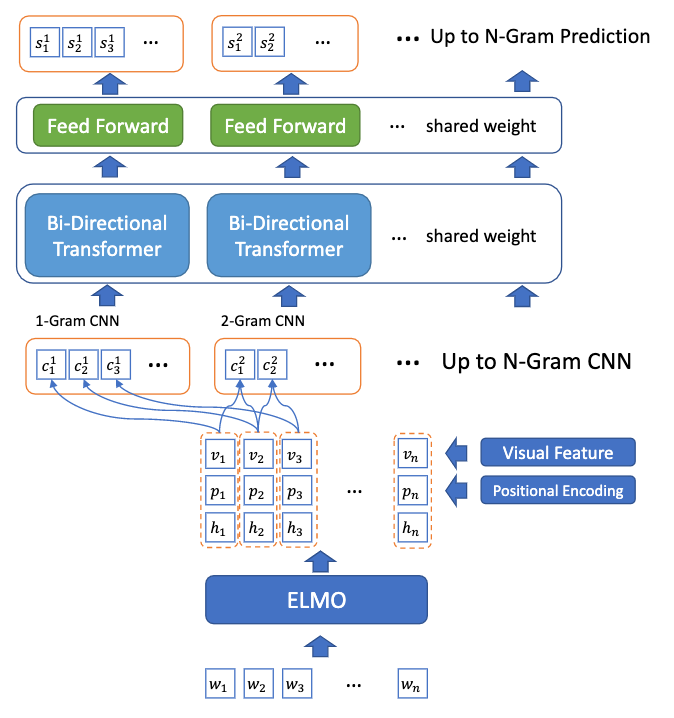

# 关键词挖掘调研
<!-- Tag: NLP、内容理解 -->

- [无监督方案](#无监督方案)
    - [基于统计](#基于统计)
        - [TF-IDF](#tf-idf)
    - [基于图](#基于图)
        - [TextRank](#textrank)
        - [PositionRank](#positionrank)
        - [TopicRank](#topicrank)
        - [MultipartiteRank](#multipartiterank)
        - [SalienceRank](#saliencerank)
    - [基于 Embedding](#基于-embedding)
        - [EmbedRank](#embedrank)
        - [EmbedRank++](#embedrank-1)
        - [SIFRank](#sifrank)
- [有监督方案](#有监督方案)
    - [抽取方案](#抽取方案)
        - [Joint-layer RNN](#joint-layer-rnn)
        - [BLING-KPE（2019）](#bling-kpe2019)
        - [BERT-PKE（2020）](#bert-pke2020)
    - [生成方案](#生成方案)
        - [CopyRNN（2017）](#copyrnn2017)
        - [更多生成方案](#更多生成方案)
    - [抽取+生成](#抽取生成)
        - [BERT-PKE&AKE](#bert-pkeake)
        - [UniKeyphrase](#unikeyphrase)
- [落地场景](#落地场景)

## 无监督方案

一般流程：1）生成候选；2）候选排序/打分；

### 基于统计

#### TF-IDF

把在文档中出现频率较高，但在整个语料库中出现频率较低的词作为关键词

### 基于图

#### TextRank
> TextRank: Bringing Order into Texts

1. 分词、词性标注获取候选短语；
2. 通过候选短语之间的共现关系构建图；
3. 用 PageRank 算法计算每个节点的 rank 值；
4. 对 rank 排序得到关键词；

#### PositionRank
> PositionRank: An Unsupervised Approach to Keyphrase Extraction from Scholarly Documents

- 在 TextRank 的基础上引入短语的位置信息来改进 rank 值的计算；
- 将随机平滑改为根据短语的位置进行平滑，认为越靠近句首的短语越重要；

#### TopicRank
> TopicRank: Graph-Based Topic Ranking for Keyphrase Extraction

- TopicRank 认为 TextRank 构建的候选词图网络会产出冗余关键词；
- TopicRank 的思路是对文档主题建立图网络，再 TextRank 获得文档主题的重要性排序：

1. 分词、词性标注获取候选短语；
2. 对候选短语聚类，每个簇为一个主题；
3. 对所有主题构建图网络，并计算 rank 值；
4. 排序后再从簇中筛选关键词，以降低冗余；

#### MultipartiteRank
> Unsupervised Keyphrase Extraction with Multipartite Graphs

- 使用多部图改进 TopicRank；
- MultipartiteRank 认为 TopicRank 中先选主题选关键词会降低关键词与全图的联系；

#### SalienceRank
> Salience Rank: Efficient Keyphrase Extraction with Topic Modeling

- 从主题特异性和语料特异性两个角度来优化 rank 值的计算；
- SalienceRank 认为被多个主题共享的词应该享有更高的权重；

### 基于 Embedding

#### EmbedRank
> Simple Unsupervised Keyphrase Extraction using Sentence Embeddings

1. 分别通过 word2vec 和 doc2vec 计算短语和文档的 embedding；
2. 计算短语 embedding 和文档 embedding 之间的 cos 距离；
3. 按照 cos 距离排序得到文档关键词；

#### EmbedRank++
> Simple Unsupervised Keyphrase Extraction using Sentence Embeddings

- 改进 EmbedRank 中的冗余关键词，提高多样性；
- 挑选出的关键词与文档的 cos 距离尽量近，但是与未被选中的关键词尽量远；

#### SIFRank
> SIFRank: A New Baseline for Unsupervised Keyphrase Extraction Based on Pre-Trained Language Model

- 引入 ELMo 预训练语言模型，分别计算词向量和句向量；
- 通过词向量和句向量的 cos 距离判断单词的重要性；

## 有监督方案

### 抽取方案

#### Joint-layer RNN 
> Keyphrase Extraction Using Deep Recurrent Neural Networks on Twitter

- 将关键词抽取当作 NER 任务；
- 基于 RNN，采用联合学习；

#### BLING-KPE（2019）
> [Open Domain Web Keyphrase Extraction Beyond Language Modeling](https://arxiv.org/abs/1911.02671)

- 拼接 ELMo 词向量、位置向量、web 特征向量作为输入；
- 使用 CNN 生成 N-Gram 向量，通过双向 Transformer 打分；

#### BERT-PKE（2020）
> [Capturing Global Informativeness in Open Domain Keyphrase Extraction](https://arxiv.org/abs/2004.13639) 【[Github](https://github.com/thunlp/BERT-KPE)】

- 利用 BERT 获取 N-Gram 表示；
- 使用两个子网络联合学习：一个用于判断是否为高质量短语，一个来学习短语的显著性（Ranking）

### 生成方案

#### CopyRNN（2017）
> [Deep keyphrase generation](https://arxiv.org/abs/1704.06879)

- 基于 Encoder-Decoder 框架；
- 通过 Copying mechanism 缓解 OOV 问题；

#### 更多生成方案
- Keyphrase Generation with Correlation Constraints
- Neural Keyphrase Generation via Reinforcement Learning with Adaptive Rewards
- Semi-Supervised Learning for Neural Keyphrase Generation
- One Size Does Not Fit All: Generating and Evaluating Variable Number of Keyphrases
- Topic-Aware Neural Keyphrase Generation for Social Media Language

### 抽取+生成

#### BERT-PKE&AKE
> Keyphrase Prediction With Pre-trained Language Model

#### UniKeyphrase
> UniKeyphrase: A Unified Extraction and Generation Framework for Keyphrase Prediction

## 落地场景

- 文档标签：简历推荐、UGC打标
- 知识图谱：实体挖掘、技能图谱、行业图谱