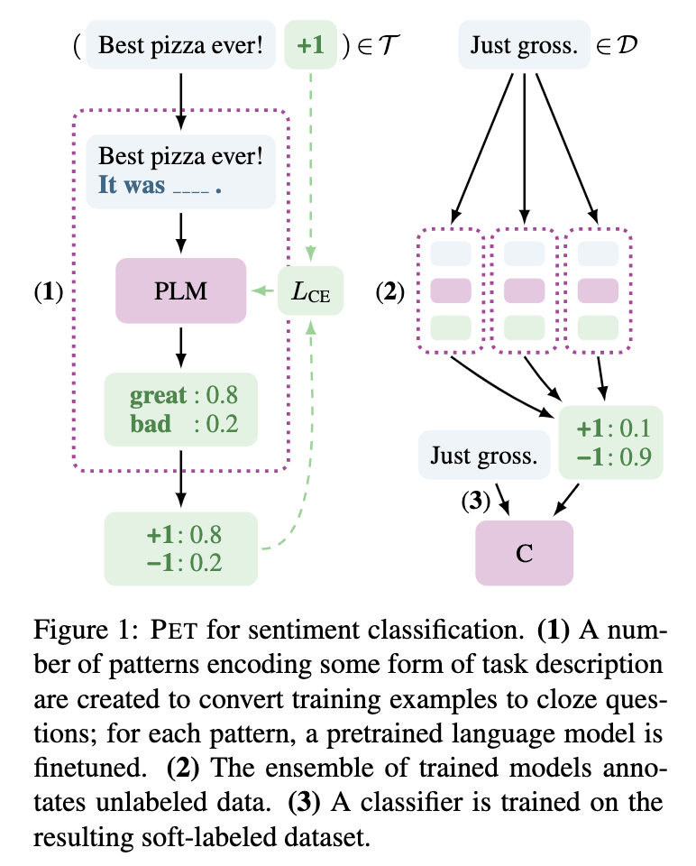

提示学习（Prompt Learning）
===

- [PET: Pattern-Exploiting Training](#pet-pattern-exploiting-training)
    - [PET for 半监督学习](#pet-for-半监督学习)
    - [优势](#优势)
    - [限制](#限制)
    - [Tricks](#tricks)
- [P-tuning](#p-tuning)
- [参考资料](#参考资料)

## PET: Pattern-Exploiting Training
> 论文[${[1]}$](#ref1)提出了 PET 模板方法，但是只能预测单个 token；论文[${[2]}$](#ref2)解除了这个限制，拓展了 PET 的使用场景；链接[${[3]}$](#ref3)介绍了 PET 方法，并在中文数据上进行了实验，验证了该方法的有效性。

**核心方法**：利用**掩码语言模型**（Masked Language Model, MLM），将一般分类任务转化为“完形填空”任务；  

简单来说，就在原始文本上添加一段**描述性语句**，并将描述中可以**作为分类依据的关键词** Mask，然后利用 MLM 预测被 Mask 掉的部分，进而得到原始文本的分类结果  

**示例**
```
分类任务：
    原始文本：  “八个月了，终于又能在赛场上看到女排姑娘们了。”
    拓展文本：  “下面报导一则____新闻。八个月了，终于又能在赛场上看到女排姑娘们了。”  
    Mask 内容：“体育”

NLI 任务
    “我去了北京？____，我去了上海。”  -> 不是
    “我去了北京？____，我在天安门。”  -> 是的
```

组合后的语句应该保持尽可能通顺自然，不能过于生硬。否则可能就退化成了一般的分类任务。


### PET for 半监督学习
> [${[1]}$](#ref1)

<!-- PET 在**半监督学习**中的用法[$^{[1]}$](#ref1)： -->
```
同一任务可以使用多种不同的 Pattern；

1. 对每种 Pattern，单独训练一个 MLM；
2. 使用集成模型预测未标注数据，得到伪标签；
3. 用所有伪标签数据训练一个常规的分类模型；
```

<div align="center"></div>

PET 直接分类的用法[$^{[2]}$](#ref2)：
```

```

### 优势
- 可用于零样本学习，

### 限制
- Mask 部分不能太长；


### Tricks
- 给输入本文加入“前缀”的效果比“后缀”更有优势一些[$^{[3]}$](#ref3)；
    <!-- > 可能原因：前缀的 Mask 位置比较固定； -->

## P-tuning
> 


## 参考资料
<a name="ref1"> $[1]$ </a> [[2001.07676] Exploiting Cloze Questions for Few Shot Text Classification and Natural Language Inference](https://arxiv.org/abs/2001.07676)
> 提出 Pattern-Exploiting Training

<a name="ref2"> $[2]$ </a> [[2009.07118] It's Not Just Size That Matters: Small Language Models Are Also Few-Shot Learners](https://arxiv.org/abs/2009.07118)  
> 拓展 Pattern-Exploiting Training

<a name="ref3"> $[3]$ </a> [必须要GPT3吗？不，BERT的MLM模型也能小样本学习 - 科学空间|Scientific Spaces](https://kexue.fm/archives/7764)
> 介绍 Pattern-Exploiting Training