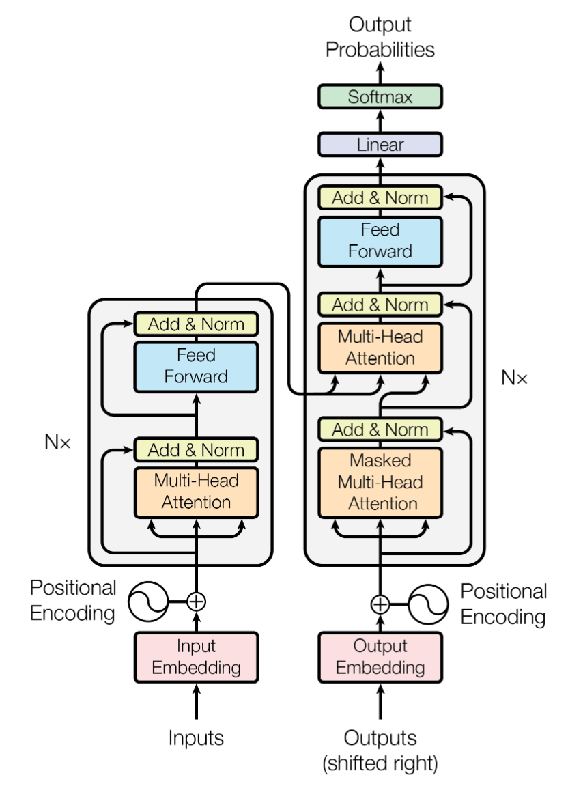

Transformer
===

- 论文：《[Attention Is All You Need](https://arxiv.org/abs/1706.03762)》

## 模型结构

- 基于 Encoder-Decoder 框架的 Seq2Seq 模型；
- 编码和解码部分分别由 N 个 `Transformer-Encoder` 和 `Transformer-Decoder` 堆叠而成。区别于 RNN 结构，堆叠的 block 并非时序展开，也没有贡献参数。串联的多层结构加大了网络深度，提高了模型的特征提取能力。
    > BERT 中仅使用了 `Transformer-Encoder`，之后由于 BERT 的流行，很多时候提到 Transformer 其实指的是其 Encoder 部分；
- 由 Encoder 生成的特征向量并不是一次性输入到 Decoder 部分，而是会输入到每一层 `Transformer-Decoder` 中；

### Transformer 中 Encoder 和 Decoder 的区别

- 主要有两个区别：
    1. Mask 不同：Decoder 部分采用一个上三角掩码，来避免提前观察到后续位置；
    2. Transformer-Decoder 比 Encoder 多了一个融合层；

### Transformer 的解码过程
> 参考 Seq2Seq 的翻译过程：

- Encoder 接收源语句的 $input\_embedding$，并输出每个字的特征向量，记 $feature\_embedding$，用于输入到 Decoder 的融合层；
- 记 Decoder 的输出为 $output\_embedding^n$，其中上标 $n$ 表示第 n 次解码后的输出，则 Decoder 接收的输入 $output\_embedding^n$，输出 $output\_embedding^{n+1}$，用于预测第 `n+1` 个词；特别的，`n=0` 时，Decoder 输入的起始符的特征向量，如 `</BOS>`；
    > 实际操作时，会通过 Mask 来屏蔽非当前可见的部分；
- **预测下一个词**：Decoder 的输出特征经过 Linear+Softmax 后得到词表中每个词作为下一个词的概率；
    > 一般来说，会通过 Beam Search 算法来计算整体概率最大的词序列；
    >> [seq2seq 中的 Beam Search 算法过程是怎样的？ - 知乎](https://www.zhihu.com/question/54356960)
- 整个流程 Encoder 会调用一次，Decoder 会调动 N+1 次（假设输出 N 个字，最后一个为终止符 `</EOS>`）；
    > 如果使用 Beam Search，次数会更多；

## 参考资料
- [Attention is All you Need - ReadPaper](https://readpaper.com/paper/2963403868)